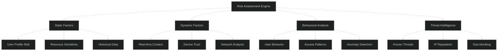
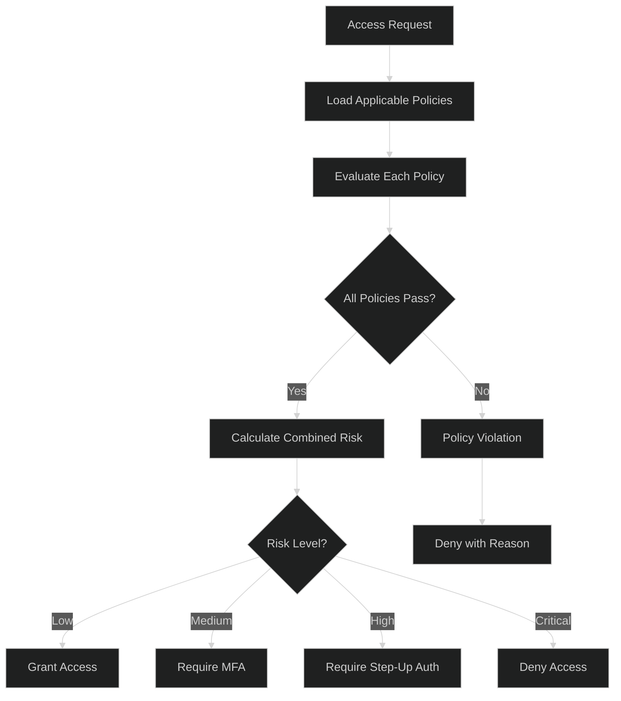

# Adaptive / Risk-Based Authentication - Advanced Level

## Advanced Risk Scoring Models

### Multi-Layer Risk Assessment



### Advanced Risk Engine Implementation

```javascript
const tf = require('@tensorflow/tfjs-node');

class AdvancedRiskEngine {
  constructor() {
    this.model = null;
    this.featureExtractor = new FeatureExtractor();
    this.threatIntel = new ThreatIntelligenceService();
    this.behavioralModel = new BehavioralAnomalyDetector();
  }
  
  async initialize() {
    // Load pre-trained neural network model
    this.model = await tf.loadLayersModel('file://./models/risk-model/model.json');
  }
  
  async assessRisk(context) {
    // Multi-dimensional risk assessment
    const scores = await Promise.all([
      this.assessStaticRisk(context),
      this.assessDynamicRisk(context),
      this.assessBehavioralRisk(context),
      this.assessThreatIntelligence(context)
    ]);
    
    // Extract features for neural network
    const features = await this.featureExtractor.extract(context, scores);
    
    // Neural network prediction
    const mlPrediction = await this.predictWithML(features);
    
    // Combine rule-based and ML scores
    const finalScore = this.combineScores(scores, mlPrediction);
    
    // Generate explanation
    const explanation = this.explainRiskScore(context, scores, mlPrediction);
    
    return {
      riskScore: finalScore,
      riskLevel: this.getRiskLevel(finalScore),
      recommendation: this.getRecommendation(finalScore, context),
      breakdown: scores,
      mlConfidence: mlPrediction.confidence,
      explanation: explanation,
      factors: this.identifyTopFactors(scores)
    };
  }
  
  async assessStaticRisk(context) {
    const { user, resource } = context;
    
    // User profile risk
    const userRisk = await this.calculateUserRisk(user);
    
    // Resource sensitivity
    const resourceRisk = this.calculateResourceRisk(resource);
    
    // Historical patterns
    const historicalRisk = await this.calculateHistoricalRisk(user, resource);
    
    return {
      category: 'static',
      score: (userRisk * 0.3 + resourceRisk * 0.4 + historicalRisk * 0.3),
      components: { userRisk, resourceRisk, historicalRisk }
    };
  }
  
  async calculateUserRisk(user) {
    let risk = 0;
    
    // Account age (newer = riskier)
    const accountAge = Date.now() - new Date(user.createdAt).getTime();
    const daysSinceCreation = accountAge / (1000 * 60 * 60 * 24);
    if (daysSinceCreation < 7) risk += 0.4;
    else if (daysSinceCreation < 30) risk += 0.2;
    
    // Failed login attempts
    const recentFailures = await this.getRecentFailedLogins(user.id);
    risk += Math.min(0.3, recentFailures * 0.05);
    
    // Password strength
    const passwordStrength = await this.getPasswordStrength(user.id);
    if (passwordStrength < 0.5) risk += 0.2;
    
    // MFA enrollment
    if (!user.mfaEnabled) risk += 0.3;
    
    // Past security incidents
    const incidents = await this.getSecurityIncidents(user.id);
    risk += Math.min(0.4, incidents.length * 0.1);
    
    return Math.min(1.0, risk);
  }
  
  calculateResourceRisk(resource) {
    const sensitivity = {
      'public': 0.1,
      'internal': 0.3,
      'confidential': 0.6,
      'restricted': 0.9
    };
    
    return sensitivity[resource.classification] || 0.5;
  }
  
  async assessDynamicRisk(context) {
    const { device, network, location, time } = context;
    
    // Device trust score
    const deviceRisk = await this.calculateDeviceRisk(device);
    
    // Network analysis
    const networkRisk = await this.calculateNetworkRisk(network);
    
    // Location risk
    const locationRisk = await this.calculateLocationRisk(location, context.user);
    
    // Time-based risk
    const timeRisk = this.calculateTimeRisk(time, context.user);
    
    return {
      category: 'dynamic',
      score: (deviceRisk * 0.3 + networkRisk * 0.25 + locationRisk * 0.3 + timeRisk * 0.15),
      components: { deviceRisk, networkRisk, locationRisk, timeRisk }
    };
  }
  
  async calculateDeviceRisk(device) {
    let risk = 0;
    
    // Device recognition
    const isKnownDevice = await this.isDeviceKnown(device.fingerprint);
    if (!isKnownDevice) risk += 0.4;
    
    // Device health
    const deviceHealth = await this.assessDeviceHealth(device);
    risk += (1 - deviceHealth) * 0.3;
    
    // Jailbreak/Root detection
    if (device.isJailbroken || device.isRooted) risk += 0.4;
    
    // Screen lock enabled
    if (!device.hasScreenLock) risk += 0.2;
    
    // OS version
    if (device.osVersion && this.isOSVersionOutdated(device.osVersion)) {
      risk += 0.3;
    }
    
    return Math.min(1.0, risk);
  }
  
  async calculateNetworkRisk(network) {
    let risk = 0;
    
    // VPN detection
    if (await this.isVPN(network.ipAddress)) risk += 0.2;
    
    // Proxy detection
    if (await this.isProxy(network.ipAddress)) risk += 0.3;
    
    // TOR detection
    if (await this.isTOR(network.ipAddress)) risk += 0.5;
    
    // IP reputation
    const reputation = await this.getIPReputation(network.ipAddress);
    risk += (1 - reputation) * 0.4;
    
    // Public WiFi
    if (network.type === 'public_wifi') risk += 0.3;
    
    return Math.min(1.0, risk);
  }
  
  async calculateLocationRisk(location, user) {
    let risk = 0;
    
    // Known location check
    const knownLocations = await this.getUserLocations(user.id);
    const isKnownLocation = knownLocations.some(loc => 
      this.calculateDistance(location, loc) < 50 // 50km radius
    );
    
    if (!isKnownLocation) risk += 0.3;
    
    // Impossible travel detection
    const lastLocation = await this.getLastLocation(user.id);
    if (lastLocation) {
      const impossibleTravel = await this.detectImpossibleTravel(
        lastLocation,
        location,
        lastLocation.timestamp
      );
      
      if (impossibleTravel) risk += 0.7;
    }
    
    // High-risk country
    if (await this.isHighRiskCountry(location.country)) {
      risk += 0.4;
    }
    
    // Geo-velocity check
    const velocity = await this.calculateGeoVelocity(user.id, location);
    if (velocity > 900) { // km/h (faster than airplane)
      risk += 0.6;
    }
    
    return Math.min(1.0, risk);
  }
  
  async assessBehavioralRisk(context) {
    // Use behavioral anomaly detector
    const anomalyScore = await this.behavioralModel.detect({
      userId: context.user.id,
      currentBehavior: context.behavior
    });
    
    return {
      category: 'behavioral',
      score: anomalyScore,
      components: {
        typingPattern: context.behavior?.typingAnomaly || 0,
        mousePattern: context.behavior?.mouseAnomaly || 0,
        navigationPattern: context.behavior?.navigationAnomaly || 0,
        timePattern: context.behavior?.timeAnomaly || 0
      }
    };
  }
  
  async assessThreatIntelligence(context) {
    const threats = await this.threatIntel.check({
      ipAddress: context.network.ipAddress,
      userAgent: context.device.userAgent,
      email: context.user.email
    });
    
    let risk = 0;
    
    // Known malicious IP
    if (threats.maliciousIP) risk += 0.8;
    
    // Data breach involvement
    if (threats.breachedCredentials) risk += 0.6;
    
    // Bot detection
    if (threats.botScore > 0.7) risk += 0.5;
    
    // Fraud networks
    if (threats.fraudNetwork) risk += 0.7;
    
    return {
      category: 'threat_intelligence',
      score: Math.min(1.0, risk),
      components: threats
    };
  }
  
  async predictWithML(features) {
    // Normalize features
    const normalizedFeatures = this.normalizeFeatures(features);
    
    // Convert to tensor
    const inputTensor = tf.tensor2d([normalizedFeatures]);
    
    // Predict
    const prediction = this.model.predict(inputTensor);
    const output = await prediction.data();
    
    // Cleanup tensors
    inputTensor.dispose();
    prediction.dispose();
    
    return {
      score: output[0],
      confidence: output[1] || 0.5
    };
  }
  
  combineScores(ruleBasedScores, mlPrediction) {
    // Weighted combination of rule-based and ML
    const ruleBasedScore = ruleBasedScores.reduce((sum, s) => sum + s.score, 0) / ruleBasedScores.length;
    
    // Give more weight to ML if confidence is high
    const mlWeight = mlPrediction.confidence;
    const ruleWeight = 1 - mlWeight;
    
    return (ruleBasedScore * ruleWeight + mlPrediction.score * mlWeight) * 100;
  }
  
  getRiskLevel(score) {
    if (score < 20) return 'VERY_LOW';
    if (score < 40) return 'LOW';
    if (score < 60) return 'MEDIUM';
    if (score < 80) return 'HIGH';
    return 'CRITICAL';
  }
  
  getRecommendation(score, context) {
    if (score < 20) {
      return {
        action: 'ALLOW',
        mfaRequired: false,
        monitoring: 'standard'
      };
    } else if (score < 40) {
      return {
        action: 'ALLOW',
        mfaRequired: false,
        monitoring: 'enhanced'
      };
    } else if (score < 60) {
      return {
        action: 'CHALLENGE',
        mfaRequired: true,
        mfaMethods: ['totp', 'push'],
        monitoring: 'enhanced'
      };
    } else if (score < 80) {
      return {
        action: 'CHALLENGE',
        mfaRequired: true,
        mfaMethods: ['hardware_key', 'biometric'],
        additionalVerification: true,
        monitoring: 'strict'
      };
    } else {
      return {
        action: 'BLOCK',
        reason: 'risk_too_high',
        requireManualReview: true,
        notifySecurityTeam: true
      };
    }
  }
  
  explainRiskScore(context, scores, mlPrediction) {
    const explanations = [];
    
    // Identify high-risk factors
    for (const scoreCategory of scores) {
      if (scoreCategory.score > 0.6) {
        explanations.push({
          category: scoreCategory.category,
          severity: 'high',
          details: this.explainCategory(scoreCategory)
        });
      }
    }
    
    return explanations;
  }
  
  identifyTopFactors(scores) {
    const allFactors = [];
    
    for (const scoreCategory of scores) {
      for (const [key, value] of Object.entries(scoreCategory.components)) {
        if (typeof value === 'number' && value > 0.4) {
          allFactors.push({
            factor: key,
            category: scoreCategory.category,
            impact: value
          });
        }
      }
    }
    
    // Sort by impact
    return allFactors
      .sort((a, b) => b.impact - a.impact)
      .slice(0, 5);
  }
  
  calculateDistance(loc1, loc2) {
    const R = 6371; // Earth radius in km
    const dLat = this.toRad(loc2.lat - loc1.lat);
    const dLon = this.toRad(loc2.lon - loc1.lon);
    
    const a = Math.sin(dLat/2) * Math.sin(dLat/2) +
              Math.cos(this.toRad(loc1.lat)) * Math.cos(this.toRad(loc2.lat)) *
              Math.sin(dLon/2) * Math.sin(dLon/2);
    
    const c = 2 * Math.atan2(Math.sqrt(a), Math.sqrt(1-a));
    return R * c;
  }
  
  toRad(degrees) {
    return degrees * Math.PI / 180;
  }
}

class BehavioralAnomalyDetector {
  async detect(data) {
    // Simplified - in production use proper ML model
    const { userId, currentBehavior } = data;
    
    // Get user's behavioral baseline
    const baseline = await this.getBaseline(userId);
    
    if (!baseline) {
      return 0.3; // Moderate risk for new users
    }
    
    // Compare current to baseline
    const deviations = {
      typing: this.calculateDeviation(currentBehavior.typing, baseline.typing),
      mouse: this.calculateDeviation(currentBehavior.mouse, baseline.mouse),
      navigation: this.calculateDeviation(currentBehavior.navigation, baseline.navigation)
    };
    
    // Average deviation
    const avgDeviation = Object.values(deviations).reduce((a, b) => a + b, 0) / 3;
    
    return avgDeviation;
  }
  
  calculateDeviation(current, baseline) {
    if (!current || !baseline) return 0.5;
    
    // Calculate statistical deviation
    const diff = Math.abs(current - baseline) / baseline;
    return Math.min(1.0, diff);
  }
}
```

## Policy-Based Adaptive Authentication

### Dynamic Policy Engine



## Best Practices

### Implementation Guidelines

✅ **Do:**
- Use multiple risk factors for assessment
- Implement both rule-based and ML models
- Provide transparency in risk decisions
- Allow user feedback on risk assessments
- Continuously retrain ML models
- Implement graceful degradation
- Monitor false positive rates
- Log all risk decisions for audit
- Provide clear explanations to users
- Implement privacy-preserving techniques

❌ **Don't:**
- Rely solely on single risk factor
- Use ML models without rule-based fallback
- Make decisions without explainability
- Ignore user privacy concerns
- Deploy untested models to production
- Forget to handle edge cases
- Block legitimate users without recourse
- Skip monitoring and evaluation
- Use biased training data
- Forget regulatory compliance (GDPR, etc.)

## Next Steps

📚 **Related Advanced Topics:** Federated learning for privacy, Explainable AI in authentication, Real-time threat intelligence integration, Adversarial ML attack prevention

---

**Related Topics:** Machine Learning, Anomaly Detection, Threat Intelligence, Zero Trust, Behavioral Analysis
