# Adaptive / Risk-Based Authentication - Basic Level

## What is Adaptive Authentication?

**Adaptive authentication** (also called **risk-based authentication**) is a smart security system that adjusts how strictly it checks your identity based on how risky your login attempt appears.

Think of it like airport security:

- **Low risk** (local flight, no alerts): Quick check, walk through
- **Medium risk** (international flight): Show passport, answer questions
- **High risk** (suspicious activity): Full search, additional screening

## How It Works

### Simple Adaptive Flow


## Risk Factors Analyzed

### What Makes a Login Risky?


## Real-World Example

### Banking App Scenario

```mermaid
%%{init: {\'theme\':\'dark\'}}%%
sequenceDiagram
    participant User
    participant App
    participant RiskEngine as Risk Engine
    participant Bank
    
    Note over User,Bank: Scenario 1: Low Risk Login
    User->>App: Login at home, known device
    App->>RiskEngine: Check risk level
    RiskEngine->>RiskEngine: ✓ Same location<br/>✓ Registered device<br/>✓ Normal time
    RiskEngine->>App: Risk Score: 10/100 (Low)
    App->>User: Just enter password
    User->>App: Enter password
    App->>Bank: Verify password
    Bank->>User: Welcome! Access granted ✓
    
    Note over User,Bank: Scenario 2: Medium Risk Login
    User->>App: Login from cafe, same city
    App->>RiskEngine: Check risk level
    RiskEngine->>RiskEngine: ⚠️ New WiFi network<br/>✓ Same device<br/>✓ Same city
    RiskEngine->>App: Risk Score: 45/100 (Medium)
    App->>User: Password + SMS code needed
    User->>App: Enter password + SMS code
    App->>Bank: Verify both
    Bank->>User: Access granted ✓
    
    Note over User,Bank: Scenario 3: High Risk Login
    User->>App: Login from another country
    App->>RiskEngine: Check risk level
    RiskEngine->>RiskEngine: 🚨 Different country<br/>🚨 New device<br/>🚨 Unusual time (3 AM)
    RiskEngine->>App: Risk Score: 85/100 (High)
    App->>User: Additional verification needed
    User->>App: Password + SMS + Security question
    App->>Bank: Verify all factors
    Bank->>User: Access granted after full verification ✓
```



## Common Risk Scenarios

### Low Risk (Green Light)


**Example:**

```
You login to your bank app:
- From your phone (device you always use)
- At home (your usual location)
- At 10 AM (normal time for you)
- Checking balance (regular activity)

Result: Just need password, quick access!
```

### Medium Risk (Yellow Caution)


**Example:**

```
You login to your email:
- From a library computer (new device)
- In a nearby city (traveling for work)
- Account shows last login was 3 days ago

Result: Need password + SMS code
```

### High Risk (Red Alert)


**Example:**

```
Someone tries to access your account:
- From Russia (you live in USA)
- On a device you've never used
- At 3 AM your time
- After 5 failed password attempts
- Trying to change your email address

Result: Need password + SMS + security questions
+ possible account freeze!
```

## Step-Up Authentication

### Dynamic Security Levels


**Example: Amazon Shopping**

```
Browsing products → No login needed
Add to cart → Still no login
Proceed to checkout → Need to login (password)
Payment for $50 → Just password
Payment for $5,000 → Password + SMS code!
Change payment method → Password + SMS + Security question
```

## Risk Scoring System

### How Risk Points Add Up

```mermaid
%%{init: {\'theme\':\'dark\'}}%%
graph TD
    A[Risk Calculator] --> B[Location: +0 to +40 points]
    A --> C[Device: +0 to +30 points]
    A --> D[Behavior: +0 to +20 points]
    A --> E[Time: +0 to +10 points]
    
    F[Total Score] --> G{Score Range}
    G -->|0-30| H[Low Risk: Password only]
    G -->|31-60| I[Medium Risk: Password + SMS]
    G -->|61-100| J[High Risk: Full MFA]```

**Example Risk Calculation:**

| Factor | Situation | Points |
|--------|-----------|--------|
| Location | Same city | +0 |
| Device | New phone | +20 |
| Time | Normal hours | +0 |
| Behavior | Regular pattern | +0 |
| **Total** | | **20/100** |
| **Result** | **Low Risk** | **Password only** |

vs.

| Factor | Situation | Points |
|--------|-----------|--------|
| Location | Different country | +40 |
| Device | Never seen before | +30 |
| Time | 3 AM (unusual) | +10 |
| Behavior | Multiple failures | +20 |
| **Total** | | **100/100** |
| **Result** | **High Risk** | **Full verification + alert** |

## Industry Examples

### 🏦 Banking: Transaction-Based Risk

```mermaid
%%{init: {\'theme\':\'dark\'}}%%
flowchart TD
    A[Banking App] --> B{Action Type?}
    
    B -->|Check Balance| C[Low Risk: No extra auth]
    B -->|Transfer $100| D[Low Risk: Password only]
    B -->|Transfer $5,000| E[Medium Risk: Password + SMS]
    B -->|Transfer $50,000| F[High Risk: Password + SMS + Call verification]
    B -->|Change Email| G[High Risk: Multiple checks]
```

### 🛒 E-commerce: Purchase Protection


### 💼 Corporate: Access Control


## Impossible Travel Detection

### Catching Fraudsters

```mermaid
%%{init: {\'theme\':\'dark\'}}%%
sequenceDiagram
    participant Hacker
    participant App
    participant DetectionSystem
    participant RealUser
    
    Note over RealUser,App: 9:00 AM - User logs in from New York
    RealUser->>App: Login from New York
    App->>DetectionSystem: Record: NYC, 9:00 AM
    DetectionSystem->>DetectionSystem: ✓ Legitimate
    
    Note over Hacker,App: 9:30 AM - Hacker tries from London
    Hacker->>App: Login from London
    App->>DetectionSystem: Check: London, 9:30 AM
    DetectionSystem->>DetectionSystem: 🚨 IMPOSSIBLE TRAVEL!<br/>NYC to London in 30 min?
    DetectionSystem->>App: BLOCK + ALERT USER
    App->>RealUser: 🔔 Suspicious login attempt detected!
    App->>Hacker: Access Denied ✗
```



**Why it's impossible:**

- New York to London = 3,459 miles
- Time elapsed = 30 minutes
- Would need to travel at 6,918 mph!
- Fastest commercial plane = 575 mph
- **Clearly fraud!**

## Benefits of Adaptive Authentication

### Why Companies Use It


## User Perspective

### What You Experience

**Normal Day:**

```
Monday morning, your laptop at home:
→ Login to work email
→ Just password needed
→ Instant access
→ Smooth experience!
```

**Traveling:**

```
Airport WiFi, different city:
→ Login to work email
→ Password + SMS code needed
→ Still quick (30 seconds)
→ Extra security makes sense!
```

**Suspicious Activity:**

```
Someone in another country tries your account:
→ Multiple failed password attempts
→ System blocks access
→ Sends you alert: "Unusual login attempt"
→ You confirm: "Not me!"
→ System keeps account safe!
```

## Common Adaptive Rules

### Simple Rule Examples


## How to Recognize Adaptive Auth

### Signs You're Using It

**You'll notice when:**

1. **Different requirements each time**
   - Sometimes just password
   - Sometimes password + SMS
   - Sometimes more verification

2. **Context-aware prompts**
   - "We noticed you're in a new location"
   - "This is a new device for your account"
   - "This action requires additional verification"

3. **Smart step-up**
   - Browse freely
   - Login needed for checkout
   - Extra check for large purchase

## Adaptive vs. Traditional Authentication

### Comparison


| Aspect | Traditional MFA | Adaptive MFA |
|--------|----------------|--------------|
| **Same device/location** | Always need SMS | Just password |
| **New device** | Always need SMS | Extra verification |
| **Suspicious activity** | Same as normal | Maximum security |
| **User experience** | Consistent but annoying | Flexible and smart |
| **Security** | Good | Better |

## Key Takeaways

1. **Adaptive = Smart security** that adjusts to risk level
2. **Low risk = Easy login** (just password)
3. **High risk = More checks** (password + SMS + more)
4. **Considers multiple factors** - location, device, behavior, time
5. **Better user experience** - only asks when necessary
6. **Catches fraud** - impossible travel, suspicious patterns
7. **Step-up authentication** - more security for sensitive actions

## Common Questions

**Q: Why do I sometimes need SMS and sometimes not?**
A: The system checks your risk level. If you're logging in from your usual device and location, it trusts you more. New device or location = higher risk = need SMS.

**Q: How does it know my location?**
A: Your IP address reveals approximate location. Not exact address, but city/country level.

**Q: Can I turn off adaptive authentication?**
A: Usually no - it's a security feature. But you can register devices as "trusted" to reduce prompts.

**Q: What if I'm traveling and can't get SMS?**
A: Most systems offer backup options like email verification, security questions, or support contact.

## Next Steps

- 📗 **Intermediate Level:** Risk scoring algorithms, machine learning models, behavioral analytics, enterprise implementation
- 📕 **Advanced Level:** Real-time decision engines, threat intelligence integration, fraud detection systems, AI-powered risk assessment

---

**Related Topics:** Multi-Factor Authentication, Behavioral Authentication, Device Fingerprinting, Fraud Detection, Zero Trust Security
