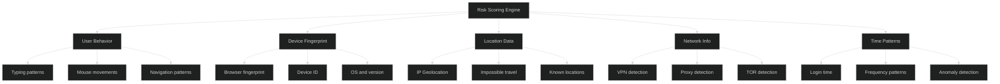
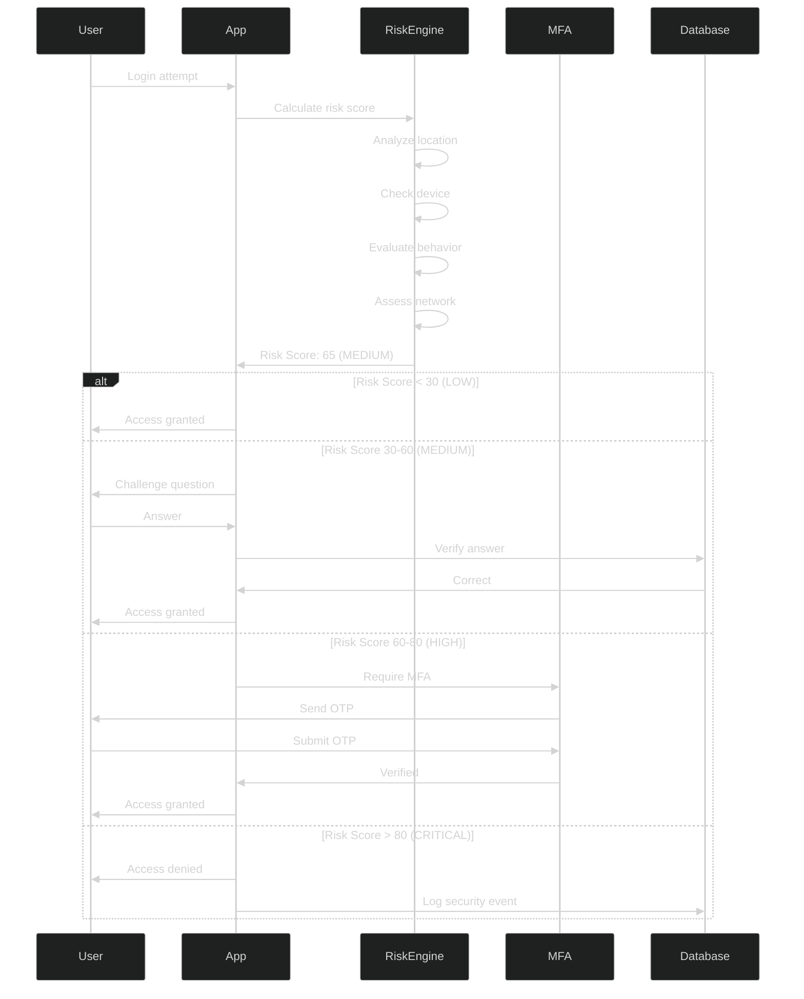
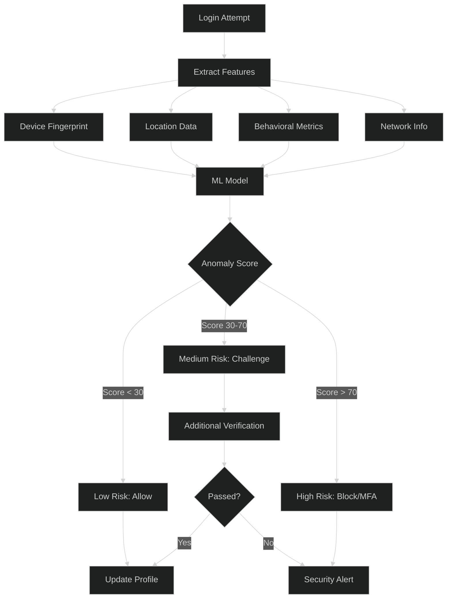

# Adaptive / Risk-Based Authentication - Intermediate Level

## Risk Scoring Engine

### Risk Factors Architecture



### Risk Score Calculation

```javascript
class RiskScoringEngine {
  constructor() {
    this.weights = {
      location: 0.25,
      device: 0.20,
      behavior: 0.20,
      network: 0.15,
      time: 0.10,
      velocity: 0.10
    };
  }
  
  async calculateRiskScore(authAttempt, userProfile) {
    const scores = {
      location: await this.scoreLocation(authAttempt, userProfile),
      device: await this.scoreDevice(authAttempt, userProfile),
      behavior: await this.scoreBehavior(authAttempt, userProfile),
      network: await this.scoreNetwork(authAttempt),
      time: await this.scoreTime(authAttempt, userProfile),
      velocity: await this.scoreVelocity(authAttempt, userProfile)
    };
    
    // Calculate weighted sum
    let totalScore = 0;
    for (const [factor, score] of Object.entries(scores)) {
      totalScore += score * this.weights[factor];
    }
    
    // Normalize to 0-100
    const normalizedScore = Math.min(100, Math.max(0, totalScore * 100));
    
    return {
      riskScore: normalizedScore,
      riskLevel: this.getRiskLevel(normalizedScore),
      factors: scores,
      recommendation: this.getRecommendation(normalizedScore)
    };
  }
  
  async scoreLocation(authAttempt, userProfile) {
    const currentLocation = await this.getGeolocation(authAttempt.ipAddress);
    const knownLocations = userProfile.locations || [];
    
    // Check if location is known
    const isKnownLocation = knownLocations.some(loc => 
      this.distance(currentLocation, loc) < 50 // Within 50km
    );
    
    if (isKnownLocation) {
      return 0.1; // Low risk
    }
    
    // Check for impossible travel
    const lastLocation = userProfile.lastLocation;
    const lastLoginTime = userProfile.lastLoginTime;
    
    if (lastLocation && lastLoginTime) {
      const timeDiff = (Date.now() - lastLoginTime) / 1000 / 3600; // hours
      const distance = this.distance(currentLocation, lastLocation);
      const maxSpeed = 900; // km/h (airplane speed)
      
      if (distance / timeDiff > maxSpeed) {
        return 1.0; // Impossible travel detected
      }
    }
    
    // New location but physically possible
    return 0.5;
  }
  
  async scoreDevice(authAttempt, userProfile) {
    const deviceFingerprint = authAttempt.deviceFingerprint;
    const knownDevices = userProfile.devices || [];
    
    const isKnownDevice = knownDevices.some(d => 
      d.fingerprint === deviceFingerprint
    );
    
    if (isKnownDevice) {
      return 0.1;
    }
    
    // Check device reputation
    const reputation = await this.getDeviceReputation(deviceFingerprint);
    
    if (reputation === 'malicious') {
      return 0.9;
    } else if (reputation === 'suspicious') {
      return 0.6;
    }
    
    return 0.4; // New but clean device
  }
  
  async scoreBehavior(authAttempt, userProfile) {
    const typingPattern = authAttempt.typingPattern;
    const expectedPattern = userProfile.typingPattern;
    
    if (!expectedPattern) {
      return 0.3; // No baseline yet
    }
    
    // Compare typing patterns
    const similarity = this.compareTypingPatterns(typingPattern, expectedPattern);
    
    // Higher similarity = lower risk
    return 1 - similarity;
  }
  
  async scoreNetwork(authAttempt) {
    const ipAddress = authAttempt.ipAddress;
    
    let score = 0;
    
    // Check for VPN
    if (await this.isVPN(ipAddress)) {
      score += 0.3;
    }
    
    // Check for proxy
    if (await this.isProxy(ipAddress)) {
      score += 0.3;
    }
    
    // Check for TOR
    if (await this.isTOR(ipAddress)) {
      score += 0.4;
    }
    
    return Math.min(1.0, score);
  }
  
  async scoreTime(authAttempt, userProfile) {
    const hour = new Date(authAttempt.timestamp).getHours();
    const loginHistory = userProfile.loginTimes || [];
    
    if (loginHistory.length < 10) {
      return 0.2; // Not enough history
    }
    
    // Calculate typical login hours
    const hourCounts = new Array(24).fill(0);
    loginHistory.forEach(time => {
      const h = new Date(time).getHours();
      hourCounts[h]++;
    });
    
    const probability = hourCounts[hour] / loginHistory.length;
    
    // Invert probability (unusual time = higher risk)
    return 1 - (probability * 2); // Scale up for sensitivity
  }
  
  async scoreVelocity(authAttempt, userProfile) {
    const recentAttempts = await this.getRecentAttempts(
      userProfile.userId,
      60 * 60 * 1000 // Last hour
    );
    
    // Too many attempts = higher risk
    if (recentAttempts.length > 10) {
      return 0.9;
    } else if (recentAttempts.length > 5) {
      return 0.5;
    }
    
    return 0.1;
  }
  
  getRiskLevel(score) {
    if (score < 30) return 'LOW';
    if (score < 60) return 'MEDIUM';
    if (score < 80) return 'HIGH';
    return 'CRITICAL';
  }
  
  getRecommendation(score) {
    if (score < 30) return 'ALLOW';
    if (score < 60) return 'CHALLENGE';
    if (score < 80) return 'MFA_REQUIRED';
    return 'BLOCK';
  }
  
  distance(loc1, loc2) {
    // Haversine formula for distance between coordinates
    const R = 6371; // Earth radius in km
    const dLat = this.toRad(loc2.lat - loc1.lat);
    const dLon = this.toRad(loc2.lon - loc1.lon);
    
    const a = Math.sin(dLat/2) * Math.sin(dLat/2) +
              Math.cos(this.toRad(loc1.lat)) * Math.cos(this.toRad(loc2.lat)) *
              Math.sin(dLon/2) * Math.sin(dLon/2);
    
    const c = 2 * Math.atan2(Math.sqrt(a), Math.sqrt(1-a));
    return R * c;
  }
  
  toRad(degrees) {
    return degrees * Math.PI / 180;
  }
}
```

### Risk-Based Authentication Flow



## Device Fingerprinting

### Fingerprint Components

```javascript
class DeviceFingerprinting {
  async generateFingerprint() {
    const components = {
      // Browser characteristics
      userAgent: navigator.userAgent,
      language: navigator.language,
      languages: navigator.languages,
      platform: navigator.platform,
      hardwareConcurrency: navigator.hardwareConcurrency,
      deviceMemory: navigator.deviceMemory,
      
      // Screen properties
      screenResolution: `${screen.width}x${screen.height}`,
      colorDepth: screen.colorDepth,
      pixelRatio: window.devicePixelRatio,
      
      // Timezone
      timezone: Intl.DateTimeFormat().resolvedOptions().timeZone,
      timezoneOffset: new Date().getTimezoneOffset(),
      
      // Canvas fingerprint
      canvas: await this.getCanvasFingerprint(),
      
      // WebGL fingerprint
      webgl: await this.getWebGLFingerprint(),
      
      // Audio fingerprint
      audio: await this.getAudioFingerprint(),
      
      // Fonts
      fonts: await this.getInstalledFonts(),
      
      // Plugins
      plugins: this.getPlugins(),
      
      // Storage
      localStorage: this.hasLocalStorage(),
      sessionStorage: this.hasSessionStorage(),
      indexedDB: this.hasIndexedDB(),
      
      // Do Not Track
      doNotTrack: navigator.doNotTrack,
      
      // Touch support
      touchSupport: 'ontouchstart' in window
    };
    
    // Generate hash from all components
    const fingerprint = await this.hashComponents(components);
    
    return {
      fingerprint,
      components,
      timestamp: Date.now()
    };
  }
  
  async getCanvasFingerprint() {
    const canvas = document.createElement('canvas');
    const ctx = canvas.getContext('2d');
    
    // Draw specific text and shapes
    ctx.textBaseline = 'top';
    ctx.font = '14px Arial';
    ctx.textBaseline = 'alphabetic';
    ctx.fillStyle = '#f60';
    ctx.fillRect(125, 1, 62, 20);
    ctx.fillStyle = '#069';
    ctx.fillText('Browser Fingerprint', 2, 15);
    ctx.fillStyle = 'rgba(102, 204, 0, 0.7)';
    ctx.fillText('Canvas FP', 4, 17);
    
    return canvas.toDataURL();
  }
  
  async getWebGLFingerprint() {
    const canvas = document.createElement('canvas');
    const gl = canvas.getContext('webgl') || canvas.getContext('experimental-webgl');
    
    if (!gl) return null;
    
    const debugInfo = gl.getExtension('WEBGL_debug_renderer_info');
    
    return {
      vendor: gl.getParameter(debugInfo.UNMASKED_VENDOR_WEBGL),
      renderer: gl.getParameter(debugInfo.UNMASKED_RENDERER_WEBGL)
    };
  }
  
  async getAudioFingerprint() {
    const context = new (window.AudioContext || window.webkitAudioContext)();
    const oscillator = context.createOscillator();
    const analyser = context.createAnalyser();
    const gainNode = context.createGain();
    const scriptProcessor = context.createScriptProcessor(4096, 1, 1);
    
    oscillator.type = 'triangle';
    oscillator.connect(analyser);
    analyser.connect(scriptProcessor);
    scriptProcessor.connect(context.destination);
    
    return new Promise((resolve) => {
      scriptProcessor.onaudioprocess = function(event) {
        const output = event.outputBuffer.getChannelData(0);
        const hash = Array.from(output).reduce((a, b) => a + b, 0);
        scriptProcessor.disconnect();
        oscillator.disconnect();
        resolve(hash.toString());
      };
      
      oscillator.start(0);
    });
  }
  
  async getInstalledFonts() {
    const baseFonts = ['monospace', 'sans-serif', 'serif'];
    const testFonts = [
      'Arial', 'Verdana', 'Times New Roman', 'Courier New',
      'Georgia', 'Palatino', 'Garamond', 'Bookman',
      'Comic Sans MS', 'Trebuchet MS', 'Impact'
    ];
    
    const installed = [];
    
    for (const font of testFonts) {
      if (await this.isFontInstalled(font, baseFonts)) {
        installed.push(font);
      }
    }
    
    return installed;
  }
  
  async hashComponents(components) {
    const str = JSON.stringify(components);
    const buffer = new TextEncoder().encode(str);
    const hashBuffer = await crypto.subtle.digest('SHA-256', buffer);
    const hashArray = Array.from(new Uint8Array(hashBuffer));
    return hashArray.map(b => b.toString(16).padStart(2, '0')).join('');
  }
}
```

## Machine Learning Integration

### Anomaly Detection Model

```javascript
class AnomalyDetectionModel {
  constructor() {
    this.model = null;
    this.scaler = null;
  }
  
  async train(historicalData) {
    // Feature extraction from historical login data
    const features = historicalData.map(login => this.extractFeatures(login));
    
    // Normalize features
    this.scaler = this.fitScaler(features);
    const normalizedFeatures = features.map(f => this.scaler.transform(f));
    
    // Train isolation forest model (scikit-learn style API)
    this.model = await this.trainIsolationForest(normalizedFeatures);
    
    return { trained: true, samples: features.length };
  }
  
  extractFeatures(loginAttempt) {
    return [
      loginAttempt.hour / 24,                    // Login hour (normalized)
      loginAttempt.dayOfWeek / 7,                // Day of week
      loginAttempt.failedAttemptsLast24h / 10,   // Failed attempts
      loginAttempt.distanceFromLastLogin / 1000, // Distance in km
      loginAttempt.timeSinceLastLogin / 86400,   // Time in days
      loginAttempt.isNewDevice ? 1 : 0,          // New device flag
      loginAttempt.isVPN ? 1 : 0,                // VPN flag
      loginAttempt.typingSpeedVariance           // Behavioral variance
    ];
  }
  
  async predict(loginAttempt) {
    const features = this.extractFeatures(loginAttempt);
    const normalized = this.scaler.transform(features);
    
    // Get anomaly score (-1 for anomaly, 1 for normal)
    const score = await this.model.predict(normalized);
    
    // Get anomaly probability
    const anomalyScore = await this.model.decisionFunction(normalized);
    
    return {
      isAnomaly: score === -1,
      anomalyScore: this.normalizeScore(anomalyScore),
      confidence: Math.abs(anomalyScore)
    };
  }
  
  normalizeScore(score) {
    // Convert decision function output to 0-100 risk score
    // More negative = more anomalous
    return Math.max(0, Math.min(100, (1 - score) * 50));
  }
}
```

### Real-Time Risk Assessment



## Step-Up Authentication

### Progressive Authentication

```javascript
class StepUpAuthenticator {
  constructor(riskEngine) {
    this.riskEngine = riskEngine;
    this.authLevels = {
      BASIC: 1,
      STANDARD: 2,
      ELEVATED: 3,
      HIGH: 4
    };
  }
  
  async determineRequiredLevel(resource, currentLevel, context) {
    const resourceSensitivity = this.getResourceSensitivity(resource);
    const riskScore = await this.riskEngine.calculateRiskScore(context);
    
    // Calculate required auth level based on risk and resource
    let requiredLevel = resourceSensitivity;
    
    if (riskScore.riskLevel === 'HIGH') {
      requiredLevel = Math.max(requiredLevel, this.authLevels.ELEVATED);
    } else if (riskScore.riskLevel === 'CRITICAL') {
      requiredLevel = Math.max(requiredLevel, this.authLevels.HIGH);
    }
    
    return {
      currentLevel,
      requiredLevel,
      needsStepUp: currentLevel < requiredLevel,
      riskScore: riskScore.riskScore
    };
  }
  
  async performStepUp(user, targetLevel, currentLevel) {
    const steps = [];
    
    // Determine authentication steps needed
    if (targetLevel >= this.authLevels.STANDARD && currentLevel < this.authLevels.STANDARD) {
      steps.push({ type: 'email_verification', completed: false });
    }
    
    if (targetLevel >= this.authLevels.ELEVATED && currentLevel < this.authLevels.ELEVATED) {
      steps.push({ type: 'sms_otp', completed: false });
    }
    
    if (targetLevel >= this.authLevels.HIGH && currentLevel < this.authLevels.HIGH) {
      steps.push({ type: 'hardware_key', completed: false });
    }
    
    return {
      steps,
      sessionId: crypto.randomUUID(),
      expiresAt: Date.now() + (5 * 60 * 1000) // 5 minutes
    };
  }
  
  getResourceSensitivity(resource) {
    const sensitivityMap = {
      '/api/profile/view': this.authLevels.BASIC,
      '/api/profile/edit': this.authLevels.STANDARD,
      '/api/payment/view': this.authLevels.STANDARD,
      '/api/payment/transfer': this.authLevels.ELEVATED,
      '/api/admin': this.authLevels.HIGH,
      '/api/security/settings': this.authLevels.HIGH
    };
    
    return sensitivityMap[resource] || this.authLevels.STANDARD;
  }
}

// Express middleware implementation
async function stepUpAuthMiddleware(req, res, next) {
  const stepUpAuth = new StepUpAuthenticator(riskEngine);
  
  const context = {
    ipAddress: req.ip,
    userAgent: req.headers['user-agent'],
    deviceFingerprint: req.cookies.deviceFingerprint,
    userId: req.session.userId
  };
  
  const assessment = await stepUpAuth.determineRequiredLevel(
    req.path,
    req.session.authLevel || 1,
    context
  );
  
  if (assessment.needsStepUp) {
    // Store original request
    req.session.pendingRequest = {
      method: req.method,
      path: req.path,
      body: req.body
    };
    
    // Initiate step-up
    const stepUpSession = await stepUpAuth.performStepUp(
      req.session.userId,
      assessment.requiredLevel,
      assessment.currentLevel
    );
    
    return res.status(403).json({
      error: 'step_up_required',
      requiredLevel: assessment.requiredLevel,
      currentLevel: assessment.currentLevel,
      steps: stepUpSession.steps,
      sessionId: stepUpSession.sessionId
    });
  }
  
  next();
}
```

## Best Practices

### Implementation Checklist

✅ **Do:**
- Implement comprehensive risk scoring with multiple factors
- Use machine learning for anomaly detection
- Collect behavioral biometrics gradually
- Provide transparency to users about risk assessments
- Implement step-up authentication for sensitive operations
- Regularly retrain ML models with new data
- Log all risk decisions for audit
- Allow users to register trusted devices

❌ **Don't:**
- Rely on single risk factor
- Make risk decisions without context
- Block legitimate users without recourse
- Collect excessive personal data
- Use risk scores as sole authentication
- Ignore false positive rates
- Forget to handle edge cases (VPN, travel, etc.)
- Deploy without thorough testing

## Next Steps

📕 **Advanced Level:** Deep learning models, real-time streaming analytics, federated learning, privacy-preserving risk assessment, behavioral biometrics fusion

---

**Related Topics:** Machine Learning, Behavioral Analytics, Device Fingerprinting, Anomaly Detection, Zero Trust
