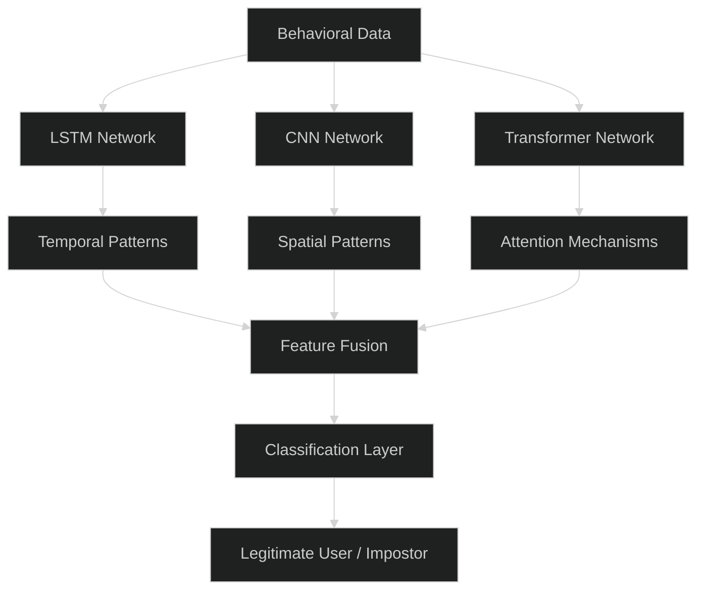
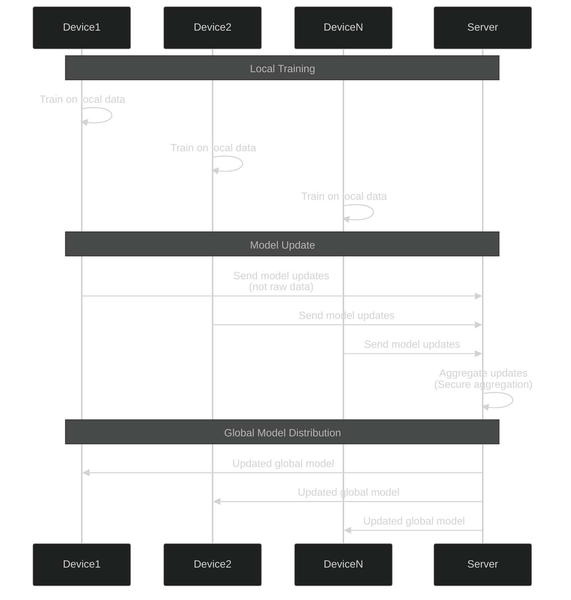
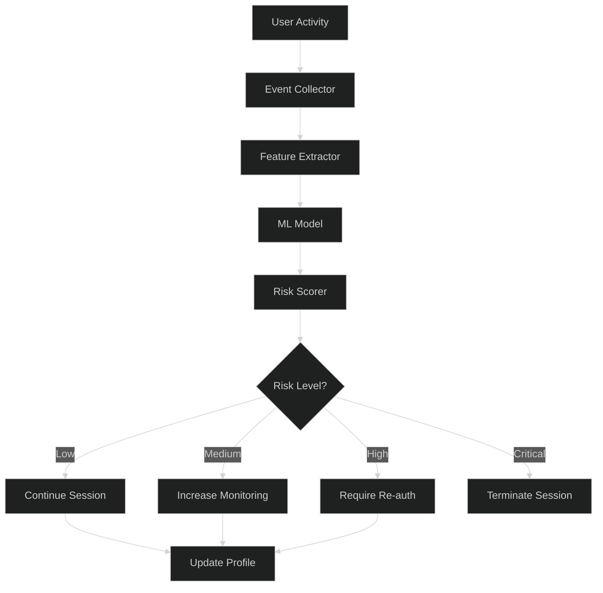

# Behavioral / Continuous Authentication - Advanced Level

## Deep Learning for Behavioral Biometrics

### Neural Network Architecture



### Advanced ML Implementation

```javascript
const tf = require('@tensorflow/tfjs-node');

class DeepBehavioralAuthenticator {
  constructor() {
    this.model = null;
    this.sequenceLength = 100; // Number of events to consider
    this.featureDimension = 20; // Features per event
  }
  
  async buildModel() {
    // Multi-modal deep learning architecture
    
    // Input layers for different modalities
    const keystrokeInput = tf.input({ shape: [this.sequenceLength, 8] });
    const mouseInput = tf.input({ shape: [this.sequenceLength, 6] });
    const touchInput = tf.input({ shape: [this.sequenceLength, 6] });
    
    // Keystroke branch (LSTM for temporal patterns)
    let keystrokeBranch = tf.layers.lstm({
      units: 64,
      returnSequences: true,
      dropout: 0.2
    }).apply(keystrokeInput);
    
    keystrokeBranch = tf.layers.lstm({
      units: 32,
      dropout: 0.2
    }).apply(keystrokeBranch);
    
    // Mouse branch (CNN for spatial patterns)
    let mouseBranch = tf.layers.conv1d({
      filters: 64,
      kernelSize: 3,
      activation: 'relu',
      padding: 'same'
    }).apply(mouseInput);
    
    mouseBranch = tf.layers.maxPooling1d({
      poolSize: 2
    }).apply(mouseBranch);
    
    mouseBranch = tf.layers.flatten().apply(mouseBranch);
    
    // Touch branch
    let touchBranch = tf.layers.lstm({
      units: 32,
      dropout: 0.2
    }).apply(touchInput);
    
    // Concatenate all branches
    const concatenated = tf.layers.concatenate().apply([
      keystrokeBranch,
      mouseBranch,
      touchBranch
    ]);
    
    // Fully connected layers
    let dense = tf.layers.dense({
      units: 128,
      activation: 'relu'
    }).apply(concatenated);
    
    dense = tf.layers.dropout({ rate: 0.3 }).apply(dense);
    
    dense = tf.layers.dense({
      units: 64,
      activation: 'relu'
    }).apply(dense);
    
    // Output layer (binary classification)
    const output = tf.layers.dense({
      units: 1,
      activation: 'sigmoid'
    }).apply(dense);
    
    // Create model
    this.model = tf.model({
      inputs: [keystrokeInput, mouseInput, touchInput],
      outputs: output
    });
    
    // Compile model
    this.model.compile({
      optimizer: tf.train.adam(0.001),
      loss: 'binaryCrossentropy',
      metrics: ['accuracy', 'precision', 'recall']
    });
    
    return this.model;
  }
  
  async train(trainingData, validationData, epochs = 50) {
    const { keystroke, mouse, touch, labels } = trainingData;
    
    // Convert to tensors
    const keystrokeTensor = tf.tensor3d(keystroke);
    const mouseTensor = tf.tensor3d(mouse);
    const touchTensor = tf.tensor3d(touch);
    const labelsTensor = tf.tensor2d(labels);
    
    // Validation tensors
    const valKeystrokeTensor = tf.tensor3d(validationData.keystroke);
    const valMouseTensor = tf.tensor3d(validationData.mouse);
    const valTouchTensor = tf.tensor3d(validationData.touch);
    const valLabelsTensor = tf.tensor2d(validationData.labels);
    
    // Train model
    const history = await this.model.fit(
      [keystrokeTensor, mouseTensor, touchTensor],
      labelsTensor,
      {
        validationData: [
          [valKeystrokeTensor, valMouseTensor, valTouchTensor],
          valLabelsTensor
        ],
        epochs: epochs,
        batchSize: 32,
        callbacks: {
          onEpochEnd: (epoch, logs) => {
            console.log(`Epoch ${epoch + 1}: loss = ${logs.loss.toFixed(4)}, ` +
                       `accuracy = ${logs.acc.toFixed(4)}, ` +
                       `val_accuracy = ${logs.val_acc.toFixed(4)}`);
          }
        }
      }
    );
    
    // Cleanup
    keystrokeTensor.dispose();
    mouseTensor.dispose();
    touchTensor.dispose();
    labelsTensor.dispose();
    valKeystrokeTensor.dispose();
    valMouseTensor.dispose();
    valTouchTensor.dispose();
    valLabelsTensor.dispose();
    
    return history;
  }
  
  async predict(behavioralData) {
    const { keystroke, mouse, touch } = behavioralData;
    
    // Convert to tensors
    const keystrokeTensor = tf.tensor3d([keystroke]);
    const mouseTensor = tf.tensor3d([mouse]);
    const touchTensor = tf.tensor3d([touch]);
    
    // Predict
    const prediction = this.model.predict([
      keystrokeTensor,
      mouseTensor,
      touchTensor
    ]);
    
    const score = await prediction.data();
    
    // Cleanup
    keystrokeTensor.dispose();
    mouseTensor.dispose();
    touchTensor.dispose();
    prediction.dispose();
    
    return {
      score: score[0],
      isLegitimate: score[0] > 0.5,
      confidence: Math.abs(score[0] - 0.5) * 2
    };
  }
  
  async continuousAuthentication(userId, behavioralStream) {
    // Real-time continuous authentication
    const windowSize = this.sequenceLength;
    const buffer = [];
    
    for await (const event of behavioralStream) {
      buffer.push(event);
      
      if (buffer.length >= windowSize) {
        // Extract features from buffer
        const features = this.extractFeatures(buffer);
        
        // Predict
        const result = await this.predict(features);
        
        if (!result.isLegitimate) {
          // Anomaly detected
          await this.handleAnomaly(userId, result, buffer);
        }
        
        // Slide window
        buffer.shift();
      }
    }
  }
  
  extractFeatures(events) {
    // Extract features for each modality
    return {
      keystroke: this.extractKeystrokeFeatures(events),
      mouse: this.extractMouseFeatures(events),
      touch: this.extractTouchFeatures(events)
    };
  }
  
  extractKeystrokeFeatures(events) {
    // Extract keystroke dynamics features
    const keystrokeEvents = events.filter(e => e.type === 'keydown' || e.type === 'keyup');
    const features = [];
    
    for (let i = 0; i < keystrokeEvents.length - 1; i++) {
      const current = keystrokeEvents[i];
      const next = keystrokeEvents[i + 1];
      
      features.push([
        current.dwellTime || 0,
        next.timestamp - current.timestamp, // Flight time
        current.pressure || 0,
        current.key.length === 1 ? current.key.charCodeAt(0) : 0,
        current.shiftKey ? 1 : 0,
        current.ctrlKey ? 1 : 0,
        current.altKey ? 1 : 0,
        current.metaKey ? 1 : 0
      ]);
    }
    
    // Pad or truncate to sequence length
    return this.padSequence(features, this.sequenceLength, 8);
  }
  
  extractMouseFeatures(events) {
    const mouseEvents = events.filter(e => e.type === 'mousemove' || e.type === 'click');
    const features = [];
    
    for (const event of mouseEvents) {
      features.push([
        event.x / 1920, // Normalized x
        event.y / 1080, // Normalized y
        event.velocity || 0,
        event.acceleration || 0,
        event.curvature || 0,
        event.type === 'click' ? 1 : 0
      ]);
    }
    
    return this.padSequence(features, this.sequenceLength, 6);
  }
  
  extractTouchFeatures(events) {
    const touchEvents = events.filter(e => e.type.startsWith('touch'));
    const features = [];
    
    for (const event of touchEvents) {
      features.push([
        event.x / 1920,
        event.y / 1080,
        event.pressure || 0,
        event.touchDuration || 0,
        event.velocity || 0,
        event.area || 0
      ]);
    }
    
    return this.padSequence(features, this.sequenceLength, 6);
  }
  
  padSequence(sequence, targetLength, featureDim) {
    // Pad or truncate sequence to target length
    if (sequence.length > targetLength) {
      return sequence.slice(-targetLength);
    }
    
    while (sequence.length < targetLength) {
      sequence.unshift(new Array(featureDim).fill(0));
    }
    
    return sequence;
  }
}
```

## Federated Learning for Privacy

### Privacy-Preserving Training



### Implementation

```javascript
class FederatedBehavioralLearning {
  constructor() {
    this.globalModel = null;
    this.clientModels = new Map();
  }
  
  async initializeGlobalModel() {
    const authenticator = new DeepBehavioralAuthenticator();
    this.globalModel = await authenticator.buildModel();
  }
  
  async clientTraining(clientId, localData) {
    // Client trains on local data
    const clientModel = await this.getClientModel(clientId);
    
    // Train locally
    await clientModel.fit(localData.x, localData.y, {
      epochs: 5,
      batchSize: 32,
      verbose: 0
    });
    
    // Get model weights (not raw data)
    const weights = clientModel.getWeights();
    
    // Send weights to server
    return this.serializeWeights(weights);
  }
  
  async aggregateUpdates(clientUpdates) {
    // Secure aggregation of client updates
    const numClients = clientUpdates.length;
    
    // Initialize aggregated weights
    let aggregatedWeights = clientUpdates[0].map(w => tf.zerosLike(w));
    
    // Sum all client weights
    for (const clientWeights of clientUpdates) {
      aggregatedWeights = aggregatedWeights.map((aggW, i) => 
        aggW.add(clientWeights[i])
      );
    }
    
    // Average
    aggregatedWeights = aggregatedWeights.map(w => 
      w.div(tf.scalar(numClients))
    );
    
    // Update global model
    this.globalModel.setWeights(aggregatedWeights);
    
    // Cleanup
    aggregatedWeights.forEach(w => w.dispose());
    
    return this.globalModel;
  }
  
  async differentialPrivacy(weights, epsilon = 1.0) {
    // Add calibrated noise for differential privacy
    const noisyWeights = weights.map(w => {
      const noise = tf.randomNormal(w.shape, 0, epsilon);
      return w.add(noise);
    });
    
    return noisyWeights;
  }
}
```

## Real-Time Continuous Monitoring

### System Architecture



## Best Practices

### Implementation Guidelines

✅ **Do:**
- Use federated learning for privacy
- Implement differential privacy
- Provide transparency to users
- Allow opt-out mechanisms
- Continuously update models
- Monitor for adversarial attacks
- Implement graceful degradation
- Use multi-modal biometrics
- Regular model retraining
- Comply with privacy regulations (GDPR, CCPA)

❌ **Don't:**
- Collect more data than necessary
- Use behavioral auth as sole factor
- Ignore privacy concerns
- Deploy untested models
- Forget about false positives
- Skip user consent
- Store raw behavioral data long-term
- Use biased training data
- Forget accessibility considerations
- Deploy without explainability

## Next Steps

📚 **Related Advanced Topics:** Adversarial ML defense, Explainable AI for biometrics, Privacy-preserving biometric authentication, Quantum-safe behavioral biometrics

---

**Related Topics:** Deep Learning, Privacy-Preserving ML, Behavioral Biometrics, Continuous Authentication, Federated Learning
