# Behavioral / Continuous Authentication - Basic Level

## What is Behavioral Authentication?

**Behavioral authentication** (also called **continuous authentication**) verifies your identity not just at login, but continuously based on how you behave. It analyzes patterns like how you type, move your mouse, hold your phone, and even how you walk.

Think of it like recognizing a friend by how they walk or talk - even from a distance, before seeing their face. Your behavior is unique!

## How It's Different

### Traditional vs Continuous Authentication


**Key difference:**
- **Traditional:** Authenticate once, trust always
- **Continuous:** Authenticate once, verify constantly

## Types of Behavioral Biometrics

### What Can Be Measured?


## Keystroke Dynamics

### Your Unique Typing Pattern

```mermaid
%%{init: {\'theme\':\'dark\'}}%%
flowchart TD
    A[Type your password: 'hello'] --> B[Measure timing between keys]
    B --> C["h-e: 0.15 seconds<br/>e-l: 0.12 seconds<br/>l-l: 0.18 seconds<br/>l-o: 0.14 seconds"]
    C --> D[Create timing pattern]
    D --> E[Compare with your usual pattern]
    E --> F{Match?}
    F -->|Yes| G[It's probably you ✓]
    F -->|No| H[Someone else typing? ⚠️]
```



**What makes your typing unique:**
- Speed: Fast vs slow typer
- Rhythm: Consistent vs variable
- Pauses: Where you hesitate
- Errors: Common mistakes
- Key pressure: How hard you press

**Example:**
```
You type "password" in 0.9 seconds with specific rhythm
Attacker with stolen password types it in 1.2 seconds
System detects: "Same password, different typing pattern!"
System asks: "Please verify it's you" (send SMS code)
```

## Mouse Movement Patterns

### How You Move the Mouse


**Your mouse signature includes:**
- How fast you move between buttons
- Whether you move in curves or straight lines
- How you scroll (smooth vs choppy)
- Where you tend to click
- Pause patterns before clicking

## Mobile Behavioral Patterns

### How You Use Your Phone


**Examples:**

**Swiping pattern:**
```
You: Quick, short swipes with thumb
Attacker: Slow, long swipes with finger
System detects difference → Ask for verification
```

**Phone angle:**
```
You: Hold phone at 45° angle
Someone else: Hold phone at 30° angle
Accelerometer detects difference
```

**Walking pattern:**
```
You: Consistent walking rhythm
Thief: Different gait while running away
System detects unusual movement → Lock phone
```

## How Continuous Authentication Works

### Real-Time Monitoring

```mermaid
%%{init: {\'theme\':\'dark\'}}%%
sequenceDiagram
    participant User
    participant Device
    participant AI as AI Monitor
    participant Server
    
    User->>Device: Login with password
    Device->>Server: Password verified ✓
    Server->>AI: Start monitoring behavior
    
    loop Every few seconds
        User->>Device: Type, click, scroll
        Device->>AI: Send behavior data
        AI->>AI: Compare with user profile
        
        alt Behavior matches
            AI->>Device: Score: 95/100 ✓ Normal
        else Behavior different
            AI->>Device: Score: 40/100 ⚠️ Suspicious
            Device->>User: Please re-authenticate
        end
    end
```



## Confidence Scoring

### Trust Level Changes Over Time

```mermaid
%%{init: {\'theme\':\'dark\'}}%%
graph LR
    A[Login: 100% confidence] --> B[Normal typing: 95%]
    B --> C[Normal mouse: 90%]
    C --> D[Unusual pause: 75%]
    D --> E[Strange click pattern: 60%]
    E --> F[Request re-auth]
    
    F --> G[SMS code verified]
    G --> H[Confidence back to 100%]```

**Confidence thresholds:**
- **90-100%:** Full access, no questions
- **70-90%:** Normal access, monitoring increased
- **50-70%:** Limited access, prompt for re-auth soon
- **Below 50%:** Require immediate re-authentication

## Real-World Examples

### Example 1: Banking App

```mermaid
%%{init: {\'theme\':\'dark\'}}%%
flowchart TD
    A[Open banking app] --> B[Login with password]
    B --> C[View balance - normal behavior]
    C --> D[Confidence: 95%]
    
    D --> E[Try to transfer $10,000]
    E --> F[System checks behavior]
    F --> G{Typing pattern matches?}
    
    G -->|Yes| H[Allow transaction]
    G -->|No| I[Unusual typing detected]
    
    I --> J[Request fingerprint verification]
    J --> K[User provides fingerprint]
    K --> L[Transaction approved ✓]
```

**Scenario:**
```
Hacker steals your password
Opens banking app (password works!)
Tries to transfer money
Types differently than you do
System detects: "This doesn't match user's typing pattern"
Asks for fingerprint verification
Hacker can't provide → Transaction blocked ✓
```

### Example 2: Corporate Email


### Example 3: Gaming Account


## Building a Behavioral Profile

### Learning Your Patterns


**What the system learns:**

**Week 1-2:**
- How you typically type
- Your mouse movement style
- When you usually login
- What you usually do

**Ongoing:**
- Adapts to gradual changes
- Learns new patterns
- Adjusts for different devices
- Updates confidence thresholds

## Industry Applications

### 🏦 Banking: Fraud Prevention


**Prevents:**
- Account takeover (password stolen)
- Unauthorized transfers
- Identity theft
- Bot attacks

### 🏢 Enterprise: Insider Threat Detection


**Detects:**
- Compromised employee accounts
- Insider threats
- Data exfiltration attempts
- Unauthorized access

### 🎮 Gaming: Anti-Cheat


## Advantages

### Why Continuous Auth is Powerful


**Key benefits:**

1. **Silent protection** - Works in background
2. **Catches stolen passwords** - Even with correct password, behavior is wrong
3. **Real-time** - Detects issues as they happen
4. **Adaptive** - Learns and improves over time
5. **Difficult to fake** - Hard to mimic someone's behavior perfectly

## Challenges

### Potential Issues


**Common problems:**

**1. False positives:**
```
You're tired and type slower than usual
System thinks: "Unusual behavior!"
Asks for re-authentication (annoying)
```

**2. New devices:**
```
Login from new laptop
Mouse/keyboard are different
Behavior changes due to hardware
System flags as suspicious
```

**3. Stress or injury:**
```
Broke your wrist
Type with one hand instead of two
Pattern completely different
Constant re-authentication requests
```

## Privacy Considerations

### What's Being Watched?


**Important privacy points:**

- **Anonymous patterns:** Data usually stored as mathematical patterns, not recordings
- **Limited scope:** Monitors authentication-relevant behavior only
- **Local processing:** Much happens on device, not sent to server
- **Opt-out:** High-security systems may require it, but many allow opting out

## The Future

### Where This is Heading


**Emerging technologies:**
- **Gait recognition:** How you walk
- **Voice patterns:** How you speak
- **Micro-expressions:** Facial micro-movements
- **Heart rate:** From wearables
- **Brain patterns:** EEG-based (research phase)

## Key Takeaways

1. **Behavioral auth = Verify continuously**, not just at login
2. **Analyzes how you behave** - typing, mouse, phone usage
3. **Unique as fingerprint** - Hard to fake your behavior
4. **Works silently** - In background, invisible to you
5. **Catches stolen passwords** - Even correct password fails if behavior is wrong
6. **AI-powered** - Machine learning detects patterns
7. **Privacy balance** - Powerful security vs monitoring concerns
8. **Future of auth** - Moving toward invisible, continuous verification

## Common Questions

**Q: Can someone fake my typing pattern?**
A: Very difficult! Would need to practice extensively and perfectly match your speed, rhythm, and errors.

**Q: What if I'm tired and type differently?**
A: System learns your variance. If far outside normal range, may ask for quick verification.

**Q: Is this creepy surveillance?**
A: Depends on implementation. Most systems focus on authentication patterns, not recording everything you do.

**Q: Does it work on touchscreens?**
A: Yes! Measures tap pressure, swipe speed, finger size, and gesture patterns.

**Q: Can I disable it?**
A: Usually yes for optional systems. High-security environments may require it.

## Next Steps

- 📗 **Intermediate Level:** Machine learning models, feature extraction, behavioral profiling systems, implementation
- 📕 **Advanced Level:** Deep learning for behavior, multi-modal fusion, privacy-preserving techniques, real-time scoring engines

---

**Related Topics:** Biometric Authentication, Adaptive Authentication, AI/Machine Learning, Fraud Detection, Identity Verification
