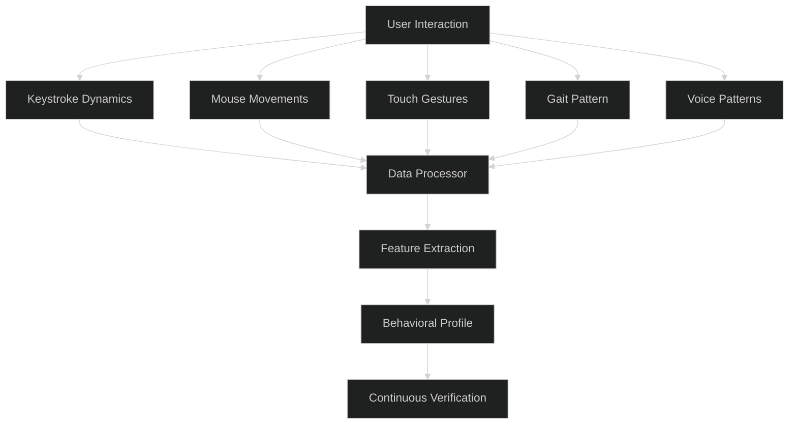
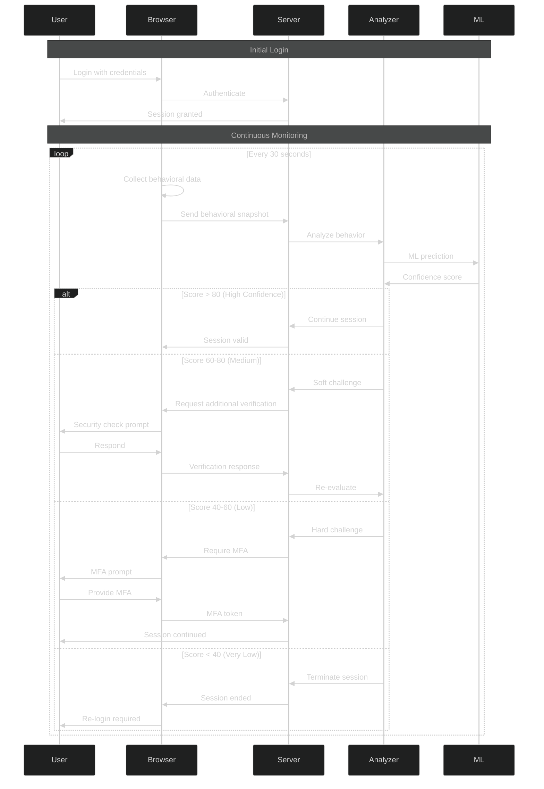

# Behavioral / Continuous Authentication - Intermediate Level

## Behavioral Biometrics Collection

### Data Collection Architecture



### Client-Side Collection

```javascript
class BehavioralBiometricsCollector {
  constructor() {
    this.keystrokeData = [];
    this.mouseData = [];
    this.touchData = [];
    this.sessionStart = Date.now();
  }
  
  initializeCollection() {
    // Keystroke dynamics
    document.addEventListener('keydown', (e) => this.captureKeyDown(e));
    document.addEventListener('keyup', (e) => this.captureKeyUp(e));
    
    // Mouse dynamics
    document.addEventListener('mousemove', (e) => this.captureMouseMove(e));
    document.addEventListener('click', (e) => this.captureClick(e));
    
    // Touch dynamics (mobile)
    document.addEventListener('touchstart', (e) => this.captureTouchStart(e));
    document.addEventListener('touchmove', (e) => this.captureTouchMove(e));
    document.addEventListener('touchend', (e) => this.captureTouchEnd(e));
    
    // Send data periodically
    setInterval(() => this.sendBehavioralData(), 30000); // Every 30 seconds
  }
  
  captureKeyDown(event) {
    const timestamp = Date.now();
    
    this.keystrokeData.push({
      type: 'keydown',
      key: event.key,
      code: event.code,
      timestamp: timestamp,
      sessionTime: timestamp - this.sessionStart
    });
  }
  
  captureKeyUp(event) {
    const timestamp = Date.now();
    
    // Find corresponding keydown
    const keydownIndex = this.keystrokeData.findIndex(
      k => k.type === 'keydown' && 
           k.key === event.key && 
           !k.duration
    );
    
    if (keydownIndex !== -1) {
      // Calculate dwell time (how long key was pressed)
      this.keystrokeData[keydownIndex].duration = 
        timestamp - this.keystrokeData[keydownIndex].timestamp;
      
      // Calculate flight time (time between keystrokes)
      if (keydownIndex > 0) {
        const prevKeystroke = this.keystrokeData[keydownIndex - 1];
        this.keystrokeData[keydownIndex].flightTime = 
          this.keystrokeData[keydownIndex].timestamp - prevKeystroke.timestamp;
      }
    }
  }
  
  captureMouseMove(event) {
    const timestamp = Date.now();
    
    // Sample mouse movements (not every pixel to reduce data)
    if (this.mouseData.length === 0 || 
        timestamp - this.mouseData[this.mouseData.length - 1].timestamp > 100) {
      
      const data = {
        type: 'mousemove',
        x: event.clientX,
        y: event.clientY,
        timestamp: timestamp,
        sessionTime: timestamp - this.sessionStart
      };
      
      // Calculate velocity if we have previous point
      if (this.mouseData.length > 0) {
        const prev = this.mouseData[this.mouseData.length - 1];
        const distance = Math.sqrt(
          Math.pow(data.x - prev.x, 2) + Math.pow(data.y - prev.y, 2)
        );
        const timeDiff = (data.timestamp - prev.timestamp) / 1000; // seconds
        data.velocity = distance / timeDiff; // pixels per second
        
        // Calculate acceleration
        if (prev.velocity !== undefined) {
          data.acceleration = (data.velocity - prev.velocity) / timeDiff;
        }
      }
      
      this.mouseData.push(data);
    }
  }
  
  captureClick(event) {
    this.mouseData.push({
      type: 'click',
      x: event.clientX,
      y: event.clientY,
      button: event.button,
      timestamp: Date.now(),
      sessionTime: Date.now() - this.sessionStart
    });
  }
  
  captureTouchStart(event) {
    const touch = event.touches[0];
    const timestamp = Date.now();
    
    this.touchData.push({
      type: 'touchstart',
      x: touch.clientX,
      y: touch.clientY,
      pressure: touch.force || 0,
      touchId: touch.identifier,
      timestamp: timestamp,
      sessionTime: timestamp - this.sessionStart
    });
  }
  
  captureTouchMove(event) {
    const touch = event.touches[0];
    
    this.touchData.push({
      type: 'touchmove',
      x: touch.clientX,
      y: touch.clientY,
      pressure: touch.force || 0,
      touchId: touch.identifier,
      timestamp: Date.now()
    });
  }
  
  captureTouchEnd(event) {
    const touch = event.changedTouches[0];
    const timestamp = Date.now();
    
    // Find corresponding touchstart
    const touchStartIndex = this.touchData.findIndex(
      t => t.type === 'touchstart' && 
           t.touchId === touch.identifier && 
           !t.duration
    );
    
    if (touchStartIndex !== -1) {
      this.touchData[touchStartIndex].duration = 
        timestamp - this.touchData[touchStartIndex].timestamp;
    }
  }
  
  async sendBehavioralData() {
    if (this.keystrokeData.length === 0 && 
        this.mouseData.length === 0 && 
        this.touchData.length === 0) {
      return;
    }
    
    const payload = {
      sessionId: sessionStorage.getItem('sessionId'),
      timestamp: Date.now(),
      keystroke: this.extractKeystrokeFeatures(),
      mouse: this.extractMouseFeatures(),
      touch: this.extractTouchFeatures()
    };
    
    try {
      await fetch('/api/behavioral-data', {
        method: 'POST',
        headers: {
          'Content-Type': 'application/json',
          'Authorization': `Bearer ${localStorage.getItem('token')}`
        },
        body: JSON.stringify(payload)
      });
      
      // Clear sent data
      this.keystrokeData = [];
      this.mouseData = [];
      this.touchData = [];
      
    } catch (error) {
      console.error('Failed to send behavioral data:', error);
    }
  }
  
  extractKeystrokeFeatures() {
    if (this.keystrokeData.length === 0) return null;
    
    const dwellTimes = this.keystrokeData
      .filter(k => k.duration)
      .map(k => k.duration);
    
    const flightTimes = this.keystrokeData
      .filter(k => k.flightTime)
      .map(k => k.flightTime);
    
    return {
      avgDwellTime: this.average(dwellTimes),
      stdDwellTime: this.standardDeviation(dwellTimes),
      avgFlightTime: this.average(flightTimes),
      stdFlightTime: this.standardDeviation(flightTimes),
      typingSpeed: dwellTimes.length / ((Date.now() - this.sessionStart) / 60000), // chars per minute
      errorRate: this.calculateErrorRate(this.keystrokeData)
    };
  }
  
  extractMouseFeatures() {
    if (this.mouseData.length === 0) return null;
    
    const velocities = this.mouseData
      .filter(m => m.velocity)
      .map(m => m.velocity);
    
    const accelerations = this.mouseData
      .filter(m => m.acceleration)
      .map(m => m.acceleration);
    
    return {
      avgVelocity: this.average(velocities),
      stdVelocity: this.standardDeviation(velocities),
      avgAcceleration: this.average(accelerations),
      stdAcceleration: this.standardDeviation(accelerations),
      clickRate: this.mouseData.filter(m => m.type === 'click').length / 
                 ((Date.now() - this.sessionStart) / 60000), // clicks per minute
      movementPattern: this.analyzeMovementPattern(this.mouseData)
    };
  }
  
  extractTouchFeatures() {
    if (this.touchData.length === 0) return null;
    
    const pressures = this.touchData
      .filter(t => t.pressure)
      .map(t => t.pressure);
    
    const durations = this.touchData
      .filter(t => t.duration)
      .map(t => t.duration);
    
    return {
      avgPressure: this.average(pressures),
      stdPressure: this.standardDeviation(pressures),
      avgTouchDuration: this.average(durations),
      stdTouchDuration: this.standardDeviation(durations),
      touchPattern: this.analyzeTouchPattern(this.touchData)
    };
  }
  
  average(arr) {
    if (arr.length === 0) return 0;
    return arr.reduce((a, b) => a + b, 0) / arr.length;
  }
  
  standardDeviation(arr) {
    if (arr.length === 0) return 0;
    const avg = this.average(arr);
    const squareDiffs = arr.map(value => Math.pow(value - avg, 2));
    return Math.sqrt(this.average(squareDiffs));
  }
  
  calculateErrorRate(keystrokeData) {
    // Count backspace/delete keys as errors
    const errors = keystrokeData.filter(
      k => k.key === 'Backspace' || k.key === 'Delete'
    ).length;
    return errors / keystrokeData.length;
  }
  
  analyzeMovementPattern(mouseData) {
    // Analyze if movements are smooth or erratic
    // Calculate curvature, direction changes, etc.
    // Simplified for example
    return 'smooth'; // or 'erratic'
  }
  
  analyzeTouchPattern(touchData) {
    // Analyze touch patterns (single tap, swipe, pinch, etc.)
    return 'normal'; // Simplified
  }
}

// Initialize on page load
const collector = new BehavioralBiometricsCollector();
collector.initializeCollection();
```

## Server-Side Analysis

### Behavioral Profile Management

```javascript
class BehavioralProfileAnalyzer {
  constructor(db, mlModel) {
    this.db = db;
    this.mlModel = mlModel;
  }
  
  async createProfile(userId, initialData) {
    // Create initial behavioral profile
    const profile = {
      userId: userId,
      keystroke: {
        avgDwellTime: null,
        stdDwellTime: null,
        avgFlightTime: null,
        stdFlightTime: null,
        typingSpeed: null
      },
      mouse: {
        avgVelocity: null,
        stdVelocity: null,
        avgAcceleration: null,
        clickRate: null
      },
      touch: {
        avgPressure: null,
        avgTouchDuration: null
      },
      samplesCollected: 0,
      lastUpdated: new Date(),
      createdAt: new Date()
    };
    
    await this.db.behavioralProfiles.create(profile);
    return profile;
  }
  
  async updateProfile(userId, newData) {
    const profile = await this.db.behavioralProfiles.findOne({ userId });
    
    if (!profile) {
      return await this.createProfile(userId, newData);
    }
    
    // Update profile with exponential moving average
    const alpha = 0.3; // Smoothing factor
    
    if (newData.keystroke) {
      profile.keystroke.avgDwellTime = this.ema(
        profile.keystroke.avgDwellTime,
        newData.keystroke.avgDwellTime,
        alpha
      );
      profile.keystroke.avgFlightTime = this.ema(
        profile.keystroke.avgFlightTime,
        newData.keystroke.avgFlightTime,
        alpha
      );
      profile.keystroke.typingSpeed = this.ema(
        profile.keystroke.typingSpeed,
        newData.keystroke.typingSpeed,
        alpha
      );
    }
    
    if (newData.mouse) {
      profile.mouse.avgVelocity = this.ema(
        profile.mouse.avgVelocity,
        newData.mouse.avgVelocity,
        alpha
      );
      profile.mouse.avgAcceleration = this.ema(
        profile.mouse.avgAcceleration,
        newData.mouse.avgAcceleration,
        alpha
      );
    }
    
    profile.samplesCollected += 1;
    profile.lastUpdated = new Date();
    
    await this.db.behavioralProfiles.update({ userId }, profile);
    
    return profile;
  }
  
  async analyzeBehavior(userId, currentData) {
    const profile = await this.db.behavioralProfiles.findOne({ userId });
    
    if (!profile || profile.samplesCollected < 10) {
      // Not enough data for reliable analysis
      return {
        confidence: 'low',
        score: 50, // Neutral
        recommendation: 'collect_more_data'
      };
    }
    
    // Calculate deviation scores for each behavioral aspect
    const deviations = {
      keystroke: this.calculateDeviation(
        currentData.keystroke,
        profile.keystroke
      ),
      mouse: this.calculateDeviation(
        currentData.mouse,
        profile.mouse
      ),
      touch: this.calculateDeviation(
        currentData.touch,
        profile.touch
      )
    };
    
    // Weighted average of deviations
    const overallDeviation = (
      deviations.keystroke * 0.4 +
      deviations.mouse * 0.35 +
      deviations.touch * 0.25
    );
    
    // Convert deviation to confidence score (0-100)
    // Lower deviation = higher confidence
    const confidenceScore = Math.max(0, Math.min(100, 100 - (overallDeviation * 10)));
    
    // Use ML model for additional analysis
    const mlPrediction = await this.mlModel.predict({
      profile: profile,
      current: currentData
    });
    
    // Combine rule-based and ML scores
    const finalScore = (confidenceScore * 0.6) + (mlPrediction.score * 0.4);
    
    return {
      confidence: this.getConfidenceLevel(finalScore),
      score: finalScore,
      deviations: deviations,
      recommendation: this.getRecommendation(finalScore),
      mlInsights: mlPrediction.insights
    };
  }
  
  calculateDeviation(current, baseline) {
    if (!current || !baseline) return 0;
    
    let totalDeviation = 0;
    let count = 0;
    
    for (const [key, value] of Object.entries(current)) {
      if (baseline[key] !== null && baseline[key] !== undefined) {
        const deviation = Math.abs(value - baseline[key]) / baseline[key];
        totalDeviation += deviation;
        count++;
      }
    }
    
    return count > 0 ? totalDeviation / count : 0;
  }
  
  ema(oldValue, newValue, alpha) {
    if (oldValue === null || oldValue === undefined) {
      return newValue;
    }
    return (alpha * newValue) + ((1 - alpha) * oldValue);
  }
  
  getConfidenceLevel(score) {
    if (score >= 80) return 'high';
    if (score >= 60) return 'medium';
    if (score >= 40) return 'low';
    return 'very_low';
  }
  
  getRecommendation(score) {
    if (score >= 80) return 'allow';
    if (score >= 60) return 'monitor';
    if (score >= 40) return 'challenge';
    return 'block';
  }
}
```

## Continuous Authentication Flow

### Real-Time Monitoring



### Continuous Verification Middleware

```javascript
class ContinuousAuthMiddleware {
  constructor(analyzer) {
    this.analyzer = analyzer;
    this.verificationInterval = 30000; // 30 seconds
  }
  
  async verify(req, res, next) {
    const userId = req.session.userId;
    const sessionId = req.session.id;
    
    // Check last verification time
    const lastVerification = await redis.get(`lastverify:${sessionId}`);
    const now = Date.now();
    
    if (lastVerification && (now - parseInt(lastVerification)) < this.verificationInterval) {
      // Recently verified, allow
      return next();
    }
    
    // Get recent behavioral data
    const recentData = await this.db.behavioralData.findOne({
      sessionId: sessionId,
      timestamp: { $gte: new Date(now - 60000) } // Last minute
    });
    
    if (!recentData) {
      // No recent behavioral data, soft challenge
      return res.status(202).json({
        status: 'verification_required',
        type: 'behavioral_data_missing',
        message: 'Please continue using the application'
      });
    }
    
    // Analyze behavior
    const analysis = await this.analyzer.analyzeBehavior(userId, recentData);
    
    // Update last verification time
    await redis.setex(`lastverify:${sessionId}`, 60, now.toString());
    
    // Handle based on confidence
    switch (analysis.recommendation) {
      case 'allow':
        // High confidence, continue
        next();
        break;
        
      case 'monitor':
        // Medium confidence, allow but log
        await this.logSecurityEvent({
          type: 'behavioral_deviation',
          severity: 'low',
          userId: userId,
          score: analysis.score,
          deviations: analysis.deviations
        });
        next();
        break;
        
      case 'challenge':
        // Low confidence, require soft challenge
        return res.status(403).json({
          status: 'challenge_required',
          type: 'behavioral_anomaly',
          challenge: {
            type: 'security_question',
            question: await this.getSecurityQuestion(userId)
          },
          score: analysis.score
        });
        
      case 'block':
        // Very low confidence, terminate session
        req.session.destroy();
        await this.logSecurityEvent({
          type: 'session_terminated',
          severity: 'high',
          userId: userId,
          reason: 'behavioral_anomaly',
          score: analysis.score,
          deviations: analysis.deviations
        });
        return res.status(401).json({
          status: 'session_terminated',
          reason: 'Security verification failed. Please log in again.'
        });
    }
  }
  
  async logSecurityEvent(event) {
    await this.db.securityEvents.create({
      ...event,
      timestamp: new Date()
    });
    
    // Alert security team for high severity
    if (event.severity === 'high') {
      await this.alertSecurityTeam(event);
    }
  }
}
```

## Machine Learning Models

### Training Behavioral Models

```python
import numpy as np
from sklearn.ensemble import IsolationForest
from sklearn.preprocessing import StandardScaler

class BehavioralAnomalyDetector:
    def __init__(self):
        self.model = IsolationForest(
            contamination=0.1,  # Expected anomaly rate
            random_state=42
        )
        self.scaler = StandardScaler()
        
    def prepare_features(self, behavioral_data):
        """Extract features from behavioral data"""
        features = []
        
        for session in behavioral_data:
            feature_vector = [
                session['keystroke']['avgDwellTime'],
                session['keystroke']['stdDwellTime'],
                session['keystroke']['avgFlightTime'],
                session['keystroke']['typingSpeed'],
                session['keystroke']['errorRate'],
                session['mouse']['avgVelocity'],
                session['mouse']['stdVelocity'],
                session['mouse']['avgAcceleration'],
                session['mouse']['clickRate'],
                session['touch']['avgPressure'] if session.get('touch') else 0,
                session['touch']['avgTouchDuration'] if session.get('touch') else 0
            ]
            features.append(feature_vector)
        
        return np.array(features)
    
    def train(self, user_behavioral_data):
        """Train model on user's normal behavior"""
        features = self.prepare_features(user_behavioral_data)
        
        # Normalize features
        features_scaled = self.scaler.fit_transform(features)
        
        # Train isolation forest
        self.model.fit(features_scaled)
        
        return {
            'trained': True,
            'samples': len(features),
            'feature_count': features.shape[1]
        }
    
    def predict(self, current_behavior):
        """Predict if current behavior is anomalous"""
        features = self.prepare_features([current_behavior])
        features_scaled = self.scaler.transform(features)
        
        # Get prediction (-1 for anomaly, 1 for normal)
        prediction = self.model.predict(features_scaled)[0]
        
        # Get anomaly score
        score = self.model.score_samples(features_scaled)[0]
        
        # Convert to confidence score (0-100)
        confidence = self._score_to_confidence(score)
        
        return {
            'is_anomaly': prediction == -1,
            'confidence': confidence,
            'raw_score': score
        }
    
    def _score_to_confidence(self, score):
        """Convert anomaly score to confidence percentage"""
        # Scores typically range from -0.5 to 0
        # More negative = more anomalous
        normalized = (score + 0.5) * 200  # Scale to 0-100
        return max(0, min(100, normalized))
```

## Best Practices

### Implementation Guidelines

✅ **Do:**
- Collect behavioral data with user consent
- Use multiple behavioral factors for reliability
- Implement graceful degradation
- Provide clear user feedback
- Balance security with user experience
- Allow users to opt-in to continuous auth
- Store behavioral profiles securely
- Regular model retraining

❌ **Don't:**
- Collect more data than necessary
- Use behavioral auth as sole authentication
- Block users without explanation
- Ignore privacy regulations (GDPR, CCPA)
- Use overly sensitive detection thresholds
- Forget about accessibility considerations
- Store raw behavioral data long-term
- Deploy without thorough testing

## Next Steps

📕 **Advanced Level:** Deep learning for behavioral analysis, multi-modal biometric fusion, adversarial attack prevention, privacy-preserving behavioral authentication

---

**Related Topics:** Machine Learning, Biometric Authentication, Anomaly Detection, Privacy, User Experience
