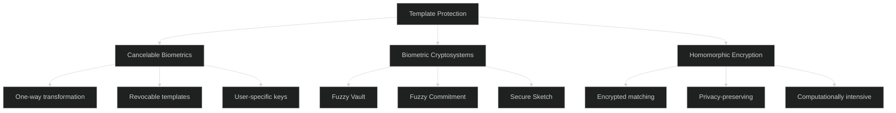
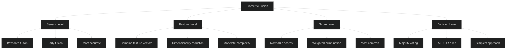

# Biometric Authentication - Advanced Level

## Biometric Template Protection

### Template Protection Techniques



### Cancelable Biometric Implementation

```javascript
class CancelableBiometrics {
  constructor() {
    this.hashIterations = 100000;
  }
  
  async generateCancelableTemplate(biometricData, userKey, applicationId) {
    // Step 1: Extract biometric features
    const features = await this.extractFeatures(biometricData);
    
    // Step 2: Generate user-specific transformation key
    const transformKey = await this.deriveTransformationKey(
      userKey,
      applicationId
    );
    
    // Step 3: Apply one-way transformation
    const cancelableTemplate = await this.applyTransformation(
      features,
      transformKey
    );
    
    // Step 4: Hash the transformed template
    const hashedTemplate = await this.hashTemplate(cancelableTemplate);
    
    return {
      template: hashedTemplate,
      metadata: {
        algorithm: 'BioHash-v2',
        applicationId,
        createdAt: Date.now()
      }
    };
  }
  
  async deriveTransformationKey(userKey, applicationId) {
    // Derive application-specific transformation key
    const salt = Buffer.from(applicationId);
    
    return crypto.pbkdf2Sync(
      userKey,
      salt,
      this.hashIterations,
      32,
      'sha256'
    );
  }
  
  async applyTransformation(features, transformKey) {
    // Apply BioHashing transformation
    // features: binary feature vector (e.g., 512-bit)
    // transformKey: 256-bit key
    
    // Generate pseudo-random matrix using transformKey
    const matrix = this.generatePseudoRandomMatrix(transformKey, features.length);
    
    // Project features onto random matrix
    const projected = this.matrixMultiply(matrix, features);
    
    // Binarize using threshold
    const binarized = projected.map(val => val > 0 ? 1 : 0);
    
    return Buffer.from(binarized);
  }
  
  generatePseudoRandomMatrix(seed, size) {
    // Generate deterministic random matrix from seed
    const matrix = [];
    const rng = this.createSeededRNG(seed);
    
    for (let i = 0; i < size; i++) {
      const row = [];
      for (let j = 0; j < size; j++) {
        row.push(rng.next() * 2 - 1); // Values between -1 and 1
      }
      matrix.push(row);
    }
    
    return matrix;
  }
  
  createSeededRNG(seed) {
    let state = Buffer.from(seed).readUInt32BE(0);
    
    return {
      next: function() {
        // Linear congruential generator
        state = (state * 1664525 + 1013904223) % 4294967296;
        return state / 4294967296;
      }
    };
  }
  
  matrixMultiply(matrix, vector) {
    return matrix.map(row => 
      row.reduce((sum, val, idx) => sum + val * vector[idx], 0)
    );
  }
  
  async hashTemplate(template) {
    return crypto.createHash('sha256').update(template).digest();
  }
  
  async verify(biometricData, storedTemplate, userKey, applicationId) {
    // Generate cancelable template from input
    const inputTemplate = await this.generateCancelableTemplate(
      biometricData,
      userKey,
      applicationId
    );
    
    // Compare templates using Hamming distance
    const distance = this.hammingDistance(
      inputTemplate.template,
      storedTemplate
    );
    
    // Calculate similarity score
    const similarity = 1 - (distance / (storedTemplate.length * 8));
    
    // Threshold for matching (typically 90-95%)
    const threshold = 0.92;
    
    return {
      match: similarity >= threshold,
      similarity: similarity,
      confidence: this.calculateConfidence(similarity, threshold)
    };
  }
  
  hammingDistance(a, b) {
    let distance = 0;
    
    for (let i = 0; i < a.length; i++) {
      const xor = a[i] ^ b[i];
      distance += this.countSetBits(xor);
    }
    
    return distance;
  }
  
  countSetBits(n) {
    let count = 0;
    while (n) {
      count += n & 1;
      n >>= 1;
    }
    return count;
  }
  
  calculateConfidence(similarity, threshold) {
    // Calculate confidence score (0-100)
    if (similarity < threshold) {
      return Math.max(0, (similarity / threshold) * 50);
    } else {
      return 50 + ((similarity - threshold) / (1 - threshold)) * 50;
    }
  }
  
  async revokeTemplate(userId, applicationId) {
    // Revoke by changing user key
    // This makes all old templates invalid
    const newUserKey = crypto.randomBytes(32);
    
    await this.db.users.update(
      { userId },
      { 
        biometricKey: newUserKey,
        keyRotatedAt: new Date()
      }
    );
    
    return { revoked: true, newKey: newUserKey };
  }
}
```

## Fuzzy Vault Scheme

### Secure Fingerprint Storage

```javascript
class FuzzyVaultScheme {
  constructor() {
    this.polynomialDegree = 8; // Secret polynomial degree
    this.chaffPoints = 200; // Number of chaff points
    this.fieldSize = 65521; // Prime number for finite field
  }
  
  async lockSecret(minutiae, secret) {
    // Step 1: Encode secret as polynomial coefficients
    const polynomial = this.encodeSecretAsPolynomial(secret);
    
    // Step 2: Evaluate polynomial at minutiae points
    const genuinePoints = minutiae.map(point => ({
      x: this.quantizeMinutia(point),
      y: this.evaluatePolynomial(polynomial, this.quantizeMinutia(point))
    }));
    
    // Step 3: Add chaff points (random points not on polynomial)
    const chaffPoints = this.generateChaffPoints(genuinePoints);
    
    // Step 4: Shuffle all points
    const vault = this.shuffle([...genuinePoints, ...chaffPoints]);
    
    return {
      vault: vault,
      metadata: {
        degree: this.polynomialDegree,
        fieldSize: this.fieldSize
      }
    };
  }
  
  encodeSecretAsPolynomial(secret) {
    // Convert secret to polynomial coefficients
    const secretBytes = Buffer.from(secret);
    const coefficients = [];
    
    for (let i = 0; i <= this.polynomialDegree; i++) {
      if (i < secretBytes.length) {
        coefficients.push(secretBytes[i]);
      } else {
        // Pad with random values
        coefficients.push(crypto.randomInt(0, 256));
      }
    }
    
    return coefficients;
  }
  
  quantizeMinutia(minutia) {
    // Quantize minutia coordinates to reduce variability
    const { x, y, theta } = minutia;
    
    // Combine coordinates and angle into single value
    const quantized = (
      Math.floor(x / 4) * 10000 +
      Math.floor(y / 4) * 100 +
      Math.floor(theta / 10)
    );
    
    return quantized % this.fieldSize;
  }
  
  evaluatePolynomial(coefficients, x) {
    // Evaluate polynomial at point x using Horner's method
    let result = 0;
    
    for (let i = coefficients.length - 1; i >= 0; i--) {
      result = (result * x + coefficients[i]) % this.fieldSize;
    }
    
    return result;
  }
  
  generateChaffPoints(genuinePoints) {
    const chaff = [];
    const genuineXs = new Set(genuinePoints.map(p => p.x));
    
    while (chaff.length < this.chaffPoints) {
      const x = crypto.randomInt(0, this.fieldSize);
      
      // Ensure chaff point doesn't coincide with genuine point
      if (!genuineXs.has(x)) {
        chaff.push({
          x: x,
          y: crypto.randomInt(0, this.fieldSize)
        });
      }
    }
    
    return chaff;
  }
  
  shuffle(array) {
    // Fisher-Yates shuffle
    for (let i = array.length - 1; i > 0; i--) {
      const j = crypto.randomInt(0, i + 1);
      [array[i], array[j]] = [array[j], array[i]];
    }
    return array;
  }
  
  async unlockSecret(queryMinutiae, vault, metadata) {
    // Step 1: Quantize query minutiae
    const queryPoints = queryMinutiae.map(m => ({
      x: this.quantizeMinutia(m),
      y: null
    }));
    
    // Step 2: Find matching points in vault
    const matchedPoints = [];
    
    for (const qPoint of queryPoints) {
      const vaultPoint = vault.find(vp => vp.x === qPoint.x);
      if (vaultPoint) {
        matchedPoints.push(vaultPoint);
      }
    }
    
    // Step 3: Check if enough points to reconstruct polynomial
    if (matchedPoints.length <= metadata.degree) {
      return { success: false, reason: 'insufficient_matches' };
    }
    
    // Step 4: Use Reed-Solomon decoder to find polynomial
    const polynomial = this.reedSolomonDecode(
      matchedPoints,
      metadata.degree
    );
    
    if (!polynomial) {
      return { success: false, reason: 'decoding_failed' };
    }
    
    // Step 5: Extract secret from polynomial coefficients
    const secret = this.extractSecretFromPolynomial(polynomial);
    
    // Step 6: Verify secret (e.g., with checksum)
    if (this.verifySecret(secret)) {
      return {
        success: true,
        secret: secret
      };
    }
    
    return { success: false, reason: 'invalid_secret' };
  }
  
  reedSolomonDecode(points, degree) {
    // Simplified Reed-Solomon decoding
    // In production, use proper error-correcting code library
    
    // Attempt to fit polynomial using least squares
    // Try all combinations of (degree + 1) points
    const combinations = this.getCombinations(points, degree + 1);
    
    for (const combo of combinations) {
      const poly = this.lagrangeInterpolation(combo);
      
      // Check if polynomial fits most points
      const errorCount = this.countErrors(poly, points);
      
      if (errorCount < points.length * 0.2) { // Less than 20% errors
        return poly;
      }
    }
    
    return null;
  }
  
  lagrangeInterpolation(points) {
    // Lagrange interpolation to find polynomial
    const n = points.length;
    const coefficients = new Array(n).fill(0);
    
    for (let i = 0; i < n; i++) {
      let term = [points[i].y];
      
      for (let j = 0; j < n; j++) {
        if (i !== j) {
          const denom = this.modInverse(
            (points[i].x - points[j].x + this.fieldSize) % this.fieldSize,
            this.fieldSize
          );
          
          term = this.multiplyPolynomials(
            term,
            [(-points[j].x * denom + this.fieldSize) % this.fieldSize, denom],
            this.fieldSize
          );
        }
      }
      
      coefficients = this.addPolynomials(coefficients, term, this.fieldSize);
    }
    
    return coefficients;
  }
  
  modInverse(a, m) {
    // Extended Euclidean algorithm
    let [old_r, r] = [a, m];
    let [old_s, s] = [1, 0];
    
    while (r !== 0) {
      const quotient = Math.floor(old_r / r);
      [old_r, r] = [r, old_r - quotient * r];
      [old_s, s] = [s, old_s - quotient * s];
    }
    
    return (old_s + m) % m;
  }
}
```

## Multi-Modal Biometric Fusion

### Fusion Strategies



### Score-Level Fusion Implementation

```javascript
class MultiModalBiometricFusion {
  constructor() {
    this.modalities = ['fingerprint', 'face', 'iris', 'voice'];
    this.weights = {
      fingerprint: 0.35,
      face: 0.25,
      iris: 0.30,
      voice: 0.10
    };
  }
  
  async authenticate(biometricData, storedTemplates) {
    const scores = {};
    
    // Get individual matcher scores
    for (const modality of Object.keys(biometricData)) {
      scores[modality] = await this.matchBiometric(
        modality,
        biometricData[modality],
        storedTemplates[modality]
      );
    }
    
    // Normalize scores
    const normalizedScores = this.normalizeScores(scores);
    
    // Apply fusion strategy
    const fusedScore = this.weightedSumFusion(normalizedScores);
    
    // Make decision
    const decision = this.makeDecision(fusedScore, normalizedScores);
    
    return decision;
  }
  
  async matchBiometric(modality, input, template) {
    // Call appropriate matcher for each modality
    const matchers = {
      fingerprint: this.matchFingerprint,
      face: this.matchFace,
      iris: this.matchIris,
      voice: this.matchVoice
    };
    
    const score = await matchers[modality].call(this, input, template);
    
    return {
      score: score.similarity,
      confidence: score.confidence,
      quality: this.assessQuality(input, modality)
    };
  }
  
  normalizeScores(scores) {
    // Min-max normalization to [0, 1] range
    const normalized = {};
    
    for (const [modality, data] of Object.entries(scores)) {
      // Each modality has different score ranges
      const range = this.getScoreRange(modality);
      
      normalized[modality] = {
        score: (data.score - range.min) / (range.max - range.min),
        confidence: data.confidence,
        quality: data.quality
      };
    }
    
    return normalized;
  }
  
  weightedSumFusion(normalizedScores) {
    let fusedScore = 0;
    let totalWeight = 0;
    
    for (const [modality, data] of Object.entries(normalizedScores)) {
      // Adjust weight based on quality
      const qualityFactor = data.quality / 100;
      const adjustedWeight = this.weights[modality] * qualityFactor;
      
      fusedScore += data.score * adjustedWeight;
      totalWeight += adjustedWeight;
    }
    
    // Normalize
    return fusedScore / totalWeight;
  }
  
  productRuleFusion(normalizedScores) {
    // Alternative: Product rule fusion
    let product = 1;
    
    for (const data of Object.values(normalizedScores)) {
      product *= data.score;
    }
    
    return product;
  }
  
  makeDecision(fusedScore, individualScores) {
    const threshold = 0.75; // Fusion threshold
    
    // Primary decision based on fused score
    const accepted = fusedScore >= threshold;
    
    // Additional checks
    const criticalModalities = ['fingerprint', 'iris'];
    const criticalPassed = criticalModalities.every(mod => 
      !individualScores[mod] || individualScores[mod].score >= 0.6
    );
    
    // Final decision
    const finalDecision = accepted && criticalPassed;
    
    return {
      authenticated: finalDecision,
      fusedScore: fusedScore,
      confidence: this.calculateConfidence(fusedScore, individualScores),
      individualScores: individualScores,
      reasoning: this.explainDecision(fusedScore, individualScores, finalDecision)
    };
  }
  
  calculateConfidence(fusedScore, individualScores) {
    // Calculate overall confidence
    const scoreConfidence = Math.min(100, fusedScore * 120);
    
    // Factor in agreement between modalities
    const scores = Object.values(individualScores).map(s => s.score);
    const variance = this.calculateVariance(scores);
    const agreementBonus = (1 - variance) * 20; // Up to 20 bonus points
    
    return Math.min(100, scoreConfidence + agreementBonus);
  }
  
  calculateVariance(values) {
    const mean = values.reduce((a, b) => a + b) / values.length;
    const squaredDiffs = values.map(v => Math.pow(v - mean, 2));
    return squaredDiffs.reduce((a, b) => a + b) / values.length;
  }
  
  explainDecision(fusedScore, individualScores, decision) {
    const explanations = [];
    
    if (decision) {
      explanations.push(`High confidence match (${(fusedScore * 100).toFixed(1)}%)`);
    } else {
      explanations.push(`Below threshold (${(fusedScore * 100).toFixed(1)}%)`);
    }
    
    // Explain individual modality contributions
    for (const [modality, data] of Object.entries(individualScores)) {
      if (data.score >= 0.8) {
        explanations.push(`${modality}: Strong match`);
      } else if (data.score < 0.5) {
        explanations.push(`${modality}: Poor match`);
      }
    }
    
    return explanations;
  }
}
```

## Best Practices

### Security & Privacy Checklist

✅ **Do:**
- Use cancelable biometric templates
- Implement template protection schemes
- Store templates encrypted at rest
- Use secure enclaves/TPM when available
- Implement multi-factor authentication with biometrics
- Provide clear consent mechanisms
- Allow biometric data deletion
- Implement liveness detection
- Use multi-modal biometrics for critical operations
- Regular security audits of biometric systems

❌ **Don't:**
- Store raw biometric data
- Use biometrics as sole authentication for high-value operations
- Share biometric templates across applications
- Implement without privacy impact assessment
- Forget GDPR/CCPA compliance
- Use biometrics without user consent
- Allow unlimited authentication attempts
- Skip quality assessment
- Ignore presentation attack detection
- Use weak template protection

## Next Steps

📚 **Related Advanced Topics:** Presentation attack detection, deep learning for biometrics, continuous authentication, behavioral biometrics fusion, quantum-safe biometric cryptosystems

---

**Related Topics:** Privacy-Preserving Technologies, Cryptography, Machine Learning, Template Protection, Zero-Knowledge Proofs
