# Biometric Authentication - Basic Level

## What is Biometric Authentication?

**Biometric authentication** uses your unique physical or behavioral characteristics to verify your identity. Instead of remembering a password, you use **who you are** - your fingerprint, face, voice, or even how you type.

## Types of Biometric Authentication

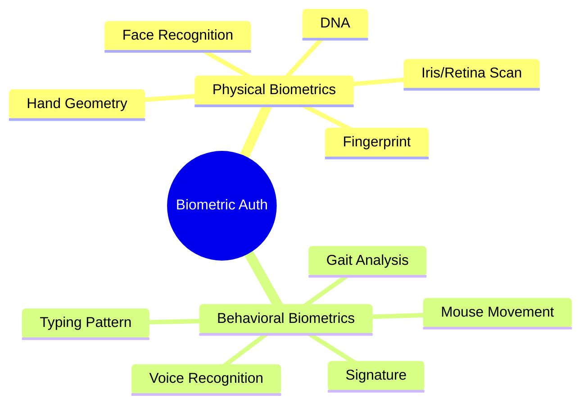

### 1. Fingerprint Recognition

**Most Common** - Used in smartphones, laptops, and building access

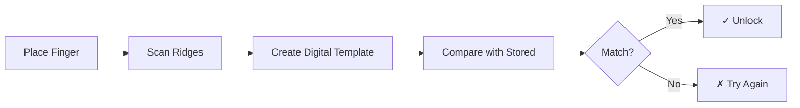

**Examples:**
- 📱 iPhone Touch ID / Android fingerprint
- 💻 Windows Hello fingerprint
- 🏦 Bank ATM fingerprint verification

**Pros:**
- ✅ Very fast (< 1 second)
- ✅ High accuracy (99.8%)
- ✅ Can't be forgotten like passwords
- ✅ Convenient for users

**Cons:**
- ❌ Can't change if compromised
- ❌ Doesn't work with wet/dirty fingers
- ❌ Injuries can prevent access

### 2. Face Recognition

**Growing Fast** - Modern smartphones and security systems

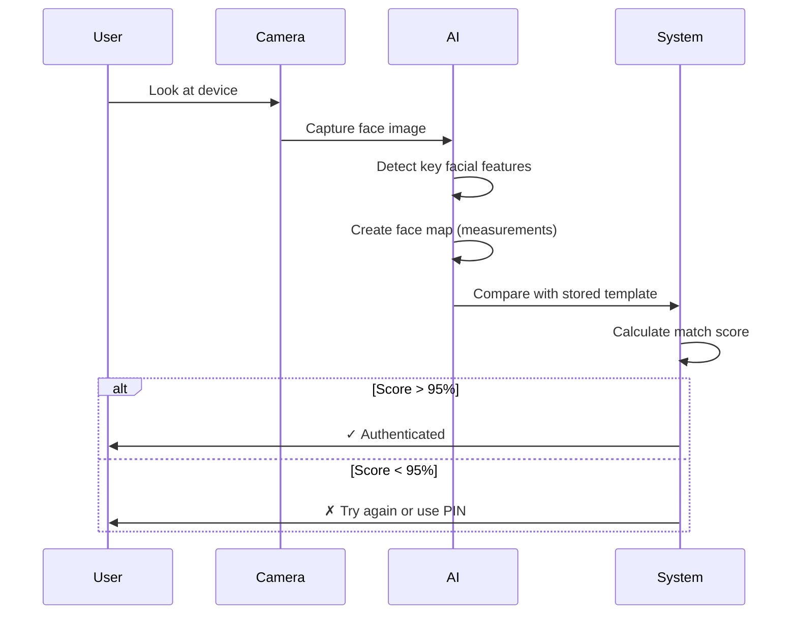

**Examples:**
- 📱 iPhone Face ID / Android Face Unlock
- 🛂 Airport border control
- 🏢 Office building access
- 🏦 Banking apps verification

**Technology Types:**
- **2D Face Recognition**: Uses regular camera (less secure)
- **3D Face Recognition**: Uses depth sensors (more secure)
- **Liveness Detection**: Ensures it's a real person, not a photo

**Pros:**
- ✅ Contactless (hygienic)
- ✅ Very convenient (just look)
- ✅ Works from a distance
- ✅ Difficult to spoof (with 3D)

**Cons:**
- ❌ Lighting conditions matter
- ❌ Glasses, masks can interfere
- ❌ Privacy concerns
- ❌ Can be fooled (2D systems)

### 3. Iris/Retina Scanning

**Highest Security** - Used in high-security facilities

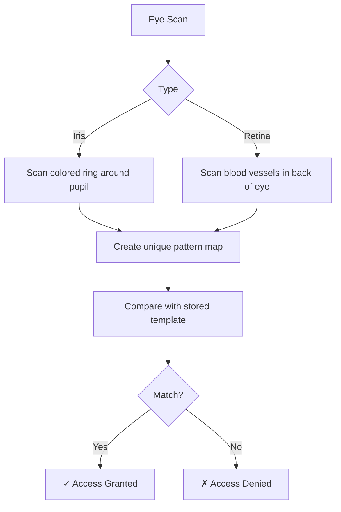

**Examples:**
- 🏛️ Government facilities
- 💎 Bank vaults
- 🔬 Research laboratories
- ✈️ High-security airports

**Pros:**
- ✅ Extremely accurate (99.999%)
- ✅ Nearly impossible to fake
- ✅ Stable over lifetime
- ✅ Very secure

**Cons:**
- ❌ Expensive equipment
- ❌ Requires close proximity
- ❌ Can be uncomfortable
- ❌ Medical conditions can affect

### 4. Voice Recognition

**Hands-Free** - Phone banking and virtual assistants

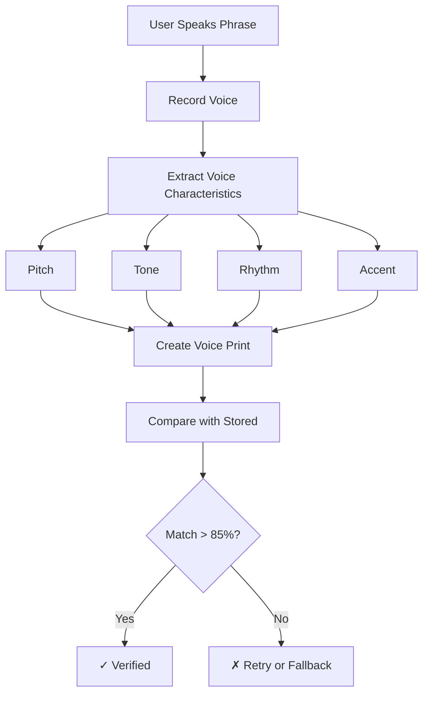

**Examples:**
- 📞 Phone banking: "Say your PIN"
- 🏦 Bank hotlines verification
- 🏠 Smart home devices
- 🚗 Car voice commands

**Pros:**
- ✅ Hands-free authentication
- ✅ Natural interaction
- ✅ Works remotely (phone)
- ✅ Good for accessibility

**Cons:**
- ❌ Background noise issues
- ❌ Illness affects voice
- ❌ Can be recorded
- ❌ Lower accuracy than other methods

### 5. Typing Pattern (Keystroke Dynamics)

**Behavioral** - How you type is unique

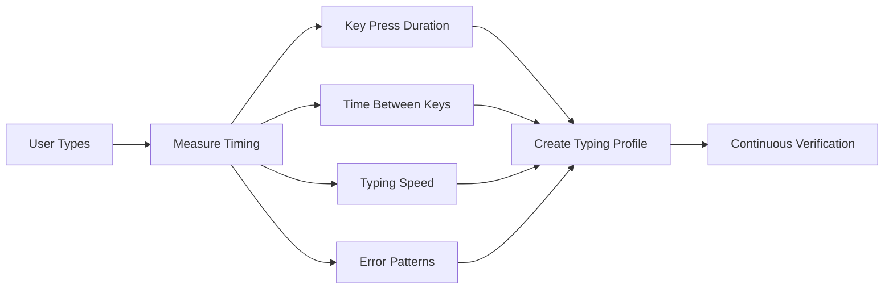

**Examples:**
- 🏦 Banking websites (background check)
- 💼 Corporate systems
- 🎓 Online exam proctoring
- 🔐 High-security logins

**Pros:**
- ✅ Invisible to user
- ✅ Continuous authentication
- ✅ No extra hardware needed
- ✅ Hard to mimic

**Cons:**
- ❌ Varies with mood/fatigue
- ❌ Different keyboards affect it
- ❌ Requires training period
- ❌ Not very accurate alone

## How Biometric Data is Stored

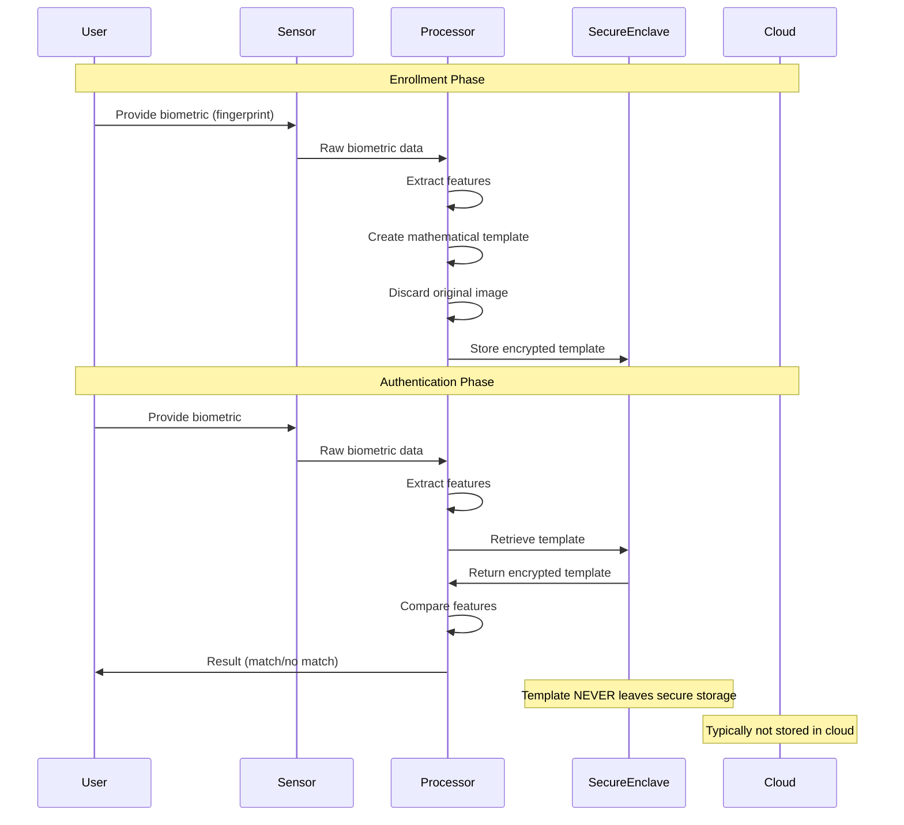

**Important:** 
- 🔒 **Your actual fingerprint/face is NOT stored**
- 🔐 **Only a mathematical template is kept**
- 🛡️ **Stored in secure hardware (Secure Enclave)**
- 🚫 **Apps cannot access raw biometric data**

## Industry Use Cases

### 🏦 Banking & Finance

**Use Case:** Mobile banking app login

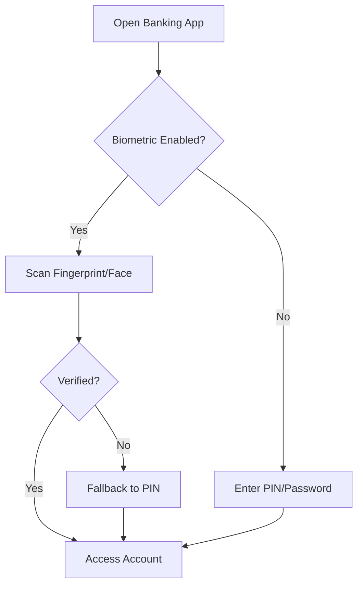

**Examples:**
- Bank of America mobile app
- PayPal fingerprint login
- Venmo Face ID
- Apple Pay transaction authorization

### 🏥 Healthcare

**Use Case:** Access electronic health records (EHR)

```
Doctor authenticates:
1. Scan fingerprint at workstation
2. System verifies identity
3. Opens patient record
4. All access logged for HIPAA compliance
```

**Benefits:**
- Quick access in emergencies
- Prevents unauthorized access to patient data
- Audit trail of who accessed what
- No passwords to forget during critical moments

### 🛒 E-commerce

**Use Case:** Purchase confirmation

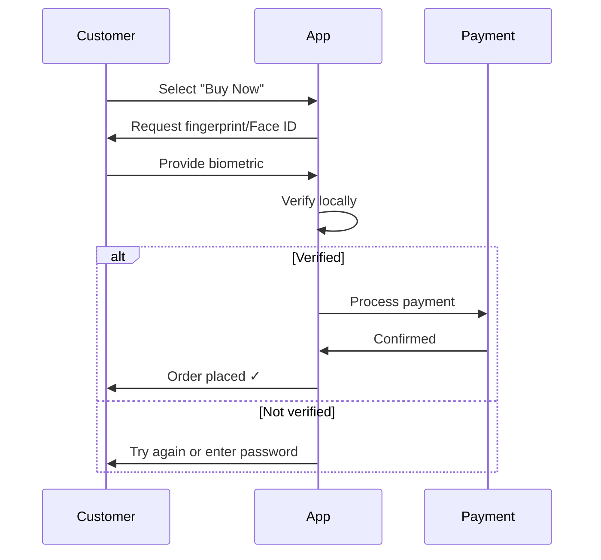

**Examples:**
- Amazon app purchases
- Apple Pay / Google Pay
- In-app purchases
- One-click buying

### 📱 Mobile Devices

**Use Case:** Phone unlocking

```
iPhone Face ID:
1. Swipe up to wake
2. Look at phone
3. Phone unlocks in < 1 second
4. If fails, try again or enter passcode
```

**Security Features:**
- Attention detection (must be looking at phone)
- Anti-spoofing (rejects photos/masks)
- Adapts to appearance changes (beard, glasses)
- Disables after 5 failed attempts

### 🏢 Workplace Access

**Use Case:** Building entry and time tracking

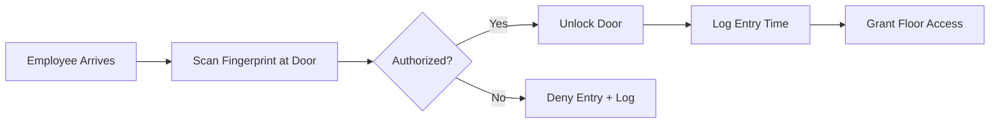

**Benefits:**
- No cards to lose or forget
- Prevents buddy punching (someone else clocking in for you)
- Automatic time tracking
- Detailed access logs

## Biometric Security Levels

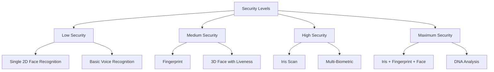

## Privacy and Security Concerns

### Common Concerns

**❓ "Can my biometric data be stolen?"**
- Template is encrypted and stored locally
- Mathematical representation, not actual image
- Very difficult to reverse-engineer

**❓ "What if someone forces me to unlock my phone with my fingerprint?"**
- Most devices have panic/emergency modes
- Can require password after restart
- Some apps have duress PINs

**❓ "Will my face data be shared with others?"**
- By law, biometric data must be protected
- Usually processed on-device only
- Not shared without explicit consent

### Protection Measures

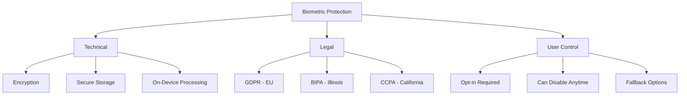

## Advantages of Biometric Authentication

### For Users

1. **Convenience** - No passwords to remember
2. **Speed** - Authenticate in < 1 second
3. **Always Available** - You always have your fingerprint/face
4. **Better UX** - Seamless experience

### For Organizations

1. **Higher Security** - Harder to share or steal
2. **Audit Trail** - Know exactly who accessed what
3. **Cost Savings** - Reduced password reset costs
4. **Compliance** - Meet regulatory requirements

## Disadvantages and Limitations

### Technical Limitations

- **False Rejection Rate (FRR)**: Legitimate user denied (~1-2%)
- **False Acceptance Rate (FAR)**: Impostor accepted (~0.001%)
- **Environmental Factors**: Lighting, noise, cleanliness
- **Hardware Requirements**: Special sensors needed

### Privacy Issues

- **Data Sensitivity**: Biometrics are permanent identifiers
- **Surveillance Concerns**: Tracking without consent
- **Data Breaches**: If stolen, can't be changed
- **Discrimination**: May not work well for all demographics

## Best Practices for Users

### ✅ Do

- Enable biometric auth on important apps
- Set up alternative authentication methods
- Keep sensors clean
- Review app permissions
- Understand privacy policies

### ❌ Don't

- Share your device when biometric is enabled
- Enroll others' biometrics on your device
- Rely solely on biometrics for very sensitive data
- Ignore fallback options

## Future of Biometric Authentication

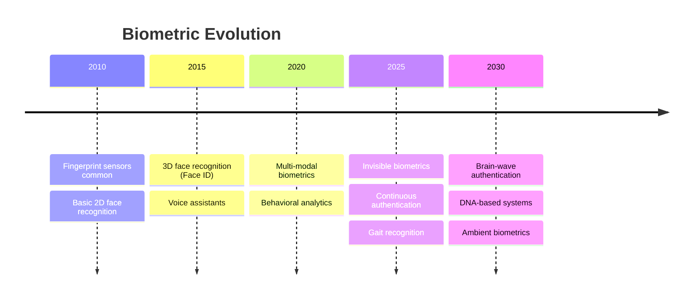

## Key Takeaways

1. **Biometrics use "who you are"** instead of "what you know"
2. **Most convenient method** - no passwords to remember
3. **Can't be changed** if compromised - use as part of MFA
4. **Privacy matters** - understand how your data is protected
5. **Always have backup** - PIN/password as fallback

## Next Steps

- 📗 **Intermediate Level:** Explore biometric algorithms, industry implementations, and detailed workflows
- 📕 **Advanced Level:** Deep dive into liveness detection, anti-spoofing, multi-modal systems, and security protocols

---

**Related Topics:** Multi-Factor Authentication, Passwordless Authentication, Hardware Security Keys, Privacy & Compliance
