# Biometric Authentication - Intermediate Level

## Biometric Algorithms and Processing

### Fingerprint Recognition Process

```mermaid
flowchart TD
    A[Fingerprint Sensor] --> B[Capture Image]
    B --> C[Image Enhancement]
    C --> D[Feature Extraction]
    D --> E[Minutiae Detection]
    E --> F[Create Template]
    F --> G[Template Storage]
    
    H[Authentication Attempt] --> I[Capture New Image]
    I --> J[Extract Features]
    J --> K[Match Against Template]
    K --> L{Match Score}
    L -->|Above Threshold| M[Accept ✓]
    L -->|Below Threshold| N[Reject ✗]
```



### Minutiae Points (Fingerprint)


**Template Creation:**

```javascript
// Simplified fingerprint template structure
const fingerprintTemplate = {
  version: '1.0',
  sensor: 'optical',
  quality: 85,  // 0-100 quality score
  minutiae: [
    { type: 'ridge_ending', x: 124, y: 87, angle: 45 },
    { type: 'bifurcation', x: 156, y: 102, angle: 135 },
    { type: 'ridge_ending', x: 89, y: 134, angle: 90 },
    // ... typically 30-100 minutiae points
  ],
  metadata: {
    captureDate: '2025-01-15',
    fingerId: 'right_thumb',
    imageResolution: '500dpi'
  }
};

// Template size: ~600-1200 bytes (very compact)
// Original image: 50-200 KB (not stored)
```

## Face Recognition Technology

### Face Recognition Pipeline


### Face Embedding Example

```javascript
// Face recognition using deep learning
const faceEmbedding = [
  0.234, -0.567, 0.123, 0.891, -0.234,  // 128 or 512 dimensional vector
  // ... represents unique facial features
  // Reduced from megapixels to compact representation
];

// Comparing faces using Euclidean distance
function compareFaces(embedding1, embedding2) {
  let distance = 0;
  for (let i = 0; i < embedding1.length; i++) {
    distance += Math.pow(embedding1[i] - embedding2[i], 2);
  }
  return Math.sqrt(distance);
}

// Threshold determines strictness
const distance = compareFaces(storedEmbedding, capturedEmbedding);
const threshold = 0.6;  // Lower = stricter

if (distance < threshold) {
  return { match: true, confidence: 1 - (distance / threshold) };
} else {
  return { match: false, confidence: 0 };
}
```

### Facial Landmarks


## False Acceptance Rate (FAR) vs False Rejection Rate (FRR)

### The Security-Usability Tradeoff

```mermaid
%%{init: {\'theme\':\'dark\'}}%%
graph TD
    A[Biometric Accuracy] --> B[FAR: False Acceptance Rate]
    A --> C[FRR: False Rejection Rate]
    
    B --> D["Impostor accepted<br/>Security risk"]
    C --> E["Legitimate user rejected<br/>UX problem"]
    
    F[Threshold Adjustment] --> G{Lower Threshold}
    F --> H{Higher Threshold}
    
    G --> I[↑ FAR, ↓ FRR<br/>More convenient, less secure]
    H --> J[↓ FAR, ↑ FRR<br/>More secure, less convenient]
```



### ROC Curve (Receiver Operating Characteristic)


**Typical Values:**

| Biometric | FAR | FRR | EER | Use Case |
|-----------|-----|-----|-----|----------|
| **High Security Fingerprint** | 0.001% | 2% | 0.1% | Border control |
| **Consumer Fingerprint** | 0.01% | 3% | 0.5% | Smartphones |
| **Face Recognition (Good)** | 0.1% | 5% | 1% | Building access |
| **Face Recognition (Masks)** | 1% | 10% | 5% | Masked face auth |
| **Iris Scan** | 0.0001% | 0.5% | 0.001% | Military facilities |

## Liveness Detection (Anti-Spoofing)

### Attack Vectors


### Liveness Detection Techniques


### Implementation Examples

**Passive Liveness (Fingerprint):**

```javascript
// Detect fake fingerprints
function detectLiveFingerprint(capturedImage) {
  const checks = {
    // 1. Pulse detection (blood flow creates periodic changes)
    pulseDetected: detectPulse(capturedImage),
    
    // 2. Perspiration pattern (real skin has moisture)
    perspirationPresent: detectPerspiration(capturedImage),
    
    // 3. Skin elasticity (real skin deforms differently)
    elasticityNormal: checkElasticity(capturedImage),
    
    // 4. Temperature (real fingers are warm)
    temperatureCorrect: checkTemperature(),
    
    // 5. Texture analysis (print/silicone has different texture)
    textureAuthentic: analyzeTexture(capturedImage)
  };
  
  const livenessScore = Object.values(checks).filter(Boolean).length / Object.keys(checks).length;
  
  return {
    isLive: livenessScore > 0.7,
    score: livenessScore,
    checks
  };
}
```

**Active Liveness (Face):**

```javascript
// Challenge-response liveness
async function verifyLiveFace(videoStream) {
  const challenges = [
    { type: 'blink', instruction: 'Please blink twice', verify: detectBlinks },
    { type: 'smile', instruction: 'Please smile', verify: detectSmile },
    { type: 'turn_left', instruction: 'Turn head left', verify: detectHeadTurn },
    { type: 'random_number', instruction: 'Say the number: 7492', verify: verifySpeech }
  ];
  
  // Randomize challenge order
  const challenge = challenges[Math.floor(Math.random() * challenges.length)];
  
  // Show instruction to user
  displayInstruction(challenge.instruction);
  
  // Capture response
  const response = await captureResponse(videoStream, duration: 3000);
  
  // Verify challenge completed correctly
  const verified = await challenge.verify(response);
  
  return {
    challengeType: challenge.type,
    passed: verified,
    confidence: calculateConfidence(response)
  };
}
```

## Multi-Modal Biometric Systems

### Combining Multiple Biometrics


### Score-Level Fusion

```javascript
// Combine multiple biometric scores
function multiModalAuthentication(user) {
  // Capture multiple biometrics
  const faceScore = authenticateFace(user);        // 0.85
  const fingerScore = authenticateFingerprint(user); // 0.92
  const voiceScore = authenticateVoice(user);      // 0.78
  
  // Weighted fusion (assign importance)
  const weights = {
    face: 0.4,
    fingerprint: 0.5,
    voice: 0.1
  };
  
  const combinedScore = 
    (faceScore * weights.face) +
    (fingerScore * weights.fingerprint) +
    (voiceScore * weights.voice);
  
  // 0.85*0.4 + 0.92*0.5 + 0.78*0.1 = 0.878
  
  const threshold = 0.8;
  
  return {
    authenticated: combinedScore >= threshold,
    score: combinedScore,
    individual: { face: faceScore, fingerprint: fingerScore, voice: voiceScore }
  };
}

// Alternative: AND/OR logic
function strictMultiModal(user) {
  const face = authenticateFace(user);
  const fingerprint = authenticateFingerprint(user);
  
  // Both must pass (AND) - highest security
  return face.passed && fingerprint.passed;
}

function flexibleMultiModal(user) {
  const face = authenticateFace(user);
  const fingerprint = authenticateFingerprint(user);
  
  // At least one must pass (OR) - better UX, lower security
  return face.passed || fingerprint.passed;
}
```

## Template Protection

### Why Protect Templates?


### Template Protection Methods

**1. Fuzzy Vault:**

```mermaid
%%{init: {\'theme\':\'dark\'}}%%
sequenceDiagram
    participant User
    participant System
    participant Vault
    
    Note over User,Vault: Enrollment
    User->>System: Provide biometric
    System->>System: Extract features (minutiae)
    System->>System: Generate secret key
    System->>System: Encode secret with minutiae
    System->>System: Add chaff points (noise)
    System->>Vault: Store protected template
    
    Note over User,Vault: Authentication
    User->>System: Provide biometric
    System->>System: Extract features
    System->>Vault: Retrieve protected template
    System->>System: Try to unlock vault with features
    
    alt Sufficient matching points
        System->>System: Vault unlocked ✓
        System->>System: Recover secret key
    else Too few matching points
        System->>System: Vault remains locked ✗
    end
```



**2. Homomorphic Encryption:**

```javascript
// Encrypted biometric matching
// Matching performed on encrypted templates without decryption

const publicKey = generatePublicKey();
const privateKey = generatePrivateKey();

// Enrollment: Encrypt template
function enrollBiometric(biometricFeatures) {
  const encryptedTemplate = encrypt(biometricFeatures, publicKey);
  // Store encrypted template
  // Original features never stored in plain text
  return encryptedTemplate;
}

// Authentication: Match in encrypted domain
function authenticateEncrypted(newFeatures, encryptedStoredTemplate) {
  const encryptedNewFeatures = encrypt(newFeatures, publicKey);
  
  // Perform matching on encrypted data
  const encryptedDistance = computeEncryptedDistance(
    encryptedNewFeatures,
    encryptedStoredTemplate
  );
  
  // Only decrypt the final result (distance)
  const distance = decrypt(encryptedDistance, privateKey);
  
  return distance < threshold;
}

// Benefit: Even if database breached, templates remain secure
```

**3. Cancelable Biometrics:**

```javascript
// Transform biometric with application-specific key
function createCancelableTemplate(biometric, applicationKey) {
  // Apply one-way transformation
  const transformed = hashFunction(biometric, applicationKey);
  
  // Properties:
  // 1. Different key = different template (even for same biometric)
  // 2. Cannot reverse to original biometric
  // 3. If compromised, generate new template with new key
  
  return transformed;
}

// Example: Banking app
const bankTemplate = createCancelableTemplate(fingerprint, 'bank_key_123');

// Example: Healthcare app (same fingerprint, different template)
const healthTemplate = createCancelableTemplate(fingerprint, 'health_key_456');

// If bank template leaked, just generate new one with new key
const newBankTemplate = createCancelableTemplate(fingerprint, 'bank_key_789');
```

## Industry-Specific Implementations

### Healthcare: Patient Identification


**Benefits:**
- Prevent medical identity theft
- Eliminate duplicate records
- Accurate patient matching
- Improve patient safety

**Compliance:**
- HIPAA privacy requirements
- Biometric data protection
- Audit logging
- Secure template storage

### Banking: ATM Biometric Authentication


### Border Control: Multi-Biometric Verification


## Performance Optimization

### Matching Speed vs Accuracy

```javascript
// 1:1 Verification (fast)
function verifyUser(userId, biometricSample) {
  // Compare against single stored template
  const storedTemplate = getTemplate(userId);
  const match = compareTemplates(biometricSample, storedTemplate);
  // Time: ~50-100ms
  return match;
}

// 1:N Identification (slower)
function identifyUser(biometricSample) {
  // Search entire database
  const allTemplates = getAllTemplates();  // Could be millions
  
  for (const template of allTemplates) {
    const score = compareTemplates(biometricSample, template);
    if (score > threshold) {
      return template.userId;
    }
  }
  // Time: Depends on database size (could be seconds)
  return null;
}

// Optimized 1:N with indexing
function identifyUserOptimized(biometricSample) {
  // Use classification to narrow search
  const faceEmbedding = extractFeatures(biometricSample);
  const cluster = classifyCluster(faceEmbedding);  // e.g., age/gender category
  
  // Only search within cluster
  const candidateTemplates = getTemplatesInCluster(cluster);  // Reduced set
  
  const matches = [];
  for (const template of candidateTemplates) {
    const score = compareTemplates(faceEmbedding, template);
    if (score > threshold) {
      matches.push({ userId: template.userId, score });
    }
  }
  
  // Return best match
  matches.sort((a, b) => b.score - a.score);
  return matches[0]?.userId || null;
  
  // Time: ~200-500ms even with millions of users
}
```

### GPU Acceleration

```javascript
// Leverage GPU for parallel processing
const tf = require('@tensorflow/tfjs-node-gpu');

async function batchFaceRecognition(images) {
  // Load pre-trained model
  const model = await tf.loadGraphModel('face_recognition_model');
  
  // Batch process multiple faces simultaneously
  const imageTensors = images.map(img => preprocessImage(img));
  const batchTensor = tf.stack(imageTensors);
  
  // GPU accelerated inference
  const embeddings = await model.predict(batchTensor);
  
  // Process 100 faces in ~200ms vs 5 seconds on CPU
  return embeddings.arraySync();
}
```

## Privacy and Compliance

### GDPR & Biometric Data


### BIPA (Biometric Information Privacy Act)

**Illinois BIPA Requirements:**

```javascript
// BIPA Compliance Checklist
const bipaCompliance = {
  // 1. Written policy
  publicPolicy: {
    retention: '3 years after last interaction',
    destruction: 'Secure deletion within 30 days',
    published: true,
    url: 'https://company.com/biometric-policy'
  },
  
  // 2. Informed consent
  consent: {
    written: true,
    infoProvided: [
      'Purpose of collection',
      'Duration of storage',
      'Third-party sharing (if any)'
    ],
    userSigned: true,
    date: '2025-01-15'
  },
  
  // 3. No unauthorized disclosure
  sharing: {
    withThirdParties: false,
    forProfit: false,
    withConsent: true
  },
  
  // 4. Reasonable security
  security: {
    encryption: 'AES-256',
    accessControl: 'Role-based',
    auditLog: true,
    regularReview: 'Quarterly'
  }
};
```

## Best Practices Summary

### Implementation Checklist

```mermaid
%%{init: {\'theme\':\'dark\'}}%%
flowchart TD
    A[Biometric System Design] --> B[Security]
    A --> C[Privacy]
    A --> D[UX]
    A --> E[Performance]
    
    B --> B1[✓ Liveness detection]
    B --> B2[✓ Template encryption]
    B --> B3[✓ Secure transmission]
    B --> B4[✓ Multi-factor option]
    
    C --> C1[✓ User consent]
    C --> C2[✓ Data minimization]
    C --> C3[✓ Right to delete]
    C --> C4[✓ Transparency]
    
    D --> D1[✓ Fast enrollment]
    D --> D2[✓ Clear instructions]
    D --> D3[✓ Error handling]
    D --> D4[✓ Fallback auth]
    
    E --> E1[✓ Optimize matching]
    E --> E2[✓ Cache templates]
    E --> E3[✓ Batch processing]
    E --> E4[✓ Monitor latency]
```



### Do's and Don'ts

✅ **Do:**
- Always implement liveness detection
- Encrypt biometric templates
- Provide fallback authentication
- Get explicit user consent
- Test with diverse populations
- Monitor FAR/FRR rates
- Use multi-modal for high security
- Delete data when no longer needed

❌ **Don't:**
- Store raw biometric images
- Share templates between systems without consent
- Use weak encryption
- Skip liveness checks
- Ignore accessibility needs
- Deploy without privacy review
- Forget about template revocation
- Use biometrics as sole authentication

## Next Steps

📕 **Advanced Level:** Deep learning architectures, adversarial attacks, privacy-preserving techniques, federated biometric systems, quantum-resistant encryption

---

**Related Topics:** Computer Vision, Machine Learning, Privacy Engineering, Security Hardware, Cryptography
