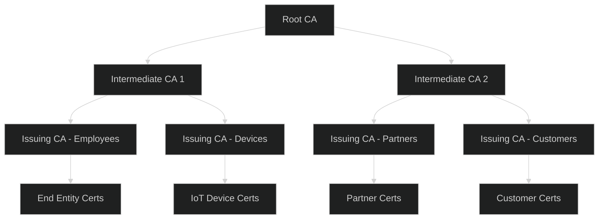
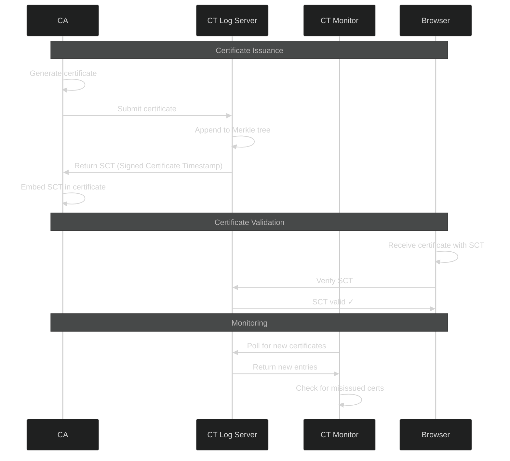

# Certificate-Based Authentication - Advanced Level

## PKI Architecture Design

### Enterprise PKI Topology



### Advanced CA Implementation

```javascript
const forge = require('node-forge');
const {pki, md, util} = forge;

class EnterpriseCA {
  constructor(config) {
    this.config = config;
    this.rootCA = null;
    this.intermediates = new Map();
    this.crl = null;
    this.ocspResponder = null;
  }
  
  async initializeRootCA(options) {
    const {
      commonName,
      country,
      organization,
      validityYears = 20,
      keySize = 4096
    } = options;
    
    // Generate root CA key pair (offline, air-gapped system)
    console.log('Generating root CA key pair (this may take a while)...');
    const keys = pki.rsa.generateKeyPair({
      bits: keySize,
      e: 0x10001
    });
    
    // Create root CA certificate
    const cert = pki.createCertificate();
    cert.publicKey = keys.publicKey;
    cert.serialNumber = this.generateSerialNumber();
    
    const now = new Date();
    cert.validity.notBefore = now;
    cert.validity.notAfter = new Date(
      now.getFullYear() + validityYears,
      now.getMonth(),
      now.getDate()
    );
    
    const attrs = [
      { name: 'commonName', value: commonName },
      { name: 'countryName', value: country },
      { name: 'organizationName', value: organization }
    ];
    
    cert.setSubject(attrs);
    cert.setIssuer(attrs); // Self-signed
    
    // Root CA extensions
    cert.setExtensions([
      {
        name: 'basicConstraints',
        cA: true,
        critical: true
      },
      {
        name: 'keyUsage',
        keyCertSign: true,
        cRLSign: true,
        critical: true
      },
      {
        name: 'subjectKeyIdentifier'
      }
    ]);
    
    // Sign certificate
    cert.sign(keys.privateKey, md.sha256.create());
    
    this.rootCA = {
      certificate: cert,
      privateKey: keys.privateKey,
      publicKey: keys.publicKey
    };
    
    // Store root CA securely (HSM in production)
    await this.securelyStoreRootCA(this.rootCA);
    
    return {
      certificate: pki.certificateToPem(cert),
      fingerprint: this.calculateFingerprint(cert)
    };
  }
  
  async createIntermediateCA(options) {
    const {
      commonName,
      pathLength = 0, // How many CAs can be below this one
      keySize = 2048
    } = options;
    
    if (!this.rootCA) {
      throw new Error('Root CA not initialized');
    }
    
    // Generate intermediate CA key pair
    const keys = pki.rsa.generateKeyPair({
      bits: keySize,
      e: 0x10001
    });
    
    // Create certificate
    const cert = pki.createCertificate();
    cert.publicKey = keys.publicKey;
    cert.serialNumber = this.generateSerialNumber();
    
    const now = new Date();
    cert.validity.notBefore = now;
    cert.validity.notAfter = new Date(
      now.getFullYear() + 10, // 10 years
      now.getMonth(),
      now.getDate()
    );
    
    cert.setSubject([
      { name: 'commonName', value: commonName },
      { name: 'organizationName', value: this.config.organization }
    ]);
    
    cert.setIssuer(this.rootCA.certificate.subject.attributes);
    
    // Intermediate CA extensions
    cert.setExtensions([
      {
        name: 'basicConstraints',
        cA: true,
        pathLenConstraint: pathLength,
        critical: true
      },
      {
        name: 'keyUsage',
        keyCertSign: true,
        cRLSign: true,
        critical: true
      },
      {
        name: 'authorityKeyIdentifier'
      },
      {
        name: 'subjectKeyIdentifier'
      },
      {
        name: 'cRLDistributionPoints',
        altNames: [{
          type: 6, // URI
          value: `http://crl.${this.config.domain}/root.crl`
        }]
      },
      {
        name: 'authorityInfoAccess',
        altNames: [{
          type: 6,
          value: `http://ocsp.${this.config.domain}/root`
        }]
      }
    ]);
    
    // Sign with root CA
    cert.sign(this.rootCA.privateKey, md.sha256.create());
    
    const intermediate = {
      commonName,
      certificate: cert,
      privateKey: keys.privateKey,
      publicKey: keys.publicKey,
      chain: [cert, this.rootCA.certificate]
    };
    
    this.intermediates.set(commonName, intermediate);
    
    return {
      certificate: pki.certificateToPem(cert),
      chain: intermediate.chain.map(c => pki.certificateToPem(c))
    };
  }
  
  async issueEndEntityCertificate(csr, intermediateCAName, options = {}) {
    const {
      validityDays = 365,
      keyUsage = ['digitalSignature', 'keyEncipherment'],
      extKeyUsage = ['clientAuth'],
      sans = []
    } = options;
    
    // Get intermediate CA
    const intermediate = this.intermediates.get(intermediateCAName);
    if (!intermediate) {
      throw new Error('Intermediate CA not found');
    }
    
    // Parse CSR
    const certReq = pki.certificationRequestFromPem(csr);
    
    // Verify CSR signature
    if (!certReq.verify()) {
      throw new Error('CSR signature verification failed');
    }
    
    // Create certificate
    const cert = pki.createCertificate();
    cert.publicKey = certReq.publicKey;
    cert.serialNumber = this.generateSerialNumber();
    
    const now = new Date();
    cert.validity.notBefore = now;
    cert.validity.notAfter = new Date(now.getTime() + validityDays * 24 * 60 * 60 * 1000);
    
    cert.setSubject(certReq.subject.attributes);
    cert.setIssuer(intermediate.certificate.subject.attributes);
    
    // Build extensions
    const extensions = [
      {
        name: 'basicConstraints',
        cA: false
      },
      {
        name: 'keyUsage',
        ...keyUsage.reduce((acc, usage) => ({ ...acc, [usage]: true }), {}),
        critical: true
      },
      {
        name: 'subjectKeyIdentifier'
      },
      {
        name: 'authorityKeyIdentifier'
      }
    ];
    
    if (extKeyUsage.length > 0) {
      extensions.push({
        name: 'extKeyUsage',
        ...extKeyUsage.reduce((acc, usage) => ({ ...acc, [usage]: true }), {})
      });
    }
    
    if (sans.length > 0) {
      extensions.push({
        name: 'subjectAltName',
        altNames: sans.map(san => ({
          type: this.getSANType(san),
          value: san
        }))
      });
    }
    
    // Add CRL and OCSP information
    extensions.push({
      name: 'cRLDistributionPoints',
      altNames: [{
        type: 6,
        value: `http://crl.${this.config.domain}/${intermediateCAName}.crl`
      }]
    });
    
    extensions.push({
      name: 'authorityInfoAccess',
      altNames: [{
        type: 6,
        value: `http://ocsp.${this.config.domain}/${intermediateCAName}`
      }]
    });
    
    cert.setExtensions(extensions);
    
    // Sign certificate
    cert.sign(intermediate.privateKey, md.sha256.create());
    
    // Store certificate
    await this.storeCertificate({
      serialNumber: cert.serialNumber,
      subject: cert.subject,
      issuer: intermediate.commonName,
      notBefore: cert.validity.notBefore,
      notAfter: cert.validity.notAfter,
      certificate: pki.certificateToPem(cert),
      status: 'active'
    });
    
    return {
      certificate: pki.certificateToPem(cert),
      chain: [cert, ...intermediate.chain].map(c => pki.certificateToPem(c))
    };
  }
  
  async revokeCertificate(serialNumber, reason) {
    // Update certificate status
    await db.certificates.update(
      { serialNumber },
      {
        status: 'revoked',
        revokedAt: new Date(),
        revocationReason: reason
      }
    );
    
    // Regenerate CRL
    await this.generateCRL();
    
    // Notify OCSP responder
    await this.updateOCSPResponder(serialNumber, 'revoked');
  }
  
  async generateCRL(intermediateCAName) {
    const intermediate = this.intermediates.get(intermediateCAName);
    if (!intermediate) {
      throw new Error('Intermediate CA not found');
    }
    
    // Get all revoked certificates
    const revokedCerts = await db.certificates.find({
      issuer: intermediateCAName,
      status: 'revoked'
    });
    
    // Create CRL
    const crl = pki.createCrl();
    crl.issuer = intermediate.certificate.subject.attributes;
    
    const now = new Date();
    crl.validity.thisUpdate = now;
    crl.validity.nextUpdate = new Date(now.getTime() + 7 * 24 * 60 * 60 * 1000); // 7 days
    
    // Add revoked certificates
    for (const cert of revokedCerts) {
      crl.addCertificate({
        serialNumber: cert.serialNumber,
        revocationDate: cert.revokedAt
      });
    }
    
    // Sign CRL
    crl.sign(intermediate.privateKey, md.sha256.create());
    
    const crlPem = pki.crlToPem(crl);
    
    // Publish CRL
    await this.publishCRL(intermediateCAName, crlPem);
    
    return crlPem;
  }
  
  generateSerialNumber() {
    // Generate cryptographically secure serial number
    return util.bytesToHex(forge.random.getBytesSync(20));
  }
  
  calculateFingerprint(cert) {
    const der = pki.certificateToDer(cert);
    const hash = md.sha256.create();
    hash.update(der);
    return hash.digest().toHex().match(/.{2}/g).join(':').toUpperCase();
  }
  
  getSANType(san) {
    if (san.includes('@')) return 1; // Email
    if (san.match(/^\d+\.\d+\.\d+\.\d+$/)) return 7; // IP
    if (san.startsWith('http://') || san.startsWith('https://')) return 6; // URI
    return 2; // DNS
  }
}
```

## Certificate Transparency

### CT Log Integration



### CT Log Client

```javascript
class CertificateTransparencyClient {
  constructor(logServers) {
    this.logServers = logServers;
  }
  
  async submitCertificate(certificate) {
    const certDer = pki.certificateToDer(pki.certificateFromPem(certificate));
    
    const submissions = this.logServers.map(async (logServer) => {
      try {
        const response = await fetch(`${logServer.url}/ct/v1/add-chain`, {
          method: 'POST',
          headers: { 'Content-Type': 'application/json' },
          body: JSON.stringify({
            chain: [Buffer.from(certDer).toString('base64')]
          })
        });
        
        const data = await response.json();
        
        return {
          logId: logServer.id,
          sct: {
            version: data.sct_version,
            logId: Buffer.from(data.id, 'base64'),
            timestamp: data.timestamp,
            extensions: data.extensions,
            signature: Buffer.from(data.signature, 'base64')
          }
        };
      } catch (error) {
        console.error(`Failed to submit to ${logServer.url}:`, error);
        return null;
      }
    });
    
    const results = await Promise.allSettled(submissions);
    const scts = results
      .filter(r => r.status === 'fulfilled' && r.value)
      .map(r => r.value);
    
    if (scts.length === 0) {
      throw new Error('Failed to obtain SCTs from any log server');
    }
    
    return scts;
  }
  
  async embedSCTInCertificate(certificate, scts) {
    const cert = pki.certificateFromPem(certificate);
    
    // Add SCT extension
    const sctExtension = {
      name: 'certificateTransparencySCTs',
      critical: false,
      value: this.encodeSCTs(scts)
    };
    
    const extensions = cert.extensions || [];
    extensions.push(sctExtension);
    cert.setExtensions(extensions);
    
    return pki.certificateToPem(cert);
  }
  
  async verifySCT(sct, certificate, logPublicKey) {
    // Build data to verify
    const certDer = pki.certificateToDer(pki.certificateFromPem(certificate));
    
    const dataToSign = Buffer.concat([
      Buffer.from([0]), // Version
      Buffer.from([0]), // SignatureType (certificate_timestamp)
      Buffer.from(sct.timestamp.toString(16).padStart(16, '0'), 'hex'),
      Buffer.from([0, 0]), // Entry type (x509_entry)
      this.encodeLength(certDer.length),
      certDer,
      this.encodeLength(sct.extensions.length),
      Buffer.from(sct.extensions)
    ]);
    
    // Verify signature
    const verify = crypto.createVerify('SHA256');
    verify.update(dataToSign);
    
    return verify.verify(logPublicKey, sct.signature);
  }
}
```

## Hardware Security Module (HSM) Integration

### HSM Key Management

```javascript
class HSMIntegration {
  constructor(hsmConfig) {
    this.hsm = this.initializeHSM(hsmConfig);
  }
  
  async generateKeyPairInHSM(label, keySize = 2048) {
    // Generate key pair directly in HSM
    // Keys never leave the HSM
    
    const keyPairHandle = await this.hsm.generateKeyPair({
      mechanism: 'RSA-PKCS-KEY-PAIR-GEN',
      keySize: keySize,
      publicLabel: `${label}-public`,
      privateLabel: `${label}-private`,
      extractable: false, // Private key cannot be extracted
      sensitive: true,
      keyUsage: {
        sign: true,
        verify: true
      }
    });
    
    // Export public key only
    const publicKey = await this.hsm.exportPublicKey(keyPairHandle.public);
    
    return {
      keyHandle: keyPairHandle,
      publicKey: publicKey
    };
  }
  
  async signCertificateInHSM(certificate, privateKeyHandle) {
    // Serialize certificate for signing
    const certData = this.serializeCertificateForSigning(certificate);
    
    // Sign using HSM
    const signature = await this.hsm.sign({
      mechanism: 'SHA256-RSA-PKCS',
      keyHandle: privateKeyHandle,
      data: certData
    });
    
    // Attach signature to certificate
    certificate.signature = signature;
    
    return certificate;
  }
  
  async createCAInHSM(config) {
    // Generate CA key pair in HSM
    const keyPair = await this.generateKeyPairInHSM(
      `CA-${config.name}`,
      4096
    );
    
    // Create CA certificate
    const cert = this.createCACertificate({
      publicKey: keyPair.publicKey,
      subject: config.subject,
      validityYears: config.validityYears
    });
    
    // Sign certificate using HSM
    const signedCert = await this.signCertificateInHSM(
      cert,
      keyPair.keyHandle.private
    );
    
    return {
      certificate: signedCert,
      keyHandle: keyPair.keyHandle
    };
  }
}
```

## Best Practices

### Security Hardening

✅ **Do:**
- Store Root CA offline in air-gapped environment
- Use HSM for CA private keys
- Implement proper key ceremony procedures
- Use appropriate key sizes (RSA 2048+, ECC 256+)
- Implement certificate pinning for critical services
- Monitor Certificate Transparency logs
- Implement automated certificate lifecycle management
- Use short validity periods (1 year for TLS)
- Implement proper CRL/OCSP infrastructure
- Regular security audits of PKI

❌ **Don't:**
- Store CA private keys on internet-connected systems
- Use weak key sizes or algorithms
- Skip certificate validation
- Allow self-signed certificates in production
- Forget to revoke compromised certificates
- Use overly long validity periods
- Skip Certificate Transparency
- Ignore certificate warnings
- Share private keys
- Forget disaster recovery procedures

## Next Steps

📚 **Related Advanced Topics:** Quantum-resistant certificates, Blockchain-based PKI, Short-lived certificates, Certificate-less authentication, Post-quantum cryptography

---

**Related Topics:** PKI, Cryptography, HSM, mTLS, Zero Trust, Certificate Transparency
