# Certificate-Based Authentication - Basic Level

## What is Certificate-Based Authentication?

**Certificate-based authentication** uses **digital certificates** (like a digital ID card) instead of passwords. These certificates prove who you are using advanced encryption, making it very secure.

Think of it like a passport - it's issued by a trusted authority, hard to fake, and proves your identity.

## How Digital Certificates Work

### Simple Certificate Concept


### Real-World Analogy


## How Certificate Authentication Works

### Basic Flow


## Key Components

### The Three Main Parts

```mermaid
%%{init: {\'theme\':\'dark\'}}%%
graph LR
    A[Certificate System] --> B[Certificate Authority CA]
    A --> C[Public Key]
    A --> D[Private Key]
    
    B --> B1["Trusted issuer<br/>Like a government"]
    C --> C1["Shared openly<br/>Anyone can see"]
    D --> D1["Kept secret<br/>Only you have it"]```

**Explained:**

1. **Certificate Authority (CA)** - Trusted organization that issues certificates
   - Examples: DigiCert, Let's Encrypt, company's internal CA
   
2. **Public Key** - Can be shared with everyone
   - Used to verify your identity
   - Like your address that anyone can know
   
3. **Private Key** - Must be kept secret
   - Used to prove you own the certificate
   - Like the key to your house - never share it!

## Types of Certificate Authentication

### 1. Client Certificates (User Authentication)

**For People** - Proving who you are

```mermaid
flowchart TD
    A[Employee] --> B[Has Certificate on Laptop]
    B --> C[Connects to VPN]
    C --> D[Certificate Verified]
    D --> E[Access Granted to Company Network]
```

**Example:**
```
Your company gives you a certificate
1. IT installs it on your laptop
2. When you connect to VPN
3. VPN checks your certificate
4. You're automatically logged in
5. No password needed!
```

### 2. Server Certificates (Website Security)

**For Websites** - Proving the website is real

```mermaid
%%{init: {\'theme\':\'dark\'}}%%
graph TD
    A[You visit https://bank.com] --> B[Browser checks certificate]
    B --> C{Certificate Valid?}
    C -->|Yes| D[Show green lock 🔒]
    C -->|No| E[Show warning ⚠️]
    
    D --> F[Safe to enter password]
    E --> G[DO NOT PROCEED]```

**What you see:**
- Green padlock in browser = Valid certificate
- Website is who it claims to be
- Your data is encrypted

### 3. Device Certificates (IoT/Smart Devices)

**For Machines** - Smart devices authenticating

```mermaid
graph LR
    A[Smart Devices] --> B[Smart Thermostat]
    A --> C[Security Camera]
    A --> D[Industrial Sensor]
    
    B --> E[Each has certificate]
    C --> E
    D --> E
    
    E --> F[Authenticates to cloud]
```

**Example:**
```
Your smart home camera:
1. Has built-in certificate
2. Connects to cloud service
3. Certificate proves it's YOUR camera
4. Not a hacker's fake device
```

## Real-World Examples

### Example 1: Corporate VPN Access


### Example 2: Website Security (HTTPS)


**Why it matters:**
- Prevents man-in-the-middle attacks
- Ensures you're talking to the real bank
- All data encrypted in transit

### Example 3: Smart Factory


**Security benefits:**

- Only authorized machines can connect
- Prevents rogue devices
- Audit trail of all connections

## Certificate Lifecycle

### From Birth to Death


**Typical Lifespan:**

- **Website certificates**: 1 year (used to be 2-3 years)
- **Employee certificates**: 1-3 years
- **Device certificates**: 5-10 years or device lifetime

## Mutual TLS (mTLS)

### Two-Way Authentication

```mermaid
%%{init: {\'theme\':\'dark\'}}%%
sequenceDiagram
    participant Client
    participant Server
    
    Note over Client,Server: Both sides verify each other
    
    Client->>Server: Hello, I want to connect
    Server->>Client: Here's my certificate
    Client->>Client: Verify server certificate ✓
    
    Server->>Client: Now show me your certificate
    Client->>Server: Here's my certificate
    Server->>Server: Verify client certificate ✓
    
    Note over Client,Server: Both verified! Secure connection established
```



**When used:**
- Banking transactions
- Government systems
- Company VPNs
- Critical infrastructure

**Benefits:**
- Both sides verified
- No fake servers
- No unauthorized clients

## Where Certificates Are Used

### Industry Applications


### Usage Examples

**🌐 Web Browsing:**
- Every HTTPS website uses certificates
- Green padlock = valid certificate
- Protects your passwords and data

**💼 Enterprise:**
- Employee laptops have certificates
- Automatic VPN connection
- Secure email (S/MIME)
- Digital signatures on documents

**🏭 Manufacturing:**
- Factory robots authenticate
- Quality control sensors
- Automated systems
- Prevent unauthorized access

**🏥 Healthcare:**
- Medical device authentication
- Patient monitoring equipment
- Secure data transmission
- HIPAA compliance

## Certificate vs Password

### Comparison

```mermaid
%%{init: {\'theme\':\'dark\'}}%%
graph TD
    A[Authentication Methods] --> B[Password]
    A --> C[Certificate]
    
    B --> B1["Easy to use<br/>Easy to steal<br/>Can be guessed<br/>Phishing vulnerable"]
    
    C --> C1["Very secure<br/>Hard to steal<br/>Cannot be guessed<br/>Phishing resistant"]```

| Aspect | Password | Certificate |
|--------|----------|-------------|
| **Security** | Medium | Very High |
| **Can be stolen** | Yes, easily | Very difficult |
| **Phishing** | Vulnerable | Resistant |
| **User Experience** | Type every time | Automatic |
| **Setup** | Easy | More complex |
| **Cost** | Free | Infrastructure needed |

## Certificate Trust Chain

### How Trust Works

```mermaid
%%{init: {\'theme\':\'dark\'}}%%
graph TD
    A[Root CA<br/>Trusted by everyone] --> B[Intermediate CA]
    B --> C[Your Company CA]
    C --> D[Employee Certificate]
    C --> E[Server Certificate]
    C --> F[Device Certificate]```

**Trust hierarchy:**
1. **Root CA** - Built into your browser/OS (DigiCert, Let's Encrypt)
2. **Intermediate CA** - Issues certificates for organizations
3. **Organization CA** - Your company's certificate authority
4. **End Certificate** - Your actual certificate

**Why it matters:**
- Browser trusts Root CAs
- Root CA trusts Intermediate CA
- Intermediate trusts your certificate
- Chain of trust = your certificate is trusted!

## Setting Up Certificates (User View)

### Getting Your Certificate

```mermaid
%%{init: {\'theme\':\'dark\'}}%%
flowchart TD
    A[IT Department] --> B[Sends you certificate file]
    B --> C[Download .pfx or .p12 file]
    C --> D[Double-click to install]
    D --> E[Enter password given by IT]
    E --> F[Certificate installed ✓]
    F --> G[Works automatically now]```

**What you do:**
1. IT emails you a certificate file
2. Download it
3. Double-click the file
4. Enter the password IT gave you
5. Click "Install"
6. Done! Works in background

## Certificate Security

### Keeping Certificates Safe

```mermaid
%%{init: {\'theme\':\'dark\'}}%%
mindmap
  root((Certificate Security))
    Storage
      Hardware security module
      Secure chip in device
      Encrypted key store
      Never on shared drives
    Protection
      Password protected
      Biometric access
      Two-person control
      Regular backups
    Monitoring
      Expiration alerts
      Revocation checks
      Usage logs
      Anomaly detection
```

**Best Practices:**

✅ **Do:**
- Store private keys securely
- Set expiration reminders
- Back up certificates safely
- Report lost devices immediately
- Keep certificate password secret

❌ **Don't:**
- Email certificates without encryption
- Store on shared folders
- Use same certificate everywhere
- Ignore expiration warnings
- Share private keys

## Common Certificate Problems

### Issues and Solutions


**Problem 1: Certificate Expired**
```
Your browser shows: "Certificate expired"
Solution: Website needs to renew certificate
You: Wait for website to fix, or contact them
```

**Problem 2: Certificate Not Trusted**
```
Your browser shows: "Connection not secure"
Reason: CA not recognized
Solution: IT installs company CA certificate
```

**Problem 3: Lost Device with Certificate**
```
You lost laptop with certificate
Action: Immediately tell IT
IT: Revokes your certificate
IT: Issues new certificate for new laptop
```

## Advantages of Certificate Authentication

### Why Use Certificates?

1. **Very Secure** - Nearly impossible to fake
2. **No Passwords** - Nothing to remember or type
3. **Automatic** - Works in background
4. **Phishing Resistant** - Certificates can't be "stolen" by fake sites
5. **Audit Trail** - Know exactly who accessed what
6. **Scales Well** - Works for millions of devices

## When Certificates Are Used

### ✅ Great For:

- Corporate VPN access
- High-security systems
- IoT device fleets
- Microservices authentication
- Government systems
- Financial transactions
- Healthcare devices

### ❌ Not Ideal For:

- Consumer web logins (too complex)
- Small personal websites
- Apps where users change devices often
- Quick prototypes

## Certificate Authorities (CAs)

### Who Issues Certificates?


**Public CAs** - For websites, trusted worldwide
**Private CAs** - For internal company use

## Key Takeaways

1. **Certificates = Digital ID cards** backed by cryptography
2. **More secure than passwords** - can't be phished or guessed
3. **Used everywhere** - HTTPS, VPNs, IoT devices, corporate access
4. **Automatic authentication** - works in background
5. **Trust chain** - hierarchy of trusted authorities
6. **Must protect private key** - like protecting house keys
7. **Expire and must be renewed** - usually yearly

## Common Questions

**Q: Why do certificates expire?**
A: For security - if a certificate is compromised, it can't be used forever. Also ensures encryption stays up-to-date.

**Q: Can hackers steal my certificate?**
A: Very hard if stored properly. Private key usually in secure hardware, protected by password or biometric.

**Q: What's the green padlock in my browser?**
A: Means website has valid certificate. Site is who it claims to be, and connection is encrypted.

**Q: Do I need to do anything with certificates?**
A: Usually no - IT handles it. Just report if you get warnings or lose your device.

## Next Steps

- 📗 **Intermediate Level:** PKI infrastructure, X.509 standard, certificate lifecycle management, mTLS implementation
- 📕 **Advanced Level:** Certificate pinning, OCSP, CRL, HSM integration, zero-touch provisioning

---

**Related Topics:** Public Key Infrastructure (PKI), SSL/TLS, mTLS, Digital Signatures, Hardware Security Modules (HSM)
