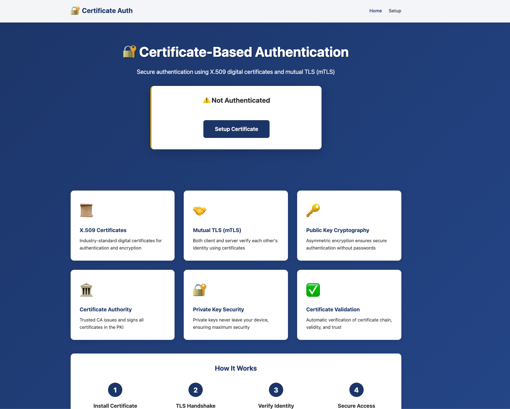

# 🔐 Certificate-Based Authentication Demo

A comprehensive demonstration of certificate-based authentication using **X.509 digital certificates** and **mutual TLS (mTLS)**. This application showcases real PKI (Public Key Infrastructure) implementation with actual certificate generation, verification, and authentication.




## 🌟 Features

### Certificate Authentication Methods

- **🔐 X.509 Client Certificates** - Industry-standard digital certificates for user authentication
- **🤝 Mutual TLS (mTLS)** - Both client and server authenticate using certificates
- **📜 Certificate Chain Verification** - Complete chain of trust validation
- **✅ Real-time Certificate Validation** - Verify certificates against Certificate Authority
- **🏛️ PKI Infrastructure** - Complete CA setup with certificate generation

### Key Capabilities

- ✅ **Real Certificate Generation** - Uses node-forge to create actual X.509 certificates
- ✅ **Certificate Authority (CA)** - Self-signed root CA for issuing certificates
- ✅ **Certificate Parsing** - Detailed X.509 structure analysis
- ✅ **mTLS Server** - HTTPS server with client certificate requirements
- ✅ **Certificate Chain View** - Visual representation of trust chain
- ✅ **Certificate Details** - Complete certificate field inspection
- ✅ **Validation Testing** - Real-time certificate verification

## 🚀 Quick Start

### Prerequisites

- Node.js (v14 or higher)
- Modern web browser (Chrome, Firefox, Safari)

### Installation & Setup

```bash
# Navigate to project directory
cd cert-auth-demo

# Install dependencies
npm install

# Generate PKI infrastructure (CA and certificates)
npm run setup

# Start the server
npm start
```

The application will be available at **https://localhost:3003**

### Generated Certificates

The setup script creates:

1. **Root CA** - Self-signed certificate authority
2. **Server Certificate** - For HTTPS server (localhost)
3. **Client Certificates** - For test users:
   - Demo User (demo-user.p12)
   - Admin User (admin-user.p12)
   - John Doe (john-doe.p12)

All client certificates use password: **demo123**

## 📋 Usage Guide

### Step 1: Generate PKI

```bash
npm run setup
```

This creates:
- `certs/ca-cert.pem` - Root CA certificate
- `certs/server-cert.pem` - Server certificate
- `certs/server-key.pem` - Server private key
- `certs/*.p12` - Client certificates (PKCS#12 format)

### Step 2: Install Client Certificate

#### Firefox
1. Open Settings → Privacy & Security
2. Certificates → View Certificates
3. Your Certificates → Import
4. Select `certs/demo-user.p12`
5. Enter password: `demo123`
6. Restart Firefox

#### Chrome / Edge
1. Open Settings → Privacy and security → Security
2. Manage certificates → Import
3. Select `certs/demo-user.p12`
4. Enter password: `demo123`
5. Restart browser

#### Safari (macOS)
1. Double-click `certs/demo-user.p12`
2. Enter password: `demo123`
3. Add to Keychain
4. Restart Safari

### Step 3: Start Server

```bash
npm start
```

Server starts on https://localhost:3003

### Step 4: Access Application

1. Navigate to https://localhost:3003
2. Accept security warning (self-signed cert)
3. Browser will prompt for certificate selection
4. Select your imported certificate
5. You're authenticated!

## 🏗️ Application Structure

```
cert-auth-demo/
├── server.js                    # HTTPS server with mTLS
├── package.json                 # Dependencies
├── scripts/
│   └── setup-pki.js             # PKI generation script
├── services/
│   └── certificateService.js    # Certificate parsing & validation
├── routes/
│   ├── auth.js                  # Authentication routes
│   ├── dashboard.js             # Protected dashboard routes
│   └── certificate.js           # Certificate management routes
├── views/
│   ├── index.ejs                # Landing page
│   ├── dashboard.ejs            # Main dashboard
│   ├── profile.ejs              # User profile
│   ├── cert-details.ejs         # X.509 certificate details
│   ├── cert-chain.ejs           # Certificate chain view
│   ├── mtls-info.ejs            # mTLS connection info
│   ├── validate.ejs             # Certificate validation
│   ├── setup.ejs                # Setup instructions
│   ├── auth-required.ejs        # Auth required page
│   ├── auth-error.ejs           # Auth error page
│   ├── 404.ejs                  # 404 page
│   └── error.ejs                # Error page
├── public/
│   └── css/
│       └── style.css            # Application styles
└── certs/                       # Generated certificates (git-ignored)
    ├── ca-cert.pem
    ├── server-cert.pem
    ├── server-key.pem
    └── *.p12
```

## 🔧 API Endpoints

### Public Routes
- `GET /` - Home page
- `GET /cert/setup` - Certificate setup guide
- `GET /cert/download/ca` - Download CA certificate
- `GET /cert/download/client/:name` - Download client certificate
- `GET /cert/list` - List available certificates

### Protected Routes (Require Client Certificate)
- `GET /dashboard` - User dashboard
- `GET /dashboard/profile` - User profile
- `GET /dashboard/cert-details` - Certificate details
- `GET /dashboard/cert-chain` - Certificate chain
- `GET /dashboard/mtls-info` - mTLS information
- `GET /dashboard/validate` - Certificate validation

### API Endpoints
- `GET /cert/info` - Get current certificate info (JSON)
- `POST /cert/verify` - Verify certificate (JSON)
- `POST /cert/parse` - Parse certificate (JSON)
- `GET /auth/status` - Authentication status
- `GET /auth/logout` - Logout and destroy session

## 🎯 Features Demonstrated

### 1. X.509 Certificate Structure
View complete certificate anatomy:
- Version, serial number, signature algorithm
- Subject and issuer distinguished names
- Validity period (notBefore, notAfter)
- Public key information (algorithm, size, modulus)
- Extensions (key usage, extended key usage, SAN)
- Fingerprints (SHA-1, SHA-256)

### 2. Certificate Chain of Trust
Visualize the complete certificate chain:
- Client certificate → Intermediate CA (if any) → Root CA
- Each level shows subject, issuer, serial, validity
- Verification of each link in the chain

### 3. Mutual TLS (mTLS)
Experience two-way authentication:
- Server presents its certificate
- Client presents its certificate
- Both verify each other
- Secure encrypted connection established

### 4. Certificate Validation
Real-time validation against CA:
- Signature verification
- Validity period check
- CA trust verification
- Revocation status (in production)

### 5. PKI Management
Complete PKI lifecycle:
- CA certificate generation
- Certificate signing requests (CSR)
- Certificate issuance
- Certificate distribution (PKCS#12)

## 🔐 Security Implementation

### TLS Configuration
```javascript
{
  minVersion: 'TLSv1.2',
  requestCert: true,
  rejectUnauthorized: false,  // Custom verification in middleware
  ca: [CA_CERTIFICATE]
}
```

### Certificate Verification
- Signature verification against CA
- Validity period checking
- Trust chain validation
- Extension validation (key usage, EKU)

### Session Management
- Secure HTTPS-only cookies
- HTTP-only session cookies
- 30-minute session timeout
- Session data includes certificate info

## 📊 Real-World Applications

### 🏦 Banking & Finance
- Online banking authentication
- Mobile banking apps
- Financial API access
- Transaction signing

### 🏢 Enterprise
- VPN access (SSL VPN)
- Corporate network authentication
- Email encryption (S/MIME)
- Code signing

### 🏥 Healthcare
- Electronic health records access
- HIPAA compliance
- Medical device authentication
- Prescription systems

### 🛡️ Government
- Digital signatures
- E-government services
- Secure communications
- Classified systems access

### 🔌 IoT & Devices
- Device authentication
- Firmware updates
- Secure communication
- Device management

## 🎓 Educational Value

### Certificate Concepts
- **X.509 Standard** - ASN.1 structure and encoding
- **Public Key Cryptography** - RSA, asymmetric encryption
- **Digital Signatures** - How certificates are signed
- **Trust Models** - Chain of trust, certificate authorities

### Security Principles
- **Authentication** - Proving identity with certificates
- **Authorization** - Certificate-based access control
- **Non-repudiation** - Digital signatures prevent denial
- **Confidentiality** - TLS encryption protects data

### Real Implementation
- **node-forge** - Pure JavaScript cryptography
- **TLS/SSL** - Industry-standard secure communication
- **PKCS#12** - Certificate and key packaging
- **PEM Format** - Certificate encoding

## ⚠️ Security Notes

### This is a Demo
- ✅ Real certificate generation
- ✅ Real cryptographic operations
- ✅ Real certificate verification
- ⚠️ Self-signed CA (not trusted by default)
- ⚠️ In-memory certificate storage
- ⚠️ No certificate revocation (CRL/OCSP)

### Production Requirements
- Use commercial or internal enterprise CA
- Implement certificate revocation checking (CRL/OCSP)
- Hardware security modules (HSM) for CA keys
- Certificate lifecycle management
- Automated renewal and rotation
- Comprehensive audit logging
- Proper key backup and recovery
- Regular security audits

## 🔍 Troubleshooting

### Browser Shows Security Warning
**Normal!** Self-signed certificates trigger warnings.
- Click "Advanced" → "Proceed to localhost"
- Or add CA certificate to system trust store

### Certificate Not Prompted
- Ensure certificate is imported
- Restart browser after import
- Check certificate is valid (not expired)
- Verify certificate matches domain

### Authentication Failed
- Verify certificate password (demo123)
- Check certificate validity period
- Ensure CA certificate is trusted
- Restart browser

### Port Already in Use
```bash
# Find process using port 3003
lsof -ti:3003 | xargs kill -9

# Or change port in server.js
const PORT = process.env.PORT || 3004;
```

## 📚 Additional Resources

### Standards & Specifications
- **RFC 5280** - X.509 Certificate and CRL Profile
- **RFC 8446** - TLS 1.3
- **RFC 7468** - PEM Format
- **RFC 7292** - PKCS#12

### Tools & Libraries
- **node-forge** - JavaScript PKI and TLS
- **OpenSSL** - Industry-standard cryptography toolkit
- **certutil** - Mozilla certificate management

### Further Reading
- NIST PKI guidelines
- CA/Browser Forum baseline requirements
- OWASP Transport Layer Protection Cheat Sheet

## 🛠️ Development

### Generate Additional Client Certificates

```bash
npm run generate-cert
```

### Project Scripts

```json
{
  "setup": "node scripts/setup-pki.js",
  "start": "node server.js",
  "dev": "nodemon server.js",
  "generate-cert": "node scripts/generate-client-cert.js"
}
```

## 📝 License

This project is for educational purposes. Use at your own risk.

## 🤝 Contributing

This is a demonstration project for learning certificate-based authentication.

## 📧 Support

Review the code, documentation, and comments for detailed explanations of certificate-based authentication concepts.

---

**Built with ❤️ for security education**

*Understanding certificate-based authentication through hands-on implementation*
