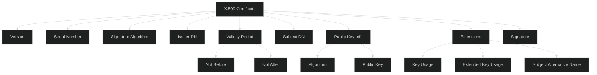
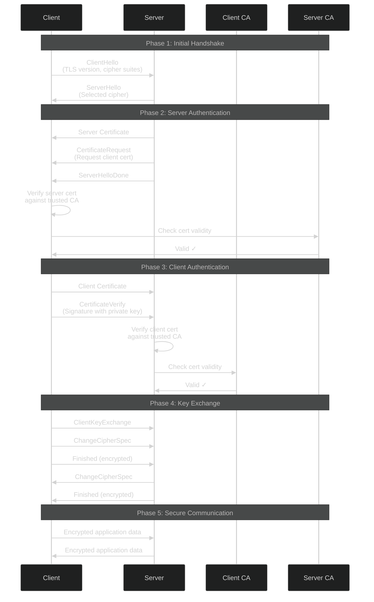
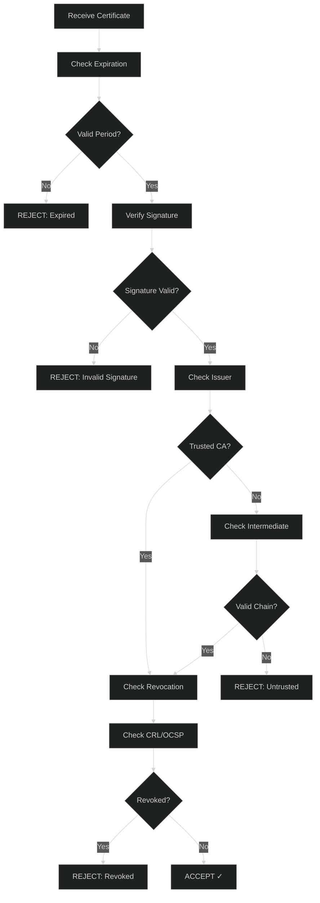
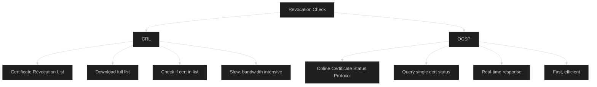
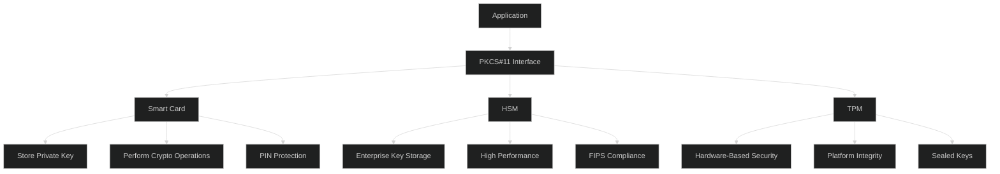
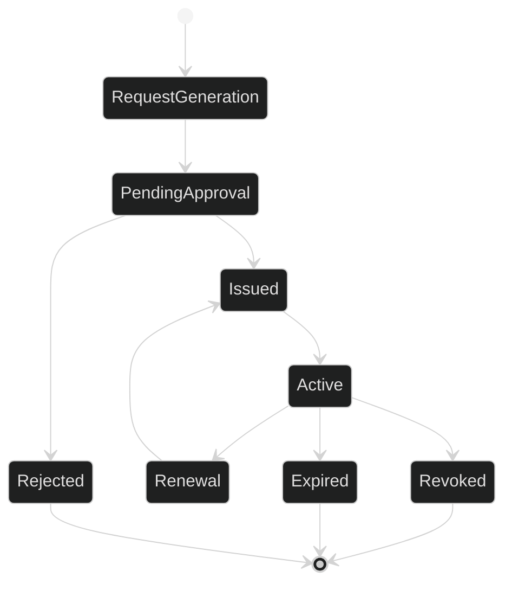
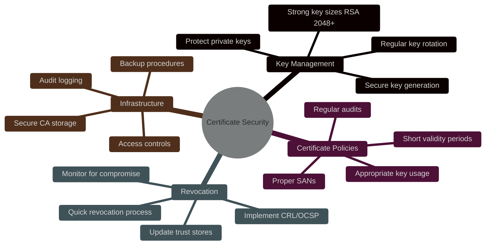

# Certificate-Based Authentication - Intermediate Level

## X.509 Certificate Structure

### Certificate Anatomy



### Certificate Fields Example

```javascript
// Parse X.509 certificate
const forge = require('node-forge');

function parseCertificate(certPem) {
  const cert = forge.pki.certificateFromPem(certPem);
  
  return {
    version: cert.version,
    serialNumber: cert.serialNumber,
    
    // Subject (who the certificate is issued to)
    subject: {
      commonName: cert.subject.getField('CN').value,
      organization: cert.subject.getField('O')?.value,
      organizationalUnit: cert.subject.getField('OU')?.value,
      country: cert.subject.getField('C')?.value
    },
    
    // Issuer (who issued the certificate)
    issuer: {
      commonName: cert.issuer.getField('CN').value,
      organization: cert.issuer.getField('O')?.value
    },
    
    // Validity period
    validity: {
      notBefore: cert.validity.notBefore,
      notAfter: cert.validity.notAfter
    },
    
    // Public key
    publicKey: {
      algorithm: cert.publicKey.algorithm,
      n: cert.publicKey.n.toString(16), // RSA modulus
      e: cert.publicKey.e.toString(16)  // RSA exponent
    },
    
    // Extensions
    extensions: cert.extensions.map(ext => ({
      name: ext.name,
      critical: ext.critical,
      value: ext.value
    })),
    
    // Signature
    signatureAlgorithm: cert.signatureAlgorithm,
    signature: cert.signature
  };
}
```

## Mutual TLS (mTLS) Implementation

### Complete mTLS Handshake



### Node.js mTLS Server

```javascript
const https = require('https');
const fs = require('fs');

// Create mTLS server
const options = {
  // Server's certificate and private key
  key: fs.readFileSync('server-key.pem'),
  cert: fs.readFileSync('server-cert.pem'),
  
  // CA certificate to verify clients
  ca: fs.readFileSync('client-ca.pem'),
  
  // Require client certificate
  requestCert: true,
  rejectUnauthorized: true,
  
  // Minimum TLS version
  minVersion: 'TLSv1.2'
};

const server = https.createServer(options, (req, res) => {
  // Client certificate is available
  const cert = req.socket.getPeerCertificate();
  
  if (req.client.authorized) {
    // Extract client identity from certificate
    const clientId = cert.subject.CN;
    const clientOrg = cert.subject.O;
    
    console.log(`Authenticated client: ${clientId} from ${clientOrg}`);
    
    res.writeHead(200);
    res.end('Hello, authenticated client!');
  } else {
    // Certificate validation failed
    const error = req.socket.authorizationError;
    console.error(`Client cert validation failed: ${error}`);
    
    res.writeHead(401);
    res.end('Unauthorized');
  }
});

server.listen(8443, () => {
  console.log('mTLS server listening on port 8443');
});
```

### Node.js mTLS Client

```javascript
const https = require('https');
const fs = require('fs');

const options = {
  hostname: 'api.example.com',
  port: 8443,
  path: '/api/data',
  method: 'GET',
  
  // Client certificate and private key
  key: fs.readFileSync('client-key.pem'),
  cert: fs.readFileSync('client-cert.pem'),
  
  // CA certificate to verify server
  ca: fs.readFileSync('server-ca.pem'),
  
  // Reject unauthorized servers
  rejectUnauthorized: true
};

const req = https.request(options, (res) => {
  console.log('Status:', res.statusCode);
  
  res.on('data', (d) => {
    process.stdout.write(d);
  });
});

req.on('error', (error) => {
  console.error('Request failed:', error);
});

req.end();
```

## Certificate Validation Process

### Validation Chain



### Comprehensive Validation

```javascript
async function validateCertificate(certPem, caPem) {
  const cert = forge.pki.certificateFromPem(certPem);
  const ca = forge.pki.certificateFromPem(caPem);
  
  // 1. Check expiration
  const now = new Date();
  if (now < cert.validity.notBefore || now > cert.validity.notAfter) {
    throw new Error('Certificate expired or not yet valid');
  }
  
  // 2. Verify signature
  try {
    const verified = ca.verify(cert);
    if (!verified) {
      throw new Error('Certificate signature verification failed');
    }
  } catch (error) {
    throw new Error(`Signature verification error: ${error.message}`);
  }
  
  // 3. Check key usage
  const keyUsage = cert.getExtension('keyUsage');
  if (keyUsage && !keyUsage.digitalSignature) {
    throw new Error('Certificate not valid for digital signature');
  }
  
  // 4. Check extended key usage
  const extKeyUsage = cert.getExtension('extKeyUsage');
  if (extKeyUsage) {
    const hasClientAuth = extKeyUsage.clientAuth;
    if (!hasClientAuth) {
      throw new Error('Certificate not valid for client authentication');
    }
  }
  
  // 5. Check revocation status
  const revoked = await checkRevocationStatus(cert);
  if (revoked) {
    throw new Error('Certificate has been revoked');
  }
  
  return {
    valid: true,
    subject: cert.subject,
    issuer: cert.issuer,
    serialNumber: cert.serialNumber
  };
}
```

## Certificate Revocation

### CRL vs OCSP



### OCSP Implementation

```javascript
const axios = require('axios');

async function checkOCSP(cert, issuerCert) {
  // Get OCSP responder URL from certificate
  const ocspUrl = getOCSPResponderUrl(cert);
  
  if (!ocspUrl) {
    throw new Error('No OCSP responder URL in certificate');
  }
  
  // Create OCSP request
  const ocspRequest = createOCSPRequest(cert, issuerCert);
  
  // Send request
  const response = await axios.post(ocspUrl, ocspRequest, {
    headers: {
      'Content-Type': 'application/ocsp-request'
    },
    responseType: 'arraybuffer'
  });
  
  // Parse response
  const ocspResponse = parseOCSPResponse(response.data);
  
  // Check status
  if (ocspResponse.certStatus === 'good') {
    return { revoked: false };
  } else if (ocspResponse.certStatus === 'revoked') {
    return {
      revoked: true,
      revocationTime: ocspResponse.revocationTime,
      revocationReason: ocspResponse.revocationReason
    };
  } else {
    throw new Error('Unknown certificate status');
  }
}

// OCSP Stapling (server-side optimization)
function enableOCSPStapling(serverOptions) {
  return {
    ...serverOptions,
    // Enable OCSP stapling
    // Server fetches OCSP response and includes it in TLS handshake
    // Reduces client latency and OCSP responder load
    OCSPResponse: async () => {
      const cert = forge.pki.certificateFromPem(serverOptions.cert);
      const issuer = forge.pki.certificateFromPem(serverOptions.ca);
      
      const ocspResponse = await checkOCSP(cert, issuer);
      return ocspResponse;
    }
  };
}
```

## Smart Card & HSM Integration

### Architecture



### PKCS#11 Integration

```javascript
const pkcs11js = require('pkcs11js');

class SmartCardAuth {
  constructor(libraryPath) {
    this.pkcs11 = new pkcs11js.PKCS11();
    this.pkcs11.load(libraryPath);
    this.pkcs11.C_Initialize();
  }
  
  // List available tokens (smart cards)
  getTokens() {
    const slots = this.pkcs11.C_GetSlotList(true);
    const tokens = [];
    
    for (const slot of slots) {
      const tokenInfo = this.pkcs11.C_GetTokenInfo(slot);
      tokens.push({
        slot,
        label: tokenInfo.label.trim(),
        manufacturer: tokenInfo.manufacturerID.trim(),
        serialNumber: tokenInfo.serialNumber.trim()
      });
    }
    
    return tokens;
  }
  
  // Login to smart card
  login(slot, pin) {
    const session = this.pkcs11.C_OpenSession(
      slot,
      pkcs11js.CKF_SERIAL_SESSION | pkcs11js.CKF_RW_SESSION
    );
    
    this.pkcs11.C_Login(
      session,
      pkcs11js.CKU_USER,
      Buffer.from(pin)
    );
    
    return session;
  }
  
  // Sign data with smart card private key
  sign(session, data) {
    // Find private key on card
    const template = [
      { type: pkcs11js.CKA_CLASS, value: pkcs11js.CKO_PRIVATE_KEY },
      { type: pkcs11js.CKA_SIGN, value: true }
    ];
    
    this.pkcs11.C_FindObjectsInit(session, template);
    const handles = this.pkcs11.C_FindObjects(session, 1);
    this.pkcs11.C_FindObjectsFinal(session);
    
    if (handles.length === 0) {
      throw new Error('No signing key found on smart card');
    }
    
    // Initialize signing
    this.pkcs11.C_SignInit(session, {
      mechanism: pkcs11js.CKM_SHA256_RSA_PKCS
    }, handles[0]);
    
    // Perform signature
    const signature = this.pkcs11.C_Sign(
      session,
      Buffer.from(data),
      Buffer.alloc(256)
    );
    
    return signature;
  }
  
  // Cleanup
  logout(session) {
    this.pkcs11.C_Logout(session);
    this.pkcs11.C_CloseSession(session);
  }
  
  finalize() {
    this.pkcs11.C_Finalize();
  }
}

// Usage
const smartCard = new SmartCardAuth('/usr/lib/opensc-pkcs11.so');
const tokens = smartCard.getTokens();
console.log('Available tokens:', tokens);

const session = smartCard.login(tokens[0].slot, '1234');
const signature = smartCard.sign(session, 'data to sign');
smartCard.logout(session);
```

## Certificate Management

### Lifecycle Management



### Automated Certificate Management

```javascript
class CertificateManager {
  constructor(ca) {
    this.ca = ca;
  }
  
  // Generate certificate signing request
  async generateCSR(subject, keySize = 2048) {
    // Generate key pair
    const keys = forge.pki.rsa.generateKeyPair(keySize);
    
    // Create CSR
    const csr = forge.pki.createCertificationRequest();
    csr.publicKey = keys.publicKey;
    csr.setSubject([
      { name: 'commonName', value: subject.commonName },
      { name: 'organizationName', value: subject.organization },
      { name: 'countryName', value: subject.country }
    ]);
    
    // Sign CSR with private key
    csr.sign(keys.privateKey);
    
    return {
      csr: forge.pki.certificationRequestToPem(csr),
      privateKey: forge.pki.privateKeyToPem(keys.privateKey)
    };
  }
  
  // Issue certificate
  async issueCertificate(csr, validityDays = 365) {
    const request = forge.pki.certificationRequestFromPem(csr);
    
    // Verify CSR signature
    if (!request.verify()) {
      throw new Error('CSR signature verification failed');
    }
    
    // Create certificate
    const cert = forge.pki.createCertificate();
    cert.publicKey = request.publicKey;
    cert.serialNumber = this.generateSerialNumber();
    cert.validity.notBefore = new Date();
    cert.validity.notAfter = new Date();
    cert.validity.notAfter.setDate(
      cert.validity.notAfter.getDate() + validityDays
    );
    
    // Set subject from CSR
    cert.setSubject(request.subject.attributes);
    
    // Set issuer (CA)
    cert.setIssuer(this.ca.cert.subject.attributes);
    
    // Add extensions
    cert.setExtensions([
      {
        name: 'basicConstraints',
        cA: false
      },
      {
        name: 'keyUsage',
        digitalSignature: true,
        keyEncipherment: true
      },
      {
        name: 'extKeyUsage',
        clientAuth: true
      }
    ]);
    
    // Sign with CA private key
    cert.sign(this.ca.privateKey, forge.md.sha256.create());
    
    // Store in database
    await this.storeCertificate({
      serialNumber: cert.serialNumber,
      subject: cert.subject,
      notBefore: cert.validity.notBefore,
      notAfter: cert.validity.notAfter,
      pem: forge.pki.certificateToPem(cert)
    });
    
    return forge.pki.certificateToPem(cert);
  }
  
  // Check for expiring certificates
  async checkExpiringCertificates(daysBeforeExpiry = 30) {
    const threshold = new Date();
    threshold.setDate(threshold.getDate() + daysBeforeExpiry);
    
    const expiringCerts = await db.certificates.find({
      notAfter: { $lte: threshold },
      revoked: false
    });
    
    for (const cert of expiringCerts) {
      await this.notifyRenewal(cert);
    }
    
    return expiringCerts;
  }
  
  // Revoke certificate
  async revokeCertificate(serialNumber, reason = 'unspecified') {
    await db.certificates.update(
      { serialNumber },
      {
        revoked: true,
        revocationDate: new Date(),
        revocationReason: reason
      }
    );
    
    // Update CRL
    await this.generateCRL();
  }
  
  // Generate Certificate Revocation List
  async generateCRL() {
    const revokedCerts = await db.certificates.find({ revoked: true });
    
    const crl = forge.pki.createCrl();
    crl.issuer = this.ca.cert.subject;
    crl.validity.thisUpdate = new Date();
    crl.validity.nextUpdate = new Date();
    crl.validity.nextUpdate.setDate(
      crl.validity.nextUpdate.getDate() + 7
    );
    
    for (const cert of revokedCerts) {
      crl.addCertificate({
        serialNumber: cert.serialNumber,
        revocationDate: cert.revocationDate
      });
    }
    
    crl.sign(this.ca.privateKey);
    
    const crlPem = forge.pki.certificationRequestToPem(crl);
    
    // Publish CRL
    await fs.writeFile('/var/www/crl/current.crl', crlPem);
    
    return crlPem;
  }
  
  generateSerialNumber() {
    return forge.util.bytesToHex(forge.random.getBytesSync(16));
  }
}
```

## Best Practices

### Security Checklist



✅ **Do:**
- Use minimum 2048-bit RSA or 256-bit ECC keys
- Implement certificate pinning for APIs
- Validate entire certificate chain
- Check revocation status (OCSP/CRL)
- Use hardware security modules for CA keys
- Implement automated certificate renewal
- Monitor certificate expiration
- Use appropriate key usage extensions

❌ **Don't:**
- Use self-signed certificates in production
- Skip certificate validation
- Store private keys unencrypted
- Use weak signature algorithms (MD5, SHA-1)
- Share private keys between systems
- Forget to revoke compromised certificates
- Use overly long validity periods
- Ignore certificate warnings

## Next Steps

📕 **Advanced Level:** PKI architecture design, CA hierarchy, certificate transparency, advanced cryptographic protocols, quantum-resistant certificates

---

**Related Topics:** PKI, TLS/SSL, Cryptography, mTLS, Hardware Security, Zero Trust
