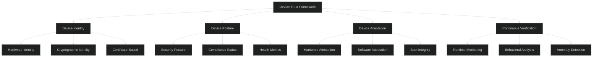
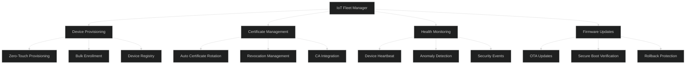

# Device/Machine Authentication - Advanced Level

## Zero Trust Device Authentication

### Device Trust Framework



### Advanced Device Attestation

```javascript
const tpm2 = require('tpm2-software');
const crypto = require('crypto');

class AdvancedDeviceAttestationService {
  constructor(config) {
    this.config = config;
    this.trustedPCRs = config.trustedPCRs;
    this.attestationCA = config.attestationCA;
  }
  
  async performAttestation(deviceId) {
    // 1. TPM-based attestation
    const tpmAttestation = await this.attestWithTPM(deviceId);
    
    // 2. Secure boot verification
    const secureBootStatus = await this.verifySecureBoot(deviceId);
    
    // 3. Software integrity check
    const softwareIntegrity = await this.verifySoftwareIntegrity(deviceId);
    
    // 4. Runtime security posture
    const securityPosture = await this.assessSecurityPosture(deviceId);
    
    // 5. Combine results
    const attestationResult = this.evaluateAttestation({
      tpm: tpmAttestation,
      secureBoot: secureBootStatus,
      software: softwareIntegrity,
      posture: securityPosture
    });
    
    // 6. Issue attestation token
    if (attestationResult.trusted) {
      return await this.issueAttestationToken(deviceId, attestationResult);
    }
    
    throw new Error(`Attestation failed: ${attestationResult.reason}`);
  }
  
  async attestWithTPM(deviceId) {
    // Get device TPM
    const device = await this.getDevice(deviceId);
    
    if (!device.tpmEnabled) {
      return { supported: false, reason: 'TPM not available' };
    }
    
    // Generate nonce for freshness
    const nonce = crypto.randomBytes(32);
    
    // Get TPM quote (signed PCR values)
    const quote = await this.getTPMQuote(device, nonce);
    
    // Verify quote signature using TPM AIK certificate
    const signatureValid = await this.verifyTPMQuote(
      quote,
      device.aikCertificate,
      nonce
    );
    
    if (!signatureValid) {
      return {
        trusted: false,
        reason: 'TPM quote signature verification failed'
      };
    }
    
    // Verify PCR values match expected baseline
    const pcrValidation = await this.validatePCRs(quote.pcrValues, device);
    
    return {
      trusted: pcrValidation.valid,
      reason: pcrValidation.reason,
      pcrValues: quote.pcrValues,
      timestamp: Date.now()
    };
  }
  
  async getTPMQuote(device, nonce) {
    // TPM2_Quote command
    const quoteCommand = {
      handle: device.tpm.aikHandle,
      qualifyingData: nonce,
      pcrSelection: {
        pcrSelections: [{
          hash: 'SHA256',
          pcrSlots: [0, 1, 2, 3, 4, 5, 6, 7] // Boot measurements
        }]
      },
      scheme: {
        scheme: 'RSASSA',
        details: { hashAlg: 'SHA256' }
      }
    };
    
    const response = await tpm2.quote(quoteCommand);
    
    return {
      pcrValues: response.pcrValues,
      signature: response.signature,
      attestationData: response.attestationData
    };
  }
  
  async validatePCRs(actualPCRs, device) {
    // Get expected PCR baseline for this device
    const baseline = await this.getPCRBaseline(device);
    
    const violations = [];
    
    for (const [pcrIndex, actualValue] of Object.entries(actualPCRs)) {
      const expectedValue = baseline[pcrIndex];
      
      if (!expectedValue) {
        continue; // Skip if no baseline defined
      }
      
      if (actualValue !== expectedValue) {
        violations.push({
          pcr: pcrIndex,
          expected: expectedValue,
          actual: actualValue,
          meaning: this.getPCRMeaning(parseInt(pcrIndex))
        });
      }
    }
    
    if (violations.length > 0) {
      return {
        valid: false,
        reason: 'PCR values do not match baseline',
        violations
      };
    }
    
    return { valid: true };
  }
  
  getPCRMeaning(pcrIndex) {
    const pcrMeanings = {
      0: 'BIOS/UEFI code',
      1: 'BIOS/UEFI configuration',
      2: 'Option ROM code',
      3: 'Option ROM configuration',
      4: 'Boot loader code',
      5: 'Boot loader configuration',
      6: 'Resume from sleep',
      7: 'Secure boot policy'
    };
    
    return pcrMeanings[pcrIndex] || 'Unknown';
  }
  
  async verifySecureBoot(deviceId) {
    const device = await this.getDevice(deviceId);
    
    // Check UEFI Secure Boot status
    if (!device.secureBootEnabled) {
      return {
        enabled: false,
        reason: 'Secure Boot is disabled'
      };
    }
    
    // Verify boot chain integrity
    const bootChain = await this.getBootChain(device);
    
    for (const component of bootChain) {
      const signatureValid = await this.verifyComponentSignature(
        component.binary,
        component.signature,
        this.config.trustedSigners
      );
      
      if (!signatureValid) {
        return {
          enabled: true,
          valid: false,
          reason: `Invalid signature for ${component.name}`
        };
      }
    }
    
    return {
      enabled: true,
      valid: true
    };
  }
  
  async assessSecurityPosture(deviceId) {
    const device = await this.getDevice(deviceId);
    
    const checks = {
      // Disk encryption
      diskEncrypted: await this.checkDiskEncryption(device),
      
      // Firewall status
      firewallEnabled: await this.checkFirewall(device),
      
      // Antivirus status
      antivirusActive: await this.checkAntivirus(device),
      
      // OS patch level
      osUpToDate: await this.checkOSPatches(device),
      
      // Running services
      noSuspiciousServices: await this.checkRunningServices(device),
      
      // Network connections
      noSuspiciousConnections: await this.checkNetworkConnections(device),
      
      // Device jailbroken/rooted
      notJailbroken: !device.jailbroken && !device.rooted,
      
      // Developer mode
      notDeveloperMode: !device.developerModeEnabled
    };
    
    const passedChecks = Object.values(checks).filter(Boolean).length;
    const totalChecks = Object.keys(checks).length;
    const postureScore = (passedChecks / totalChecks) * 100;
    
    return {
      score: postureScore,
      level: this.getPostureLevel(postureScore),
      checks,
      compliant: postureScore >= this.config.minimumPostureScore
    };
  }
  
  getPostureLevel(score) {
    if (score >= 90) return 'EXCELLENT';
    if (score >= 75) return 'GOOD';
    if (score >= 60) return 'ACCEPTABLE';
    if (score >= 40) return 'POOR';
    return 'CRITICAL';
  }
  
  async issueAttestationToken(deviceId, attestationResult) {
    const token = await new jose.SignJWT({
      device_id: deviceId,
      attestation_level: attestationResult.level,
      tpm_verified: attestationResult.tpm.trusted,
      secure_boot: attestationResult.secureBoot.valid,
      posture_score: attestationResult.posture.score,
      attested_at: Date.now()
    })
      .setProtectedHeader({ alg: 'ES256', typ: 'at+jwt' })
      .setIssuedAt()
      .setIssuer(this.config.issuer)
      .setExpirationTime('1h')
      .sign(this.config.signingKey);
    
    return token;
  }
}
```

## IoT Device Authentication at Scale

### Fleet Management Architecture



### Implementation

```javascript
class IoTFleetManager {
  async provisionDevice(deviceInfo) {
    // 1. Generate device identity
    const deviceId = await this.generateDeviceId(deviceInfo);
    
    // 2. Generate device certificate
    const certificate = await this.issueDeviceCertificate(deviceId, deviceInfo);
    
    // 3. Provision credentials to device
    const provisioningData = {
      deviceId,
      certificate: certificate.cert,
      privateKey: certificate.privateKey,
      caCertificate: certificate.caCert,
      endpoints: {
        mqtt: this.config.mqttEndpoint,
        http: this.config.httpEndpoint
      },
      configuration: await this.getDeviceConfiguration(deviceId)
    };
    
    // 4. Encrypt provisioning data with device public key
    const encryptedData = await this.encryptProvisioningData(
      provisioningData,
      deviceInfo.publicKey
    );
    
    // 5. Register in device registry
    await this.registerDevice({
      deviceId,
      deviceType: deviceInfo.type,
      manufacturer: deviceInfo.manufacturer,
      model: deviceInfo.model,
      serialNumber: deviceInfo.serialNumber,
      provisionedAt: new Date(),
      certificateId: certificate.id,
      status: 'provisioned'
    });
    
    return encryptedData;
  }
  
  async authenticateDevice(deviceId, clientCertificate) {
    // 1. Verify certificate
    const certValid = await this.verifyCertificate(clientCertificate);
    
    if (!certValid) {
      throw new Error('Invalid certificate');
    }
    
    // 2. Check certificate revocation
    const revoked = await this.isCertificateRevoked(clientCertificate.serialNumber);
    
    if (revoked) {
      throw new Error('Certificate has been revoked');
    }
    
    // 3. Verify device exists in registry
    const device = await this.getDevice(deviceId);
    
    if (!device) {
      throw new Error('Device not registered');
    }
    
    // 4. Check device status
    if (device.status === 'suspended' || device.status === 'revoked') {
      throw new Error(`Device is ${device.status}`);
    }
    
    // 5. Verify certificate matches registered device
    if (device.certificateId !== clientCertificate.id) {
      throw new Error('Certificate mismatch');
    }
    
    // 6. Update last seen
    await this.updateDeviceActivity(deviceId);
    
    return {
      authenticated: true,
      deviceId,
      permissions: device.permissions
    };
  }
  
  async rotateDeviceCredentials(deviceId) {
    // Automatic credential rotation
    const device = await this.getDevice(deviceId);
    
    // Generate new certificate
    const newCertificate = await this.issueDeviceCertificate(deviceId, {
      type: device.deviceType
    });
    
    // Update device registry
    await this.updateDevice(deviceId, {
      certificateId: newCertificate.id,
      previousCertificateId: device.certificateId,
      certificateRotatedAt: new Date()
    });
    
    // Send new certificate to device
    await this.sendCredentialUpdate(deviceId, newCertificate);
    
    // Keep old certificate valid for grace period
    await this.scheduleOldCertificateRevocation(
      device.certificateId,
      this.config.rotationGracePeriod
    );
    
    return newCertificate;
  }
  
  async monitorFleetHealth() {
    const devices = await this.getAllDevices();
    
    const health = {
      total: devices.length,
      online: 0,
      offline: 0,
      compromised: 0,
      needsUpdate: 0,
      certificateExpiring: 0
    };
    
    for (const device of devices) {
      // Check online status
      if (Date.now() - device.lastSeen < 5 * 60 * 1000) {
        health.online++;
      } else {
        health.offline++;
      }
      
      // Check certificate expiration
      const cert = await this.getCertificate(device.certificateId);
      const daysUntilExpiry = (cert.notAfter - Date.now()) / (1000 * 60 * 60 * 24);
      
      if (daysUntilExpiry < 30) {
        health.certificateExpiring++;
      }
      
      // Check firmware version
      if (device.firmwareVersion < this.config.minimumFirmwareVersion) {
        health.needsUpdate++;
      }
      
      // Check for anomalies
      if (await this.detectAnomalies(device)) {
        health.compromised++;
      }
    }
    
    return health;
  }
}
```

## Best Practices

### Security Hardening

✅ **Do:**
- Implement hardware-backed device identity
- Use TPM/Secure Enclave when available
- Implement device attestation
- Monitor device security posture
- Automate certificate rotation
- Implement zero-touch provisioning
- Use mutual TLS for device communication
- Implement device-specific access policies
- Monitor for anomalous device behavior
- Plan for device decommissioning

❌ **Don't:**
- Store device credentials in plain text
- Use static shared secrets
- Skip device attestation
- Forget certificate expiration
- Allow unvetted devices on network
- Use weak device identifiers
- Forget device revocation procedures
- Skip security posture checks
- Allow devices without encryption
- Forget compliance requirements

## Next Steps

📚 **Related Advanced Topics:** Hardware root of trust, Secure element integration, Device identity composition engine (DICE), Confidential computing for IoT

---

**Related Topics:** TPM, IoT Security, PKI, Zero Trust, Hardware Security, Certificate Management
