# Device / Machine Authentication - Basic Level

## What is Device Authentication?

**Device authentication** means verifying that a device or machine is authorized - not just a person. This is crucial for IoT devices, servers, APIs, and any system where machines talk to each other without human involvement.

Think of it like your car's key fob - the car recognizes the specific fob,not just any person holding it.

## Why Authenticate Devices?

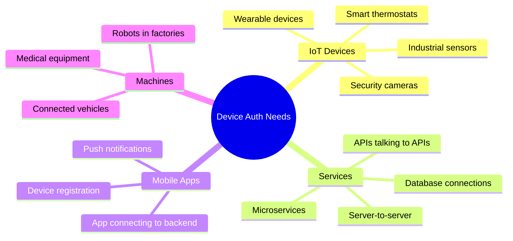

## How It Works

### Simple Device Auth Flow

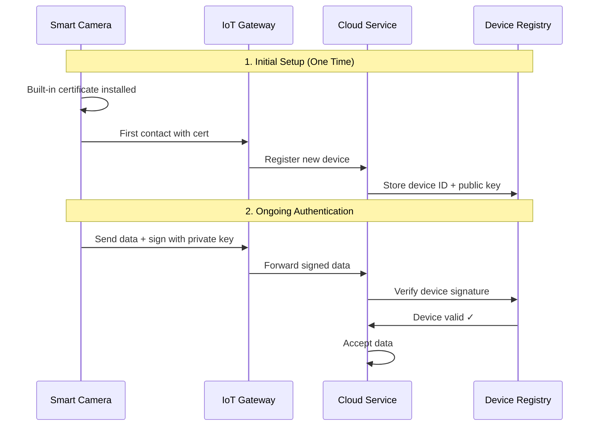

## Types of Device Authentication

### 1. Certificate-Based (Most Secure)

```mermaid
%%{init: {\'theme\':\'dark\'}}%%
graph TD
    A[Device Certificate] --> B[Factory Install]
    B --> C[Each device has unique cert]
    C --> D[Private key never leaves device]
    D --> E[Public key registered with server]
    
    F[Connection] --> G[Device signs challenge]
    G --> H[Server verifies with public key]
    H --> I[Device authenticated ✓]```

**How it works:**
- Device manufactured with unique certificate
- Certificate proves device identity
- Can't be copied or faked
- Used by: IoT devices, industrial equipment

**Example:** Smart thermostat with built-in certificate

### 2. API Keys / Tokens

```mermaid
%%{init: {\'theme\':\'dark\'}}%%
flowchart LR
    A[Service Account] --> B[Generate API Key]
    B --> C[Store securely in device]
    C --> D[Send with every request]
    D --> E[Server validates key]
    E --> F[Grant access]
```

**How it works:**
- Administrator generates API key
- Key stored in device configuration
- Device includes key in requests
- Server checks if key is valid

**Example:** Mobile app backend communication

### 3. Device Fingerprinting

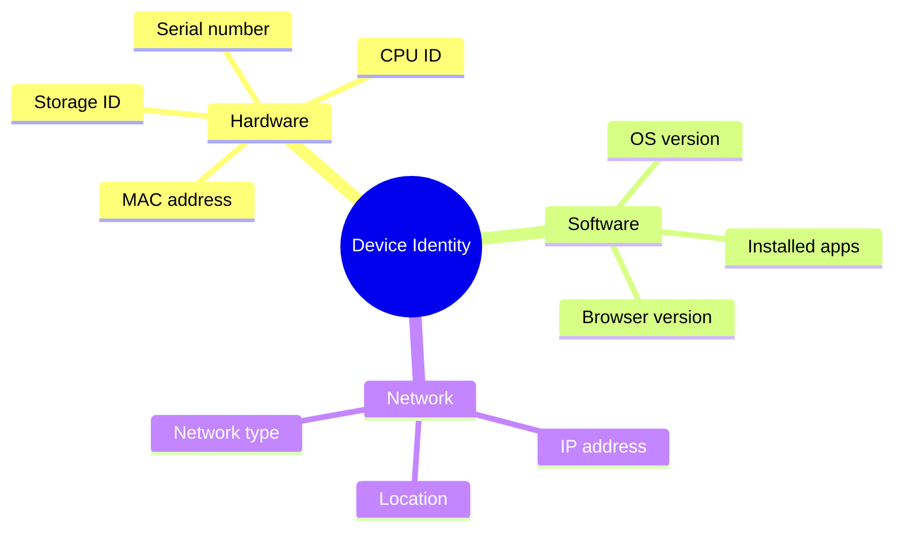

**How it works:**
- Collect unique device characteristics
- Create "fingerprint" hash
- Server recognizes device by fingerprint
- Changes indicate different device

**Example:** Fraud detection, device tracking

## Real-World Examples

### Example 1: Smart Home Security Camera

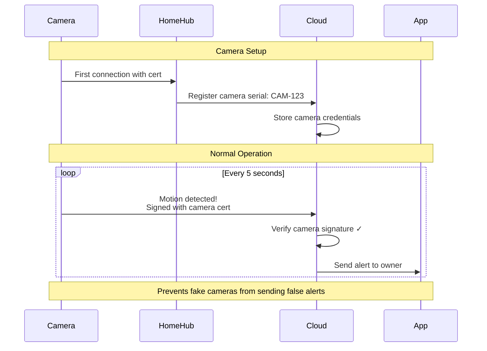

### Example 2: Mobile App to Backend

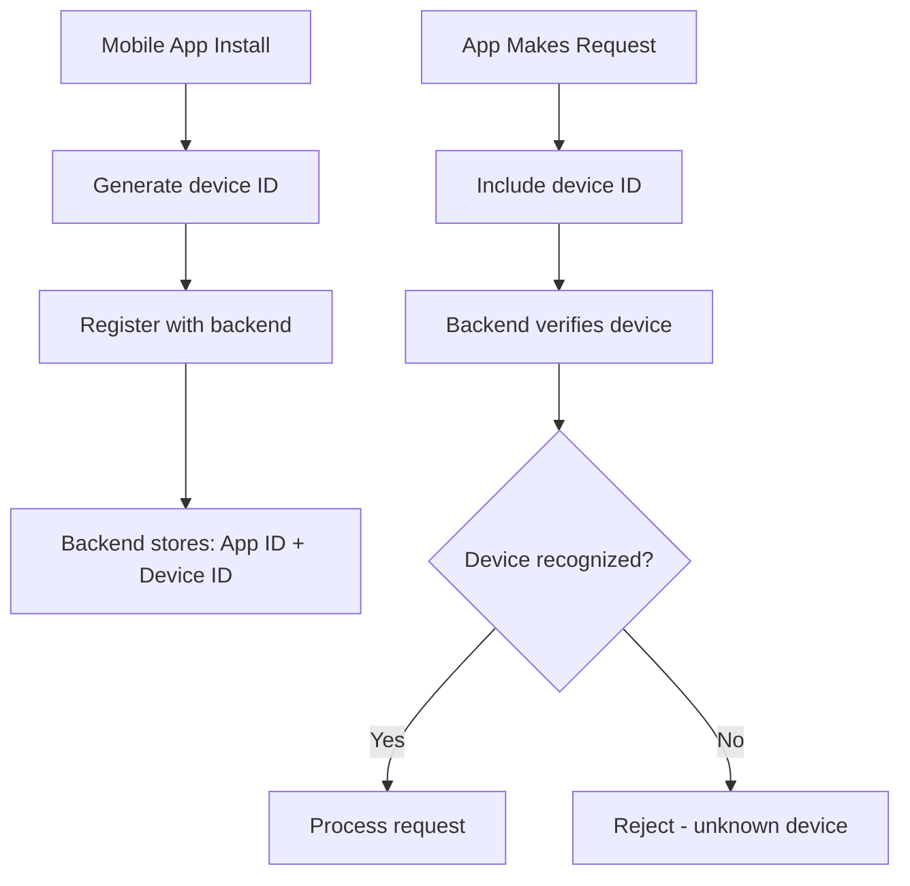

**What happens:**
1. Install app on phone
2. App generates unique device ID
3. Registers with backend server
4. Every request includes device ID
5. Server tracks which devices access account

### Example 3: Factory Robots

```mermaid
%%{init: {\'theme\':\'dark\'}}%%
graph TD
    A[Robot ARM-001] --> B[Has certificate]
    A[Robot ARM-002] --> B
    A[Robot ARM-003] --> B
    
    B --> C[Central Controller]
    C --> D{Verify identity}
    
    D -->|Valid cert| E[Send instructions]
    D -->|Invalid cert| F[Reject - unauthorized]
    
    E --> G[Robot executes task]```

## Machine-to-Machine (M2M) Communication

### Services Talking to Each Other

```mermaid
%%{init: {\'theme\':\'dark\'}}%%
sequenceDiagram
    participant OrderService
    participant PaymentService
    participant ShippingService
    participant EmailService
    
    Note over OrderService,EmailService: Customer places order
    
    OrderService->>PaymentService: Process payment<br/>API Key: order-svc-key-123
    PaymentService->>PaymentService: Verify API key ✓
    PaymentService->>OrderService: Payment approved
    
    OrderService->>ShippingService: Create shipment<br/>API Key: order-svc-key-123
    ShippingService->>ShippingService: Verify API key ✓
    ShippingService->>OrderService: Shipment created
    
    OrderService->>EmailService: Send confirmation<br/>API Key: order-svc-key-123
    EmailService->>EmailService: Verify API key ✓
    EmailService->>EmailService: Send email ✓
```

## Service Accounts

### Non-Human Accounts

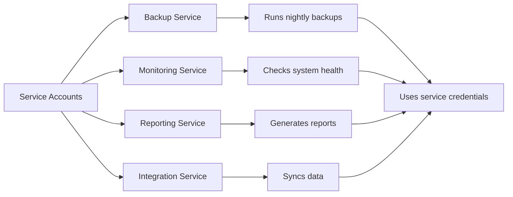

**What are service accounts?**
- Accounts for applications, not people
- Have API keys or certificates
- Limited permissions (only what they need)
- Can't login interactively
- Audited and monitored

## Device Provisioning

### Adding New Devices

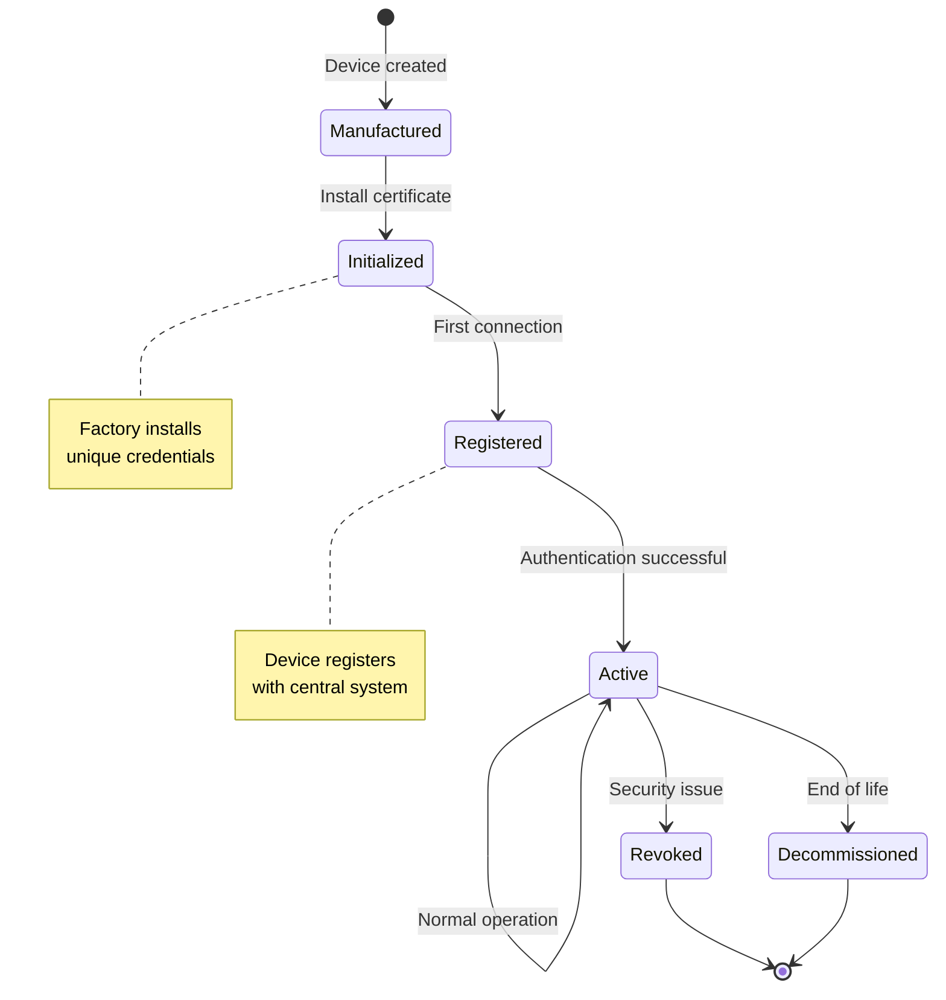

## Industry Examples

### 🏭 Manufacturing: Industrial IoT

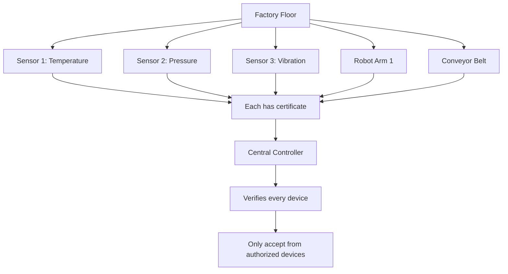

**Why it matters:**
- Prevent rogue devices
- Ensure data integrity
- Safety critical systems
- Production line security

### 🏥 Healthcare: Medical Devices

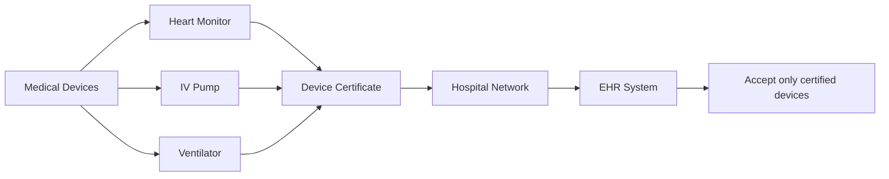

**Requirements:**
- FDA regulations
- Patient safety
- HIPAA compliance
- Device tracking
- Audit trails

### 🚗 Automotive: Connected Cars

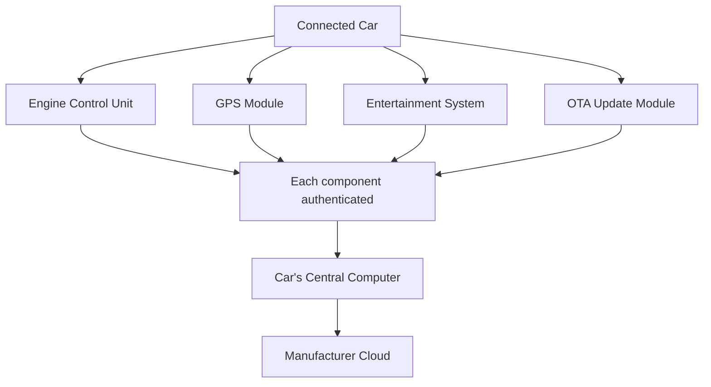

**Security needs:**
- Prevent car hacking
- Secure OTA updates
- Component verification
- Safety critical

## Device Registration Process

### Onboarding New Devices

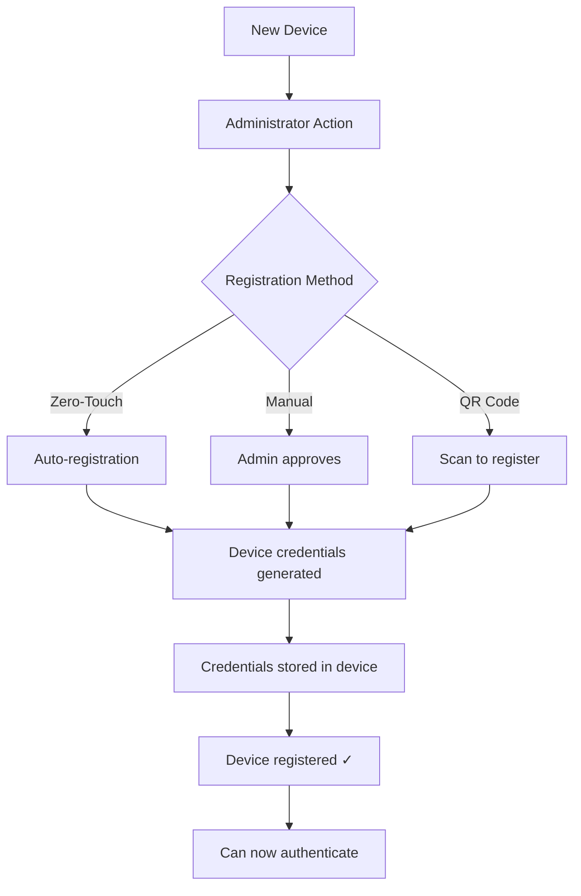

**Methods:**

1. **Zero-Touch Provisioning**
   - Device auto-registers on first boot
   - Used by: Large-scale IoT deployments

2. **Manual Approval**
   - Admin reviews and approves
   - Used by: High-security environments

3. **QR Code/NFC**
   - Scan to register
   - Used by: Consumer IoT devices

## Security Considerations

### Protecting Device Credentials

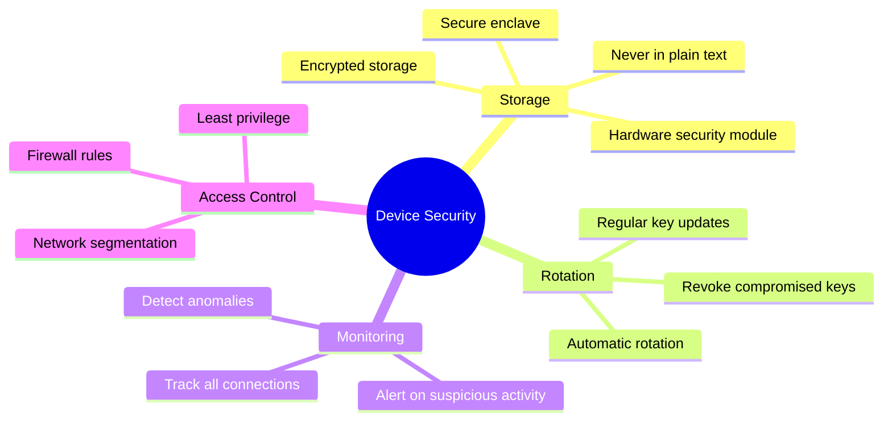

## Device Lifecycle Management

### From Birth to Death

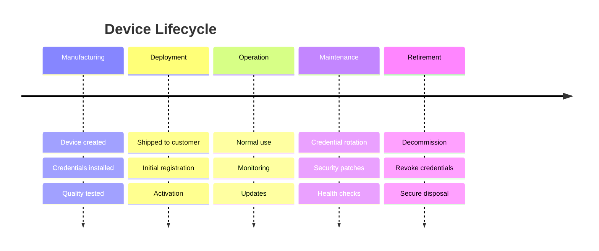

## Common Challenges

### Device Auth Problems

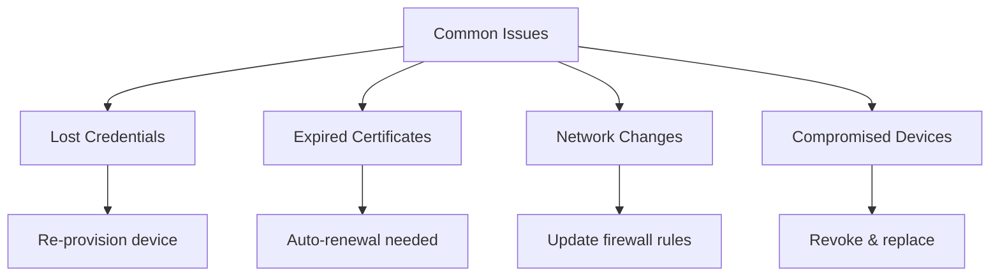

**Solutions:**

**Problem:** Device credentials lost or corrupted
```
Solution: Have backup recovery method
- Factory reset procedure
- Re-provisioning process
- Admin override capability
```

**Problem:** Certificates expire
```
Solution: Automated certificate renewal
- Monitor expiration dates
- Auto-renew before expiration
- Alert administrators
```

**Problem:** Device compromised
```
Solution: Quick revocation
- Maintain device registry
- Revoke compromised device
- Update access control lists
```

## API Keys for Devices

### Managing Service API Keys

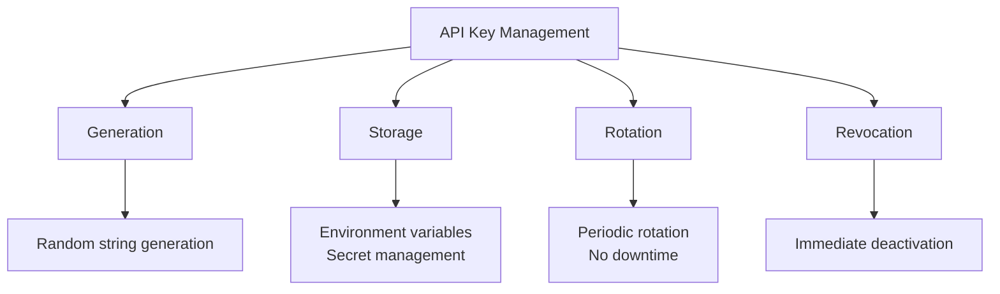

**Best Practices:**

✅ **Do:**
- Store in environment variables
- Use secret management systems (AWS Secrets Manager, Vault)
- Rotate keys regularly (every 90 days)
- Different keys for different environments (dev/staging/prod)
- Log all key usage

❌ **Don't:**
- Hardcode in application code
- Commit to source control
- Share keys between services
- Use same key for multiple environments
- Forget to rotate

## Advantages of Device Authentication

### Why It's Important

1. **Security** - Only authorized devices can connect
2. **Accountability** - Track which device did what
3. **Integrity** - Verify device identity
4. **Scale** - Manage thousands of devices
5. **Automation** - No human intervention needed
6. **Compliance** - Meet regulatory requirements

## Key Takeaways

1. **Device auth = Verify machines**, not just people
2. **Certificates** - Most secure for IoT devices
3. **API keys** - Common for service-to-service
4. **Service accounts** - For automated processes
5. **Provisioning** - How new devices are added
6. **Rotation** - Regularly update credentials
7. **Monitoring** - Track all device activity

## Common Questions

**Q: What if a device's certificate expires?**
A: Implement automatic certificate renewal. Device should renew before expiration or have fallback authentication.

**Q: How do I secure API keys on devices?**
A: Use hardware security modules, secure enclaves, or encrypted storage. Never hardcode in source code.

**Q: Can one certificate work for multiple devices?**
A: No! Each device needs unique credentials. Sharing creates security risk.

**Q: What's the difference between device auth and user auth?**
A: User auth verifies people (passwords, biometrics). Device auth verifies machines (certificates, API keys).

## Next Steps

- 📗 **Intermediate Level:** PKI for devices, zero-touch provisioning, certificate lifecycle, fleet management
- 📕 **Advanced Level:** HSM integration, attestation, secure boot, supply chain security, device identity standards

---

**Related Topics:** Certificate-Based Authentication, PKI, API Security, IoT Security, Service Mesh, mTLS
