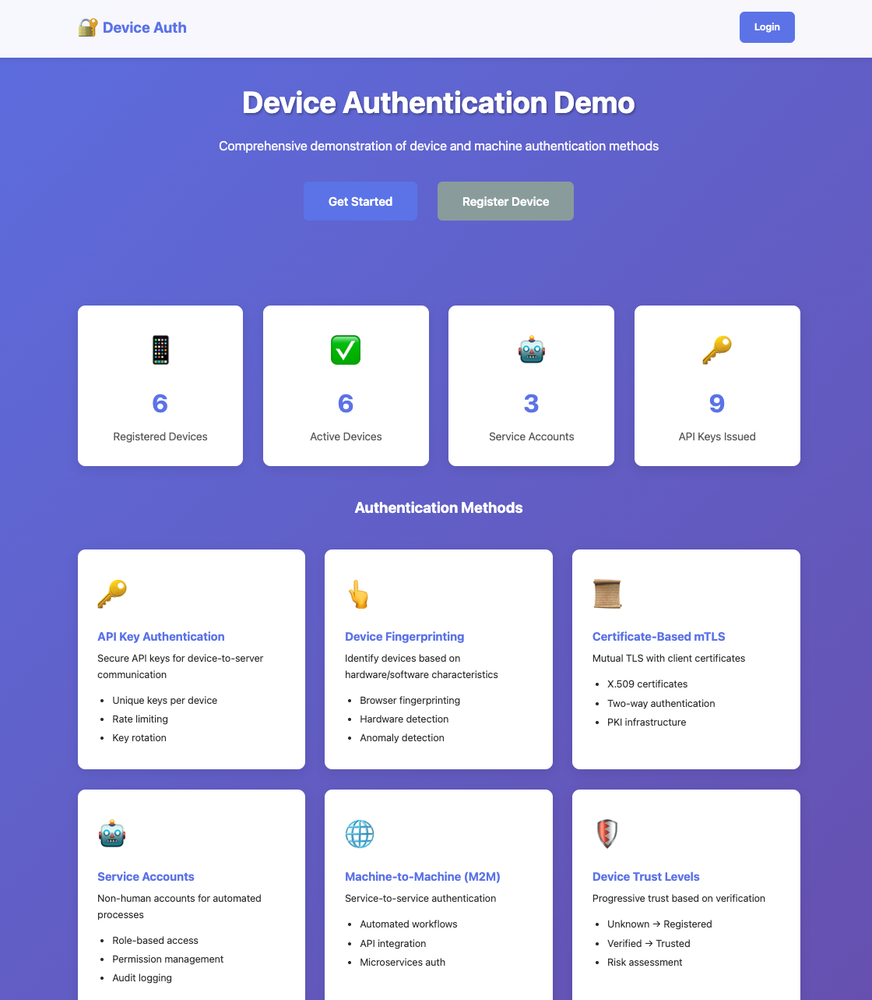

# 🔐 Device Authentication Demo

A comprehensive demonstration of device and machine authentication methods including API keys, device fingerprinting, certificate-based auth, and service accounts.




## 🌟 Features

### Authentication Methods Demonstrated

1. **🔑 API Key Authentication**
   - Secure API key generation and validation
   - Key rotation and expiration
   - Rate limiting per device
   - Environment-specific keys (live/test)

2. **👆 Device Fingerprinting**
   - Browser and hardware characteristic collection
   - Unique device identification
   - Change detection and anomaly alerts
   - Bot detection

3. **📜 Certificate-Based Authentication (mTLS)**
   - X.509 client certificates
   - Mutual TLS support
   - Certificate validation and trust chains

4. **🤖 Service Accounts**
   - Non-human accounts for automated processes
   - Permission and scope management
   - IP whitelisting
   - Audit trail

5. **🌐 Machine-to-Machine (M2M) Communication**
   - Service-to-service authentication
   - API integration patterns
   - Microservices auth

6. **🛡️ Device Trust Levels**
   - Unknown → Registered → Verified → Trusted
   - Progressive trust based on verification
   - Risk assessment

## 🚀 Quick Start

### Prerequisites

- Node.js (v14 or higher)
- npm or yarn

### Installation

```bash
# Navigate to project directory
cd device-auth-demo

# Install dependencies
npm install

# Setup test devices and service accounts
npm run setup-devices

# Start the server
npm start
```

The application will be available at **http://localhost:3004**

### Default Credentials

**Admin User:**
- Username: `admin`
- Password: `admin123`

**Device Manager:**
- Username: `device-manager`
- Password: `manager123`

## 📋 Usage

### 1. Web Interface

#### Login
1. Visit http://localhost:3004
2. Click "Login"
3. Use credentials: `admin` / `admin123`

#### Register a Device
1. Navigate to "Devices" → "Register New Device"
2. Fill in device information
3. Click "Register Device"
4. Generate API key for the device

#### Create Service Account
1. Navigate to "Service Accounts" → "Create Service Account"
2. Enter account details and permissions
3. Save the generated API key securely

#### Test Device Fingerprinting
1. Navigate to "Dashboard" → "Test Fingerprinting"
2. View your device's unique fingerprint
3. See collected characteristics

### 2. API Usage

#### Authenticate with API Key

```bash
# Get device information
curl -H "X-API-Key: sk_live_YOUR_KEY_HERE" \
  http://localhost:3004/api/device/info

# Send telemetry data
curl -X POST \
  -H "X-API-Key: sk_live_YOUR_KEY_HERE" \
  -H "Content-Type: application/json" \
  -d '{"temperature": 25.5, "humidity": 60}' \
  http://localhost:3004/api/telemetry

# Get device status
curl -H "X-API-Key: sk_live_YOUR_KEY_HERE" \
  http://localhost:3004/api/device/status
```

#### Get Device Fingerprint

```bash
# Generate fingerprint for current request
curl http://localhost:3004/api/fingerprint

# Verify fingerprint
curl -X POST \
  -H "Content-Type: application/json" \
  -d '{"fingerprintHash": "YOUR_HASH_HERE"}' \
  http://localhost:3004/api/fingerprint/verify
```

## 🏗️ Project Structure

```
device-auth-demo/
├── server.js                    # Main Express server
├── package.json                 # Dependencies
├── models/
│   ├── Device.js                # Device model and registry
│   └── ServiceAccount.js        # Service account model
├── services/
│   ├── deviceAuthService.js     # Device authentication service
│   ├── apiKeyService.js         # API key management
│   └── fingerprintService.js    # Device fingerprinting
├── routes/
│   ├── auth.js                  # User and device authentication
│   ├── devices.js               # Device management
│   ├── dashboard.js             # Dashboard routes
│   ├── api.js                   # Device API endpoints
│   └── serviceAccounts.js       # Service account management
├── views/                       # EJS templates (15+ pages)
├── public/
│   └── css/
│       └── style.css            # Application styles
├── scripts/
│   └── setup-test-devices.js    # Test data generator
└── devices/                     # Device registry storage
```

## 🎯 Key Components

### Device Registry
- In-memory storage with file persistence
- Device lifecycle management
- Authentication method tracking
- Usage statistics

### API Key Service
- Cryptographically secure key generation
- bcrypt hashing for storage
- Format validation
- Rate limit checking
- Key rotation support

### Fingerprinting Service
- User agent parsing
- Hardware/software characteristic collection
- Confidence scoring
- Change detection
- Bot identification

### Device Authentication Service
- Multi-method authentication
- Device verification
- Trust level management
- Session handling

## 📊 Device Types

- **IoT**: Smart home devices, sensors, cameras
- **Mobile**: Smartphones, tablets
- **Server**: Backend servers, APIs
- **Service**: Automated services, integrations

## 🔐 Security Features

- **API Key Hashing**: Keys stored as bcrypt hashes
- **Rate Limiting**: Per-device and per-service account limits
- **Trust Levels**: Progressive trust based on verification
- **Audit Logging**: Track all authentication attempts
- **IP Whitelisting**: Restrict service account access by IP
- **Session Management**: Secure HTTP-only cookies
- **Key Rotation**: Automatic expiration tracking

## 🌐 API Endpoints

### Public Endpoints
- `GET /` - Home page
- `GET /auth/login` - Login page
- `POST /auth/login` - User login
- `GET /devices/register` - Device registration page
- `POST /devices/register` - Register device
- `GET /api/health` - Health check
- `GET /api/fingerprint` - Get device fingerprint

### Protected Endpoints (Require Login)
- `GET /dashboard` - Main dashboard
- `GET /devices` - List devices
- `GET /devices/:id` - Device details
- `POST /devices/:id/generate-api-key` - Generate API key
- `GET /service-accounts` - List service accounts
- `POST /service-accounts/create` - Create service account

### API Endpoints (Require API Key)
- `GET /api/device/info` - Get device information
- `POST /api/telemetry` - Send telemetry data
- `GET /api/device/status` - Get device status
- `POST /api/device/config` - Update configuration
- `POST /api/echo` - Echo test endpoint

## 📈 Use Cases

### Industrial IoT
- Factory sensors authentication
- Equipment monitoring
- Production line security
- Preventive maintenance

### Healthcare
- Medical device authentication
- Patient monitoring systems
- EHR system access
- HIPAA compliance

### Smart Home
- IoT device management
- Home automation
- Security systems
- Energy monitoring

### Connected Vehicles
- Vehicle component authentication
- OTA updates
- Telematics
- Fleet management

## 🔧 Configuration

### Environment Variables

```bash
PORT=3004                    # Server port
NODE_ENV=development         # Environment
SESSION_SECRET=your-secret   # Session secret key
```

### Rate Limits

Default rate limits (configurable per device/service account):
- **Devices**: 60 req/min, 1000 req/day
- **Service Accounts**: 100 req/min, 1000 req/hour, 10000 req/day

## 📝 Development

### Adding New Device Types

1. Update `Device.js` model
2. Add type-specific validation
3. Update UI forms and displays
4. Test authentication flow

### Adding New Authentication Methods

1. Create service in `services/` directory
2. Add route handlers in `routes/auth.js`
3. Update device model to track method
4. Create UI for method configuration

### Custom API Endpoints

1. Add route in `routes/api.js`
2. Apply `authenticateAPIKey` middleware
3. Implement business logic
4. Test with API key

## 🧪 Testing

### Manual Testing

1. **Register Device**
   - Fill registration form
   - Verify device appears in list
   - Check device details page

2. **Generate API Key**
   - Click "Generate API Key" on device page
   - Copy the key (shown once!)
   - Test with curl command

3. **Test API**
   ```bash
   curl -H "X-API-Key: YOUR_KEY" \
     http://localhost:3004/api/device/info
   ```

4. **Test Fingerprinting**
   - Visit fingerprint demo page
   - View device characteristics
   - Test from different browsers

5. **Service Accounts**
   - Create service account
   - Generate API key
   - Test M2M communication

### API Testing Examples

```bash
# Health check (no auth)
curl http://localhost:3004/api/health

# Get fingerprint (no auth)
curl http://localhost:3004/api/fingerprint

# Device info (requires API key)
curl -H "X-API-Key: sk_live_..." \
  http://localhost:3004/api/device/info

# Send telemetry (requires API key)
curl -X POST \
  -H "X-API-Key: sk_live_..." \
  -H "Content-Type: application/json" \
  -d '{"temp": 25, "humidity": 60}' \
  http://localhost:3004/api/telemetry
```

## 🎓 Educational Value

This demo teaches:
- Device identity management
- API key best practices
- Service account patterns
- Rate limiting strategies
- Device fingerprinting techniques
- Trust level progression
- M2M authentication
- Security audit logging

## ⚠️ Production Considerations

For production deployment, you would need:
- Database instead of in-memory storage
- Redis for rate limiting
- Certificate management system
- Key rotation automation
- Comprehensive monitoring
- Load balancing
- HTTPS enforcement
- Enhanced security headers
- DDoS protection
- Logging and analytics

## 📚 Related Technologies

- **PKI**: Public Key Infrastructure for certificates
- **OAuth 2.0**: For delegated authorization
- **JWT**: For stateless authentication
- **mTLS**: Mutual TLS for mutual authentication
- **HSM**: Hardware Security Modules for key storage

## 🐛 Troubleshooting

### Server Won't Start
```bash
# Check if port is in use
lsof -ti:3004 | xargs kill -9

# Or change port in server.js
const PORT = process.env.PORT || 3005;
```

### API Key Not Working
- Verify key format (sk_live_ prefix)
- Check if device is active
- Verify rate limits not exceeded
- Ensure key hasn't expired

### Fingerprint Not Recognized
- Device characteristics may have changed
- Try registering device again
- Check if device is active
- Verify fingerprint confidence score

## 📄 License

MIT License - Educational purposes

## 🤝 Contributing

This is a demo project for educational purposes.

---

**Built for learning device authentication concepts through hands-on implementation** 🚀
