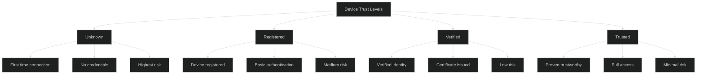
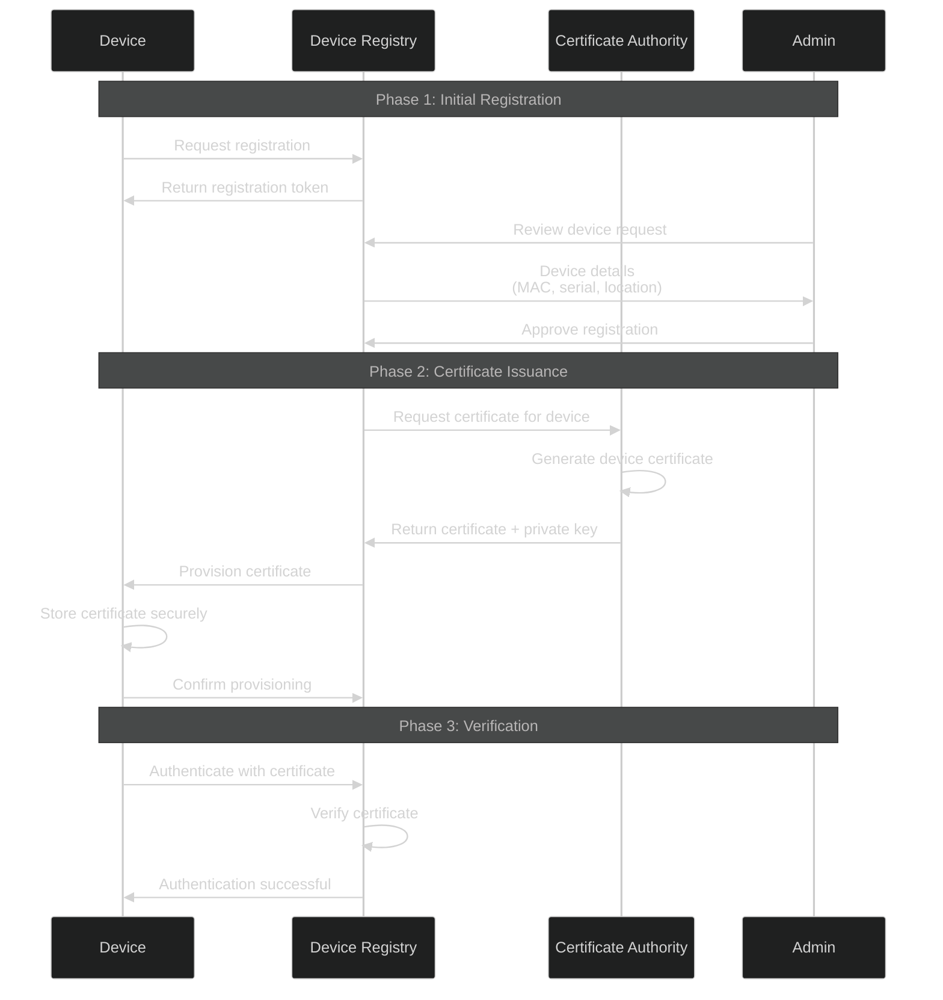
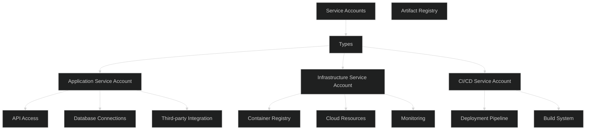

# Device/Machine Authentication - Intermediate Level

## Device Identity and Trust

### Device Trust Levels



### Device Registration Flow



## Certificate-Based Device Authentication

### mTLS for IoT Devices

```javascript
const mqtt = require('mqtt');
const fs = require('fs');

class IoTDeviceClient {
  constructor(deviceId, certPath, keyPath, caPath) {
    this.deviceId = deviceId;
    this.certPath = certPath;
    this.keyPath = keyPath;
    this.caPath = caPath;
    this.client = null;
  }
  
  connect(brokerUrl) {
    const options = {
      // Device certificate (client cert)
      cert: fs.readFileSync(this.certPath),
      key: fs.readFileSync(this.keyPath),
      
      // CA certificate to verify broker
      ca: fs.readFileSync(this.caPath),
      
      // Client ID from device certificate
      clientId: this.deviceId,
      
      // TLS options
      rejectUnauthorized: true,
      protocol: 'mqtts',
      port: 8883,
      
      // Connection options
      keepalive: 60,
      reconnectPeriod: 1000,
      connectTimeout: 30000
    };
    
    this.client = mqtt.connect(brokerUrl, options);
    
    this.client.on('connect', () => {
      console.log(`Device ${this.deviceId} connected securely`);
      this.onConnect();
    });
    
    this.client.on('error', (error) => {
      console.error('Connection error:', error);
    });
    
    return this.client;
  }
  
  onConnect() {
    // Subscribe to device-specific topics
    this.client.subscribe(`devices/${this.deviceId}/commands`);
    this.client.subscribe(`devices/${this.deviceId}/config`);
    
    // Publish device status
    this.publishStatus({
      online: true,
      timestamp: new Date().toISOString()
    });
  }
  
  publishTelemetry(data) {
    const payload = {
      deviceId: this.deviceId,
      timestamp: new Date().toISOString(),
      data: data
    };
    
    this.client.publish(
      `devices/${this.deviceId}/telemetry`,
      JSON.stringify(payload),
      { qos: 1 }
    );
  }
  
  publishStatus(status) {
    this.client.publish(
      `devices/${this.deviceId}/status`,
      JSON.stringify(status),
      { qos: 1, retain: true }
    );
  }
}

// Usage
const device = new IoTDeviceClient(
  'sensor-12345',
  '/certs/device-cert.pem',
  '/certs/device-key.pem',
  '/certs/ca-cert.pem'
);

device.connect('mqtts://iot.example.com');
```

## API Key Management for Services

### API Key Structure and Security

```javascript
class APIKeyManager {
  constructor(db, redis) {
    this.db = db;
    this.redis = redis;
  }
  
  async generateAPIKey(serviceId, permissions) {
    // Generate cryptographically secure key
    const keyPrefix = 'sk_live_'; // or sk_test_ for test keys
    const randomBytes = crypto.randomBytes(32);
    const apiKey = keyPrefix + randomBytes.toString('base64url');
    
    // Hash the key for storage (like password hashing)
    const keyHash = await this.hashKey(apiKey);
    
    // Store key metadata
    const keyRecord = await this.db.apiKeys.create({
      keyHash: keyHash,
      keyPrefix: apiKey.substring(0, 12), // For identification
      serviceId: serviceId,
      permissions: permissions,
      createdAt: new Date(),
      lastUsed: null,
      usageCount: 0,
      rateLimit: {
        requestsPerMinute: 100,
        requestsPerDay: 10000
      },
      ipWhitelist: [],
      active: true
    });
    
    // Only return the plain key once
    return {
      apiKey: apiKey,  // Show only once
      keyId: keyRecord.id,
      message: 'Store this key securely. It will not be shown again.'
    };
  }
  
  async hashKey(apiKey) {
    // Use strong hashing like bcrypt or Argon2
    return await bcrypt.hash(apiKey, 12);
  }
  
  async validateAPIKey(apiKey, request) {
    // Quick prefix check
    const prefix = apiKey.substring(0, 12);
    
    // Check Redis cache first
    const cached = await this.redis.get(`apikey:${prefix}`);
    if (cached) {
      const keyData = JSON.parse(cached);
      
      // Verify hash
      const valid = await bcrypt.compare(apiKey, keyData.keyHash);
      if (!valid) {
        return { valid: false, reason: 'invalid_key' };
      }
      
      // Check rate limits
      const rateLimitOk = await this.checkRateLimit(keyData.keyId);
      if (!rateLimitOk) {
        return { valid: false, reason: 'rate_limit_exceeded' };
      }
      
      return {
        valid: true,
        serviceId: keyData.serviceId,
        permissions: keyData.permissions
      };
    }
    
    // Fallback to database
    const keys = await this.db.apiKeys.find({ keyPrefix: prefix, active: true });
    
    for (const key of keys) {
      const valid = await bcrypt.compare(apiKey, key.keyHash);
      
      if (valid) {
        // Cache for future requests
        await this.redis.setex(
          `apikey:${prefix}`,
          3600, // 1 hour
          JSON.stringify({
            keyId: key.id,
            keyHash: key.keyHash,
            serviceId: key.serviceId,
            permissions: key.permissions
          })
        );
        
        // Update usage stats
        await this.updateUsage(key.id, request);
        
        // Check rate limit
        const rateLimitOk = await this.checkRateLimit(key.id);
        if (!rateLimitOk) {
          return { valid: false, reason: 'rate_limit_exceeded' };
        }
        
        return {
          valid: true,
          serviceId: key.serviceId,
          permissions: key.permissions
        };
      }
    }
    
    return { valid: false, reason: 'invalid_key' };
  }
  
  async checkRateLimit(keyId) {
    const minute = Math.floor(Date.now() / 60000);
    const minuteKey = `ratelimit:${keyId}:${minute}`;
    
    const count = await this.redis.incr(minuteKey);
    await this.redis.expire(minuteKey, 120); // Keep for 2 minutes
    
    const keyData = await this.db.apiKeys.findOne({ id: keyId });
    
    return count <= keyData.rateLimit.requestsPerMinute;
  }
  
  async updateUsage(keyId, request) {
    await this.db.apiKeys.update(
      { id: keyId },
      {
        lastUsed: new Date(),
        $inc: { usageCount: 1 }
      }
    );
    
    // Log usage for analytics
    await this.db.apiUsage.create({
      keyId: keyId,
      endpoint: request.path,
      method: request.method,
      timestamp: new Date(),
      ipAddress: request.ip,
      userAgent: request.headers['user-agent']
    });
  }
  
  async rotateKey(keyId) {
    const oldKey = await this.db.apiKeys.findOne({ id: keyId });
    
    // Generate new key
    const newKey = await this.generateAPIKey(
      oldKey.serviceId,
      oldKey.permissions
    );
    
    // Mark old key for deprecation
    await this.db.apiKeys.update(
      { id: keyId },
      {
        deprecated: true,
        deprecatedAt: new Date(),
        replacedBy: newKey.keyId,
        expiresAt: new Date(Date.now() + 30 * 24 * 60 * 60 * 1000) // 30 days
      }
    );
    
    return newKey;
  }
}
```

### API Key Authorization Middleware

```javascript
function apiKeyAuth(requiredPermissions = []) {
  return async (req, res, next) => {
    const apiKey = req.headers['x-api-key'] || req.query.api_key;
    
    if (!apiKey) {
      return res.status(401).json({
        error: 'missing_api_key',
        message: 'API key is required'
      });
    }
    
    // Validate key
    const validation = await apiKeyManager.validateAPIKey(apiKey, req);
    
    if (!validation.valid) {
      return res.status(401).json({
        error: validation.reason,
        message: 'Invalid or expired API key'
      });
    }
    
    // Check permissions
    if (requiredPermissions.length > 0) {
      const hasPermission = requiredPermissions.every(perm =>
        validation.permissions.includes(perm)
      );
      
      if (!hasPermission) {
        return res.status(403).json({
          error: 'insufficient_permissions',
          message: 'API key does not have required permissions'
        });
      }
    }
    
    // Attach service info to request
    req.service = {
      id: validation.serviceId,
      permissions: validation.permissions
    };
    
    next();
  };
}

// Usage
app.get('/api/data', apiKeyAuth(['read:data']), (req, res) => {
  res.json({ data: 'protected data' });
});

app.post('/api/data', apiKeyAuth(['write:data']), (req, res) => {
  // Create data
  res.json({ success: true });
});
```

## Device Fingerprinting

### Advanced Fingerprinting Techniques

```javascript
class DeviceFingerprintManager {
  async generateFingerprint(device) {
    const components = {
      // Hardware identifiers
      hardwareId: device.cpuId || device.serialNumber,
      macAddress: device.macAddress,
      imei: device.imei, // Mobile devices
      
      // Software identifiers
      osVersion: device.osVersion,
      kernelVersion: device.kernelVersion,
      firmware: device.firmwareVersion,
      
      // Network identifiers
      ipAddress: device.ipAddress,
      hostname: device.hostname,
      
      // Additional entropy
      installationId: device.installationId,
      firstSeen: device.firstSeen
    };
    
    // Create composite fingerprint
    const fingerprint = await this.hashFingerprint(components);
    
    return {
      fingerprint,
      components,
      confidence: this.calculateConfidence(components)
    };
  }
  
  async hashFingerprint(components) {
    // Normalize and sort keys
    const normalized = Object.keys(components)
      .sort()
      .reduce((obj, key) => {
        obj[key] = components[key];
        return obj;
      }, {});
    
    const str = JSON.stringify(normalized);
    const buffer = Buffer.from(str);
    
    return crypto.createHash('sha256').update(buffer).digest('hex');
  }
  
  calculateConfidence(components) {
    let score = 0;
    const weights = {
      hardwareId: 40,
      macAddress: 30,
      imei: 30,
      serialNumber: 25,
      installationId: 20,
      osVersion: 5,
      ipAddress: 5
    };
    
    for (const [key, weight] of Object.entries(weights)) {
      if (components[key]) {
        score += weight;
      }
    }
    
    return Math.min(100, score);
  }
  
  async verifyDevice(fingerprint, claimedDeviceId) {
    const stored = await this.db.devices.findOne({ deviceId: claimedDeviceId });
    
    if (!stored) {
      return { verified: false, reason: 'device_not_found' };
    }
    
    if (stored.fingerprint !== fingerprint) {
      // Check for partial match (hardware upgrade, IP change, etc.)
      const similarity = await this.compareFingerprints(
        fingerprint,
        stored.fingerprint
      );
      
      if (similarity > 0.8) {
        // Likely the same device with minor changes
        return {
          verified: true,
          confidence: similarity,
          updated: true
        };
      }
      
      return {
        verified: false,
        reason: 'fingerprint_mismatch',
        similarity
      };
    }
    
    return { verified: true, confidence: 1.0 };
  }
}
```

## Service Account Management

### Service Account Architecture



### Service Account Implementation

```javascript
class ServiceAccountManager {
  async createServiceAccount(name, description, permissions) {
    // Generate service account credentials
    const serviceAccount = {
      id: `sa-${crypto.randomUUID()}`,
      name: name,
      description: description,
      type: 'service_account',
      createdAt: new Date(),
      permissions: permissions,
      credentials: []
    };
    
    // Generate initial credential (certificate or API key)
    const credential = await this.generateCredential(serviceAccount.id);
    serviceAccount.credentials.push(credential);
    
    await this.db.serviceAccounts.create(serviceAccount);
    
    return {
      serviceAccount: serviceAccount,
      credential: credential.secret // Return only once
    };
  }
  
  async generateCredential(serviceAccountId, type = 'certificate') {
    if (type === 'certificate') {
      return await this.generateCertificate(serviceAccountId);
    } else {
      return await this.generateAPIKey(serviceAccountId);
    }
  }
  
  async generateCertificate(serviceAccountId) {
    const keys = crypto.generateKeyPairSync('rsa', {
      modulusLength: 2048,
      publicKeyEncoding: { type: 'spki', format: 'pem' },
      privateKeyEncoding: { type: 'pkcs8', format: 'pem' }
    });
    
    // Create certificate (using CA)
    const cert = await this.ca.issueCertificate({
      commonName: serviceAccountId,
      publicKey: keys.publicKey,
      validityDays: 365
    });
    
    return {
      id: crypto.randomUUID(),
      type: 'certificate',
      certificate: cert,
      secret: keys.privateKey, // Private key
      createdAt: new Date(),
      expiresAt: new Date(Date.now() + 365 * 24 * 60 * 60 * 1000)
    };
  }
  
  async authenticateServiceAccount(credentials) {
    // Extract service account ID from certificate or API key
    const serviceAccountId = await this.extractServiceAccountId(credentials);
    
    if (!serviceAccountId) {
      return { authenticated: false, reason: 'invalid_credentials' };
    }
    
    const serviceAccount = await this.db.serviceAccounts.findOne({
      id: serviceAccountId,
      active: true
    });
    
    if (!serviceAccount) {
      return { authenticated: false, reason: 'account_not_found' };
    }
    
    // Verify credentials
    const valid = await this.verifyCredentials(credentials, serviceAccount);
    
    if (!valid) {
      return { authenticated: false, reason: 'invalid_credentials' };
    }
    
    return {
      authenticated: true,
      serviceAccount: {
        id: serviceAccount.id,
        name: serviceAccount.name,
        permissions: serviceAccount.permissions
      }
    };
  }
}
```

## Best Practices

### Security Checklist

✅ **Do:**
- Use certificate-based authentication for high-security environments
- Implement device registration and approval workflows
- Store API keys hashed, never in plain text
- Implement rate limiting per device/service
- Monitor device behavior for anomalies
- Rotate credentials regularly
- Use hardware security modules for key storage
- Implement device attestation

❌ **Don't:**
- Hardcode API keys or certificates
- Share credentials between devices
- Use weak device identifiers
- Skip device verification
- Allow unlimited API requests
- Forget to revoke compromised credentials
- Use same credentials across environments
- Ignore device fingerprint changes

## Next Steps

📕 **Advanced Level:** TPM integration, hardware attestation, zero-touch provisioning, device identity blockchain, secure boot chains

---

**Related Topics:** IoT Security, PKI, API Security, Zero Trust, Certificate Management
