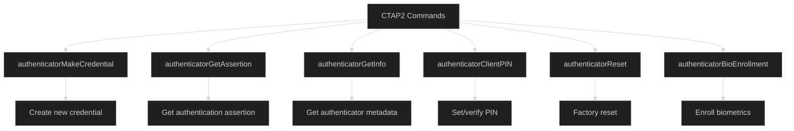
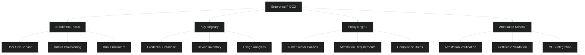

# Hardware Security Keys (FIDO2) - Advanced Level

## FIDO2 Protocol Internals

### CTAP2 Protocol Deep Dive



### Advanced CTAP2 Implementation

```javascript
const ctap2 = require('ctap2');
const cbor = require('cbor');

class AdvancedCTAP2Client {
  constructor(device) {
    this.device = device;
    this.transport = null;
  }
  
  async initialize() {
    // Detect transport (USB HID, NFC, BLE)
    this.transport = await this.detectTransport();
    
    // Get authenticator info
    const info = await this.getInfo();
    
    return {
      aaguid: info.aaguid,
      versions: info.versions,
      extensions: info.extensions,
      options: info.options,
      maxMsgSize: info.maxMsgSize,
      pinProtocols: info.pinProtocols,
      transports: info.transports
    };
  }
  
  async getInfo() {
    // CTAP2 authenticatorGetInfo command (0x04)
    const command = Buffer.from([0x04]);
    
    const response = await this.sendCommand(command);
    
    return cbor.decodeFirstSync(response);
  }
  
  async makeCredential(params) {
    const {
      rpId,
      rpName,
      userId,
      userName,
      userDisplayName,
      credTypesAndPubKeyAlgs,
      excludeList,
      extensions,
      options,
      pinAuth,
      pinProtocol
    } = params;
    
    // Build CTAP2 authenticatorMakeCredential (0x01)
    const commandParams = {
      1: { id: rpId, name: rpName }, // clientDataHash
      2: { id: userId, name: userName, displayName: userDisplayName }, // rp
      3: params.clientDataHash, // user
      4: credTypesAndPubKeyAlgs, // pubKeyCredParams
      5: excludeList, // excludeList
      6: extensions, // extensions
      7: options, // options
      8: pinAuth, // pinAuth
      9: pinProtocol // pinProtocol
    };
    
    const commandData = cbor.encodeOne(commandParams);
    const command = Buffer.concat([Buffer.from([0x01]), commandData]);
    
    const response = await this.sendCommand(command);
    
    // Decode response
    const decodedResponse = cbor.decodeFirstSync(response);
    
    return {
      fmt: decodedResponse[1], // attestation format
      authData: decodedResponse[2], // authenticator data
      attStmt: decodedResponse[3] // attestation statement
    };
  }
  
  async getAssertion(params) {
    const {
      rpId,
      clientDataHash,
      allowList,
      extensions,
      options,
      pinAuth,
      pinProtocol
    } = params;
    
    // Build CTAP2 authenticatorGetAssertion (0x02)
    const commandParams = {
      1: rpId,
      2: clientDataHash,
      3: allowList,
      4: extensions,
      5: options,
      6: pinAuth,
      7: pinProtocol
    };
    
    const commandData = cbor.encodeOne(commandParams);
    const command = Buffer.concat([Buffer.from([0x02]), commandData]);
    
    const response = await this.sendCommand(command);
    const decodedResponse = cbor.decodeFirstSync(response);
    
    return {
      credential: decodedResponse[1],
      authData: decodedResponse[2],
      signature: decodedResponse[3],
      user: decodedResponse[4],
      numberOfCredentials: decodedResponse[5]
    };
  }
  
  async getPINToken(pin) {
    // CTAP2 PIN protocol
    // 1. Get key agreement
    const keyAgreement = await this.getPINKeyAgreement();
    
    // 2. Derive shared secret
    const sharedSecret = await this.deriveSharedSecret(
      keyAgreement.publicKey
    );
    
    // 3. Encrypt PIN
    const encryptedPIN = await this.encryptPIN(pin, sharedSecret);
    
    // 4. Get PIN token
    const pinToken = await this.requestPINToken(
      keyAgreement.keyAgreement,
      encryptedPIN
    );
    
    // 5. Decrypt PIN token
    return await this.decryptPINToken(pinToken, sharedSecret);
  }
  
  async getPINKeyAgreement() {
    // authenticatorClientPIN (0x06) with subCommand getKeyAgreement (0x02)
    const commandParams = {
      1: 0x02 // getKeyAgreement
    };
    
    const commandData = cbor.encodeOne(commandParams);
    const command = Buffer.concat([Buffer.from([0x06]), commandData]);
    
    const response = await this.sendCommand(command);
    const decoded = cbor.decodeFirstSync(response);
    
    return {
      keyAgreement: decoded[1],
      publicKey: this.extractPublicKey(decoded[1])
    };
  }
  
  async deriveSharedSecret(authenticatorPublicKey) {
    // Generate platform key pair
    const platformKeyPair = await crypto.subtle.generateKey(
      {
        name: 'ECDH',
        namedCurve: 'P-256'
      },
      true,
      ['deriveBits']
    );
    
    // Derive shared secret using ECDH
    const sharedSecret = await crypto.subtle.deriveBits(
      {
        name: 'ECDH',
        public: authenticatorPublicKey
      },
      platformKeyPair.privateKey,
      256
    );
    
    return {
      sharedSecret: Buffer.from(sharedSecret),
      platformPublicKey: await crypto.subtle.exportKey('raw', platformKeyPair.publicKey)
    };
  }
  
  async sendCommand(command) {
    // Send command via transport
    switch (this.transport.type) {
      case 'usb':
        return await this.sendUSBCommand(command);
      case 'nfc':
        return await this.sendNFCCommand(command);
      case 'ble':
        return await this.sendBLECommand(command);
      default:
        throw new Error('Unknown transport');
    }
  }
  
  async sendUSBCommand(command) {
    // USB HID CTAP framing
    const CTAPHID_COMMAND = 0x10;
    const CHANNEL_ID = 0xffffffff;
    
    // Build CTAP HID packet
    const packet = Buffer.alloc(64);
    packet.writeUInt32BE(CHANNEL_ID, 0);
    packet.writeUInt8(CTAPHID_COMMAND, 4);
    packet.writeUInt16BE(command.length, 5);
    command.copy(packet, 7);
    
    // Send to device
    await this.device.write(packet);
    
    // Read response
    const response = await this.device.read();
    
    // Parse response
    return this.parseUSBResponse(response);
  }
}
```

## Enterprise Deployment at Scale

### Centralized Key Management



### Enterprise FIDO2 Manager

```javascript
class EnterpriseFIDO2Manager {
  constructor(config) {
    this.config = config;
    this.mdsClient = new FIDOMetadataServiceClient();
    this.policyEngine = new FIDO2PolicyEngine();
  }
  
  async enrollKey(userId, attestation, clientData) {
    // 1. Verify attestation
    const attestationResult = await this.verifyAttestation(attestation);
    
    // 2. Check against FIDO MDS
    const metadata = await this.mdsClient.getMetadata(attestationResult.aaguid);
    
    // 3. Evaluate against enterprise policy
    const policyResult = await this.policyEngine.evaluate({
      authenticator: metadata,
      attestation: attestationResult,
      user: await this.getUser(userId)
    });
    
    if (!policyResult.allowed) {
      throw new Error(`Policy violation: ${policyResult.reason}`);
    }
    
    // 4. Store credential
    const credential = {
      userId,
      credentialId: attestationResult.credentialId,
      publicKey: attestationResult.publicKey,
      signCount: 0,
      aaguid: attestationResult.aaguid,
      attestationType: attestationResult.attestationType,
      transports: attestation.transports,
      metadata: {
        authenticatorName: metadata.description,
        authenticatorVersion: metadata.authenticatorVersion,
        certificationLevel: metadata.statusReports[0]?.certificateNumber
      },
      enrolledAt: new Date(),
      lastUsed: null,
      status: 'active'
    };
    
    await this.storeCredential(credential);
    
    // 5. Register in inventory
    await this.registerInInventory(userId, credential);
    
    // 6. Notify user
    await this.notifyUserOfEnrollment(userId, credential);
    
    return credential;
  }
  
  async enforcePolicy(userId, authenticatorAAGUID) {
    const policy = await this.policyEngine.getPolicy(userId);
    const metadata = await this.mdsClient.getMetadata(authenticatorAAGUID);
    
    // Check certification level
    if (policy.requireCertification) {
      const certLevel = this.getCertificationLevel(metadata);
      if (certLevel < policy.minCertificationLevel) {
        return {
          allowed: false,
          reason: 'Authenticator certification level insufficient'
        };
      }
    }
    
    // Check authenticator status
    const status = metadata.statusReports[0]?.status;
    if (['REVOKED', 'ATTESTATION_KEY_COMPROMISE'].includes(status)) {
      return {
        allowed: false,
        reason: `Authenticator status: ${status}`
      };
    }
    
    // Check authenticator type
    if (policy.allowedAuthenticatorTypes) {
      const authType = this.getAuthenticatorType(metadata);
      if (!policy.allowedAuthenticatorTypes.includes(authType)) {
        return {
          allowed: false,
          reason: 'Authenticator type not allowed'
        };
      }
    }
    
    // Check biometric capability requirement
    if (policy.requireBiometric && !metadata.userVerificationDetails) {
      return {
        allowed: false,
        reason: 'Biometric authentication required'
      };
    }
    
    return { allowed: true };
  }
  
  async monitorKeyHealth() {
    const allCredentials = await this.getAllCredentials();
    
    const healthReport = {
      total: allCredentials.length,
      active: 0,
      inactive: 0,
      compromised: 0,
      expiringSoon: 0,
      issues: []
    };
    
    for (const cred of allCredentials) {
      // Check last usage
      if (cred.lastUsed && Date.now() - cred.lastUsed < 90 * 24 * 60 * 60 * 1000) {
        healthReport.active++;
      } else {
        healthReport.inactive++;
      }
      
      // Check MDS status
      const metadata = await this.mdsClient.getMetadata(cred.aaguid);
      const status = metadata.statusReports[0]?.status;
      
      if (['REVOKED', 'ATTESTATION_KEY_COMPROMISE'].includes(status)) {
        healthReport.compromised++;
        healthReport.issues.push({
          credentialId: cred.credentialId,
          userId: cred.userId,
          issue: 'compromised',
          status: status,
          action: 'revoke_immediately'
        });
      }
      
      // Check for clone detection
      if (await this.detectClone(cred)) {
        healthReport.issues.push({
          credentialId: cred.credentialId,
          userId: cred.userId,
          issue: 'possible_clone',
          action: 'investigate'
        });
      }
    }
    
    return healthReport;
  }
  
  async detectClone(credential) {
    // Check for sign counter anomalies
    const usageHistory = await this.getUsageHistory(credential.credentialId);
    
    for (let i = 1; i < usageHistory.length; i++) {
      if (usageHistory[i].signCount <= usageHistory[i-1].signCount) {
        // Sign counter decreased or stayed same - possible clone
        return true;
      }
    }
    
    return false;
  }
  
  async revokeCompromisedKeys(aaguid, reason) {
    // Find all keys with this AAGUID
    const affectedCredentials = await this.findCredentialsByAAGUID(aaguid);
    
    const revocationResults = [];
    
    for (const cred of affectedCredentials) {
      try {
        // Revoke credential
        await this.revokeCredential(cred.credentialId, reason);
        
        // Notify user
        await this.notifyUserOfRevocation(cred.userId, cred, reason);
        
        // Require re-enrollment
        await this.flagForReEnrollment(cred.userId);
        
        revocationResults.push({
          credentialId: cred.credentialId,
          userId: cred.userId,
          success: true
        });
      } catch (error) {
        revocationResults.push({
          credentialId: cred.credentialId,
          userId: cred.userId,
          success: false,
          error: error.message
        });
      }
    }
    
    return {
      total: affectedCredentials.length,
      revoked: revocationResults.filter(r => r.success).length,
      failed: revocationResults.filter(r => !r.success).length,
      results: revocationResults
    };
  }
}
```

## Best Practices

### Enterprise Security

✅ **Do:**
- Implement comprehensive attestation verification
- Use FIDO Metadata Service for authenticator validation
- Monitor for compromised authenticators
- Implement clone detection via sign counters
- Support multiple keys per user
- Implement proper key lifecycle management
- Regular security audits of enrolled authenticators
- Maintain authenticator inventory
- Implement policy-based enrollment
- Plan for key revocation scenarios

❌ **Don't:**
- Skip attestation verification
- Ignore MDS security advisories
- Allow single key per user
- Forget account recovery mechanisms
- Skip sign counter validation
- Use keys without proper certification
- Forget to monitor key health
- Allow unvetted authenticators
- Skip policy enforcement
- Forget compliance requirements

## Next Steps

📚 **Related Advanced Topics:** Custom authenticator development, FIDO alliance certification process, Hybrid CTAP protocols, Quantum-resistant FIDO2

---

**Related Topics:** FIDO2, WebAuthn, PKI, Hardware Security, Zero Trust, Cryptography
