# Hardware Security Keys - Basic Level

## What is a Hardware Security Key?

A **hardware security key** is a physical device (like a USB stick) that you use to prove your identity when logging in. It's the most secure form of authentication because it's a physical object hackers can't steal remotely.

Think of it like a car key - you need the physical key to start your car. Similarly, you need the physical security key to access your account.

## What They Look Like


**Common Types:**
- USB keys (plug into computer)
- NFC keys (tap on phone)
- Bluetooth keys (wireless connection)
- USB-C keys (modern ports)

## How It Works

### Simple Login Flow

```mermaid
sequenceDiagram
    participant User
    participant Computer
    participant SecurityKey as Security Key
    participant Website
    
    User->>Website: I want to login
    Website->>User: Enter username + password
    User->>Website: Here's my credentials
    Website->>Website: Password correct ✓
    
    Website->>Computer: Now insert security key
    Computer->>User: Please insert your key
    User->>Computer: Insert USB key
    Computer->>User: Touch the button on key
    User->>SecurityKey: Touch gold button
    
    SecurityKey->>SecurityKey: Generate cryptographic proof
    SecurityKey->>Website: Here's signed response
    Website->>Website: Verify signature ✓
    Website->>User: Access granted! ✓
```



## Why Hardware Keys Are Super Secure

### Phishing Protection

```mermaid
%%{init: {\'theme\':\'dark\'}}%%
flowchart TD
    A[Phishing Attack] --> B[Fake Website]
    
    B --> C{With Hardware Key?}
    C -->|No key| D[User types password]
    D --> E[Hacker steals password ✗]
    
    C -->|Has key| F[User inserts key]
    F --> G[Key checks website domain]
    G --> H[Domain doesn't match!]
    H --> I[Key refuses to work ✓]
    I --> J[User realizes it's fake]```

**Why it works:**
- Key is programmed for specific websites
- Key checks the real website address
- Won't work on fake/phishing sites
- Even if you want it to, it won't!

## Types of Hardware Keys

### 1. YubiKey (Most Popular)

```mermaid
%%{init: {\'theme\':\'dark\'}}%%
graph TD
    A[YubiKey Models] --> B[YubiKey 5 NFC]
    A --> C[YubiKey 5C]
    A --> D[YubiKey Bio]
    
    B --> B1["USB-A + NFC<br/>$45<br/>Most compatible"]
    C --> C1["USB-C<br/>$55<br/>Modern laptops"]
    D --> D1["Fingerprint sensor<br/>$85<br/>Extra security"]```

**Features:**
- Works with 100s of services
- No battery needed
- Water resistant
- Lasts 10+ years

### 2. Google Titan

```mermaid
%%{init: {\'theme\':\'dark\'}}%%
graph LR
    A[Titan Key] --> B[USB Version]
    A --> C[Bluetooth Version]
    
    B --> B1["$30<br/>Plug into computer"]
    C --> C1["$35<br/>Works with phones"]
```

**Made for:**
- Google accounts
- Android phones
- Gmail security
- Google Workspace

### 3. Other Options


## Setting Up Your Security Key

### Registration Process

```mermaid
%%{init: {\'theme\':\'dark\'}}%%
flowchart TD
    A[Buy Security Key] --> B[Go to website settings]
    B --> C[Find 'Security Keys' section]
    C --> D[Click 'Add Security Key']
    D --> E[Insert key when prompted]
    E --> F[Touch key button]
    F --> G[Give it a name: 'My YubiKey']
    G --> H[Registration complete ✓]
    
    H --> I[Buy backup key]
    I --> J[Register backup key too]```

**Step-by-step:**

1. **Buy a key** ($20-$85)
2. **Go to account settings** (e.g., Google Account)
3. **Find "2-Step Verification"**
4. **Click "Add Security Key"**
5. **Insert key** into USB port
6. **Touch the button** when it blinks
7. **Done!** Key is registered

## Using Your Security Key

### Daily Login

```mermaid
%%{init: {\'theme\':\'dark\'}}%%
stateDiagram-v2
    [*] --> EnterPassword: Visit website
    EnterPassword --> PasswordCorrect: Submit
    PasswordCorrect --> PromptForKey: Website asks for key
    PromptForKey --> InsertKey: User inserts key
    InsertKey --> TouchButton: Key blinks
    TouchButton --> Success: Touch gold button
    Success --> [*]: Logged in!
    
    note right of TouchButton
        Physical touch proves
        you're really there
    end note
```

## Where You Can Use Security Keys

### Supported Services


**Major services that support keys:**
- ✅ Gmail / Google Workspace
- ✅ Microsoft / Office 365
- ✅ Facebook / Instagram
- ✅ Twitter
- ✅ GitHub
- ✅ Dropbox
- ✅ AWS / Azure / GCP
- ✅ Password managers

## Real-World Example

### Protecting Your Google Account


## Advantages of Hardware Keys

### Why They're the Best

```mermaid
%%{init: {\'theme\':\'dark\'}}%%
graph TD
    A[Security Key Benefits] --> B[Phishing Proof]
    A --> C[No Phone Needed]
    A --> D[Works Offline]
    A --> E[Super Fast]
    A --> F[Long Lasting]
    
    B --> B1[Can't be tricked by fake sites]
    C --> C1[No SMS or app required]
    D --> D1[No internet needed for key]
    E --> E1[Touch button = instant login]
    F --> F1[10+ year lifespan]```

**Top Benefits:**

1. **Phishing resistant** - Works only on real websites
2. **No SIM swapping** - Doesn't use your phone number
3. **Fast** - Just insert and touch (2 seconds)
4. **Reliable** - No batteries, no charging
5. **Private** - Doesn't track you
6. **Multiple accounts** - One key for all services
7. **Portable** - Carry on keychain

## Hardware Key vs Other Methods

### Comparison

```mermaid
%%{init: {\'theme\':\'dark\'}}%%
graph TD
    A[2FA Methods] --> B[SMS Codes]
    A --> C[Authenticator Apps]
    A --> D[Hardware Keys]
    
    B --> B1["Security: Medium<br/>Convenience: Easy<br/>Cost: Free<br/>Phishing: Vulnerable"]
    
    C --> C1["Security: High<br/>Convenience: Medium<br/>Cost: Free<br/>Phishing: Vulnerable"]
    
    D --> D1["Security: Highest<br/>Convenience: High<br/>Cost: $20-85<br/>Phishing: Immune"]```

| Method | Security | Phishing Risk | Cost | Speed |
|--------|----------|---------------|------|-------|
| **SMS** | ⭐⭐⭐ | High | Free | Medium |
| **Authenticator App** | ⭐⭐⭐⭐ | Medium | Free | Medium |
| **Hardware Key** | ⭐⭐⭐⭐⭐ | None | $20-85 | Fast |

## Common Use Cases

### Who Uses Security Keys?

**🔐 Security Professionals**
```
Protecting sensitive accounts
Accessing secure systems
Preventing account takeovers
```

**💼 Corporate Employees**
```
Company requires hardware keys
Access to confidential data
Remote work security
```

**💰 Cryptocurrency Users**
```
Protecting digital wallets
Securing exchange accounts
Preventing theft
```

**👨‍💻 Developers & Admins**
```
GitHub account protection
AWS/Cloud access
Root access to servers
```

**🎯 High-Value Targets**
```
Executives
Journalists
Activists
Public figures
```

## Backup Keys

### Why You Need Two

```mermaid
%%{init: {\'theme\':\'dark\'}}%%
flowchart TD
    A[Buy 2 Keys] --> B[Register Both]
    B --> C[Primary Key]
    B --> D[Backup Key]
    
    C --> E[Keep on keychain<br/>Use daily]
    D --> F[Keep in safe place<br/>Home or office]
    
    G[Primary Key Lost] --> H[Use Backup Key]
    H --> I[Remove lost key from accounts]
    I --> J[Buy new key]
    J --> K[Register as new backup]```

**Important:**
- Always buy 2 keys
- Register both keys
- Keep backup in safe place
- If primary lost, use backup
- Remove lost key from all accounts

## Setting Up Multiple Accounts

### One Key, Many Services

```mermaid
%%{init: {\'theme\':\'dark\'}}%%
graph TD
    A[Your YubiKey] --> B[Register on multiple sites]
    
    B --> C[Google]
    B --> D[GitHub]
    B --> E[Facebook]
    B --> F[Dropbox]
    B --> G[Twitter]
    B --> H[Bank]
    
    I[How?] --> J[Each site stores<br/>your key's public signature]
    J --> K[Same key works everywhere]
```

## Troubleshooting

### Common Issues


**Quick fixes:**
- Try different USB port
- Use updated browser (Chrome, Firefox, Edge)
- Clean the gold button contact
- Make sure you're pressing firmly
- Check if service supports hardware keys

## Cost Analysis

### Is It Worth It?

```mermaid
%%{init: {\'theme\':\'dark\'}}%%
graph LR
    A[One-Time Cost] --> B[$45 for YubiKey]
    
    C[What You Get] --> D[10+ years of use]
    C --> E[Unlimited accounts]
    C --> F[Maximum security]
    C --> G[Peace of mind]
    
    H[Yearly Cost] --> I[$4.50 per year]
    I --> J[Less than a coffee!]```

**Price breakdown:**
- YubiKey 5 NFC: $45
- Expected lifespan: 10+ years
- Cost per year: $4.50
- Number of accounts: Unlimited
- Cost per account: Basically free

**Compare to:**
- Account takeover damage: $1000s
- Identity theft recovery: Months of hassle
- Peace of mind: Priceless

## How to Buy

### Where to Get Security Keys

**Official stores:**
- yubico.com (YubiKey)
- store.google.com (Titan Key)
- amazon.com (various brands)

**What to buy:**
- **Most people:** YubiKey 5 NFC ($45)
- **Modern laptops:** YubiKey 5C USB-C ($55)
- **Budget:** Feitian ($15-20)
- **Premium:** YubiKey Bio with fingerprint ($85)

**Don't forget:**
- Buy 2 keys (primary + backup)
- Choose correct port type (USB-A vs USB-C)
- NFC support for phones

## Best Practices

### Using Your Key Safely

✅ **Do:**
- Register 2 keys (primary + backup)
- Keep backup in safe place
- Use key for all important accounts
- Test key after registration
- Keep key on keychain
- Clean occasionally

❌ **Don't:**
- Don't share your key
- Don't register on untrusted computers
- Don't forget your backup key
- Don't lose both keys
- Don't forget backup codes (just in case)

## Key Takeaways

1. **Hardware keys = Physical USB devices** for ultra-secure login
2. **Phishing proof** - Only works on real websites
3. **Fast and easy** - Insert + touch button (2 seconds)
4. **One key** - Works with Google, GitHub, Facebook, etc.
5. **Buy two** - Primary + backup key
6. **Cost** - $20-85 one-time, lasts 10+ years
7. **Most secure** - Better than SMS or authenticator apps

## Common Questions

**Q: What if I lose my security key?**
A: Use your backup key! Then remove lost key from all accounts and buy a replacement.

**Q: Can someone copy my security key?**
A: No! Each key has a unique cryptographic identity that can't be cloned.

**Q: Do I need a key for each account?**
A: No! One key works with unlimited accounts. Just register it once per service.

**Q: What if my key stops working?**
A: Keys last 10+ years. If it fails, use your backup key immediately.

**Q: Can I use it on my phone?**
A: Yes! Get a key with NFC (like YubiKey 5 NFC) and tap it on your phone.

## Getting Started

### Your Action Plan

1. **Decide on a key**
   - Recommend: YubiKey 5 NFC ($45)

2. **Buy 2 keys**
   - Primary for daily use
   - Backup for emergencies

3. **Start with Google**
   - Easiest to set up
   - Go to myaccount.google.com
   - Security → 2-Step Verification
   - Add security key

4. **Add to other accounts**
   - GitHub
   - Facebook
   - Password manager
   - Work accounts

5. **Test both keys**
   - Make sure they both work
   - Store backup safely

## Next Steps

- 📗 **Intermediate Level:** FIDO U2F vs FIDO2 protocols, registration flows, enterprise deployment, backup strategies
- 📕 **Advanced Level:** CTAP1/CTAP2 protocols, attestation mechanisms, resident credentials, supply chain security

---

**Related Topics:** FIDO2, WebAuthn, Phishing Resistance, Multi-Factor Authentication, Passwordless Authentication
