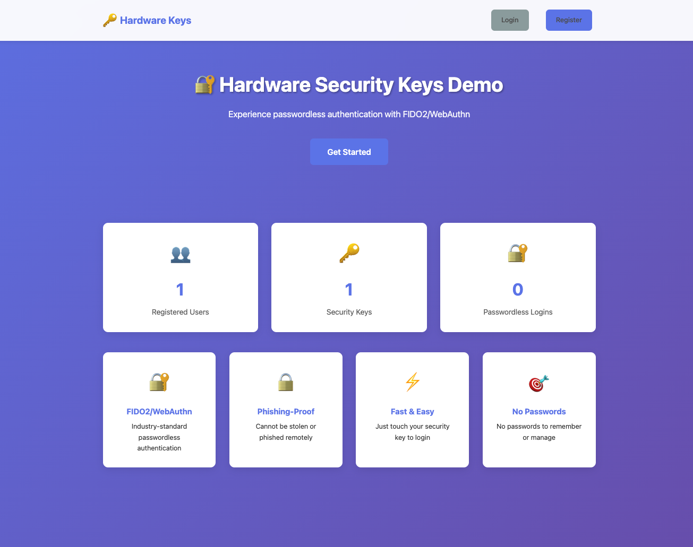
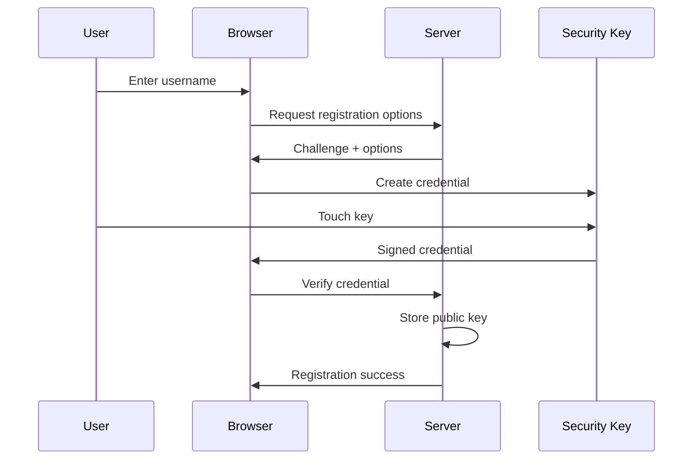
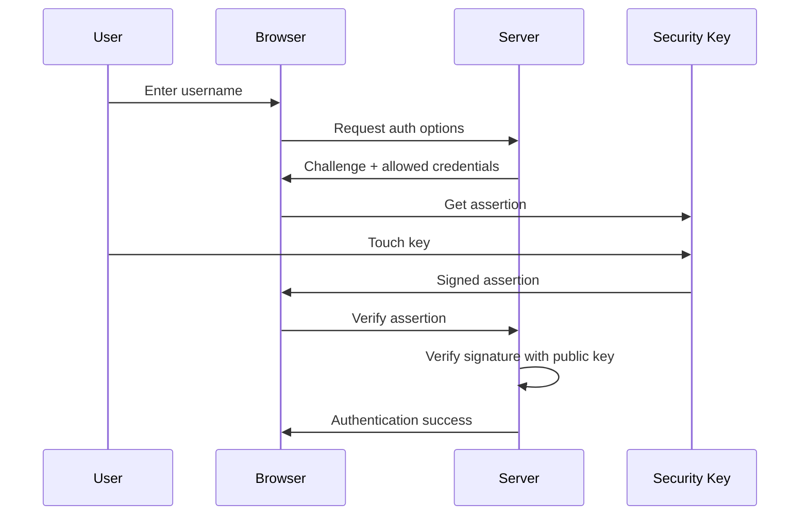

# 🔐 Hardware Security Keys Demo

A comprehensive demonstration of passwordless authentication using FIDO2/WebAuthn protocol with hardware security keys.



## 🌟 Features

### Authentication Methods

1. **🔑 Hardware Security Keys**
   - YubiKey (5 Series, Bio, NFC)
   - Google Titan Security Key
   - Feitian Keys
   - SoloKeys
   - Any FIDO2-compatible hardware key

2. **💻 Platform Authenticators**
   - Touch ID (macOS/iOS)
   - Windows Hello
   - Android Biometrics
   - Chrome OS built-in

3. **🔐 FIDO2/WebAuthn Features**
   - Passwordless authentication
   - Phishing-proof security
   - Multi-device support
   - Resident keys (passkeys)
   - User verification options

## 🚀 Quick Start

### Prerequisites

- Node.js (v14 or higher)
- A hardware security key OR platform authenticator
- Modern browser (Chrome 67+, Firefox 60+, Edge 18+, Safari 13+)

### Installation

```bash
# Navigate to project directory
cd hardware-key-demo

# Install dependencies
npm install

# Start the server
npm start
```

The application will be available at **http://localhost:3005**

### Testing Without Physical Key

Use Chrome DevTools Virtual Authenticator:

1. Open Chrome DevTools (F12)
2. Click **⋮** (More tools) → **WebAuthn**
3. Click **Enable virtual authenticator environment**
4. Click **Add authenticator**
5. Configure:
   - Protocol: **ctap2**
   - Transport: **usb** or **internal**
   - Supports resident keys: **✓**
   - Supports user verification: **✓**
6. Click **Add**

Now you can test registration and login!

## 📋 Usage

### 1. Register a New Account

1. Visit http://localhost:3005
2. Click **Register**
3. Enter a username (e.g., `john.doe`)
4. Optionally name your security key (e.g., `My YubiKey`)
5. Click **Register with Security Key**
6. Insert your security key and touch it when it blinks
7. You're automatically logged in!

### 2. Login with Security Key

1. Visit http://localhost:3005
2. Click **Login**
3. Enter your username
4. Click **Login with Security Key**
5. Touch your security key
6. You're logged in - no password needed!

### 3. Add Backup Key

1. Login to your account
2. Go to **Dashboard**
3. Click **Add Security Key**
4. Enter a name for the backup key
5. Insert and touch your backup key
6. Now you have two keys that can access your account

### 4. Manage Security Keys

- View all registered keys on the Dashboard
- See key details (name, type, transport, last used)
- Remove keys you no longer use
- Add unlimited keys

## 🏗️ Project Structure

```
hardware-key-demo/
├── server.js                    # Express server
├── package.json                 # Dependencies
├── models/
│   └── User.js                  # User model with WebAuthn credentials
├── services/
│   └── webAuthnService.js       # FIDO2/WebAuthn implementation
├── routes/
│   ├── auth.js                  # Authentication pages
│   ├── webauthn.js              # WebAuthn API endpoints
│   └── dashboard.js             # Dashboard and profile
├── views/                       # EJS templates
│   ├── index.ejs                # Landing page
│   ├── register.ejs             # Registration page
│   ├── login.ejs                # Login page
│   ├── dashboard.ejs            # Main dashboard
│   ├── profile.ejs              # User profile
│   ├── add-key.ejs              # Add security key
│   ├── 404.ejs                  # Not found
│   └── error.ejs                # Error page
├── public/
│   ├── css/
│   │   └── style.css            # Application styles
│   └── js/
│       └── webauthn-client.js   # Client-side WebAuthn handler
└── storage/
    └── users.json               # User data persistence
```

## 🔐 How It Works

### Registration Flow



### Authentication Flow



## 🎯 Key Components

### WebAuthn Service

The `webAuthnService.js` handles:
- **Registration**: Generating options and verifying responses
- **Authentication**: Creating challenges and validating assertions
- **Credential Management**: Storing and retrieving public keys
- **Authenticator Info**: Identifying device types (YubiKey, Touch ID, etc.)

### User Model

The `User.js` model includes:
- User profile information
- Multiple WebAuthn credentials
- Authentication statistics
- Security preferences
- Credential counter tracking (replay attack prevention)

### WebAuthn Client

The `webauthn-client.js` provides:
- Browser WebAuthn API wrapper
- Base64url encoding/decoding
- Credential creation and assertion
- Error handling

## 🔒 Security Features

### Phishing Protection

Hardware keys verify the website domain. They won't work on phishing sites even if the user wants them to.

### No Shared Secrets

Public key cryptography means:
- Server stores only public keys
- Private keys never leave the security key
- Server breach doesn't compromise authentication

### Replay Attack Prevention

Each authentication increments a counter. The server rejects attempts with old counters.

### User Verification

Optional PIN or biometric verification on the security key adds an extra layer.

### Attestation

The server can verify the authenticator's authenticity (though this demo uses `attestation: 'none'`).

## 🎓 Educational Value

### FIDO2/WebAuthn Concepts

- **Relying Party (RP)**: Your website/application
- **Authenticator**: Hardware key or platform authenticator
- **Challenge**: Random value preventing replay attacks
- **Attestation**: Proof of authenticator authenticity
- **Assertion**: Proof of user authentication
- **Resident Key**: Credential stored on the authenticator
- **User Verification**: PIN or biometric on the key

### Implementation Details

This demo shows:
- Complete WebAuthn registration and authentication
- Multiple credential support
- Credential counter tracking
- Authenticator transport detection
- AAGUID-based device identification
- Session management
- Error handling

## 🧪 Testing Scenarios

### Test 1: Basic Registration and Login

```bash
1. Register account with username "testuser"
2. Use hardware key or virtual authenticator
3. Verify redirect to dashboard
4. Logout
5. Login with same username
6. Touch key to authenticate
```

### Test 2: Multiple Security Keys

```bash
1. Register account
2. Add 2-3 additional keys
3. Logout
4. Login using different keys
5. Verify all keys work
```

### Test 3: Key Management

```bash
1. Register account with 2 keys
2. Remove one key
3. Logout
4. Try to login with removed key (should fail)
5. Login with remaining key (should work)
```

### Test 4: Platform Authenticator

```bash
1. Use Touch ID or Windows Hello
2. Register account
3. Notice "internal" transport
4. Test biometric authentication
```

### Test 5: Cross-Device Flow

```bash
1. Register on desktop with YubiKey
2. Login on phone using NFC
3. Verify same account access
```

## 🌐 Browser Support

| Browser | Version | Support |
|---------|---------|---------|
| Chrome | 67+ | ✅ Full |
| Firefox | 60+ | ✅ Full |
| Edge | 18+ | ✅ Full |
| Safari | 13+ | ✅ Full |
| Opera | 54+ | ✅ Full |

## 🔑 Supported Hardware Keys

### Tested

- ✅ YubiKey 5 Series (USB-A, USB-C, NFC)
- ✅ YubiKey Bio (with fingerprint)
- ✅ Google Titan Security Key
- ✅ Touch ID (Mac)
- ✅ Windows Hello
- ✅ Chrome Virtual Authenticator

### Should Work

- Any FIDO2-compatible security key
- Feitian Keys
- SoloKeys
- Thetis FIDO2
- HyperFIDO
- Kensington VeriMark

## 📊 API Endpoints

### Registration

```bash
POST /webauthn/register/options
Body: { "username": "john.doe" }
Response: WebAuthn registration options

POST /webauthn/register/verify
Body: { "response": {...}, "name": "My Key" }
Response: { "verified": true, "credential": {...} }
```

### Authentication

```bash
POST /webauthn/authenticate/options
Body: { "username": "john.doe" }
Response: WebAuthn authentication options

POST /webauthn/authenticate/verify
Body: { "response": {...} }
Response: { "verified": true, "user": {...} }
```

### Dashboard

```bash
GET /dashboard
Requires: Session authentication

POST /dashboard/add-key/options
Response: Registration options for new key

POST /dashboard/add-key/verify
Body: { "response": {...}, "name": "Backup Key" }

DELETE /dashboard/key/:credentialId
Removes a security key
```

## 🛠️ Development

### Enable Debug Logging

```javascript
// In server.js
app.use(morgan('combined')); // More verbose logging
```

### Test Attestation Verification

```javascript
// In services/webAuthnService.js
const regOptions = await generateRegistrationOptions({
  // ...
  attestationType: 'direct', // Request device attestation
});
```

### Add Custom Authenticator Detection

```javascript
// In services/webAuthnService.js
getAuthenticatorInfo(aaguid) {
  const knownAuthenticators = {
    'your-aaguid-here': {
      name: 'Custom Key',
      icon: '🔐',
      vendor: 'Vendor Name'
    }
  };
}
```

## ⚠️ Production Considerations

For production deployment, implement:

### Security
- **HTTPS only** - WebAuthn requires secure context
- **Environment variables** for secrets
- **Rate limiting** on API endpoints
- **CSRF protection**
- **Content Security Policy**

### Storage
- **Database** instead of JSON files
- **Redis** for challenge storage
- **Session store** (Redis/MongoDB)

### Features
- **Email verification**
- **Account recovery** (backup codes)
- **Audit logging**
- **Admin panel**
- **Device management**

### Infrastructure
- **Load balancing**
- **CDN** for static assets
- **Monitoring** (Sentry, DataDog)
- **Backup** strategy

## 🐛 Troubleshooting

### Security Key Not Detected

**Chrome:**
- Check USB connection
- Enable WebAuthn in chrome://flags
- Try different USB port

**Firefox:**
- Go to about:config
- Set `security.webauthn.u2f` to `true`
- Restart browser

### Registration Fails

**Check:**
- Browser supports WebAuthn
- HTTPS or localhost (required)
- Security key is FIDO2-compatible
- Key not already registered for this username

### Authentication Fails

**Check:**
- Using correct username
- Key was registered for this account
- Key counter hasn't been reset
- No browser extensions interfering

### Touch ID Not Working

**Requirements:**
- macOS with Touch ID
- Safari 13+ or Chrome 70+
- Device enrolled in Touch ID
- Keychain access allowed

## 📚 Resources

### FIDO Alliance
- [FIDO2 Specifications](https://fidoalliance.org/fido2/)
- [WebAuthn Guide](https://webauthn.guide/)

### W3C
- [WebAuthn Specification](https://www.w3.org/TR/webauthn/)

### Libraries
- [@simplewebauthn/server](https://simplewebauthn.dev/)
- [@simplewebauthn/browser](https://simplewebauthn.dev/)

### Hardware Keys
- [YubiKey](https://www.yubico.com/)
- [Google Titan](https://store.google.com/product/titan_security_key)
- [FIDO Alliance Members](https://fidoalliance.org/members/)

## 📄 License

MIT License - Educational purposes

## 🤝 Contributing

This is a demo project for educational purposes.

---

**Experience the future of authentication - no passwords required!** 🔐✨
