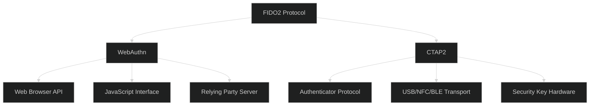
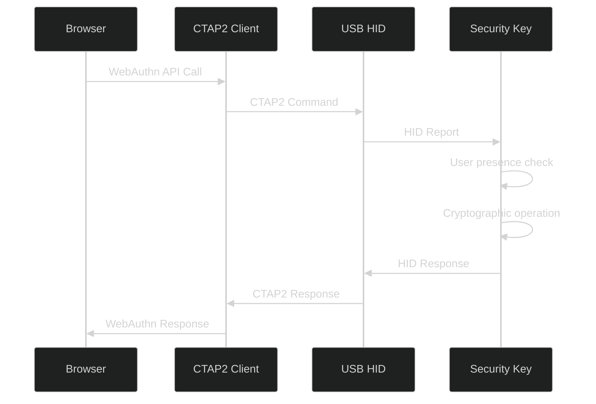
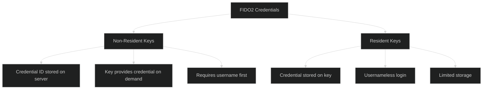
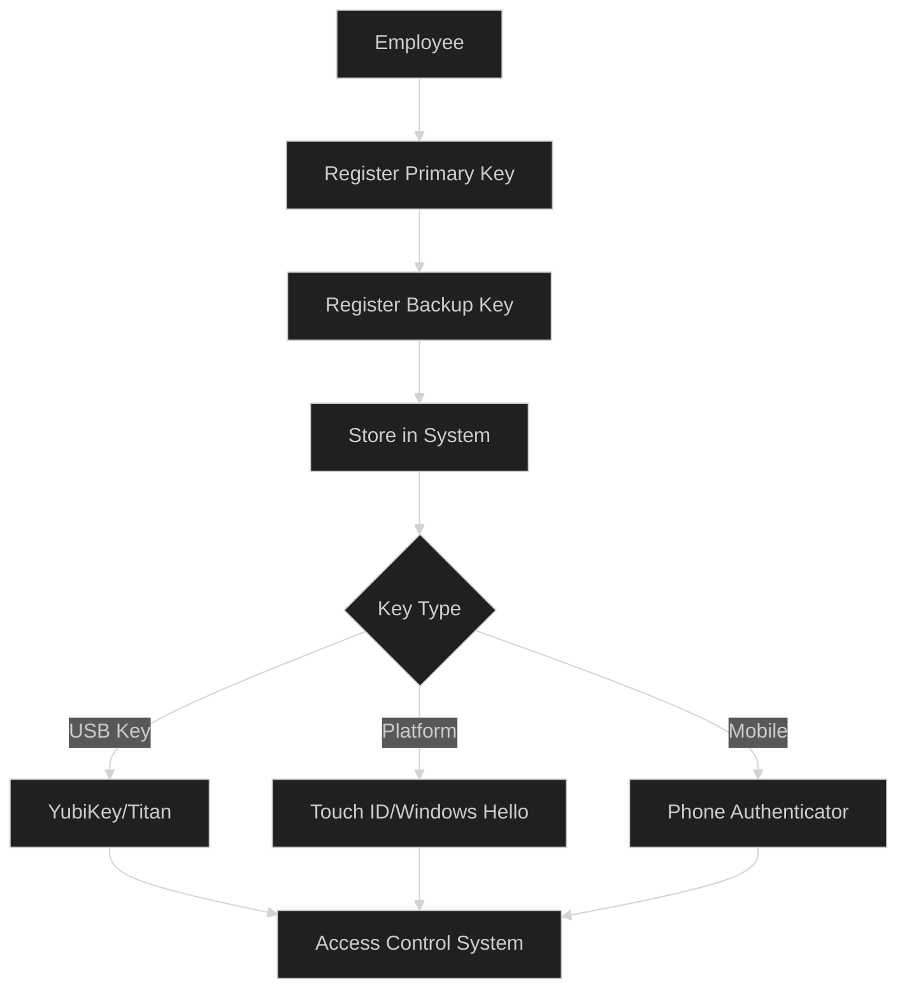

# Hardware Security Keys (FIDO2) - Intermediate Level

## FIDO2 Protocol Architecture

### Complete FIDO2 Stack



### CTAP2 Communication Flow



## Attestation Types and Verification

### Attestation Formats

```javascript
class AttestationVerifier {
  async verifyAttestation(attestationObject, clientDataJSON) {
    const attestation = cbor.decode(attestationObject);
    const format = attestation.fmt;
    
    switch(format) {
      case 'packed':
        return await this.verifyPackedAttestation(attestation);
      case 'tpm':
        return await this.verifyTPMAttestation(attestation);
      case 'android-key':
        return await this.verifyAndroidKeyAttestation(attestation);
      case 'android-safetynet':
        return await this.verifyAndroidSafetyNetAttestation(attestation);
      case 'fido-u2f':
        return await this.verifyU2FAttestation(attestation);
      case 'apple':
        return await this.verifyAppleAttestation(attestation);
      case 'none':
        return this.verifyNoneAttestation(attestation);
      default:
        throw new Error(`Unknown attestation format: ${format}`);
    }
  }
  
  async verifyPackedAttestation(attestation) {
    const authData = this.parseAuthenticatorData(attestation.authData);
    const attStmt = attestation.attStmt;
    
    // Extract public key from authData
    const publicKey = authData.attestedCredentialData.publicKey;
    
    if (attStmt.x5c) {
      // Full attestation with certificate chain
      const cert = this.parseCertificate(attStmt.x5c[0]);
      
      // Verify certificate chain
      await this.verifyCertificateChain(attStmt.x5c);
      
      // Verify signature
      const signatureBase = Buffer.concat([
        attestation.authData,
        this.hash(clientDataJSON)
      ]);
      
      const valid = await this.verifySignature(
        signatureBase,
        attStmt.sig,
        cert.publicKey,
        attStmt.alg
      );
      
      if (!valid) {
        throw new Error('Attestation signature verification failed');
      }
      
      return {
        format: 'packed',
        trustPath: 'full',
        aaguid: authData.attestedCredentialData.aaguid,
        credentialId: authData.attestedCredentialData.credentialId,
        publicKey: publicKey
      };
    } else {
      // Self-attestation
      const signatureBase = Buffer.concat([
        attestation.authData,
        this.hash(clientDataJSON)
      ]);
      
      const valid = await this.verifySignature(
        signatureBase,
        attStmt.sig,
        publicKey,
        attStmt.alg
      );
      
      if (!valid) {
        throw new Error('Self-attestation signature verification failed');
      }
      
      return {
        format: 'packed',
        trustPath: 'self',
        publicKey: publicKey
      };
    }
  }
  
  parseAuthenticatorData(authData) {
    let offset = 0;
    
    // RP ID Hash (32 bytes)
    const rpIdHash = authData.slice(offset, offset + 32);
    offset += 32;
    
    // Flags (1 byte)
    const flags = authData[offset];
    offset += 1;
    
    const result = {
      rpIdHash,
      flags: {
        userPresent: !!(flags & 0x01),
        userVerified: !!(flags & 0x04),
        attestedCredentialDataIncluded: !!(flags & 0x40),
        extensionDataIncluded: !!(flags & 0x80)
      },
      signCount: authData.readUInt32BE(offset)
    };
    offset += 4;
    
    // Attested credential data (if present)
    if (result.flags.attestedCredentialDataIncluded) {
      // AAGUID (16 bytes)
      const aaguid = authData.slice(offset, offset + 16);
      offset += 16;
      
      // Credential ID length (2 bytes)
      const credIdLength = authData.readUInt16BE(offset);
      offset += 2;
      
      // Credential ID
      const credentialId = authData.slice(offset, offset + credIdLength);
      offset += credIdLength;
      
      // CBOR encoded public key
      const publicKey = cbor.decode(authData.slice(offset));
      
      result.attestedCredentialData = {
        aaguid,
        credentialId,
        publicKey
      };
    }
    
    return result;
  }
}
```

### FIDO Metadata Service

```javascript
class FIDOMetadataService {
  constructor() {
    this.metadataCache = new Map();
    this.tocURL = 'https://mds.fidoalliance.org/';
  }
  
  async fetchMetadata() {
    // Download Table of Contents (TOC)
    const toc = await this.fetchTOC();
    
    // Verify TOC signature
    await this.verifyTOCSignature(toc);
    
    // Download and cache metadata for each authenticator
    for (const entry of toc.entries) {
      const metadata = await this.downloadMetadata(entry.url);
      this.metadataCache.set(entry.aaguid, metadata);
    }
  }
  
  async getAuthenticatorMetadata(aaguid) {
    if (!this.metadataCache.has(aaguid)) {
      await this.fetchMetadata();
    }
    
    return this.metadataCache.get(aaguid);
  }
  
  async verifyAuthenticator(aaguid, attestation) {
    const metadata = await this.getAuthenticatorMetadata(aaguid);
    
    if (!metadata) {
      throw new Error('Authenticator not found in metadata service');
    }
    
    // Check authenticator status
    const status = metadata.statusReports[0]?.status;
    
    const blockedStatuses = [
      'REVOKED',
      'USER_VERIFICATION_BYPASS',
      'ATTESTATION_KEY_COMPROMISE',
      'USER_KEY_REMOTE_COMPROMISE',
      'USER_KEY_PHYSICAL_COMPROMISE'
    ];
    
    if (blockedStatuses.includes(status)) {
      throw new Error(`Authenticator has blocked status: ${status}`);
    }
    
    // Verify attestation format matches metadata
    if (!metadata.attestationTypes.includes(attestation.format)) {
      throw new Error('Attestation format not supported by this authenticator');
    }
    
    return {
      valid: true,
      description: metadata.description,
      authenticatorVersion: metadata.authenticatorVersion,
      status: status
    };
  }
}
```

## Resident Keys and Discoverable Credentials

### Resident vs Non-Resident Keys



### Implementing Resident Keys

```javascript
// Registration with resident key
async function registerWithResidentKey(username) {
  const publicKeyCredentialCreationOptions = {
    challenge: await getChallenge(),
    rp: {
      name: "Your App",
      id: "example.com"
    },
    user: {
      id: new Uint8Array(16), // User handle
      name: username,
      displayName: "John Doe"
    },
    pubKeyCredParams: [
      { type: "public-key", alg: -7 },  // ES256
      { type: "public-key", alg: -257 } // RS256
    ],
    authenticatorSelection: {
      // Request resident key
      residentKey: "required",
      requireResidentKey: true,
      
      // Require user verification
      userVerification: "required",
      
      // Platform or cross-platform
      authenticatorAttachment: "cross-platform"
    },
    timeout: 60000,
    attestation: "direct"
  };
  
  const credential = await navigator.credentials.create({
    publicKey: publicKeyCredentialCreationOptions
  });
  
  return credential;
}

// Authentication without username
async function authenticateUsernameless() {
  const publicKeyCredentialRequestOptions = {
    challenge: await getChallenge(),
    rpId: "example.com",
    timeout: 60000,
    userVerification: "required"
    // NO allowCredentials - let key provide options
  };
  
  // This will show a list of credentials stored on the key
  const credential = await navigator.credentials.get({
    publicKey: publicKeyCredentialRequestOptions
  });
  
  // Server identifies user from credential.userHandle
  return credential;
}
```

## Multi-Device FIDO2 Deployment

### Enterprise Key Management



### Key Lifecycle Management

```javascript
class KeyLifecycleManager {
  async registerNewKey(userId, keyName) {
    // Initiate registration
    const challenge = await this.generateChallenge();
    
    // Store registration session
    await this.storeRegistrationSession(userId, {
      challenge,
      keyName,
      timestamp: Date.now()
    });
    
    return {
      challenge,
      keyName
    };
  }
  
  async completeRegistration(userId, credential) {
    // Verify credential
    const valid = await this.verifyCredential(credential);
    
    if (!valid) {
      throw new Error('Invalid credential');
    }
    
    // Extract key metadata
    const authData = this.parseAuthenticatorData(credential.response.attestationObject);
    
    // Store key
    await db.securityKeys.create({
      userId,
      credentialId: credential.id,
      publicKey: authData.attestedCredentialData.publicKey,
      aaguid: authData.attestedCredentialData.aaguid,
      signCount: authData.signCount,
      registeredAt: new Date(),
      lastUsed: null,
      keyName: credential.keyName,
      transport: credential.response.getTransports()
    });
    
    return { success: true };
  }
  
  async listUserKeys(userId) {
    const keys = await db.securityKeys.find({ userId });
    
    return keys.map(key => ({
      id: key.credentialId,
      name: key.keyName,
      registeredAt: key.registeredAt,
      lastUsed: key.lastUsed,
      transport: key.transport,
      status: this.getKeyStatus(key)
    }));
  }
  
  async revokeKey(userId, credentialId) {
    const result = await db.securityKeys.update(
      { userId, credentialId },
      { revoked: true, revokedAt: new Date() }
    );
    
    // Log security event
    await this.logEvent({
      type: 'key_revoked',
      userId,
      credentialId,
      timestamp: new Date()
    });
    
    return result;
  }
  
  async checkKeyHealth(userId) {
    const keys = await db.securityKeys.find({ userId, revoked: false });
    
    const health = {
      totalKeys: keys.length,
      activeKeys: 0,
      inactiveKeys: 0,
      warnings: []
    };
    
    const inactivityThreshold = 90 * 24 * 60 * 60 * 1000; // 90 days
    
    for (const key of keys) {
      if (key.lastUsed && Date.now() - key.lastUsed < inactivityThreshold) {
        health.activeKeys++;
      } else {
        health.inactiveKeys++;
        health.warnings.push({
          keyId: key.credentialId,
          keyName: key.keyName,
          issue: 'inactive',
          lastUsed: key.lastUsed
        });
      }
    }
    
    if (health.totalKeys < 2) {
      health.warnings.push({
        issue: 'insufficient_backup',
        message: 'Register at least 2 security keys for account recovery'
      });
    }
    
    return health;
  }
}
```

## Platform Authenticators

### Touch ID / Face ID Integration

```javascript
// iOS/macOS WebAuthn with Touch ID
async function registerTouchID(username) {
  const publicKeyCredentialCreationOptions = {
    challenge: await getChallenge(),
    rp: { name: "Your App", id: window.location.hostname },
    user: {
      id: new TextEncoder().encode(username),
      name: username,
      displayName: username
    },
    pubKeyCredParams: [{ type: "public-key", alg: -7 }], // ES256
    authenticatorSelection: {
      // Platform authenticator (Touch ID / Face ID)
      authenticatorAttachment: "platform",
      residentKey: "required",
      userVerification: "required"
    },
    timeout: 60000,
    attestation: "direct"
  };
  
  try {
    const credential = await navigator.credentials.create({
      publicKey: publicKeyCredentialCreationOptions
    });
    
    // Touch ID prompt will appear automatically
    return credential;
  } catch (error) {
    if (error.name === 'NotAllowedError') {
      console.log('User cancelled or Touch ID failed');
    } else if (error.name === 'NotSupportedError') {
      console.log('Touch ID not available on this device');
    }
    throw error;
  }
}

// Windows Hello Integration
async function registerWindowsHello(username) {
  // Similar to Touch ID, but Windows Hello specific
  const publicKeyCredentialCreationOptions = {
    challenge: await getChallenge(),
    rp: { name: "Your App", id: window.location.hostname },
    user: {
      id: new TextEncoder().encode(username),
      name: username,
      displayName: username
    },
    pubKeyCredParams: [{ type: "public-key", alg: -7 }],
    authenticatorSelection: {
      authenticatorAttachment: "platform",
      userVerification: "required"
    },
    timeout: 60000,
    // Windows Hello supports enterprise attestation
    attestation: "enterprise"
  };
  
  const credential = await navigator.credentials.create({
    publicKey: publicKeyCredentialCreationOptions
  });
  
  return credential;
}
```

## Security Considerations

### Clone Detection

```javascript
async function verifySignCount(credentialId, signCount) {
  const storedCred = await db.credentials.findOne({ id: credentialId });
  
  if (!storedCred) {
    throw new Error('Credential not found');
  }
  
  // Sign counter should only increase
  if (signCount <= storedCred.signCount && signCount !== 0) {
    // Possible cloned authenticator
    await this.handleClonedKey(credentialId, {
      storedCount: storedCred.signCount,
      receivedCount: signCount
    });
    
    throw new Error('Authenticator clone detected');
  }
  
  // Update sign counter
  await db.credentials.update(
    { id: credentialId },
    { signCount: signCount, lastUsed: new Date() }
  );
  
  return true;
}

async function handleClonedKey(credentialId, details) {
  // Revoke the credential
  await db.credentials.update(
    { id: credentialId },
    {
      revoked: true,
      revokedReason: 'clone_detected',
      revokedAt: new Date()
    }
  );
  
  // Alert security team
  await this.sendSecurityAlert({
    type: 'authenticator_clone_detected',
    credentialId,
    details,
    severity: 'high'
  });
  
  // Notify user
  const credential = await db.credentials.findOne({ id: credentialId });
  await this.notifyUser(credential.userId, {
    type: 'security_key_revoked',
    reason: 'Possible security key cloning detected',
    action: 'Register a new security key immediately'
  });
}
```

## Best Practices

### Implementation Checklist

✅ **Do:**
- Support multiple key registration per user
- Implement proper attestation verification
- Check FIDO Metadata Service for key status
- Monitor sign counters for cloning
- Provide clear user instructions
- Support both platform and roaming authenticators
- Implement key lifecycle management
- Allow key naming/labeling

❌ **Don't:**
- Rely on single key per user
- Skip attestation verification in production
- Ignore sign counter anomalies
- Force specific authenticator models
- Forget about key recovery options
- Store attestation objects long-term
- Allow registration without user verification
- Forget to handle transport preferences

## Next Steps

📕 **Advanced Level:** Enterprise FIDO2 deployment, custom authenticator development, CTAP protocol internals, attestation CA management, advanced threat modeling

---

**Related Topics:** WebAuthn, PKI, Biometric Authentication, Zero Trust, Hardware Security, Cryptography
