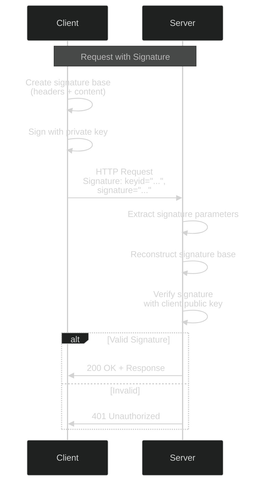
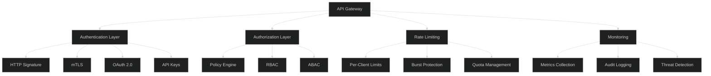

# HTTP Authentication - Advanced Level

## HTTP Signature Authentication

### HTTP Message Signatures (RFC 9421)



### Implementation

```javascript
const crypto = require('crypto');

class HTTPSignatureAuth {
  constructor(config) {
    this.config = config;
    this.keyStore = new Map();
  }
  
  async signRequest(request, keyId, privateKey) {
    // 1. Determine components to sign
    const components = [
      '@method',
      '@target-uri',
      '@authority',
      'content-digest',
      'content-type',
      'content-length'
    ];
    
    // 2. Create signature base
    const signatureBase = await this.createSignatureBase(request, components);
    
    // 3. Create signature input
    const signatureInput = this.createSignatureInput(components, {
      keyid: keyId,
      algorithm: 'rsa-pss-sha512',
      created: Math.floor(Date.now() / 1000),
      expires: Math.floor(Date.now() / 1000) + 300 // 5 minutes
    });
    
    // 4. Sign
    const signature = await this.sign(signatureBase, privateKey);
    
    // 5. Add headers to request
    request.headers['Signature-Input'] = signatureInput;
    request.headers['Signature'] = `sig1=:${signature}:`;
    
    // 6. Add content digest if body present
    if (request.body) {
      request.headers['Content-Digest'] = await this.createContentDigest(request.body);
    }
    
    return request;
  }
  
  async createSignatureBase(request, components) {
    const lines = [];
    
    for (const component of components) {
      if (component.startsWith('@')) {
        // Derived component
        const value = this.getDerivedComponent(component, request);
        lines.push(`"${component}": ${value}`);
      } else {
        // Header component
        const value = request.headers[component];
        if (value !== undefined) {
          lines.push(`"${component}": ${value}`);
        }
      }
    }
    
    // Add signature parameters
    lines.push(`"@signature-params": ${this.formatSignatureParams(components)}`);
    
    return lines.join('\n');
  }
  
  getDerivedComponent(component, request) {
    switch (component) {
      case '@method':
        return request.method.toUpperCase();
      case '@target-uri':
        return request.url;
      case '@authority':
        return new URL(request.url).host;
      case '@scheme':
        return new URL(request.url).protocol.replace(':', '');
      case '@request-target':
        const url = new URL(request.url);
        return `${url.pathname}${url.search}`;
      default:
        throw new Error(`Unknown derived component: ${component}`);
    }
  }
  
  createSignatureInput(components, params) {
    const componentList = components.map(c => `"${c}"`).join(' ');
    const paramList = Object.entries(params)
      .map(([key, value]) => `${key}="${value}"`)
      .join(';');
    
    return `sig1=(${componentList});${paramList}`;
  }
  
  async sign(data, privateKey) {
    const sign = crypto.createSign('RSA-SHA512');
    sign.update(data);
    sign.end();
    
    const signature = sign.sign({
      key: privateKey,
      padding: crypto.constants.RSA_PKCS1_PSS_PADDING,
      saltLength: crypto.constants.RSA_PSS_SALTLEN_DIGEST
    });
    
    return signature.toString('base64');
  }
  
  async createContentDigest(body) {
    const hash = crypto.createHash('sha512');
    hash.update(body);
    const digest = hash.digest('base64');
    
    return `sha-512=:${digest}:`;
  }
  
  async verifyRequest(request) {
    // 1. Extract signature components
    const signatureInput = request.headers['signature-input'];
    const signature = request.headers['signature'];
    
    if (!signatureInput || !signature) {
      throw new Error('Missing signature headers');
    }
    
    // 2. Parse signature input
    const parsed = this.parseSignatureInput(signatureInput);
    
    // 3. Get public key
    const publicKey = await this.getPublicKey(parsed.params.keyid);
    
    if (!publicKey) {
      throw new Error('Unknown key ID');
    }
    
    // 4. Check expiration
    if (parsed.params.expires) {
      const now = Math.floor(Date.now() / 1000);
      if (now > parsed.params.expires) {
        throw new Error('Signature expired');
      }
    }
    
    // 5. Verify content digest if present
    if (request.headers['content-digest'] && request.body) {
      const expectedDigest = await this.createContentDigest(request.body);
      if (request.headers['content-digest'] !== expectedDigest) {
        throw new Error('Content digest mismatch');
      }
    }
    
    // 6. Recreate signature base
    const signatureBase = await this.createSignatureBase(
      request,
      parsed.components
    );
    
    // 7. Verify signature
    const signatureValue = this.extractSignatureValue(signature);
    const valid = await this.verify(signatureBase, signatureValue, publicKey);
    
    if (!valid) {
      throw new Error('Signature verification failed');
    }
    
    return {
      verified: true,
      keyId: parsed.params.keyid,
      algorithm: parsed.params.algorithm
    };
  }
  
  parseSignatureInput(input) {
    // Parse: sig1=("@method" "@target-uri");keyid="key1";algorithm="rsa-pss-sha512"
    const match = input.match(/sig1=\(([^)]+)\);(.+)/);
    
    if (!match) {
      throw new Error('Invalid signature input format');
    }
    
    const components = match[1]
      .split(' ')
      .map(c => c.replace(/"/g, ''));
    
    const params = {};
    const paramPairs = match[2].split(';');
    
    for (const pair of paramPairs) {
      const [key, value] = pair.split('=');
      params[key.trim()] = value.replace(/"/g, '');
    }
    
    return { components, params };
  }
  
  extractSignatureValue(signature) {
    // Extract: sig1=:BASE64_SIGNATURE:
    const match = signature.match(/sig1=:([^:]+):/);
    return match ? match[1] : null;
  }
  
  async verify(data, signature, publicKey) {
    const verify = crypto.createVerify('RSA-SHA512');
    verify.update(data);
    verify.end();
    
    return verify.verify(
      {
        key: publicKey,
        padding: crypto.constants.RSA_PKCS1_PSS_PADDING,
        saltLength: crypto.constants.RSA_PSS_SALTLEN_DIGEST
      },
      Buffer.from(signature, 'base64')
    );
  }
  
  async getPublicKey(keyId) {
    // Retrieve public key from key store
    return this.keyStore.get(keyId);
  }
}
```

## Mutual Authentication (mTLS) over HTTP

### Advanced mTLS Configuration

```javascript
const https = require('https');
const fs = require('fs');

class MutualTLSHTTPServer {
  constructor(config) {
    this.config = config;
    this.trustedCAs = new Map();
  }
  
  createServer() {
    const options = {
      // Server certificate
      key: fs.readFileSync(this.config.serverKeyPath),
      cert: fs.readFileSync(this.config.serverCertPath),
      
      // CA certificates for client verification
      ca: this.loadTrustedCAs(),
      
      // Request client certificate
      requestCert: true,
      rejectUnauthorized: true,
      
      // TLS configuration
      minVersion: 'TLSv1.3',
      maxVersion: 'TLSv1.3',
      
      // Cipher suites (TLS 1.3)
      ciphers: [
        'TLS_AES_256_GCM_SHA384',
        'TLS_CHACHA20_POLY1305_SHA256',
        'TLS_AES_128_GCM_SHA256'
      ].join(':'),
      
      // Enable OCSP stapling
      enableTrace: false
    };
    
    const server = https.createServer(options, async (req, res) => {
      try {
        await this.handleRequest(req, res);
      } catch (error) {
        this.handleError(error, req, res);
      }
    });
    
    // Handle TLS connection
    server.on('secureConnection', (tlsSocket) => {
      this.handleSecureConnection(tlsSocket);
    });
    
    return server;
  }
  
  async handleRequest(req, res) {
    // Extract client certificate
    const clientCert = req.socket.getPeerCertificate();
    
    if (!req.client.authorized) {
      throw new Error(`Certificate validation failed: ${req.socket.authorizationError}`);
    }
    
    // Advanced certificate validation
    await this.validateClientCertificate(clientCert);
    
    // Extract client identity
    const clientIdentity = this.extractClientIdentity(clientCert);
    
    // Check authorization
    if (!await this.authorize(clientIdentity, req)) {
      res.writeHead(403, { 'Content-Type': 'application/json' });
      res.end(JSON.stringify({ error: 'Forbidden' }));
      return;
    }
    
    // Attach identity to request
    req.clientIdentity = clientIdentity;
    
    // Process request
    res.writeHead(200, { 'Content-Type': 'application/json' });
    res.end(JSON.stringify({
      message: 'Authenticated',
      client: clientIdentity
    }));
  }
  
  async validateClientCertificate(cert) {
    // 1. Check certificate validity period
    const now = new Date();
    const notBefore = new Date(cert.valid_from);
    const notAfter = new Date(cert.valid_to);
    
    if (now < notBefore || now > notAfter) {
      throw new Error('Certificate expired or not yet valid');
    }
    
    // 2. Check revocation status
    const revoked = await this.checkRevocation(cert);
    if (revoked) {
      throw new Error('Certificate has been revoked');
    }
    
    // 3. Validate certificate chain
    if (!this.validateCertificateChain(cert)) {
      throw new Error('Invalid certificate chain');
    }
    
    // 4. Check key usage
    if (!this.hasRequiredKeyUsage(cert)) {
      throw new Error('Certificate does not have required key usage');
    }
    
    return true;
  }
  
  extractClientIdentity(cert) {
    return {
      commonName: cert.subject.CN,
      organization: cert.subject.O,
      organizationalUnit: cert.subject.OU,
      serialNumber: cert.serialNumber,
      fingerprint: cert.fingerprint,
      issuer: cert.issuer.CN
    };
  }
  
  async authorize(clientIdentity, req) {
    // Implement authorization logic
    // Check ACLs, roles, permissions, etc.
    
    const acl = await this.getACL(clientIdentity.commonName);
    
    if (!acl) {
      return false;
    }
    
    // Check if client has access to requested resource
    return acl.permissions.includes(req.url);
  }
  
  async checkRevocation(cert) {
    // Check CRL or OCSP
    if (cert.ocspServer) {
      return await this.checkOCSP(cert);
    }
    
    if (cert.crlDistributionPoints) {
      return await this.checkCRL(cert);
    }
    
    return false; // No revocation info available
  }
  
  handleSecureConnection(tlsSocket) {
    // Log TLS connection details
    const cipher = tlsSocket.getCipher();
    const protocol = tlsSocket.getProtocol();
    
    console.log('Secure connection established:', {
      cipher: cipher.name,
      version: protocol,
      authorized: tlsSocket.authorized
    });
  }
}
```

## API Gateway Authentication

### Advanced Gateway Implementation



## Best Practices

### Security Hardening

✅ **Do:**
- Use TLS 1.3 exclusively
- Implement HTTP Signature for API authentication
- Use mutual TLS for high-security scenarios
- Implement comprehensive certificate validation
- Monitor for certificate expiration
- Use strong cipher suites
- Implement certificate pinning for critical services
- Log all authentication attempts
- Implement rate limiting
- Use modern authentication standards

❌ **Don't:**
- Use HTTP Basic auth without TLS
- Skip certificate revocation checks
- Use weak cipher suites
- Allow outdated TLS versions (< 1.2)
- Hardcode credentials
- Forget to rotate certificates
- Use self-signed certificates in production
- Skip signature verification
- Allow unlimited authentication attempts
- Use deprecated authentication schemes

## Next Steps

📚 **Related Advanced Topics:** Zero Trust API security, Service mesh authentication, API gateway patterns, Certificate transparency for APIs

---

**Related Topics:** mTLS, PKI, API Security, TLS/SSL, Cryptography, Zero Trust
