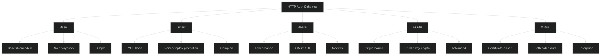
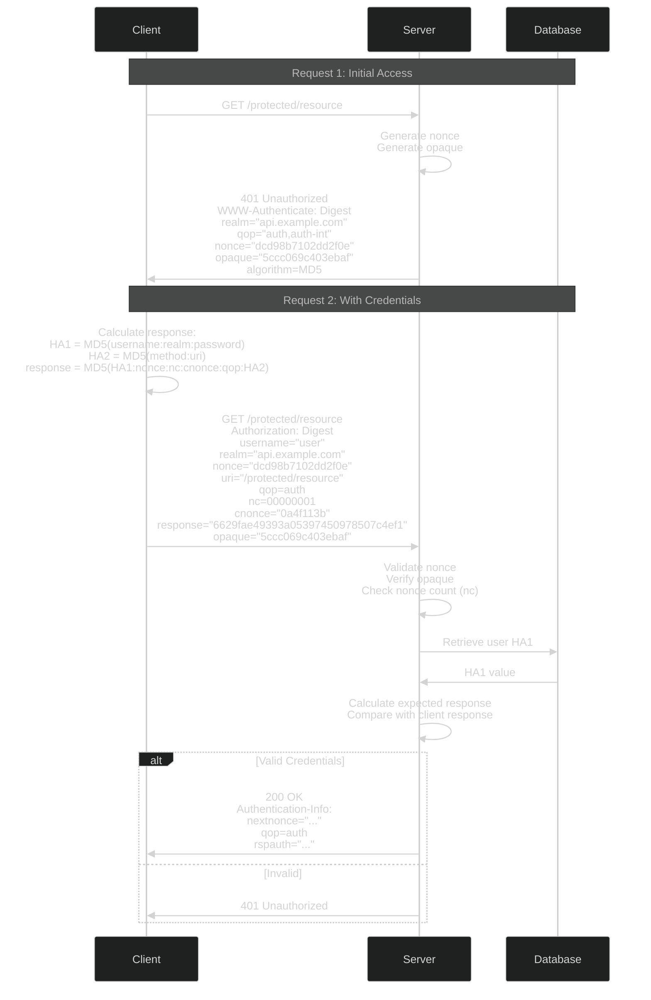
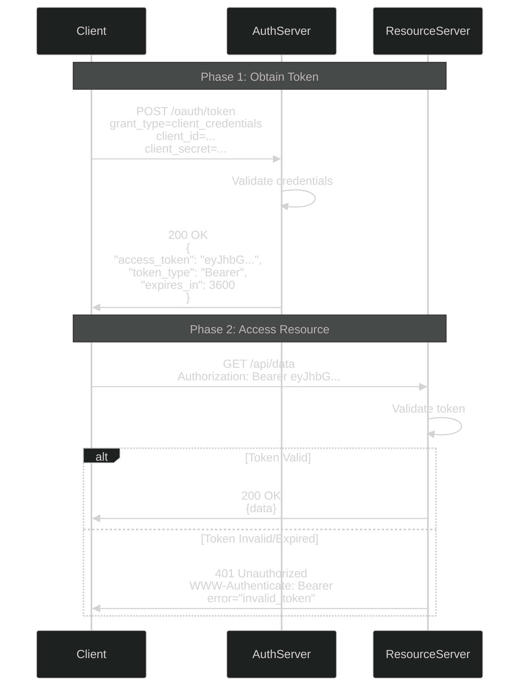
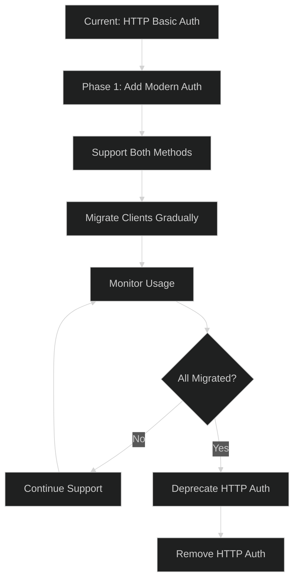

# HTTP Authentication - Intermediate Level

## HTTP Authentication Schemes Deep Dive

### Authentication Scheme Comparison



## HTTP Digest Authentication Deep Dive

### Complete Digest Flow



### Digest Authentication Implementation

```javascript
const crypto = require('crypto');

class DigestAuthServer {
  constructor() {
    this.nonces = new Map(); // In production, use Redis
    this.nonceTimeout = 300000; // 5 minutes
  }
  
  generateNonce() {
    const nonce = crypto.randomBytes(16).toString('hex');
    const timestamp = Date.now();
    
    this.nonces.set(nonce, {
      created: timestamp,
      count: 0
    });
    
    // Cleanup old nonces
    this.cleanupNonces();
    
    return nonce;
  }
  
  generateOpaque() {
    return crypto.randomBytes(16).toString('hex');
  }
  
  generateChallenge(realm) {
    return {
      realm: realm,
      qop: 'auth,auth-int',
      nonce: this.generateNonce(),
      opaque: this.generateOpaque(),
      algorithm: 'MD5',
      stale: false
    };
  }
  
  formatChallenge(challenge) {
    return `Digest realm="${challenge.realm}", ` +
           `qop="${challenge.qop}", ` +
           `nonce="${challenge.nonce}", ` +
           `opaque="${challenge.opaque}", ` +
           `algorithm=${challenge.algorithm}`;
  }
  
  parseAuthorizationHeader(authHeader) {
    if (!authHeader || !authHeader.startsWith('Digest ')) {
      return null;
    }
    
    const params = {};
    const regex = /(\w+)=(?:"([^"]+)"|([^\s,]+))/g;
    let match;
    
    while ((match = regex.exec(authHeader.substring(7))) !== null) {
      params[match[1]] = match[2] || match[3];
    }
    
    return params;
  }
  
  async validateDigestAuth(authParams, method, userRecord) {
    // 1. Validate nonce
    const nonceData = this.nonces.get(authParams.nonce);
    if (!nonceData) {
      return { valid: false, stale: true, reason: 'invalid_nonce' };
    }
    
    // Check nonce age
    if (Date.now() - nonceData.created > this.nonceTimeout) {
      this.nonces.delete(authParams.nonce);
      return { valid: false, stale: true, reason: 'stale_nonce' };
    }
    
    // 2. Verify nonce count (prevents replay)
    const nc = parseInt(authParams.nc, 16);
    if (nc <= nonceData.count) {
      return { valid: false, stale: false, reason: 'replay_attack' };
    }
    nonceData.count = nc;
    
    // 3. Calculate HA1 (username:realm:password)
    const ha1 = userRecord.ha1; // Pre-calculated and stored
    
    // Alternative if password is available:
    // const ha1 = crypto.createHash('md5')
    //   .update(`${authParams.username}:${authParams.realm}:${password}`)
    //   .digest('hex');
    
    // 4. Calculate HA2
    let ha2;
    if (authParams.qop === 'auth') {
      // HA2 = MD5(method:uri)
      ha2 = crypto.createHash('md5')
        .update(`${method}:${authParams.uri}`)
        .digest('hex');
    } else if (authParams.qop === 'auth-int') {
      // HA2 = MD5(method:uri:MD5(body))
      const bodyHash = crypto.createHash('md5')
        .update(authParams.body || '')
        .digest('hex');
      ha2 = crypto.createHash('md5')
        .update(`${method}:${authParams.uri}:${bodyHash}`)
        .digest('hex');
    } else {
      // No qop
      ha2 = crypto.createHash('md5')
        .update(`${method}:${authParams.uri}`)
        .digest('hex');
    }
    
    // 5. Calculate expected response
    let expectedResponse;
    if (authParams.qop) {
      // response = MD5(HA1:nonce:nc:cnonce:qop:HA2)
      expectedResponse = crypto.createHash('md5')
        .update(`${ha1}:${authParams.nonce}:${authParams.nc}:${authParams.cnonce}:${authParams.qop}:${ha2}`)
        .digest('hex');
    } else {
      // response = MD5(HA1:nonce:HA2)
      expectedResponse = crypto.createHash('md5')
        .update(`${ha1}:${authParams.nonce}:${ha2}`)
        .digest('hex');
    }
    
    // 6. Compare responses
    if (expectedResponse !== authParams.response) {
      return { valid: false, stale: false, reason: 'invalid_response' };
    }
    
    return { valid: true, nextnonce: this.generateNonce() };
  }
  
  cleanupNonces() {
    const now = Date.now();
    for (const [nonce, data] of this.nonces.entries()) {
      if (now - data.created > this.nonceTimeout) {
        this.nonces.delete(nonce);
      }
    }
  }
}

// Express middleware
function digestAuth(realm = 'Protected Area') {
  const digestServer = new DigestAuthServer();
  
  return async (req, res, next) => {
    const authHeader = req.headers.authorization;
    
    if (!authHeader) {
      // Send challenge
      const challenge = digestServer.generateChallenge(realm);
      res.setHeader('WWW-Authenticate', digestServer.formatChallenge(challenge));
      return res.status(401).json({ error: 'Authentication required' });
    }
    
    const authParams = digestServer.parseAuthorizationHeader(authHeader);
    
    if (!authParams) {
      return res.status(400).json({ error: 'Invalid authorization header' });
    }
    
    // Get user from database
    const user = await db.users.findOne({ username: authParams.username });
    
    if (!user) {
      // Send challenge with stale=false
      const challenge = digestServer.generateChallenge(realm);
      res.setHeader('WWW-Authenticate', digestServer.formatChallenge(challenge));
      return res.status(401).json({ error: 'Authentication failed' });
    }
    
    // Validate digest
    const validation = await digestServer.validateDigestAuth(
      authParams,
      req.method,
      user
    );
    
    if (!validation.valid) {
      const challenge = digestServer.generateChallenge(realm);
      if (validation.stale) {
        challenge.stale = true;
      }
      res.setHeader('WWW-Authenticate', digestServer.formatChallenge(challenge));
      return res.status(401).json({ error: 'Authentication failed' });
    }
    
    // Authentication successful
    req.user = user;
    
    // Send nextnonce for next request
    if (validation.nextnonce) {
      res.setHeader('Authentication-Info', `nextnonce="${validation.nextnonce}"`);
    }
    
    next();
  };
}
```

## HTTP Bearer Token Authentication

### Bearer Token Flow



### Bearer Token Validation

```javascript
class BearerTokenValidator {
  constructor(jwtSecret, redis) {
    this.jwtSecret = jwtSecret;
    this.redis = redis;
  }
  
  async validateToken(token) {
    try {
      // Check revocation list
      const revoked = await this.redis.get(`revoked:${token.substring(0, 16)}`);
      if (revoked) {
        return {
          valid: false,
          error: 'invalid_token',
          error_description: 'Token has been revoked'
        };
      }
      
      // Verify JWT
      const payload = jwt.verify(token, this.jwtSecret);
      
      // Additional checks
      if (payload.exp && payload.exp < Date.now() / 1000) {
        return {
          valid: false,
          error: 'invalid_token',
          error_description: 'Token has expired'
        };
      }
      
      return {
        valid: true,
        payload: payload
      };
      
    } catch (error) {
      return {
        valid: false,
        error: 'invalid_token',
        error_description: error.message
      };
    }
  }
  
  formatWWWAuthenticate(error) {
    let header = 'Bearer';
    
    if (error) {
      header += ` error="${error.error}"`;
      if (error.error_description) {
        header += `, error_description="${error.error_description}"`;
      }
    }
    
    return header;
  }
}

// Express middleware
function bearerAuth() {
  const validator = new BearerTokenValidator(process.env.JWT_SECRET, redisClient);
  
  return async (req, res, next) => {
    const authHeader = req.headers.authorization;
    
    if (!authHeader || !authHeader.startsWith('Bearer ')) {
      res.setHeader('WWW-Authenticate', 'Bearer');
      return res.status(401).json({
        error: 'missing_token',
        message: 'Bearer token required'
      });
    }
    
    const token = authHeader.substring(7);
    const validation = await validator.validateToken(token);
    
    if (!validation.valid) {
      res.setHeader('WWW-Authenticate', validator.formatWWWAuthenticate(validation));
      return res.status(401).json({
        error: validation.error,
        message: validation.error_description
      });
    }
    
    req.token = validation.payload;
    next();
  };
}
```

## Security Improvements

### Adding Security Headers

```javascript
class SecureHTTPAuth {
  static addSecurityHeaders(res) {
    // Prevent credentials from being cached
    res.setHeader('Cache-Control', 'no-store, no-cache, must-revalidate, private');
    res.setHeader('Pragma', 'no-cache');
    res.setHeader('Expires', '0');
    
    // HSTS - Force HTTPS
    res.setHeader('Strict-Transport-Security', 'max-age=31536000; includeSubDomains');
    
    // Prevent MIME sniffing
    res.setHeader('X-Content-Type-Options', 'nosniff');
    
    // XSS Protection
    res.setHeader('X-XSS-Protection', '1; mode=block');
    
    // Frame options
    res.setHeader('X-Frame-Options', 'DENY');
  }
  
  static rateLimitAuth(req, identifier) {
    // Implement rate limiting on authentication attempts
    const key = `auth_attempt:${identifier}`;
    const attempts = cache.get(key) || 0;
    
    if (attempts > 5) {
      return {
        allowed: false,
        retryAfter: 300 // 5 minutes
      };
    }
    
    cache.set(key, attempts + 1, 300);
    
    return { allowed: true };
  }
  
  static async logAuthAttempt(req, success, username) {
    await db.authLogs.create({
      timestamp: new Date(),
      ip: req.ip,
      userAgent: req.headers['user-agent'],
      username: username,
      success: success,
      method: 'http_auth'
    });
  }
}
```

### Enhanced Error Responses

```javascript
class HTTPAuthErrorHandler {
  static handle401(res, scheme = 'Bearer', error = null) {
    SecureHTTPAuth.addSecurityHeaders(res);
    
    let wwwAuth = scheme;
    
    if (error) {
      if (scheme === 'Bearer' && error.code) {
        wwwAuth += ` error="${error.code}"`;
        if (error.description) {
          wwwAuth += `, error_description="${error.description}"`;
        }
        if (error.uri) {
          wwwAuth += `, error_uri="${error.uri}"`;
        }
      } else if (scheme === 'Digest' && error.stale) {
        wwwAuth += ' stale=true';
      }
    }
    
    res.setHeader('WWW-Authenticate', wwwAuth);
    
    return res.status(401).json({
      error: 'unauthorized',
      message: 'Authentication required',
      details: error
    });
  }
  
  static handle403(res, reason = 'insufficient_scope') {
    SecureHTTPAuth.addSecurityHeaders(res);
    
    return res.status(403).json({
      error: 'forbidden',
      error_description: reason,
      message: 'Access denied'
    });
  }
}
```

## Migration Strategy

### Migrating Away from HTTP Auth



### Dual Authentication Support

```javascript
// Support both HTTP Basic and Bearer tokens during migration
function dualAuth() {
  return async (req, res, next) => {
    const authHeader = req.headers.authorization;
    
    if (!authHeader) {
      return res.status(401).json({
        error: 'authentication_required',
        message: 'Use Bearer token (recommended) or Basic auth (deprecated)'
      });
    }
    
    if (authHeader.startsWith('Bearer ')) {
      // Modern: Bearer token
      return bearerAuth()(req, res, next);
    } else if (authHeader.startsWith('Basic ')) {
      // Legacy: HTTP Basic (log warning)
      console.warn(`HTTP Basic auth used by ${req.ip} - Deprecated`);
      
      // Add deprecation header
      res.setHeader('Warning', '299 - "HTTP Basic auth is deprecated. Please migrate to Bearer tokens."');
      
      return basicAuth()(req, res, next);
    } else {
      return res.status(401).json({
        error: 'invalid_auth_scheme',
        message: 'Unsupported authentication scheme'
      });
    }
  };
}
```

## Best Practices

### Security Checklist

✅ **Do:**
- Always use HTTPS with HTTP authentication
- Implement rate limiting on auth endpoints
- Use Digest auth over Basic when possible
- Prefer Bearer tokens (OAuth 2.0) for new systems
- Add security headers to all responses
- Log all authentication attempts
- Implement proper error handling
- Use strong nonce generation for Digest

❌ **Don't:**
- Use HTTP Basic without HTTPS
- Store passwords in plain text
- Implement custom auth schemes
- Allow unlimited authentication attempts
- Expose sensitive information in error messages
- Use HTTP auth for user-facing applications
- Forget to validate nonces in Digest auth
- Cache authentication credentials

## Next Steps

📕 **Advanced Level:** Custom authentication schemes, HTTP Signature authentication, Mutual TLS over HTTP, OAuth 2.0 implementation details

---

**Related Topics:** OAuth 2.0, TLS/SSL, API Security, Token-Based Authentication, Rate Limiting
