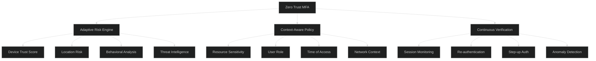
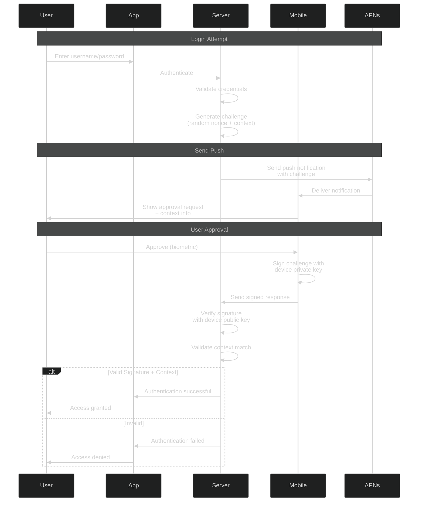

# Multi-Factor Authentication - Advanced Level

## Advanced MFA Architecture

### Zero Trust MFA Framework



### Policy-Based MFA Engine

```javascript
class AdvancedMFAPolicyEngine {
  constructor(riskEngine, contextProvider) {
    this.riskEngine = riskEngine;
    this.contextProvider = contextProvider;
    this.policies = new Map();
  }
  
  async registerPolicy(policy) {
    this.validatePolicy(policy);
    this.policies.set(policy.id, policy);
  }
  
  validatePolicy(policy) {
    const required = ['id', 'name', 'conditions', 'requirements'];
    for (const field of required) {
      if (!policy[field]) {
        throw new Error(`Policy missing required field: ${field}`);
      }
    }
  }
  
  async evaluateAccess(user, resource, context) {
    // Gather comprehensive context
    const enrichedContext = await this.enrichContext(user, resource, context);
    
    // Calculate risk score
    const riskScore = await this.riskEngine.calculateRisk(enrichedContext);
    
    // Find applicable policies
    const applicablePolicies = this.findApplicablePolicies(
      user,
      resource,
      enrichedContext
    );
    
    // Evaluate each policy
    const evaluations = await Promise.all(
      applicablePolicies.map(policy => 
        this.evaluatePolicy(policy, user, resource, enrichedContext, riskScore)
      )
    );
    
    // Merge requirements (take strictest)
    const mergedRequirements = this.mergeRequirements(evaluations);
    
    return {
      allowed: evaluations.every(e => e.satisfied),
      riskScore: riskScore,
      requirements: mergedRequirements,
      evaluations: evaluations,
      context: enrichedContext
    };
  }
  
  async enrichContext(user, resource, context) {
    return {
      ...context,
      user: {
        id: user.id,
        roles: user.roles,
        groups: user.groups,
        mfaEnrolled: await this.getMFAEnrollment(user.id),
        trustScore: await this.getUserTrustScore(user.id),
        lastSuccessfulAuth: user.lastSuccessfulAuth
      },
      resource: {
        path: resource.path,
        sensitivity: resource.sensitivity,
        dataClassification: resource.dataClassification,
        complianceRequirements: resource.complianceRequirements
      },
      device: await this.contextProvider.getDeviceContext(context.deviceId),
      location: await this.contextProvider.getLocationContext(context.ipAddress),
      network: await this.contextProvider.getNetworkContext(context.ipAddress),
      time: {
        timestamp: Date.now(),
        dayOfWeek: new Date().getDay(),
        hour: new Date().getHours(),
        isBusinessHours: this.isBusinessHours(new Date())
      }
    };
  }
  
  findApplicablePolicies(user, resource, context) {
    const applicable = [];
    
    for (const policy of this.policies.values()) {
      if (this.policyApplies(policy, user, resource, context)) {
        applicable.push(policy);
      }
    }
    
    // Sort by priority (higher priority first)
    return applicable.sort((a, b) => (b.priority || 0) - (a.priority || 0));
  }
  
  policyApplies(policy, user, resource, context) {
    for (const condition of policy.conditions) {
      if (!this.evaluateCondition(condition, user, resource, context)) {
        return false;
      }
    }
    return true;
  }
  
  evaluateCondition(condition, user, resource, context) {
    const { field, operator, value } = condition;
    const actualValue = this.getFieldValue(field, user, resource, context);
    
    switch (operator) {
      case 'equals':
        return actualValue === value;
      case 'contains':
        return Array.isArray(actualValue) && actualValue.includes(value);
      case 'matches':
        return new RegExp(value).test(actualValue);
      case 'greaterThan':
        return actualValue > value;
      case 'lessThan':
        return actualValue < value;
      case 'in':
        return Array.isArray(value) && value.includes(actualValue);
      default:
        throw new Error(`Unknown operator: ${operator}`);
    }
  }
  
  getFieldValue(field, user, resource, context) {
    const parts = field.split('.');
    let value = { user, resource, context };
    
    for (const part of parts) {
      value = value?.[part];
    }
    
    return value;
  }
  
  async evaluatePolicy(policy, user, resource, context, riskScore) {
    const requirements = policy.requirements;
    const satisfied = await this.checkRequirements(
      requirements,
      user,
      context,
      riskScore
    );
    
    return {
      policyId: policy.id,
      policyName: policy.name,
      satisfied: satisfied,
      requirements: requirements,
      riskBasedAdjustment: this.applyRiskAdjustment(requirements, riskScore)
    };
  }
  
  async checkRequirements(requirements, user, context, riskScore) {
    const { minFactors, allowedFactors, forbiddenFactors } = requirements;
    
    // Check if user has enrolled required factors
    const enrolledFactors = await this.getEnrolledFactors(user.id);
    
    // Filter to allowed factors
    const availableFactors = enrolledFactors.filter(f => 
      allowedFactors.includes(f.type) && !forbiddenFactors?.includes(f.type)
    );
    
    // Check minimum factors
    return availableFactors.length >= minFactors;
  }
  
  applyRiskAdjustment(requirements, riskScore) {
    // Increase MFA requirements based on risk
    let adjusted = { ...requirements };
    
    if (riskScore > 70) {
      adjusted.minFactors = Math.max(adjusted.minFactors, 3);
      adjusted.requireHardwareToken = true;
    } else if (riskScore > 50) {
      adjusted.minFactors = Math.max(adjusted.minFactors, 2);
    }
    
    return adjusted;
  }
  
  mergeRequirements(evaluations) {
    // Take the strictest requirements from all policies
    let merged = {
      minFactors: 1,
      allowedFactors: [],
      forbiddenFactors: [],
      requireHardwareToken: false,
      requireBiometric: false
    };
    
    for (const eval of evaluations) {
      const req = eval.riskBasedAdjustment || eval.requirements;
      
      merged.minFactors = Math.max(merged.minFactors, req.minFactors);
      merged.requireHardwareToken = merged.requireHardwareToken || req.requireHardwareToken;
      merged.requireBiometric = merged.requireBiometric || req.requireBiometric;
      
      // Intersection of allowed factors
      if (req.allowedFactors) {
        if (merged.allowedFactors.length === 0) {
          merged.allowedFactors = [...req.allowedFactors];
        } else {
          merged.allowedFactors = merged.allowedFactors.filter(f => 
            req.allowedFactors.includes(f)
          );
        }
      }
      
      // Union of forbidden factors
      if (req.forbiddenFactors) {
        merged.forbiddenFactors = [
          ...new Set([...merged.forbiddenFactors, ...req.forbiddenFactors])
        ];
      }
    }
    
    return merged;
  }
  
  async getMFAEnrollment(userId) {
    return await db.mfaEnrollments.find({ userId, active: true });
  }
  
  async getEnrolledFactors(userId) {
    return await db.mfaFactors.find({ userId, verified: true });
  }
  
  async getUserTrustScore(userId) {
    // Calculate based on history, behavior, compliance
    const history = await db.authHistory.find({ userId })
      .sort({ timestamp: -1 })
      .limit(100);
    
    let score = 50; // Base score
    
    // Positive factors
    const successRate = history.filter(h => h.success).length / history.length;
    score += successRate * 30;
    
    // Negative factors
    const recentFailures = history.slice(0, 10).filter(h => !h.success).length;
    score -= recentFailures * 5;
    
    return Math.max(0, Math.min(100, score));
  }
  
  isBusinessHours(date) {
    const hour = date.getHours();
    const day = date.getDay();
    return day >= 1 && day <= 5 && hour >= 9 && hour <= 17;
  }
}
```

### Example Policy Definitions

```javascript
// Policy 1: High-value transactions
const highValueTransactionPolicy = {
  id: 'pol_high_value_txn',
  name: 'High Value Transaction Policy',
  priority: 100,
  conditions: [
    {
      field: 'resource.path',
      operator: 'matches',
      value: '^/api/transactions/.*'
    },
    {
      field: 'context.transactionAmount',
      operator: 'greaterThan',
      value: 10000
    }
  ],
  requirements: {
    minFactors: 2,
    allowedFactors: ['totp', 'hardware_key', 'biometric'],
    forbiddenFactors: ['sms'],
    requireHardwareToken: true,
    maxSessionDuration: 300 // 5 minutes
  }
};

// Policy 2: Admin access
const adminAccessPolicy = {
  id: 'pol_admin_access',
  name: 'Administrative Access Policy',
  priority: 90,
  conditions: [
    {
      field: 'user.roles',
      operator: 'contains',
      value: 'admin'
    }
  ],
  requirements: {
    minFactors: 2,
    allowedFactors: ['totp', 'hardware_key', 'push'],
    requireHardwareToken: false,
    requireReauth: true,
    reauthInterval: 3600 // 1 hour
  }
};

// Policy 3: Sensitive data access
const sensitiveDataPolicy = {
  id: 'pol_sensitive_data',
  name: 'Sensitive Data Access Policy',
  priority: 85,
  conditions: [
    {
      field: 'resource.dataClassification',
      operator: 'in',
      value: ['confidential', 'restricted']
    }
  ],
  requirements: {
    minFactors: 2,
    allowedFactors: ['totp', 'hardware_key', 'biometric', 'push'],
    requireBiometric: true
  }
};

// Policy 4: High risk context
const highRiskContextPolicy = {
  id: 'pol_high_risk',
  name: 'High Risk Context Policy',
  priority: 95,
  conditions: [
    {
      field: 'context.device.trustScore',
      operator: 'lessThan',
      value: 50
    }
  ],
  requirements: {
    minFactors: 3,
    allowedFactors: ['totp', 'hardware_key', 'biometric'],
    forbiddenFactors: ['sms', 'email'],
    requireHardwareToken: true
  }
};

// Register policies
const policyEngine = new AdvancedMFAPolicyEngine(riskEngine, contextProvider);
await policyEngine.registerPolicy(highValueTransactionPolicy);
await policyEngine.registerPolicy(adminAccessPolicy);
await policyEngine.registerPolicy(sensitiveDataPolicy);
await policyEngine.registerPolicy(highRiskContextPolicy);
```

## Advanced TOTP Implementation

### Time-Window Flexibility and Drift Correction

```javascript
class AdvancedTOTPManager {
  constructor() {
    this.windowSize = 1; // Check 1 window before and after
    this.timeStep = 30; // 30 seconds
  }
  
  async validateTOTP(userId, token, allowDrift = true) {
    const secret = await this.getSecret(userId);
    const currentTime = Math.floor(Date.now() / 1000);
    
    // Try current window first
    if (this.verifyToken(secret, token, currentTime)) {
      return {
        valid: true,
        drift: 0,
        window: 0
      };
    }
    
    if (!allowDrift) {
      return { valid: false };
    }
    
    // Check previous and next windows
    for (let window = 1; window <= this.windowSize; window++) {
      // Check past
      if (this.verifyToken(secret, token, currentTime - (window * this.timeStep))) {
        await this.recordDrift(userId, -window);
        return {
          valid: true,
          drift: -window,
          window: -window
        };
      }
      
      // Check future
      if (this.verifyToken(secret, token, currentTime + (window * this.timeStep))) {
        await this.recordDrift(userId, window);
        return {
          valid: true,
          drift: window,
          window: window
        };
      }
    }
    
    return { valid: false };
  }
  
  verifyToken(secret, token, time) {
    const counter = Math.floor(time / this.timeStep);
    const expectedToken = this.generateTOTP(secret, counter);
    return this.constantTimeCompare(token, expectedToken);
  }
  
  generateTOTP(secret, counter) {
    const buffer = Buffer.alloc(8);
    buffer.writeBigUInt64BE(BigInt(counter));
    
    const hmac = crypto.createHmac('sha1', Buffer.from(secret, 'base32'));
    hmac.update(buffer);
    const hash = hmac.digest();
    
    const offset = hash[hash.length - 1] & 0xf;
    const binary = 
      ((hash[offset] & 0x7f) << 24) |
      ((hash[offset + 1] & 0xff) << 16) |
      ((hash[offset + 2] & 0xff) << 8) |
      (hash[offset + 3] & 0xff);
    
    const otp = binary % 1000000;
    return otp.toString().padStart(6, '0');
  }
  
  constantTimeCompare(a, b) {
    if (a.length !== b.length) return false;
    
    let result = 0;
    for (let i = 0; i < a.length; i++) {
      result |= a.charCodeAt(i) ^ b.charCodeAt(i);
    }
    
    return result === 0;
  }
  
  async recordDrift(userId, drift) {
    await db.totpDrift.create({
      userId,
      drift,
      timestamp: new Date()
    });
    
    // Analyze drift patterns
    const recentDrift = await db.totpDrift.find({ userId })
      .sort({ timestamp: -1 })
      .limit(10);
    
    const avgDrift = recentDrift.reduce((sum, d) => sum + d.drift, 0) / recentDrift.length;
    
    // If consistent drift, notify user
    if (Math.abs(avgDrift) > 0.5) {
      await this.notifyTimeDrift(userId, avgDrift);
    }
  }
  
  async notifyTimeDrift(userId, avgDrift) {
    await notifications.send(userId, {
      type: 'time_drift_detected',
      message: `Your device clock appears to be ${Math.abs(avgDrift) * 30} seconds ${avgDrift > 0 ? 'ahead' : 'behind'}`,
      action: 'Sync your device time with NTP server'
    });
  }
}
```

## Push Notification MFA with Challenge-Response

### Cryptographic Push Authentication



### Implementation

```javascript
class CryptographicPushMFA {
  constructor(pushService, deviceRegistry) {
    this.pushService = pushService;
    this.deviceRegistry = deviceRegistry;
  }
  
  async initiateAuth(userId, context) {
    // Generate cryptographic challenge
    const challenge = {
      nonce: crypto.randomBytes(32).toString('hex'),
      timestamp: Date.now(),
      context: {
        ipAddress: context.ipAddress,
        userAgent: context.userAgent,
        location: context.location,
        action: context.action
      },
      expiresAt: Date.now() + (2 * 60 * 1000) // 2 minutes
    };
    
    // Store challenge
    await redis.setex(
      `push_challenge:${userId}:${challenge.nonce}`,
      120,
      JSON.stringify(challenge)
    );
    
    // Get user's registered devices
    const devices = await this.deviceRegistry.getDevices(userId);
    
    if (devices.length === 0) {
      throw new Error('No devices registered for push MFA');
    }
    
    // Send push to all devices
    const promises = devices.map(device =>
      this.sendPushChallenge(device, challenge)
    );
    
    await Promise.all(promises);
    
    return {
      challengeId: challenge.nonce,
      sentTo: devices.length,
      expiresAt: challenge.expiresAt
    };
  }
  
  async sendPushChallenge(device, challenge) {
    const payload = {
      type: 'auth_request',
      challengeId: challenge.nonce,
      timestamp: challenge.timestamp,
      context: {
        location: challenge.context.location?.city,
        device: challenge.context.userAgent,
        action: challenge.context.action
      },
      expiresIn: 120
    };
    
    await this.pushService.send(device.pushToken, payload);
  }
  
  async respondToChallenge(userId, challengeId, response) {
    // Retrieve challenge
    const challengeData = await redis.get(`push_challenge:${userId}:${challengeId}`);
    
    if (!challengeData) {
      return {
        valid: false,
        reason: 'challenge_expired_or_not_found'
      };
    }
    
    const challenge = JSON.parse(challengeData);
    
    // Check expiration
    if (Date.now() > challenge.expiresAt) {
      await redis.del(`push_challenge:${userId}:${challengeId}`);
      return {
        valid: false,
        reason: 'challenge_expired'
      };
    }
    
    // Get device public key
    const device = await this.deviceRegistry.getDevice(response.deviceId);
    
    if (!device) {
      return {
        valid: false,
        reason: 'device_not_found'
      };
    }
    
    // Verify signature
    const signatureValid = await this.verifySignature(
      challenge,
      response.signature,
      device.publicKey
    );
    
    if (!signatureValid) {
      return {
        valid: false,
        reason: 'invalid_signature'
      };
    }
    
    // Verify action (approve/deny)
    if (response.action !== 'approve') {
      await redis.del(`push_challenge:${userId}:${challengeId}`);
      return {
        valid: false,
        reason: 'user_denied'
      };
    }
    
    // Check context fraud detection
    const fraudCheck = await this.checkFraudIndicators(challenge, response);
    
    if (!fraudCheck.safe) {
      return {
        valid: false,
        reason: 'fraud_detected',
        indicators: fraudCheck.indicators
      };
    }
    
    // Clean up challenge
    await redis.del(`push_challenge:${userId}:${challengeId}`);
    
    return {
      valid: true,
      deviceId: device.id,
      timestamp: response.timestamp
    };
  }
  
  async verifySignature(challenge, signature, publicKey) {
    // Create signature data
    const data = JSON.stringify({
      nonce: challenge.nonce,
      timestamp: challenge.timestamp,
      context: challenge.context
    });
    
    // Verify with device public key
    const verify = crypto.createVerify('SHA256');
    verify.update(data);
    verify.end();
    
    return verify.verify(publicKey, signature, 'base64');
  }
  
  async checkFraudIndicators(challenge, response) {
    const indicators = [];
    
    // Check response time (too fast = automated)
    const responseTime = response.timestamp - challenge.timestamp;
    if (responseTime < 1000) { // Less than 1 second
      indicators.push('response_too_fast');
    }
    
    // Check location match
    if (response.deviceLocation && challenge.context.location) {
      const distance = this.calculateDistance(
        response.deviceLocation,
        challenge.context.location
      );
      
      if (distance > 100) { // More than 100km apart
        indicators.push('location_mismatch');
      }
    }
    
    return {
      safe: indicators.length === 0,
      indicators
    };
  }
}
```

## Best Practices

### Security Hardening

✅ **Do:**
- Implement rate limiting per user and IP
- Use hardware-backed key storage when possible
- Enforce MFA for all administrative actions
- Implement account recovery with multiple factors
- Log all MFA events for audit
- Use constant-time comparison for tokens
- Implement anti-automation measures
- Support multiple backup factors

❌ **Don't:**
- Allow SMS as sole second factor for high-value operations
- Store MFA secrets in plain text
- Reuse TOTP codes (implement replay protection)
- Allow unlimited authentication attempts
- Send sensitive context in push notifications
- Forget to handle device loss scenarios
- Implement custom crypto (use established libraries)
- Skip user education about MFA security

## Next Steps

📚 **Related Advanced Topics:** FIDO2 attestation, biometric template protection, quantum-resistant MFA, decentralized identity, MFA for IoT devices

---

**Related Topics:** Zero Trust, Risk-Based Authentication, Hardware Security, Cryptography, Identity Governance
