# Multi-Factor Authentication (MFA) - Basic Level

## What is Multi-Factor Authentication?

**Multi-Factor Authentication (MFA)** is a security method that requires users to provide **two or more** verification factors to access an account or system. Instead of just a password, you need additional proof of identity.

### The Three Authentication Factors


### Why MFA is Important

- **Stops 99.9% of account hacks** (Microsoft research)
- **Protects even with stolen passwords** - hackers need the second factor
- **Required by many regulations** - banking, healthcare, government
- **Peace of mind** - you're notified of suspicious login attempts

## How MFA Works

### Simple 2-Factor Authentication Flow

```mermaid
%%{init: {\'theme\':\'dark\'}}%%
sequenceDiagram
    participant User
    participant Website
    participant Phone
    
    User->>Website: 1. Enter username & password
    Website->>Website: Verify password ✓
    Website->>Phone: 2. Send verification code
    Phone->>User: Display code: 123456
    User->>Website: 3. Enter code: 123456
    Website->>Website: Verify code ✓
    Website->>User: 4. Access granted! 🎉
```



## Types of Multi-Factor Authentication

### 1. SMS-Based MFA (Text Message)

**How it works:** After entering your password, you receive a text message with a code.

**Example:**
```
Your bank sends:
"Your verification code is 847291. 
Valid for 5 minutes."
```

**Pros:**
- ✅ Easy to use
- ✅ Works on any phone
- ✅ No app needed

**Cons:**
- ❌ Requires cell signal
- ❌ Can be intercepted (SIM swapping)
- ❌ Costs for SMS delivery

### 2. Authenticator Apps

**How it works:** An app on your phone generates time-based codes that change every 30 seconds.

**Popular Apps:**
- Google Authenticator
- Microsoft Authenticator
- Authy
- 1Password

**Example Code Display:**
```
Amazon Web Services
847 291
Valid for: ⏱️ 23 seconds
```

**Pros:**
- ✅ Works offline
- ✅ More secure than SMS
- ✅ Free

**Cons:**
- ❌ Need to install app
- ❌ Lost phone = locked out (unless backup)

### 3. Push Notifications

**How it works:** App sends a notification to your phone asking "Is this you trying to log in?"

```mermaid
%%{init: {\'theme\':\'dark\'}}%%
flowchart LR
    A[Login Attempt] --> B[Push to Phone]
    B --> C{Approve?}
    C -->|Yes ✓| D[Access Granted]
    C -->|No ✗| E[Access Denied]
```



**Example:**
```
🔔 Microsoft Authenticator
Login attempt from Chrome on Windows
Location: New York, USA
Time: 2:30 PM

[Approve] [Deny]
```

**Pros:**
- ✅ Very convenient (one tap)
- ✅ Shows location and device info
- ✅ No code to type

**Cons:**
- ❌ Requires internet connection
- ❌ Risk of approval fatigue

### 4. Hardware Security Keys

**How it works:** Physical device (USB or NFC) that you plug in or tap to verify.

**Example Devices:**
- YubiKey
- Google Titan
- Feitian

**Pros:**
- ✅ Highest security
- ✅ Phishing-resistant
- ✅ Long-lasting

**Cons:**
- ❌ Costs $20-50
- ❌ Can be lost
- ❌ Need to carry with you

### 5. Email-Based MFA

**How it works:** Verification code sent to your email address.

**Example:**
```
Subject: Your login code
Body: Enter code 598432 to complete sign-in.
```

**Pros:**
- ✅ No phone needed
- ✅ Works everywhere

**Cons:**
- ❌ Less secure (email can be hacked)
- ❌ Slower than other methods

## Real-World Examples

### Example 1: Banking - Chase Bank


### Example 2: Google Account

**Scenario:** You're logging into Gmail from a new computer.

1. Enter email address → click "Next"
2. Enter password → click "Next"
3. Google sends notification to your phone
4. Check phone → see login details
5. Tap "Yes, it's me"
6. Logged in! ✓

### Example 3: Work VPN Access

```
Employee connects to company VPN:
1. Enter employee ID: E12345
2. Enter password: ••••••••
3. Open Microsoft Authenticator app
4. Enter 6-digit code: 729384
5. Connected to secure network
```

## MFA Across Industries

| Industry | Primary MFA Method | Why? |
|----------|-------------------|------|
| 🏦 Banking | SMS + Authenticator App | Regulatory requirements (PCI-DSS) |
| 🏥 Healthcare | Hardware Keys + Biometric | HIPAA compliance, patient data protection |
| 🛒 E-commerce | SMS + Email | Balance security and user convenience |
| 💼 Corporate | Authenticator App + Push | Protect company resources |
| 🎓 Education | Email + SMS | Easy for students to use |
| ☁️ Cloud Services | All methods supported | User choice for flexibility |

## Setting Up MFA - Simple Steps

### For Users

1. **Go to Account Settings** → Look for "Security" or "2-Factor Authentication"
2. **Choose MFA Method** → Select SMS, app, or hardware key
3. **Follow Setup Wizard** → Scan QR code or enter phone number
4. **Save Backup Codes** → Store safely for emergency access
5. **Test It** → Log out and log back in to verify

### Backup Codes Example

```
Emergency Backup Codes - Save These!
1. 8472-9384-7563
2. 2938-4756-8392
3. 7563-9284-1836
4. 4756-2847-9365
5. 9284-5738-2947

Use these if you lose your phone.
Each code works only once.
```

## Common MFA Scenarios

### Scenario 1: Lost Phone


### Scenario 2: New Device Setup

When you get a new phone, you need to:
1. Transfer authenticator apps
2. Re-scan QR codes
3. Update phone number if using SMS
4. Test MFA on all important accounts

## MFA Best Practices for Users

### ✅ Do's

- Enable MFA on all important accounts (email, banking, social media)
- Use authenticator apps instead of SMS when possible
- Save backup codes in a safe place
- Set up multiple MFA methods (SMS + app)
- Keep backup phone number updated

### ❌ Don'ts

- Don't ignore MFA prompts (could be an attack)
- Don't share codes with anyone
- Don't approve push notifications without checking details
- Don't disable MFA for convenience
- Don't use the same phone number for MFA and account recovery

## Understanding MFA Prompts

### Safe vs Suspicious

```mermaid
%%{init: {\'theme\':\'dark\'}}%%
graph TD
    A[MFA Prompt] --> B{Check Details}
    B --> C[Your Location?]
    B --> D[Your Device?]
    B --> E[Your Time?]
    
    C --> F{Match?}
    D --> F
    E --> F
    
    F -->|All Yes| G[SAFE - Approve ✓]
    F -->|Any No| H[SUSPICIOUS - Deny ✗]
    
    H --> I[Change Password Immediately]
```



**Red Flags:**
- 🚩 Location you've never been
- 🚩 Device you don't recognize
- 🚩 Time you weren't trying to log in
- 🚩 Multiple rapid requests

## Benefits of Using MFA

### Security Benefits

1. **Prevents Account Takeover** - Even with your password, hackers can't get in
2. **Stops Phishing** - Stolen password alone isn't enough
3. **Alerts You to Attacks** - You know someone tried to access your account
4. **Protects Sensitive Data** - Extra layer for important information

### User Benefits

1. **Peace of Mind** - Sleep better knowing accounts are secure
2. **Quick Recovery** - Easier to recover from password leak
3. **Trust** - Know that services take security seriously
4. **Control** - You decide when and where to approve access

## MFA Comparison Chart

```mermaid
%%{init: {\'theme\':\'dark\'}}%%
graph LR
    A[MFA Methods] --> B{Security Level}
    
    B --> C[⭐ Basic]
    B --> D[⭐⭐ Good]
    B --> E[⭐⭐⭐ Excellent]
    
    C --> C1[Email Codes]
    C --> C2[SMS Codes]
    
    D --> D1[Authenticator Apps]
    D --> D2[Push Notifications]
    
    E --> E1[Hardware Keys]
    E --> E2[Biometric + Hardware]```

## Key Takeaways

1. **MFA = Something You Know + Something You Have/Are**
2. **Use authenticator apps** for better security than SMS
3. **Always save backup codes** in case you lose access
4. **Enable MFA everywhere** - especially email and banking
5. **Stay alert** - check MFA prompts before approving
6. **Hardware keys are best** for highest security needs

## Next Steps

Want to learn more?

- 📗 **Intermediate Level:** Explore how MFA works in different industries and implementation patterns
- 📕 **Advanced Level:** Deep dive into TOTP algorithms, security protocols, and advanced threat prevention

## Common Questions

**Q: Is MFA annoying?**
A: Slightly more steps, but modern methods (push notifications) are very quick. Worth it for security!

**Q: Can hackers bypass MFA?**
A: Very difficult. While not 100% impossible, MFA blocks 99.9% of automated attacks.

**Q: What if I lose my phone?**
A: Use backup codes, backup phone number, or contact support with ID verification.

**Q: Do I need MFA for everything?**
A: Prioritize: banking, email, social media, work accounts. Then add to other accounts.

---

**Related Topics:** Password Security, Biometric Authentication, Hardware Security Keys, Passwordless Authentication
