# Multi-Factor Authentication (MFA) - Intermediate Level

## Understanding MFA Implementation

Multi-factor authentication requires users to provide multiple independent credentials from different categories. This intermediate guide explores implementation patterns, algorithms, and industry-specific workflows.

## MFA Factor Categories Deep Dive

### Factor Types and Verification Methods


## TOTP (Time-Based One-Time Password) Algorithm

### How TOTP Works

```mermaid
%%{init: {\'theme\':\'dark\'}}%%
sequenceDiagram
    participant User
    participant App as Authenticator App
    participant Server
    participant Clock
    
    Note over User,Server: Initial Setup Phase
    Server->>Server: Generate secret key
    Server->>User: Display QR code with secret
    User->>App: Scan QR code
    App->>App: Store secret key
    
    Note over User,Server: Authentication Phase
    Clock->>App: Current Unix timestamp
    App->>App: Calculate: HMAC-SHA1(secret, timestamp/30)
    App->>App: Extract 6-digit code from hash
    App->>User: Display code (valid 30 seconds)
    
    User->>Server: Enter 6-digit code
    Clock->>Server: Current Unix timestamp
    Server->>Server: Calculate expected codes<br/>(current + previous + next window)
    Server->>Server: Compare submitted vs expected
    
    alt Code matches
        Server->>User: Access granted ✓
    else No match
        Server->>Server: Log failed attempt
        Server->>User: Invalid code ✗
    end
```



### TOTP Implementation Details

**Algorithm:** RFC 6238 (TOTP) based on RFC 4226 (HOTP)

```javascript
// Simplified TOTP calculation
function generateTOTP(secret, timeStep = 30) {
    const epoch = Math.floor(Date.now() / 1000);
    const counter = Math.floor(epoch / timeStep);
    
    // HMAC-SHA1(secret, counter)
    const hash = hmacSHA1(secret, counter);
    
    // Dynamic truncation
    const offset = hash[19] & 0x0f;
    const truncated = ((hash[offset] & 0x7f) << 24) |
                     ((hash[offset + 1] & 0xff) << 16) |
                     ((hash[offset + 2] & 0xff) << 8) |
                     (hash[offset + 3] & 0xff);
    
    // Generate 6-digit code
    const code = truncated % 1000000;
    return code.toString().padStart(6, '0');
}
```

**Key Parameters:**
- **Time Step:** 30 seconds (standard)
- **Code Length:** 6 digits (can be 8 for higher security)
- **Hash Algorithm:** HMAC-SHA1 (SHA256/SHA512 also supported)
- **Clock Drift Tolerance:** ±1 time step (30 seconds)

## SMS-Based MFA Implementation

### SMS OTP Flow


### SMS Security Considerations

**Vulnerabilities:**
- **SIM Swapping:** Attacker convinces carrier to transfer number
- **SS7 Attacks:** Exploit telecom protocol vulnerabilities
- **Interception:** SMS can be intercepted over the air
- **Phishing:** Users tricked into revealing codes

**Best Practices:**


## Push Notification MFA

### Push-Based Authentication Flow


### Push Notification Payload

```json
{
  "notification": {
    "title": "Login Request",
    "body": "Approve login to YourApp?",
    "click_action": "AUTH_APPROVE"
  },
  "data": {
    "request_id": "auth_req_1234567890",
    "timestamp": "2025-01-15T14:30:00Z",
    "device": "Chrome on Windows",
    "location": "San Francisco, CA",
    "ip_address": "203.0.113.45",
    "expires_at": "2025-01-15T14:32:00Z",
    "action_approve": "https://api.app.com/auth/approve",
    "action_deny": "https://api.app.com/auth/deny"
  }
}
```

## Hardware Token MFA

### FIDO U2F Registration and Authentication


## Industry-Specific MFA Implementations

### 🏦 Banking: Transaction-Based Step-Up Authentication


**Example: Chase Bank Implementation**

| Risk Level | Amount | MFA Required |
|------------|--------|--------------|
| Low | View only | None (already authenticated) |
| Medium | $0 - $500 | SMS OTP |
| High | $500 - $5,000 | SMS OTP + Security Question |
| Critical | > $5,000 | Hardware Token + SMS OTP |

### 🏥 Healthcare: Role-Based MFA


**HIPAA Compliance Requirements:**
- Unique user identification
- Automatic logoff after 15 minutes
- Audit logs for all access
- Encryption of authentication data
- Emergency access procedures

### 💼 Enterprise: Adaptive MFA with Context


## MFA Enrollment Strategies

### Progressive Enrollment Flow


### Multi-Method Registration


## MFA Backup and Recovery

### Account Recovery Options


### Backup Code Generation

```javascript
// Generate backup codes
function generateBackupCodes(count = 10) {
    const codes = [];
    const charset = '23456789ABCDEFGHJKLMNPQRSTUVWXYZ'; // Removed ambiguous chars
    
    for (let i = 0; i < count; i++) {
        let code = '';
        for (let j = 0; j < 8; j++) {
            code += charset[Math.floor(Math.random() * charset.length)];
            if (j === 3) code += '-'; // Format: XXXX-XXXX
        }
        codes.push({
            code: code,
            used: false,
            created: new Date()
        });
    }
    
    return codes;
}

// Example output:
// 2K7M-9PRT
// 4J3N-8VWX
// 6L5Q-2YB3
```

## MFA Performance Optimization

### Caching Strategy


**Cache Parameters:**

| Trust Level | Last MFA | Same Device | Same Location | Cache TTL |
|-------------|----------|-------------|---------------|-----------|
| High | < 4 hours | Yes | Yes | 24 hours |
| Medium | < 8 hours | Yes | Yes/No | 12 hours |
| Low | > 8 hours | Yes/No | Changed | 0 hours |
| None | Never | No | No | 0 hours |

## MFA Testing Strategy

### Test Coverage Matrix


### Test Scenarios


## MFA Metrics and Monitoring

### Key Performance Indicators


**Target Metrics:**

- **Enrollment Rate:** > 90% of users
- **First-Attempt Success:** > 95%
- **Average Auth Time:** < 10 seconds
- **Recovery Rate:** < 5% per month
- **Failed Attempts:** < 0.1% of total

## Common MFA Implementation Pitfalls

### Issues and Solutions


### Anti-Patterns to Avoid

❌ **Don't:**
- Force MFA immediately without education
- Use SMS as the only MFA option
- Make recovery process too difficult
- Ignore user feedback about friction
- Apply same MFA requirements for all actions

✅ **Do:**
- Provide multiple MFA options
- Implement progressive enrollment
- Offer convenient backup methods
- Monitor and optimize auth times
- Use adaptive/risk-based approaches

## Future MFA Trends


## Best Practices Summary

1. **Offer Multiple Methods** - SMS, authenticator apps, hardware keys, biometrics
2. **Implement Risk-Based** - Adapt requirements to context
3. **Provide Clear Recovery** - Multiple backup options
4. **Monitor and Optimize** - Track metrics and user feedback
5. **Educate Users** - Clear benefits and setup instructions
6. **Test Thoroughly** - All methods and scenarios
7. **Plan for Scale** - Consider infrastructure needs
8. **Stay Compliant** - Meet industry regulations

## Next Steps

📕 **Advanced Level:** Explore FIDO2 protocol deep dive, machine learning for risk scoring, enterprise-scale MFA architecture, and zero-trust implementations

---

**Standards Referenced:** RFC 6238 (TOTP), RFC 4226 (HOTP), FIDO U2F, FIDO2, NIST SP 800-63B
**Industry Examples:** Chase Bank, Epic Systems EHR, Microsoft Azure AD, Google Workspace
