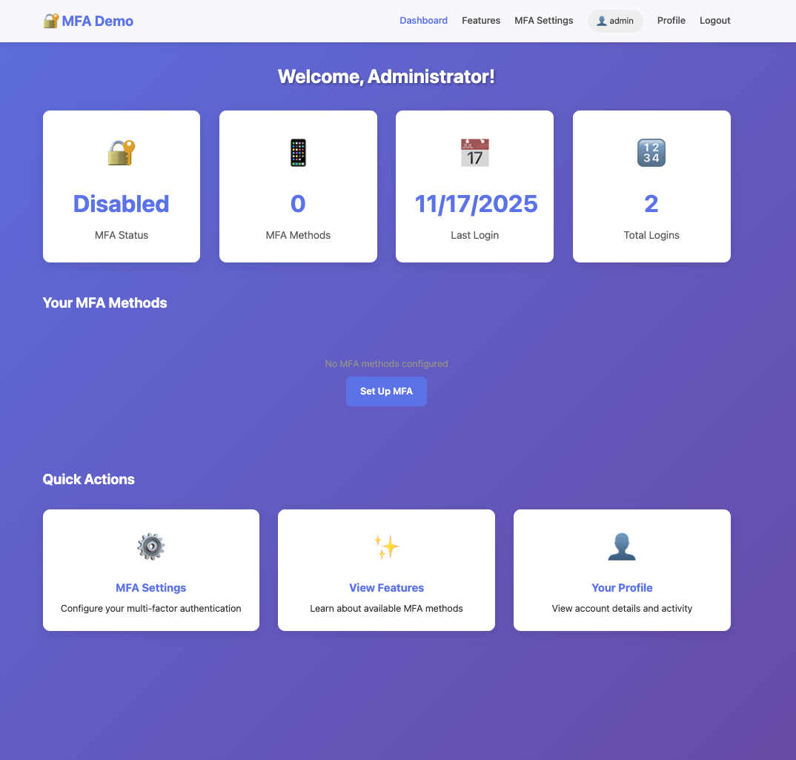

# 🔐 Multi-Factor Authentication (MFA) Demo

A comprehensive demonstration of all Multi-Factor Authentication methods with real implementations and in-memory database.




## 🌟 Features

### Supported MFA Methods

1. **📱 TOTP (Time-Based One-Time Password)**
   - Authenticator apps (Google Authenticator, Authy, Microsoft Authenticator)
   - QR code enrollment
   - 6-digit codes refreshing every 30 seconds
   - RFC 6238 compliant

2. **💬 SMS OTP**
   - SMS-based one-time passwords
   - 6-digit codes
   - 5-minute expiration
   - Rate limiting

3. **📧 Email OTP**
   - Email-based verification codes
   - 6-digit codes
   - 5-minute expiration
   - Resend functionality

4. **🔑 Backup Recovery Codes**
   - 10 one-time use codes
   - Emergency access when primary MFA unavailable
   - SHA-256 hashed storage
   - Regeneration support

## 🚀 Quick Start

### Prerequisites

- Node.js (v14 or higher)
- npm or yarn

### Installation

```bash
cd mfa-demo
npm install
npm start
```

**Access:** http://localhost:3007

### Default Credentials

**Admin User:**
- Username: `admin`
- Password: `admin123`

**Regular User:**
- Username: `user`
- Password: `user123`

## 📋 Usage Guide

### 1. Initial Login (Without MFA)

1. Visit http://localhost:3007
2. Click "Login"
3. Enter: `admin` / `admin123`
4. You'll be logged in (MFA not yet enabled)

### 2. Enable TOTP (Authenticator App)

1. Go to Dashboard → "MFA Settings"
2. Click "Enable Authenticator App"
3. Scan QR code with your authenticator app:
   - Google Authenticator
   - Microsoft Authenticator
   - Authy
   - 1Password
4. Enter the 6-digit code from your app
5. TOTP is now enabled!

### 3. Test TOTP Login

1. Logout
2. Login with username/password
3. Enter 6-digit code from authenticator app
4. Access granted!

### 4. Enable SMS OTP

1. Go to MFA Settings
2. Click "Enable SMS OTP"
3. Verify your phone number
4. SMS OTP is enabled as backup method

**Note:** SMS codes will be printed to console in demo mode

### 5. Enable Email OTP

1. Go to MFA Settings
2. Click "Enable Email OTP"
3. Verify with code sent to your email
4. Email OTP enabled

**Note:** Email codes will be printed to console in demo mode

### 6. Generate Backup Codes

1. Go to MFA Settings
2. Click "Generate Backup Codes"
3. **IMPORTANT:** Save these codes securely!
4. Each code can only be used once
5. Use them if you lose your phone/authenticator

## 🏗️ Project Structure

```
mfa-demo/
├── server.js                      # Express server
├── package.json                   # Dependencies
├── database/
│   └── Database.js                # In-memory database with MFA schema
├── services/
│   ├── totpService.js             # TOTP/Authenticator implementation
│   └── otpService.js              # SMS/Email OTP service
├── routes/
│   ├── auth.js                    # Login/logout
│   ├── mfa.js                     # MFA enrollment & verification
│   └── dashboard.js               # Protected pages
├── views/                         # EJS templates
│   ├── index.ejs                  # Home page
│   ├── login.ejs                  # Login page
│   ├── mfa-verify.ejs             # MFA verification page
│   ├── dashboard.ejs              # Dashboard
│   ├── profile.ejs                # User profile
│   ├── mfa-settings.ejs           # MFA management
│   ├── features.ejs               # MFA features showcase
│   └── ...
└── public/
    ├── css/style.css              # Styles
    └── js/mfa.js                  # Client-side MFA logic
```

## 🔐 MFA Flow

### Complete Authentication Flow

```
┌─────────────────────────────────────────┐
│ 1. User enters username & password      │
└──────────────┬──────────────────────────┘
               │
               ▼
┌─────────────────────────────────────────┐
│ 2. Server verifies credentials          │
└──────────────┬──────────────────────────┘
               │
               ▼
       ┌───────┴────────┐
       │ MFA Enabled?   │
       └───┬────────┬───┘
           │        │
       No  │        │ Yes
           │        │
           ▼        ▼
    ┌──────────┐ ┌──────────────────────────┐
    │ Login    │ │ 3. Request MFA           │
    │ Success  │ │    verification          │
    └──────────┘ └──────────┬───────────────┘
                             │
                             ▼
                   ┌─────────────────────────┐
                   │ User selects MFA method │
                   └──────┬──────────────────┘
                          │
        ┌─────────────────┼─────────────────┐
        │                 │                 │
        ▼                 ▼                 ▼
   ┌────────┐        ┌────────┐       ┌─────────┐
   │  TOTP  │        │  SMS   │       │  Email  │
   │  Code  │        │  OTP   │       │   OTP   │
   └───┬────┘        └───┬────┘       └────┬────┘
       │                 │                  │
       └─────────────────┼──────────────────┘
                         │
                         ▼
              ┌──────────────────────┐
              │ 4. Verify MFA code   │
              └─────────┬────────────┘
                        │
                  ┌─────┴─────┐
                  │ Valid?    │
                  └─┬───────┬─┘
              Yes   │       │   No
                    │       │
                    ▼       ▼
             ┌──────────┐ ┌──────────┐
             │  Login   │ │  Error   │
             │ Success! │ │  Retry   │
             └──────────┘ └──────────┘
```

## 🎯 Database Schema

### Users Table
```javascript
{
  id: UUID,
  username: String,
  email: String,
  phone: String,
  passwordHash: String (bcrypt),
  mfaEnabled: Boolean,
  mfaPreference: 'totp'|'sms'|'email',
  role: 'user'|'admin',
  stats: {
    loginCount: Number,
    failedLoginAttempts: Number,
    mfaFailedAttempts: Number
  }
}
```

### MFA Methods Table
```javascript
{
  id: UUID,
  userId: UUID,
  type: 'totp'|'sms'|'email'|'backup',
  enabled: Boolean,
  secret: String (for TOTP),
  enrolledAt: Timestamp,
  lastUsed: Timestamp,
  usageCount: Number
}
```

### OTPs Table (SMS/Email)
```javascript
{
  id: UUID,
  userId: UUID,
  type: 'sms'|'email',
  code: String (6-digit),
  channel: String (phone/email),
  expiresAt: Timestamp,
  attempts: Number,
  used: Boolean
}
```

### Backup Codes Table
```javascript
{
  id: UUID,
  userId: UUID,
  codeHash: String (SHA-256),
  used: Boolean,
  revoked: Boolean,
  usedAt: Timestamp
}
```

### MFA Sessions Table
```javascript
{
  id: UUID,
  userId: UUID,
  passwordVerified: Boolean,
  mfaVerified: Boolean,
  expiresAt: Timestamp (5 minutes)
}
```

## 🔒 Security Features

### Password Security
- bcrypt hashing (10 rounds)
- No plain text storage
- Timing attack protection

### TOTP Security
- RFC 6238 compliant
- 30-second time window
- ±1 window tolerance (90 seconds total)
- Secret key: 32 characters base32

### OTP Security
- 6-digit random codes
- 5-minute expiration
- 3 attempt limit
- Single-use enforcement
- Rate limiting

### Backup Codes Security
- SHA-256 hashing
- Single-use enforcement
- 8-character alphanumeric
- Revocation on regeneration

### Session Security
- HTTP-only cookies
- 30-minute expiration
- CSRF protection ready
- Secure flag (production)

## 📊 MFA Statistics

The dashboard shows:
- Total users
- MFA-enabled users percentage
- Enrolled MFA methods breakdown
- Login statistics
- MFA verification success rate

## 🧪 Testing Guide

### Test TOTP Authentication

1. **Without Physical Device:**
   - Use the "Show Current Code" feature in MFA settings
   - Or install authenticator app on phone

2. **With Google Authenticator:**
   - Install app from app store
   - Scan QR code during enrollment
   - Use generated codes to login

3. **With Authy:**
   - Install Authy
   - Scan QR code
   - Codes sync across devices

### Test SMS OTP

```bash
# After enabling SMS OTP and logging in:
# 1. Enter username/password
# 2. Select "SMS" as MFA method
# 3. Check console output for SMS code
# 4. Enter the 6-digit code

# Console will show:
# ━━━━━━━━━━━━━━━━━━━━━━━━━━━━━━━━━━━━━━━━
# 📱 SMS OTP SENT TO: +1234567890
# ━━━━━━━━━━━━━━━━━━━━━━━━━━━━━━━━━━━━━━━━
#    Your verification code is: 123456
#    Valid for 5 minutes
# ━━━━━━━━━━━━━━━━━━━━━━━━━━━━━━━━━━━━━━━━
```

### Test Email OTP

Same as SMS, but check console for email OTP

### Test Backup Codes

1. Generate backup codes
2. Save one code
3. Logout
4. Login with username/password
5. Select "Backup Code"
6. Enter saved code
7. Access granted!
8. Code is now used (can't reuse)

## 🎓 Understanding MFA

### Why MFA Matters

- **99.9% protection** against account takeovers (Microsoft)
- **Prevents** password-only attacks
- **Protects** even if password is stolen
- **Required** by many regulations (PCI-DSS, HIPAA, SOC 2)

### Factor Categories

1. **Something You Know**
   - Password, PIN
   - Security questions

2. **Something You Have**
   - Phone (SMS)
   - Authenticator app
   - Hardware key
   - Smart card

3. **Something You Are**
   - Fingerprint
   - Face recognition
   - Iris scan

### MFA vs 2FA

- **2FA:** Exactly 2 factors
- **MFA:** 2 or more factors

This demo supports 2FA (most common) but architecture supports 3+ factors.

## 🌐 Real-World Applications

### Banking
- Password + SMS OTP
- Password + Hardware key
- Biometric + PIN

### Enterprise
- Password + Authenticator app
- Smart card + PIN
- SSO + Push notification

### Healthcare (HIPAA)
- Password + Hardware key
- Biometric + Smart card

### E-Commerce
- Password + SMS
- Password + Email OTP
- Saved device recognition

## ⚠️ Production Considerations

### SMS Integration
```javascript
// Twilio example
const twilio = require('twilio');
const client = twilio(accountSid, authToken);

await client.messages.create({
  body: `Your code is ${code}`,
  to: phone,
  from: twilioNumber
});
```

### Email Integration
```javascript
// SendGrid example
const sgMail = require('@sendgrid/mail');
sgMail.setApiKey(process.env.SENDGRID_API_KEY);

await sgMail.send({
  to: email,
  from: 'noreply@yourapp.com',
  subject: 'Your Verification Code',
  text: `Your code is ${code}`
});
```

### Database
- Use PostgreSQL/MySQL instead of in-memory
- Encrypt MFA secrets at rest
- Proper indexing for performance
- Regular backups

### Security
- HTTPS everywhere
- Rate limiting
- Account lockout policies
- Audit logging
- GDPR compliance

## 🐛 Troubleshooting

### TOTP Code Not Working

**Causes:**
- Phone clock out of sync
- Wrong secret/QR code
- Code expired (30-second window)

**Solutions:**
- Sync phone clock
- Re-enroll with new QR code
- Enter code quickly

### SMS Not Received

**In Demo:**
- Check console output

**In Production:**
- Verify phone number format
- Check SMS gateway status
- Verify account balance

### Backup Code Invalid

**Causes:**
- Already used
- Typo in code
- Codes regenerated

**Solutions:**
- Try another code
- Regenerate new codes
- Contact support

## 📄 License

MIT License - Educational purposes

---

**Built for learning MFA implementation through hands-on practice** 🚀
