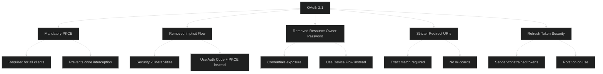
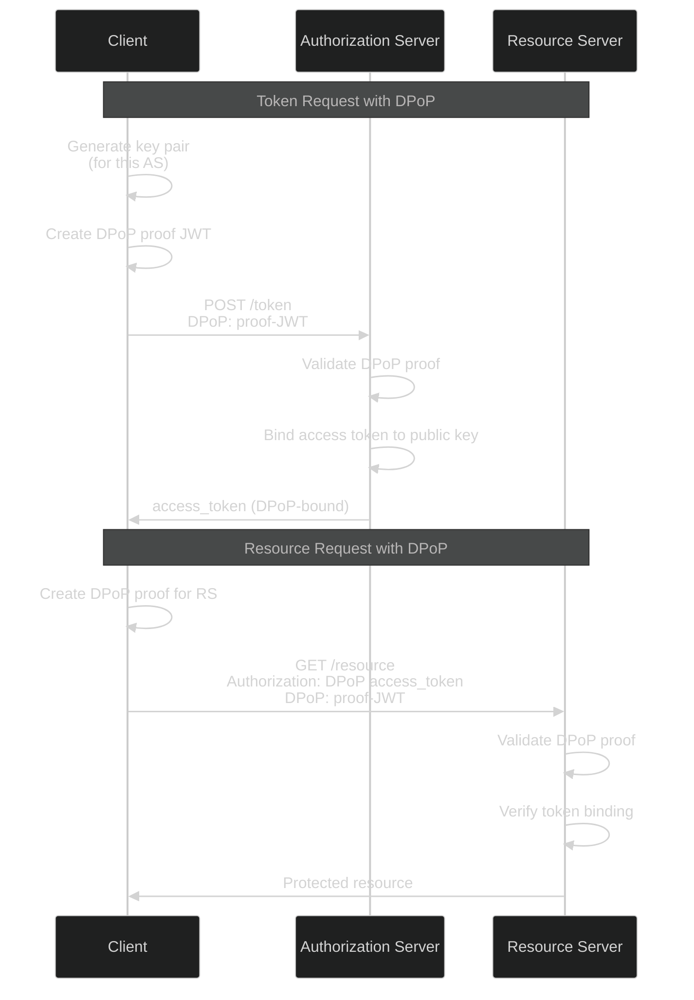

# OAuth 2.0 & OpenID Connect - Advanced Level

## OAuth 2.1 and Security Best Practices

### OAuth 2.1 Changes



### Authorization Server Implementation

```javascript
class OAuth2AuthorizationServer {
  constructor(config) {
    this.config = config;
    this.clients = new Map();
    this.authorizationCodes = new Map();
    this.accessTokens = new Map();
    this.refreshTokens = new Map();
  }
  
  async registerClient(clientData) {
    const {
      name,
      redirectUris,
      grantTypes,
      tokenEndpointAuthMethod,
      applicationType // 'web', 'native', 'spa'
    } = clientData;
    
    // Generate client credentials
    const clientId = `client_${crypto.randomUUID()}`;
    const clientSecret = applicationType !== 'spa' ? 
      crypto.randomBytes(32).toString('base64url') : null;
    
    // Validate redirect URIs
    this.validateRedirectUris(redirectUris, applicationType);
    
    const client = {
      clientId,
      clientSecret,
      name,
      redirectUris: redirectUris.map(uri => new URL(uri).href), // Normalize
      grantTypes: grantTypes || ['authorization_code'],
      tokenEndpointAuthMethod: tokenEndpointAuthMethod || 'client_secret_basic',
      applicationType,
      createdAt: new Date(),
      active: true
    };
    
    this.clients.set(clientId, client);
    
    return {
      clientId,
      clientSecret, // Only returned once
      redirectUris: client.redirectUris
    };
  }
  
  validateRedirectUris(uris, applicationType) {
    for (const uri of uris) {
      const url = new URL(uri);
      
      // OAuth 2.1: No localhost for web apps in production
      if (applicationType === 'web' && url.hostname === 'localhost') {
        throw new Error('Localhost redirect URIs not allowed for web applications');
      }
      
      // Must use HTTPS (except localhost for native apps)
      if (url.protocol !== 'https:' && 
          !(applicationType === 'native' && url.hostname === 'localhost')) {
        throw new Error('Redirect URIs must use HTTPS');
      }
      
      // No wildcards
      if (uri.includes('*')) {
        throw new Error('Wildcard redirect URIs not allowed');
      }
      
      // No fragments
      if (url.hash) {
        throw new Error('Redirect URIs must not contain fragments');
      }
    }
  }
  
  async authorize(req) {
    const {
      clientId,
      redirectUri,
      responseType,
      scope,
      state,
      codeChallenge,
      codeChallengeMethod,
      nonce // OIDC
    } = req.query;
    
    // Validate client
    const client = this.clients.get(clientId);
    if (!client || !client.active) {
      throw new OAuth2Error('invalid_client', 'Unknown or inactive client');
    }
    
    // Validate redirect URI (exact match)
    if (!client.redirectUris.includes(redirectUri)) {
      throw new OAuth2Error('invalid_request', 'Invalid redirect_uri');
    }
    
    // Validate response type
    if (responseType !== 'code') {
      // OAuth 2.1: Only code flow supported
      throw new OAuth2Error('unsupported_response_type', 'Only code flow is supported');
    }
    
    // PKCE is mandatory (OAuth 2.1)
    if (!codeChallenge) {
      throw new OAuth2Error('invalid_request', 'code_challenge is required');
    }
    
    if (!codeChallengeMethod || !['S256', 'plain'].includes(codeChallengeMethod)) {
      throw new OAuth2Error('invalid_request', 'Invalid code_challenge_method');
    }
    
    // Validate scope
    const requestedScopes = scope ? scope.split(' ') : [];
    const allowedScopes = this.config.supportedScopes;
    const invalidScopes = requestedScopes.filter(s => !allowedScopes.includes(s));
    
    if (invalidScopes.length > 0) {
      throw new OAuth2Error('invalid_scope', `Invalid scopes: ${invalidScopes.join(', ')}`);
    }
    
    // User authentication and consent
    // (This would redirect to login page if user not authenticated)
    const userId = req.session.userId;
    if (!userId) {
      // Redirect to login, then back to authorization endpoint
      return { redirect: `/login?return_to=${encodeURIComponent(req.originalUrl)}` };
    }
    
    // Check for existing consent
    const consent = await this.getConsent(userId, clientId, requestedScopes);
    
    if (!consent) {
      // Show consent screen
      return {
        showConsent: true,
        client: {
          name: client.name,
          redirectUri
        },
        scopes: requestedScopes
      };
    }
    
    // Generate authorization code
    const code = await this.generateAuthorizationCode({
      clientId,
      userId,
      redirectUri,
      scopes: requestedScopes,
      codeChallenge,
      codeChallengeMethod,
      nonce
    });
    
    // Redirect back to client
    const redirectUrl = new URL(redirectUri);
    redirectUrl.searchParams.set('code', code);
    redirectUrl.searchParams.set('state', state);
    
    return { redirect: redirectUrl.href };
  }
  
  async generateAuthorizationCode(data) {
    const code = crypto.randomBytes(32).toString('base64url');
    
    this.authorizationCodes.set(code, {
      ...data,
      createdAt: Date.now(),
      expiresAt: Date.now() + (10 * 60 * 1000), // 10 minutes
      used: false
    });
    
    // Auto-cleanup after expiration
    setTimeout(() => {
      this.authorizationCodes.delete(code);
    }, 10 * 60 * 1000);
    
    return code;
  }
  
  async token(req) {
    const {
      grantType,
      code,
      redirectUri,
      clientId,
      codeVerifier,
      refreshToken
    } = req.body;
    
    // Authenticate client
    const client = await this.authenticateClient(req);
    
    if (!client) {
      throw new OAuth2Error('invalid_client', 'Client authentication failed');
    }
    
    switch (grantType) {
      case 'authorization_code':
        return await this.handleAuthorizationCodeGrant(
          code,
          redirectUri,
          clientId,
          codeVerifier
        );
        
      case 'refresh_token':
        return await this.handleRefreshTokenGrant(refreshToken, client);
        
      case 'client_credentials':
        return await this.handleClientCredentialsGrant(client);
        
      default:
        throw new OAuth2Error('unsupported_grant_type', `Grant type ${grantType} not supported`);
    }
  }
  
  async authenticateClient(req) {
    const authHeader = req.headers.authorization;
    const { clientId, clientSecret } = req.body;
    
    let extractedClientId, extractedSecret;
    
    if (authHeader && authHeader.startsWith('Basic ')) {
      // Basic authentication
      const credentials = Buffer.from(authHeader.substring(6), 'base64').toString();
      [extractedClientId, extractedSecret] = credentials.split(':');
    } else if (clientId && clientSecret) {
      // Body parameters
      extractedClientId = clientId;
      extractedSecret = clientSecret;
    } else {
      return null;
    }
    
    const client = this.clients.get(extractedClientId);
    
    if (!client) {
      return null;
    }
    
    // Public clients (SPAs, native apps) don't have secrets
    if (!client.clientSecret) {
      return client;
    }
    
    // Validate secret
    const valid = await this.validateClientSecret(client.clientSecret, extractedSecret);
    
    return valid ? client : null;
  }
  
  async validateClientSecret(storedSecret, providedSecret) {
    // Constant-time comparison
    return crypto.timingSafeEqual(
      Buffer.from(storedSecret),
      Buffer.from(providedSecret)
    );
  }
  
  async handleAuthorizationCodeGrant(code, redirectUri, clientId, codeVerifier) {
    const authCode = this.authorizationCodes.get(code);
    
    if (!authCode) {
      throw new OAuth2Error('invalid_grant', 'Invalid authorization code');
    }
    
    // Check expiration
    if (Date.now() > authCode.expiresAt) {
      this.authorizationCodes.delete(code);
      throw new OAuth2Error('invalid_grant', 'Authorization code expired');
    }
    
    // Check if already used (prevent replay)
    if (authCode.used) {
      // Revoke all tokens issued with this code
      await this.revokeTokensByCode(code);
      throw new OAuth2Error('invalid_grant', 'Authorization code already used');
    }
    
    // Validate client
    if (authCode.clientId !== clientId) {
      throw new OAuth2Error('invalid_grant', 'Client mismatch');
    }
    
    // Validate redirect URI
    if (authCode.redirectUri !== redirectUri) {
      throw new OAuth2Error('invalid_grant', 'Redirect URI mismatch');
    }
    
    // Verify PKCE
    if (!await this.verifyPKCE(authCode.codeChallenge, authCode.codeChallengeMethod, codeVerifier)) {
      throw new OAuth2Error('invalid_grant', 'PKCE verification failed');
    }
    
    // Mark as used
    authCode.used = true;
    
    // Generate tokens
    const accessToken = await this.generateAccessToken({
      clientId: authCode.clientId,
      userId: authCode.userId,
      scopes: authCode.scopes
    });
    
    const refreshToken = await this.generateRefreshToken({
      clientId: authCode.clientId,
      userId: authCode.userId,
      scopes: authCode.scopes
    });
    
    // Generate ID token if OpenID Connect
    let idToken;
    if (authCode.scopes.includes('openid')) {
      idToken = await this.generateIDToken({
        userId: authCode.userId,
        clientId: authCode.clientId,
        nonce: authCode.nonce,
        authTime: authCode.createdAt
      });
    }
    
    const response = {
      access_token: accessToken.token,
      token_type: 'Bearer',
      expires_in: 3600,
      refresh_token: refreshToken.token,
      scope: authCode.scopes.join(' ')
    };
    
    if (idToken) {
      response.id_token = idToken;
    }
    
    return response;
  }
  
  async verifyPKCE(codeChallenge, method, codeVerifier) {
    if (!codeVerifier) {
      return false;
    }
    
    let computedChallenge;
    
    if (method === 'S256') {
      const hash = crypto.createHash('sha256').update(codeVerifier).digest();
      computedChallenge = Buffer.from(hash).toString('base64url');
    } else if (method === 'plain') {
      computedChallenge = codeVerifier;
    } else {
      return false;
    }
    
    return crypto.timingSafeEqual(
      Buffer.from(codeChallenge),
      Buffer.from(computedChallenge)
    );
  }
  
  async generateAccessToken(data) {
    const { clientId, userId, scopes } = data;
    
    const token = await new jose.SignJWT({
      client_id: clientId,
      sub: userId,
      scope: scopes.join(' ')
    })
      .setProtectedHeader({ alg: 'ES256', typ: 'at+jwt' })
      .setIssuedAt()
      .setIssuer(this.config.issuer)
      .setAudience(this.config.audience)
      .setExpirationTime('1h')
      .setJti(crypto.randomUUID())
      .sign(this.config.signingKey);
    
    return {
      token,
      expiresIn: 3600
    };
  }
  
  async generateRefreshToken(data) {
    const token = crypto.randomBytes(32).toString('base64url');
    
    this.refreshTokens.set(token, {
      ...data,
      createdAt: Date.now(),
      expiresAt: Date.now() + (90 * 24 * 60 * 60 * 1000), // 90 days
      rotated: false
    });
    
    return { token };
  }
  
  async handleRefreshTokenGrant(refreshToken, client) {
    const tokenData = this.refreshTokens.get(refreshToken);
    
    if (!tokenData) {
      throw new OAuth2Error('invalid_grant', 'Invalid refresh token');
    }
    
    // Check expiration
    if (Date.now() > tokenData.expiresAt) {
      this.refreshTokens.delete(refreshToken);
      throw new OAuth2Error('invalid_grant', 'Refresh token expired');
    }
    
    // Validate client
    if (tokenData.clientId !== client.clientId) {
      throw new OAuth2Error('invalid_grant', 'Client mismatch');
    }
    
    // OAuth 2.1: Rotate refresh token
    this.refreshTokens.delete(refreshToken);
    
    // Generate new tokens
    const newAccessToken = await this.generateAccessToken({
      clientId: tokenData.clientId,
      userId: tokenData.userId,
      scopes: tokenData.scopes
    });
    
    const newRefreshToken = await this.generateRefreshToken({
      clientId: tokenData.clientId,
      userId: tokenData.userId,
      scopes: tokenData.scopes
    });
    
    return {
      access_token: newAccessToken.token,
      token_type: 'Bearer',
      expires_in: 3600,
      refresh_token: newRefreshToken.token,
      scope: tokenData.scopes.join(' ')
    };
  }
  
  async generateIDToken(data) {
    const { userId, clientId, nonce, authTime } = data;
    
    // Get user info
    const user = await this.getUserInfo(userId);
    
    const idToken = await new jose.SignJWT({
      sub: userId,
      name: user.name,
      email: user.email,
      email_verified: user.emailVerified,
      nonce: nonce,
      auth_time: Math.floor(authTime / 1000)
    })
      .setProtectedHeader({ alg: 'ES256', typ: 'JWT' })
      .setIssuedAt()
      .setIssuer(this.config.issuer)
      .setAudience(clientId)
      .setExpirationTime('1h')
      .sign(this.config.signingKey);
    
    return idToken;
  }
}

class OAuth2Error extends Error {
  constructor(error, description) {
    super(description);
    this.error = error;
    this.description = description;
  }
  
  toJSON() {
    return {
      error: this.error,
      error_description: this.description
    };
  }
}
```

## DPoP (Demonstrating Proof of Possession)

### DPoP Implementation



### DPoP Token Manager

```javascript
class DPoPTokenManager {
  constructor() {
    this.keyPairs = new Map(); // Store key pairs per AS
  }
  
  async getOrCreateKeyPair(authorizationServer) {
    if (!this.keyPairs.has(authorizationServer)) {
      const keyPair = await jose.generateKeyPair('ES256');
      this.keyPairs.set(authorizationServer, keyPair);
    }
    
    return this.keyPairs.get(authorizationServer);
  }
  
  async createDPoPProof(options) {
    const {
      htm, // HTTP method
      htu, // HTTP URI (without query/fragment)
      authorizationServer,
      accessToken,
      nonce
    } = options;
    
    const keyPair = await this.getOrCreateKeyPair(authorizationServer);
    const publicJWK = await jose.exportJWK(keyPair.publicKey);
    
    // Calculate access token hash if provided
    let ath;
    if (accessToken) {
      const hash = crypto.createHash('sha256').update(accessToken).digest();
      ath = Buffer.from(hash).toString('base64url');
    }
    
    const dpopProof = await new jose.SignJWT({
      htm,
      htu,
      ath,
      iat: Math.floor(Date.now() / 1000),
      jti: crypto.randomUUID()
    })
      .setProtectedHeader({
        alg: 'ES256',
        typ: 'dpop+jwt',
        jwk: publicJWK
      })
      .sign(keyPair.privateKey);
    
    return dpopProof;
  }
  
  async requestToken(tokenEndpoint, params) {
    // Create DPoP proof for token request
    const dpopProof = await this.createDPoPProof({
      htm: 'POST',
      htu: tokenEndpoint,
      authorizationServer: new URL(tokenEndpoint).origin
    });
    
    const response = await fetch(tokenEndpoint, {
      method: 'POST',
      headers: {
        'Content-Type': 'application/x-www-form-urlencoded',
        'DPoP': dpopProof
      },
      body: new URLSearchParams(params)
    });
    
    const data = await response.json();
    
    return {
      accessToken: data.access_token,
      tokenType: data.token_type, // Should be 'DPoP'
      expiresIn: data.expires_in,
      refreshToken: data.refresh_token
    };
  }
  
  async accessResource(resourceUrl, accessToken) {
    const url = new URL(resourceUrl);
    const htu = `${url.protocol}//${url.host}${url.pathname}`;
    
    // Create DPoP proof for resource request
    const dpopProof = await this.createDPoPProof({
      htm: 'GET',
      htu: htu,
      authorizationServer: url.origin,
      accessToken: accessToken
    });
    
    const response = await fetch(resourceUrl, {
      headers: {
        'Authorization': `DPoP ${accessToken}`,
        'DPoP': dpopProof
      }
    });
    
    return response;
  }
}

// Resource Server: Validate DPoP
class DPoPValidator {
  async validateRequest(req) {
    const authHeader = req.headers.authorization;
    const dpopHeader = req.headers.dpop;
    
    if (!authHeader || !authHeader.startsWith('DPoP ')) {
      throw new Error('Missing or invalid Authorization header');
    }
    
    if (!dpopHeader) {
      throw new Error('Missing DPoP header');
    }
    
    const accessToken = authHeader.substring(5);
    
    // Decode DPoP proof
    const { payload, protectedHeader } = jose.decodeJwt(dpopHeader);
    
    // Validate header
    if (protectedHeader.typ !== 'dpop+jwt') {
      throw new Error('Invalid DPoP proof type');
    }
    
    if (!protectedHeader.jwk) {
      throw new Error('Missing public key in DPoP proof');
    }
    
    // Verify signature with embedded public key
    const publicKey = await jose.importJWK(protectedHeader.jwk);
    await jose.jwtVerify(dpopHeader, publicKey);
    
    // Validate claims
    if (payload.htm !== req.method) {
      throw new Error('HTTP method mismatch');
    }
    
    const expectedHtu = `${req.protocol}://${req.get('host')}${req.path}`;
    if (payload.htu !== expectedHtu) {
      throw new Error('HTTP URI mismatch');
    }
    
    // Validate access token hash
    if (payload.ath) {
      const hash = crypto.createHash('sha256').update(accessToken).digest();
      const ath = Buffer.from(hash).toString('base64url');
      
      if (payload.ath !== ath) {
        throw new Error('Access token hash mismatch');
      }
    }
    
    // Validate access token and check binding
    const tokenValidation = await this.validateAccessToken(accessToken);
    
    // Check that token is bound to the same public key
    const jkt = await jose.calculateJwkThumbprint(protectedHeader.jwk);
    
    if (tokenValidation.cnf?.jkt !== jkt) {
      throw new Error('Token not bound to this public key');
    }
    
    // Check timestamp (prevent replay)
    const now = Math.floor(Date.now() / 1000);
    if (Math.abs(now - payload.iat) > 60) {
      throw new Error('DPoP proof timestamp too old');
    }
    
    // Check nonce if required
    // ...
    
    return {
      valid: true,
      user: tokenValidation.sub
    };
  }
}
```

## Best Practices

### Security Checklist

✅ **Do:**
- Always use PKCE for all OAuth flows
- Implement exact redirect URI matching
- Use short-lived authorization codes (10 minutes max)
- Rotate refresh tokens on each use
- Implement comprehensive logging and monitoring
- Use DPoP or certificate-bound tokens for high-value operations
- Validate all parameters strictly
- Implement rate limiting on token endpoint
- Use sender-constrained tokens when possible
- Store tokens securely (never in localStorage for web apps)

❌ **Don't:**
- Use implicit flow or password grant
- Allow wildcard redirect URIs
- Skip PKCE validation
- Reuse authorization codes
- Store client secrets in client-side code
- Use long-lived access tokens
- Forget to validate state parameter
- Allow http:// redirect URIs in production
- Implement custom crypto
- Trust user-provided redirect_uri without validation

## Next Steps

📚 **Related Advanced Topics:** OAuth 2.0 for Native Apps (RFC 8252), OAuth 2.0 Token Exchange (RFC 8693), OAuth 2.0 Device Authorization Grant, Federation and trust frameworks

---

**Related Topics:** OpenID Connect, JWT, API Security, Zero Trust, Identity Federation
