# OAuth 2.0 & OpenID Connect - Basic Level

## What is OAuth?

**OAuth 2.0** is an authorization framework that lets you give apps limited access to your accounts without sharing your password. Think of it as a "valet key" for your online accounts.

**OpenID Connect (OIDC)** adds authentication on top of OAuth, verifying **who you are** in addition to **what you can access**.

### Real-World Analogy


## Simple Example: "Sign in with Google"

### How It Works


### What Just Happened?

1. **You** clicked "Sign in with Google" instead of creating new password
2. **Google** asked if Photo App can access your basic info
3. **You** said yes
4. **Photo App** got limited access - NO access to your password!
5. **You** are logged in safely

## OAuth vs OpenID Connect


**Simple Difference:**
- **OAuth**: "Here's permission to use my stuff"
- **OIDC**: "Here's who I am + permission to use my stuff"

## Common OAuth Use Cases

### 1. Social Login

Instead of creating a new account, use existing one:

```mermaid
%%{init: {\'theme\':\'dark\'}}%%
flowchart LR
    A[New Website] --> B{Login Options}
    B --> C[Sign in with Google]
    B --> D[Sign in with Facebook]
    B --> E[Sign in with Apple]
    B --> F[Sign in with GitHub]
    
    C --> G[Quick Login ✓]
    D --> G
    E --> G
    F --> G
```



**Examples:**
- 📱 Spotify: "Continue with Facebook"
- 🎮 Epic Games: "Sign in with Google"
- 📝 Medium: "Sign in with Twitter"
- 💼 LinkedIn: "Sign in with Microsoft"

**Benefits:**
- ✅ No new password to remember
- ✅ Faster signup (one click)
- ✅ Your info stays updated
- ✅ More secure (trusted provider)

### 2. API Access

Apps requesting access to your data:


**Examples:**
- 🏃 MyFitnessPal accessing Apple Health
- 📊 Data studio accessing Google Analytics
- 📧 Email client accessing Gmail
- 📅 Calendar apps accessing Google Calendar

### 3. Third-Party Integrations

Connecting different services:

```
Slack + Google Drive:
1. In Slack: "Add Google Drive"
2. Google: "Allow Slack to view your files?"
3. You: "Allow"
4. Now you can share Drive files in Slack!
```

**Examples:**
- Slack + Google Drive
- Trello + Dropbox
- Zoom + Google Calendar
- Zapier + Everything!

## The OAuth Flow (Simple Version)

### Step-by-Step


### What You See vs What Happens Behind

**What You See:**
1. Click "Sign in with Google"
2. Pop-up window opens
3. You're already logged into Google, so it asks: "Allow Photo App?"
4. You click "Allow"
5. Pop-up closes
6. You're logged in!

**What Happens Behind:**


## OAuth Scopes - What Apps Can Access

**Scopes** define what data the app can access. Think of them as permissions.

### Example Scopes


### Real Example: Photo Editor App

```
Photo Editor requests:
✓ View your basic profile (name, email)
✓ View your photos
✓ Upload edited photos back
✗ Access your emails (NOT requested)
✗ Access your location (NOT requested)
```

**You choose what to share!**

## OAuth Providers

### Popular OAuth Providers

| Provider | Best For | What They Provide |
|----------|----------|-------------------|
| 🔵 Google | General apps, email access | Profile, Gmail, Drive, Calendar, Photos |
| 🔵 Facebook | Social apps, gaming | Profile, friends list, posts |
| ⚫ Apple | iOS apps, privacy-focused | Anonymous email, basic profile |
| 🐙 GitHub | Developer tools | Code repos, profile, commits |
| 💼 Microsoft | Enterprise apps | Office 365, Outlook, Teams, OneDrive |
| 🐦 Twitter | Social media apps | Profile, tweets, followers |
| 💼 LinkedIn | Professional apps | Work history, connections, posts |

## Security Benefits

### Why OAuth is Secure


**Benefits:**

1. **No Password Sharing** - App never sees your password
2. **Limited Access** - Only what you approve (read photos, not delete)
3. **Revokable** - Can cancel access anytime
4. **Time-Limited** - Tokens expire automatically
5. **Auditable** - See which apps have access

### Managing OAuth Connections

**Check Connected Apps:**

**Google:**
```
Settings → Security → Third-party apps with account access
See all apps you've connected
Click "Remove access" for any app
```

**Facebook:**
```
Settings → Apps and Websites
See active apps
Click "Remove" to revoke access
```

**Apple:**
```
Settings → [Your Name] → Password & Security
Apps Using Apple ID
Stop using Apple ID with [App Name]
```

## Real-World Industry Examples

### 🛒 E-commerce: Shopify


**Benefit:** One-click checkout using saved payment methods

### 🎓 Education: Google Classroom

```
Student uses learning app:
1. App: "Sign in with Google"
2. Google: "Allow access to Classroom?"
3. Student: "Allow"
4. App can now view assignments
```

**Benefit:** Easy integration with school Google accounts

### 💼 Enterprise: Salesforce


**Benefit:** Single company login for all business apps

### 🏥 Healthcare: Patient Portal

```
Health tracking app:
1. Request access to patient records (FHIR API)
2. Hospital OAuth server authenticates
3. App receives limited health data
4. Patient data protected by HIPAA
```

**Benefit:** Secure access to medical records

## Common OAuth Terms (Simple)


## OAuth vs Traditional Login

### Traditional Login Problems

```
Problem: Each app stores your password
❌ If app is hacked, your password is stolen
❌ Can't limit what app can do
❌ Same password everywhere = all accounts at risk
❌ Changing password = update everywhere
```

### OAuth Solution

```
Solution: Apps get tokens, not passwords
✅ Token is app-specific, not your master password
✅ Control exactly what app can do (scopes)
✅ Revoke token anytime, doesn't affect other apps
✅ Change password once, tokens still work
```

## Setting Up OAuth as a User

### Example: Connecting App to Google Drive


**What to Check:**
1. ✅ Is this the right app name?
2. ✅ Are permissions reasonable?
3. ✅ Do I trust this app?
4. ✅ Do I really need this integration?

## OAuth Security Tips

### For Users

**✅ Do:**
- Read what permissions app requests
- Use OAuth from trusted providers (Google, Microsoft, Apple)
- Regularly review connected apps
- Revoke access you don't need anymore
- Check app reviews before connecting

**❌ Don't:**
- Grant unnecessary permissions
- Connect to sketchy apps
- Ignore weird permission requests (e.g., weather app wants email access?)
- Leave old apps connected forever

### Red Flags 🚩

```
SUSPICIOUS permission requests:
🚩 Photo editor wants access to emails
🚩 Game wants access to contacts
🚩 Todo app wants full Google Drive access
🚩 Free app wants excessive permissions
```

## Future of OAuth


## Key Takeaways

1. **OAuth = No password sharing** with third-party apps
2. **Scopes control access** - only share what's needed
3. **Revokable anytime** - you're always in control
4. **OIDC adds identity** - both login and authorization
5. **Check connected apps regularly** - security hygiene

## When to Use OAuth

### ✅ Good Use Cases

- Logging into third-party apps
- Integrating multiple services
- API access for mobile apps
- Enterprise single sign-on
- Social features in apps

### ❌ When Not to Use

- First-party authentication (your own app)
- Simple password-only systems
- Offline applications
- Systems without internet access

## Next Steps

- 📗 **Intermediate Level:** OAuth flows, industry implementations, PKCE, refresh tokens
- 📕 **Advanced Level:** Security vulnerabilities, token management, OAuth 2.1, custom providers

---

**Related Topics:** Single Sign-On (SSO), API Authentication, Token-Based Auth, Federated Identity
