# OAuth 2.0 & OpenID Connect - Intermediate Level

## OAuth 2.0 Authorization Flows

### The Four Grant Types


## Authorization Code Flow (Most Common)

### Complete Flow with PKCE


### PKCE (Proof Key for Code Exchange)

**Why PKCE is Critical:**

```mermaid
flowchart TD
    A[Without PKCE] --> B[Authorization code intercepted]
    B --> C[Attacker exchanges code for tokens]
    C --> D[Attacker gains access ✗]
    
    E[With PKCE] --> F[Authorization code intercepted]
    F --> G[Attacker tries to exchange code]
    G --> H[Needs code_verifier]
    H --> I[Attacker doesn't have it]
    I --> J[Exchange fails ✓]
    
    style D fill:#FFE4E4
    style J fill:#E4FFE4
```



**PKCE Implementation:**

```javascript
// Generate code_verifier
function generateCodeVerifier() {
  const array = new Uint8Array(32);
  crypto.getRandomValues(array);
  return base64URLEncode(array);
}

// Generate code_challenge
async function generateCodeChallenge(verifier) {
  const encoder = new TextEncoder();
  const data = encoder.encode(verifier);
  const hash = await crypto.subtle.digest('SHA-256', data);
  return base64URLEncode(new Uint8Array(hash));
}

// Base64URL encoding
function base64URLEncode(buffer) {
  return btoa(String.fromCharCode(...buffer))
    .replace(/\+/g, '-')
    .replace(/\//g, '_')
    .replace(/=/g, '');
}

// Usage
const codeVerifier = generateCodeVerifier();
const codeChallenge = await generateCodeChallenge(codeVerifier);

// Store verifier for later use
sessionStorage.setItem('pkce_verifier', codeVerifier);

// Build authorization URL
const authUrl = `https://auth.example.com/authorize?` +
  `response_type=code&` +
  `client_id=${clientId}&` +
  `redirect_uri=${redirectUri}&` +
  `scope=openid profile email&` +
  `state=${state}&` +
  `code_challenge=${codeChallenge}&` +
  `code_challenge_method=S256`;

// Redirect user
window.location.href = authUrl;

// After redirect back, exchange code for tokens
const codeVerifier = sessionStorage.getItem('pkce_verifier');
const response = await fetch('https://auth.example.com/token', {
  method: 'POST',
  headers: { 'Content-Type': 'application/x-www-form-urlencoded' },
  body: new URLSearchParams({
    grant_type: 'authorization_code',
    code: authorizationCode,
    redirect_uri: redirectUri,
    client_id: clientId,
    code_verifier: codeVerifier  // Proves we initiated the flow
  })
});
```

## Client Credentials Flow (Service-to-Service)

### Machine-to-Machine Authentication


**Use Cases:**
- Microservices calling each other
- Scheduled jobs accessing APIs
- Backend batch processes
- CI/CD pipelines

**Implementation:**

```javascript
// Service A requesting token
async function getServiceToken() {
  const response = await fetch('https://auth.example.com/token', {
    method: 'POST',
    headers: { 'Content-Type': 'application/x-www-form-urlencoded' },
    body: new URLSearchParams({
      grant_type: 'client_credentials',
      client_id: process.env.CLIENT_ID,
      client_secret: process.env.CLIENT_SECRET,
      scope: 'read:users write:orders'
    })
  });
  
  const data = await response.json();
  return data.access_token;
}

// Service B verifying token
async function verifyServiceToken(token) {
  // Option 1: Token introspection
  const response = await fetch('https://auth.example.com/introspect', {
    method: 'POST',
    headers: { 'Content-Type': 'application/x-www-form-urlencoded' },
    body: new URLSearchParams({
      token: token,
      client_id: process.env.CLIENT_ID,
      client_secret: process.env.CLIENT_SECRET
    })
  });
  
  const result = await response.json();
  
  if (!result.active) {
    throw new Error('Token invalid or expired');
  }
  
  return {
    clientId: result.client_id,
    scopes: result.scope.split(' ')
  };
}
```

## OpenID Connect (OIDC) Layer

### OIDC Adds Identity to OAuth


### ID Token Structure

```javascript
// ID Token (JWT format)
{
  // Header
  "alg": "RS256",
  "typ": "JWT",
  "kid": "key-id-1"
}
{
  // Payload
  "iss": "https://accounts.google.com",           // Issuer
  "sub": "10769150350006150715113082367",         // Subject (user ID)
  "aud": "1234567890-abc123.apps.googleusercontent.com", // Audience (your client ID)
  "exp": 1640003600,                               // Expiration
  "iat": 1640000000,                               // Issued at
  "nonce": "random_nonce_value",                   // Prevents replay
  
  // Standard claims
  "email": "user@example.com",
  "email_verified": true,
  "name": "John Doe",
  "picture": "https://example.com/photo.jpg",
  "given_name": "John",
  "family_name": "Doe",
  "locale": "en"
}
```

### ID Token vs Access Token


## Scopes and Claims

### OAuth Scopes


### Requesting Scopes

```javascript
// Authorization request with scopes
const authUrl = new URL('https://auth.example.com/authorize');
authUrl.searchParams.append('response_type', 'code');
authUrl.searchParams.append('client_id', clientId);
authUrl.searchParams.append('redirect_uri', redirectUri);
authUrl.searchParams.append('scope', 'openid profile email read:orders');
authUrl.searchParams.append('state', state);

// Scope format:
// - Space-separated
// - Case-sensitive
// - Order doesn't matter
// - openid required for OIDC

// After token exchange, check granted scopes
const tokenResponse = await exchangeCodeForToken(code);
console.log(tokenResponse.scope);  // "openid profile email"
// User might not grant all requested scopes!
```

### Dynamic Consent


## Token Management

### Token Lifecycle


### Refresh Token Flow


### Secure Token Storage Patterns

```javascript
// Pattern 1: Backend-for-Frontend (BFF)
// Tokens stored server-side, session cookie to client

// Server (Node.js + Express)
app.post('/auth/login', async (req, res) => {
  // Exchange auth code for tokens
  const tokens = await exchangeCodeForTokens(req.body.code);
  
  // Store tokens server-side (Redis/Database)
  await storeTokens(req.sessionID, tokens);
  
  // Send only session cookie to client
  res.cookie('session_id', req.sessionID, {
    httpOnly: true,
    secure: true,
    sameSite: 'strict',
    maxAge: 3600000
  });
  
  res.json({ success: true });
});

// Client never sees tokens
app.get('/api/data', async (req, res) => {
  const tokens = await getTokens(req.sessionID);
  const response = await fetch('https://api.example.com/data', {
    headers: { 'Authorization': `Bearer ${tokens.access_token}` }
  });
  res.json(await response.json());
});

// Pattern 2: Mobile secure storage
// iOS Keychain
import * as Keychain from 'react-native-keychain';

async function storeTokens(tokens) {
  await Keychain.setGenericPassword(
    'oauth_tokens',
    JSON.stringify(tokens),
    {
      accessible: Keychain.ACCESSIBLE.WHEN_UNLOCKED,
      service: 'com.yourapp.oauth'
    }
  );
}

async function getTokens() {
  const credentials = await Keychain.getGenericPassword({
    service: 'com.yourapp.oauth'
  });
  return JSON.parse(credentials.password);
}
```

## Token Revocation

### Revoking Access


**Implementation:**

```javascript
// Revoke tokens on logout
async function logout() {
  const refreshToken = await getStoredRefreshToken();
  
  // Revoke refresh token
  await fetch('https://auth.example.com/revoke', {
    method: 'POST',
    headers: { 'Content-Type': 'application/x-www-form-urlencoded' },
    body: new URLSearchParams({
      token: refreshToken,
      token_type_hint: 'refresh_token',
      client_id: clientId
    })
  });
  
  // Clear local tokens
  await clearStoredTokens();
  
  // Redirect to post-logout page
  window.location.href = '/logged-out';
}
```

## Industry Implementation Patterns

### Social Login Integration


**Multi-Provider Support:**

```javascript
// Provider configuration
const providers = {
  google: {
    authEndpoint: 'https://accounts.google.com/o/oauth2/v2/auth',
    tokenEndpoint: 'https://oauth2.googleapis.com/token',
    userInfoEndpoint: 'https://www.googleapis.com/oauth2/v2/userinfo',
    clientId: process.env.GOOGLE_CLIENT_ID,
    clientSecret: process.env.GOOGLE_CLIENT_SECRET,
    scopes: ['openid', 'profile', 'email']
  },
  github: {
    authEndpoint: 'https://github.com/login/oauth/authorize',
    tokenEndpoint: 'https://github.com/login/oauth/access_token',
    userInfoEndpoint: 'https://api.github.com/user',
    clientId: process.env.GITHUB_CLIENT_ID,
    clientSecret: process.env.GITHUB_CLIENT_SECRET,
    scopes: ['read:user', 'user:email']
  }
};

// Unified login function
async function loginWithProvider(providerName) {
  const provider = providers[providerName];
  
  const authUrl = new URL(provider.authEndpoint);
  authUrl.searchParams.append('client_id', provider.clientId);
  authUrl.searchParams.append('redirect_uri', `${baseUrl}/auth/callback/${providerName}`);
  authUrl.searchParams.append('scope', provider.scopes.join(' '));
  authUrl.searchParams.append('state', generateState());
  
  if (providerName === 'google') {
    authUrl.searchParams.append('response_type', 'code');
  }
  
  window.location.href = authUrl.toString();
}

// Unified callback handler
app.get('/auth/callback/:provider', async (req, res) => {
  const provider = providers[req.params.provider];
  const { code, state } = req.query;
  
  // Verify state
  if (!verifyState(state)) {
    return res.status(400).send('Invalid state');
  }
  
  // Exchange code for token
  const tokens = await exchangeCode(provider, code);
  
  // Get user info
  const userInfo = await getUserInfo(provider, tokens.access_token);
  
  // Find or create user in your database
  const user = await findOrCreateUser({
    provider: req.params.provider,
    providerId: userInfo.id,
    email: userInfo.email,
    name: userInfo.name,
    picture: userInfo.picture
  });
  
  // Create session
  req.session.userId = user.id;
  
  res.redirect('/dashboard');
});
```

### SaaS B2B Authentication


## Security Best Practices

### State Parameter (CSRF Protection)

```javascript
// Generate cryptographically random state
function generateState() {
  return crypto.randomBytes(32).toString('hex');
}

// Store state before redirect
sessionStorage.setItem('oauth_state', state);

// Verify state on callback
const storedState = sessionStorage.getItem('oauth_state');
if (receivedState !== storedState) {
  throw new Error('State mismatch - possible CSRF attack');
}
sessionStorage.removeItem('oauth_state');
```

### Nonce (Replay Protection for OIDC)

```javascript
// Generate nonce for OIDC request
const nonce = crypto.randomBytes(16).toString('hex');
sessionStorage.setItem('oidc_nonce', nonce);

// Add to authorization request
authUrl.searchParams.append('nonce', nonce);

// Verify nonce in ID token
const idToken = jwt.decode(tokens.id_token);
const storedNonce = sessionStorage.getItem('oidc_nonce');

if (idToken.nonce !== storedNonce) {
  throw new Error('Nonce mismatch - possible replay attack');
}
```

### Redirect URI Validation

```javascript
// Server-side validation
const allowedRedirectUris = [
  'https://yourapp.com/callback',
  'https://yourapp.com/auth/callback',
  'myapp://oauth-callback'  // Mobile deep link
];

function validateRedirectUri(uri) {
  // Exact match only - no wildcards!
  if (!allowedRedirectUris.includes(uri)) {
    throw new Error('Invalid redirect_uri');
  }
  
  // Additional checks
  const url = new URL(uri);
  
  // Must be HTTPS in production (except localhost)
  if (process.env.NODE_ENV === 'production' && url.protocol !== 'https:') {
    throw new Error('redirect_uri must use HTTPS');
  }
  
  return true;
}
```

## Common Issues and Solutions

### Issue 1: CORS Errors

```javascript
// Problem: Frontend calling OAuth endpoints directly
// Browser blocks due to CORS

// ❌ Don't do this from frontend
fetch('https://oauth.example.com/token', { ... });  // CORS error!

// ✅ Solution: Use backend proxy
// Frontend → Your Backend → OAuth Server

// Your backend endpoint
app.post('/api/auth/token', async (req, res) => {
  const response = await fetch('https://oauth.example.com/token', {
    method: 'POST',
    headers: { 'Content-Type': 'application/x-www-form-urlencoded' },
    body: new URLSearchParams({
      grant_type: 'authorization_code',
      code: req.body.code,
      client_id: process.env.CLIENT_ID,
      client_secret: process.env.CLIENT_SECRET,  // Kept server-side!
      redirect_uri: process.env.REDIRECT_URI
    })
  });
  
  const tokens = await response.json();
  res.json(tokens);
});
```

### Issue 2: Token Expiration Handling

```javascript
// Automatic token refresh with retry
async function fetchWithAuth(url, options = {}) {
  let tokens = await getStoredTokens();
  
  // Try request with current token
  let response = await fetch(url, {
    ...options,
    headers: {
      ...options.headers,
      'Authorization': `Bearer ${tokens.access_token}`
    }
  });
  
  // If 401, try refreshing token
  if (response.status === 401) {
    tokens = await refreshAccessToken(tokens.refresh_token);
    await storeTokens(tokens);
    
    // Retry request with new token
    response = await fetch(url, {
      ...options,
      headers: {
        ...options.headers,
        'Authorization': `Bearer ${tokens.access_token}`
      }
    });
  }
  
  return response;
}
```

## Next Steps

📕 **Advanced Level:** OAuth 2.1 updates, security threat modeling, token introspection, dynamic client registration, OpenID Federation

---

**Related Topics:** JWT, Token Management, API Security, Identity Federation, SSO
