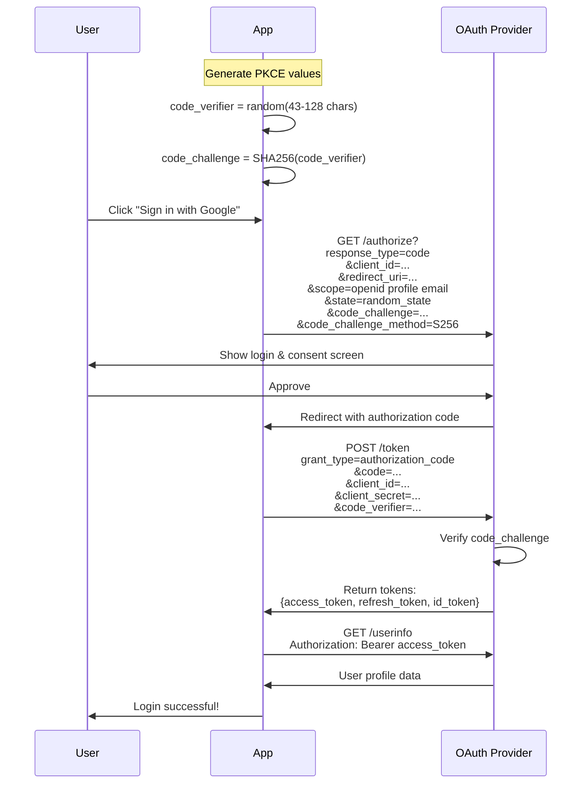
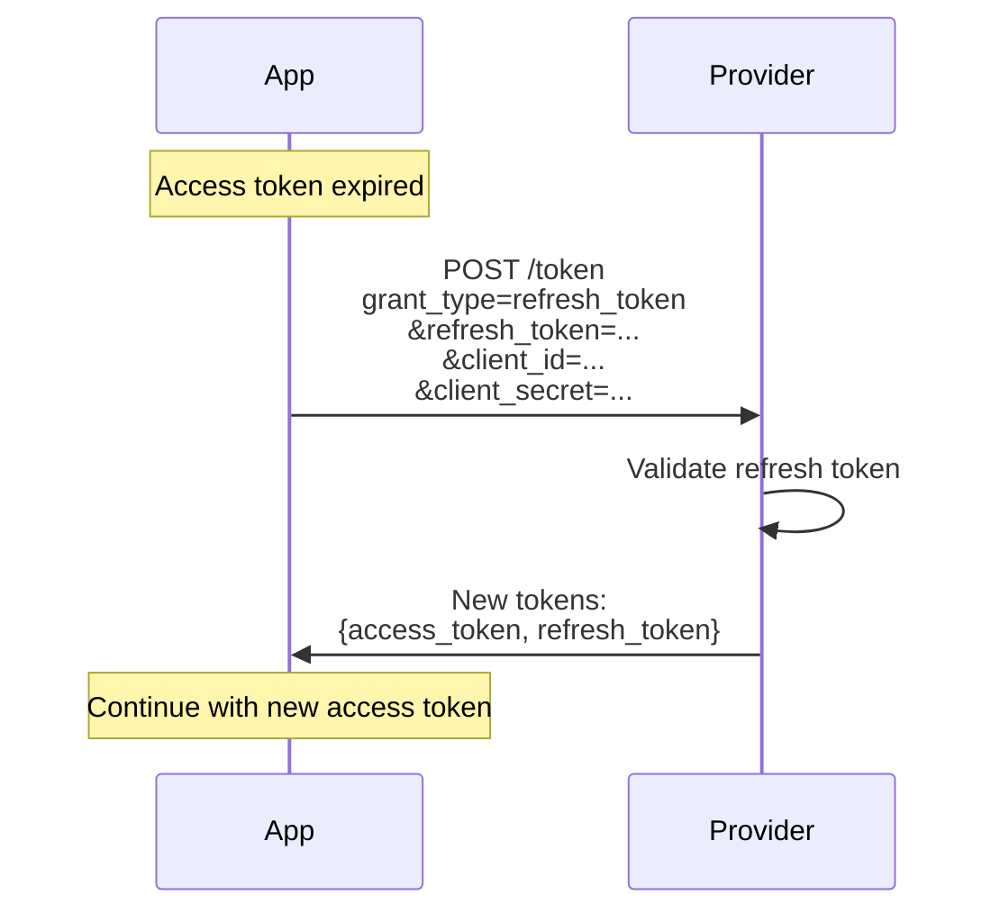

# 🔐 OAuth 2.0 & OpenID Connect Demo

A comprehensive demonstration of OAuth 2.0 and OpenID Connect with **real provider integrations** (Google, Microsoft, GitHub) and in-memory database.

  

## 🌟 Features

### Supported OAuth 2.0 Flows

1. **🔵 Authorization Code Flow with PKCE**
   - Most secure flow for web and mobile apps
   - PKCE (Proof Key for Code Exchange) protection
   - Complete implementation with state parameter

2. **🔷 Client Credentials Flow**
   - Service-to-service authentication
   - No user interaction required
   - Machine-to-machine communication

3. **🔶 Implicit Flow** *(Deprecated - Educational Only)*
   - Legacy flow for single-page apps
   - Shown for learning purposes
   - Not recommended for production

### OpenID Connect (OIDC) Features

1. **🆔 ID Tokens (JWT)**
   - User identity verification
   - Claims extraction
   - Token validation

2. **👤 UserInfo Endpoint**
   - Fetch user profile data
   - Standard OIDC claims
   - Provider-specific data

3. **🔍 Discovery**
   - OIDC Discovery endpoint
   - Dynamic configuration
   - Metadata retrieval

### Provider Integrations

1. **🔴 Google OAuth 2.0**
   - Sign in with Google
   - Access Google APIs
   - OpenID Connect compliant

2. **🔵 Microsoft OAuth 2.0**
   - Sign in with Microsoft Account
   - Azure AD integration
   - Office 365 access

3. **⚫ GitHub OAuth 2.0**
   - Sign in with GitHub
   - Repository access
   - User profile data

## 🚀 Quick Start

### Prerequisites

- Node.js (v18 or higher)
- npm or yarn
- OAuth credentials from providers (see setup below)

### Installation

```bash
cd oauth-demo
npm install
```

### Configuration

1. **Copy environment template:**

   ```bash
   cp .env.example .env
   ```

2. **Set up OAuth credentials (see detailed instructions below):**
   - Google OAuth
   - Microsoft OAuth
   - GitHub OAuth

3. **Start the server:**

   ```bash
   npm start
   ```

4. **Access the application:**

   ```
   http://localhost:3008
   ```

## 📋 OAuth Provider Setup

### 1. Google OAuth 2.0 Setup

**Step 1:** Go to [Google Cloud Console](https://console.cloud.google.com/)

**Step 2:** Create a new project (or select existing)

**Step 3:** Enable Google+ API

- APIs & Services → Library
- Search "Google+ API"
- Click "Enable"

**Step 4:** Create OAuth 2.0 credentials

- APIs & Services → Credentials
- Create Credentials → OAuth client ID
- Application type: Web application
- Name: "OAuth Demo"

**Step 5:** Configure authorized redirect URIs

```
http://localhost:3008/auth/google/callback
```

**Step 6:** Copy credentials to `.env`:

```env
GOOGLE_CLIENT_ID=your-client-id-here.apps.googleusercontent.com
GOOGLE_CLIENT_SECRET=your-client-secret-here
GOOGLE_CALLBACK_URL=http://localhost:3008/auth/google/callback
```

### 2. Microsoft OAuth 2.0 Setup

**Step 1:** Go to [Azure Portal](https://portal.azure.com/)

**Step 2:** Navigate to Azure Active Directory

- Azure Active Directory → App registrations → New registration

**Step 3:** Register application

- Name: "OAuth Demo"
- Supported account types: "Accounts in any organizational directory and personal Microsoft accounts"
- Redirect URI: Web - `http://localhost:3008/auth/microsoft/callback`
- Click "Register"

**Step 4:** Copy Application (client) ID

**Step 5:** Create client secret

- Certificates & secrets → New client secret
- Description: "OAuth Demo Secret"
- Expires: 24 months
- Click "Add"
- **Copy the secret value immediately** (won't show again)

**Step 6:** Configure API permissions

- API permissions → Add a permission
- Microsoft Graph → Delegated permissions
- Select: `User.Read`, `openid`, `profile`, `email`
- Click "Add permissions"

**Step 7:** Update `.env`:

```env
MICROSOFT_CLIENT_ID=your-application-id-here
MICROSOFT_CLIENT_SECRET=your-client-secret-here
MICROSOFT_CALLBACK_URL=http://localhost:3008/auth/microsoft/callback
```

### 3. GitHub OAuth 2.0 Setup

**Step 1:** Go to [GitHub Settings](https://github.com/settings/developers)

**Step 2:** OAuth Apps → New OAuth App

**Step 3:** Fill in application details

- Application name: "OAuth Demo"
- Homepage URL: `http://localhost:3008`
- Authorization callback URL: `http://localhost:3008/auth/github/callback`
- Click "Register application"

**Step 4:** Copy Client ID

**Step 5:** Generate client secret

- Click "Generate a new client secret"
- **Copy the secret immediately**

**Step 6:** Update `.env`:

```env
GITHUB_CLIENT_ID=your-github-client-id
GITHUB_CLIENT_SECRET=your-github-client-secret
GITHUB_CALLBACK_URL=http://localhost:3008/auth/github/callback
```

## 🏗️ Project Structure

```
oauth-demo/
├── server.js                      # Express server
├── package.json                   # Dependencies
├── .env                           # Environment variables (create from .env.example)
├── .env.example                   # Environment template
├── config/
│   └── passport.js                # Passport.js OAuth strategies
├── database/
│   └── Database.js                # In-memory database
├── routes/
│   ├── auth.js                    # OAuth authentication routes
│   ├── dashboard.js               # Protected routes
│   └── api.js                     # API endpoints
├── middleware/
│   └── auth.js                    # Authentication middleware
├── views/                         # EJS templates
│   ├── index.ejs                  # Home page
│   ├── login.ejs                  # Login page
│   ├── dashboard.ejs              # Dashboard
│   ├── profile.ejs                # User profile
│   ├── features.ejs               # OAuth features explanation
│   ├── providers.ejs              # Provider integrations
│   └── tokens.ejs                 # Token management
└── public/
    └── css/
        └── style.css              # Styles
```

## 📊 Database Schema

### In-Memory Database Structure

**Users Table:**

```javascript
{
  id: UUID,
  username: String,
  email: String,
  displayName: String,
  avatar: String,
  provider: 'google'|'microsoft'|'github',
  providerId: String,
  accessToken: String (encrypted),
  refreshToken: String (encrypted),
  tokenExpiry: Timestamp,
  createdAt: Timestamp,
  lastLogin: Timestamp,
  stats: {
    loginCount: Number,
    lastProvider: String
  }
}
```

**OAuth Sessions:**

```javascript
{
  id: UUID,
  userId: UUID,
  provider: String,
  accessToken: String,
  refreshToken: String,
  expiresAt: Timestamp,
  scopes: Array<String>,
  createdAt: Timestamp
}
```

**Audit Logs:**

```javascript
{
  id: UUID,
  userId: UUID,
  action: String,
  provider: String,
  ipAddress: String,
  timestamp: Timestamp,
  details: Object
}
```

## 🎯 OAuth Flows Explained

### Authorization Code Flow with PKCE



### Token Refresh Flow



## 🔒 Security Features

### PKCE Implementation

- **Code Verifier:** Random 43-128 character string
- **Code Challenge:** SHA-256 hash of verifier
- **Protection:** Prevents authorization code interception

### State Parameter

- Random value to prevent CSRF
- Validated on callback
- Session-based verification

### Token Storage

- Access tokens encrypted at rest
- Refresh tokens securely stored
- Automatic token refresh

### Scope Management

- Minimal scope requests
- User consent required
- Scope validation

## 📡 API Endpoints

### Authentication Routes

```
GET  /                              # Home page
GET  /login                         # Login page
GET  /dashboard                     # Protected dashboard
GET  /profile                       # User profile
GET  /features                      # OAuth features info
GET  /providers                     # Provider integrations
GET  /tokens                        # Token management

# Google OAuth
GET  /auth/google                   # Initiate Google OAuth
GET  /auth/google/callback          # Google callback

# Microsoft OAuth
GET  /auth/microsoft                # Initiate Microsoft OAuth
GET  /auth/microsoft/callback       # Microsoft callback

# GitHub OAuth
GET  /auth/github                   # Initiate GitHub OAuth
GET  /auth/github/callback          # GitHub callback

POST /auth/logout                   # Logout
POST /auth/refresh                  # Refresh access token
```

### API Routes

```
GET  /api/user                      # Get current user
GET  /api/tokens                    # Get user tokens
POST /api/tokens/refresh            # Refresh tokens
GET  /api/providers                 # List connected providers
DELETE /api/providers/:id           # Disconnect provider
```

## 🧪 Testing Guide

### Test Google OAuth

1. Visit <http://localhost:3008>
2. Click "Sign in with Google"
3. Select Google account
4. Grant permissions
5. Redirected to dashboard
6. View your Google profile data

### Test Microsoft OAuth

1. Click "Sign in with Microsoft"
2. Enter Microsoft account credentials
3. Consent to permissions
4. Access granted
5. See Microsoft profile

### Test GitHub OAuth

1. Click "Sign in with GitHub"
2. Authorize application
3. GitHub profile loaded
4. Access repositories (if scope granted)

### Test Token Refresh

1. Wait for access token to expire (or manually expire)
2. Make API request
3. App automatically refreshes token
4. Request succeeds with new token

### Test Multiple Providers

1. Sign in with Google
2. Disconnect Google provider
3. Sign in with Microsoft
4. Account linked to same user
5. Multiple provider connections

## 📚 Understanding OAuth & OIDC

### What is OAuth 2.0?

**OAuth 2.0** is an **authorization** framework that allows third-party applications to obtain limited access to user accounts without exposing passwords.

**Key Concepts:**

- **Resource Owner:** You (the user)
- **Client:** The application requesting access
- **Authorization Server:** The OAuth provider (Google, Microsoft, etc.)
- **Resource Server:** API serving protected data

**Use Cases:**

- Social login ("Sign in with Google")
- API access (access your photos, calendar, etc.)
- Third-party integrations (Slack accessing Google Drive)

### What is OpenID Connect (OIDC)?

**OpenID Connect** is an **authentication** layer built on top of OAuth 2.0. It verifies **who you are** in addition to **what you can access**.

**Key Features:**

- **ID Token:** JWT containing user identity
- **UserInfo Endpoint:** Fetch user profile
- **Standardized Claims:** email, name, picture, etc.

**Difference from OAuth:**

- **OAuth:** "What can you access?" (Authorization)
- **OIDC:** "Who are you?" (Authentication + Authorization)

### OAuth Terminology

- **Access Token:** Key to access protected resources
- **Refresh Token:** Get new access tokens without re-authentication
- **ID Token:** JWT containing user identity (OIDC only)
- **Scope:** Permissions being requested (e.g., `profile`, `email`)
- **Grant Type:** OAuth flow being used
- **Redirect URI:** Where to send user after authentication

## 🎓 Learning Objectives

After using this demo, you'll understand:

1. **OAuth 2.0 Flows:**
   - Authorization Code Flow
   - PKCE security enhancement
   - Token exchange process

2. **OpenID Connect:**
   - ID Token structure
   - UserInfo endpoint
   - Claims mapping

3. **Provider Integration:**
   - Google OAuth setup
   - Microsoft Azure AD integration
   - GitHub OAuth configuration

4. **Security Best Practices:**
   - PKCE implementation
   - State parameter usage
   - Token storage and refresh

5. **Real-World Implementation:**
   - Passport.js strategies
   - Session management
   - Error handling

## ⚠️ Production Considerations

### Security

- [ ] Use HTTPS everywhere
- [ ] Store secrets in secure vault (not .env)
- [ ] Implement rate limiting
- [ ] Add CSRF protection
- [ ] Validate all redirect URIs
- [ ] Encrypt tokens at rest
- [ ] Implement token rotation
- [ ] Add logging and monitoring

### Database

- [ ] Replace in-memory DB with PostgreSQL/MySQL
- [ ] Implement connection pooling
- [ ] Add proper indexing
- [ ] Regular backups
- [ ] Data encryption

### Scalability

- [ ] Use Redis for sessions
- [ ] Implement caching
- [ ] Load balancing
- [ ] Horizontal scaling
- [ ] CDN for static assets

### Compliance

- [ ] GDPR compliance (data privacy)
- [ ] User consent management
- [ ] Data retention policies
- [ ] Right to be forgotten
- [ ] Audit logging

## 🐛 Troubleshooting

### "Redirect URI mismatch" Error

**Cause:** Callback URL doesn't match what's configured in provider

**Solution:**

1. Check `.env` callback URL
2. Verify provider dashboard settings
3. Ensure exact match (including http/https, port)

Example:

```
Provider: http://localhost:3008/auth/google/callback
.env:     http://localhost:3008/auth/google/callback
          ✅ Match
```

### "Invalid Client" Error

**Cause:** Client ID or Secret incorrect

**Solution:**

1. Verify credentials in `.env`
2. Regenerate secrets if needed
3. Check for extra spaces or newlines

### "Access Denied" Error

**Cause:** User denied permissions or scope issues

**Solution:**

1. Check requested scopes
2. User must grant all required permissions
3. Verify scope configuration in provider

### Token Refresh Fails

**Cause:** Refresh token expired or revoked

**Solution:**

1. User must re-authenticate
2. Check refresh token expiry
3. Verify scope includes `offline_access`

## 📄 License

MIT License - Educational purposes

---

## 🤝 Contributing

This is a demo/educational project. Feel free to:

- Report issues
- Suggest improvements
- Submit pull requests
- Use in your learning

---

**Built for learning OAuth 2.0 & OpenID Connect through hands-on practice** 🚀

## Next Steps

1. **Set up OAuth credentials** for all three providers
2. **Install dependencies:** `npm install`
3. **Configure `.env`** with your credentials
4. **Start the server:** `npm start`
5. **Test each provider** integration
6. **Explore the code** and learn!

Happy learning! 🎓
