# Password-Based Authentication - Advanced Level

## Technical Deep Dive

This advanced guide explores the cryptographic foundations, security protocols, standards, and architectural patterns for implementing enterprise-grade password-based authentication systems.

## Cryptographic Foundations

### Hash Function Deep Dive

#### Argon2 - Current Best Practice

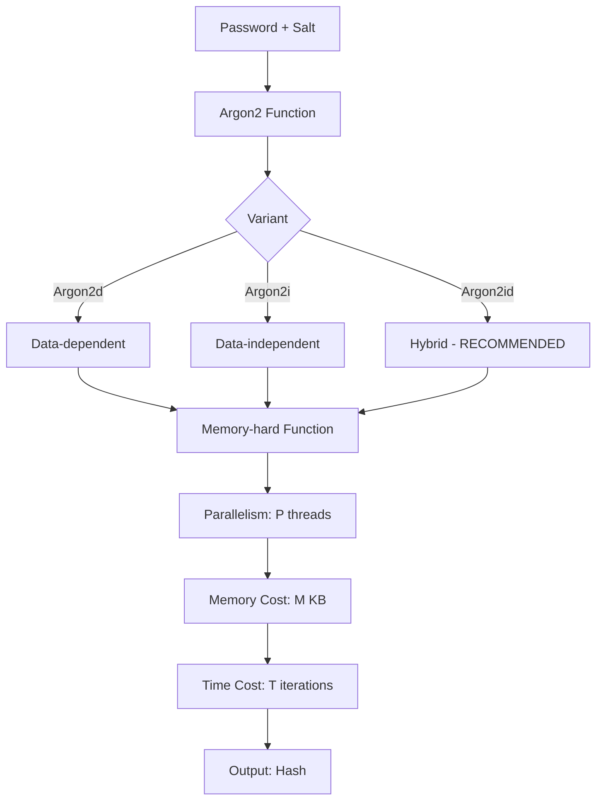
```mermaid
graph TD
    A[Password + Salt] --> B[Argon2 Function]
    B --> C{Variant}
    C -->|Argon2d| D[Data-dependent]
    C -->|Argon2i| E[Data-independent]
    C -->|Argon2id| F[Hybrid - RECOMMENDED]
    
    D --> G[Memory-hard Function]
    E --> G
    F --> G
    
    G --> H[Parallelism: P threads]
    H --> I[Memory Cost: M KB]
    I --> J[Time Cost: T iterations]
    J --> K[Output: Hash]
```

**Argon2id Parameters:**

| Parameter | Purpose | Recommended Value | Explanation |
|-----------|---------|-------------------|-------------|
| Memory Cost (m) | Memory in KB | 65536 (64 MB) | Resists GPU/ASIC attacks |
| Time Cost (t) | Iterations | 3-4 | Computational work |
| Parallelism (p) | Threads | 4 | Parallel execution |
| Salt Length | Unique per user | 16 bytes | Prevents rainbow tables |
| Hash Length | Output size | 32 bytes | Sufficient security |

**Security Properties:**

- **Memory-hard**: Requires substantial RAM, defeating ASIC/GPU attacks
- **Side-channel resistant**: Argon2id variant protects against timing attacks
- **Tunable**: Adjust parameters as hardware improves
- **Winner**: Password Hashing Competition (PHC) 2015

### Salt and Pepper Implementation

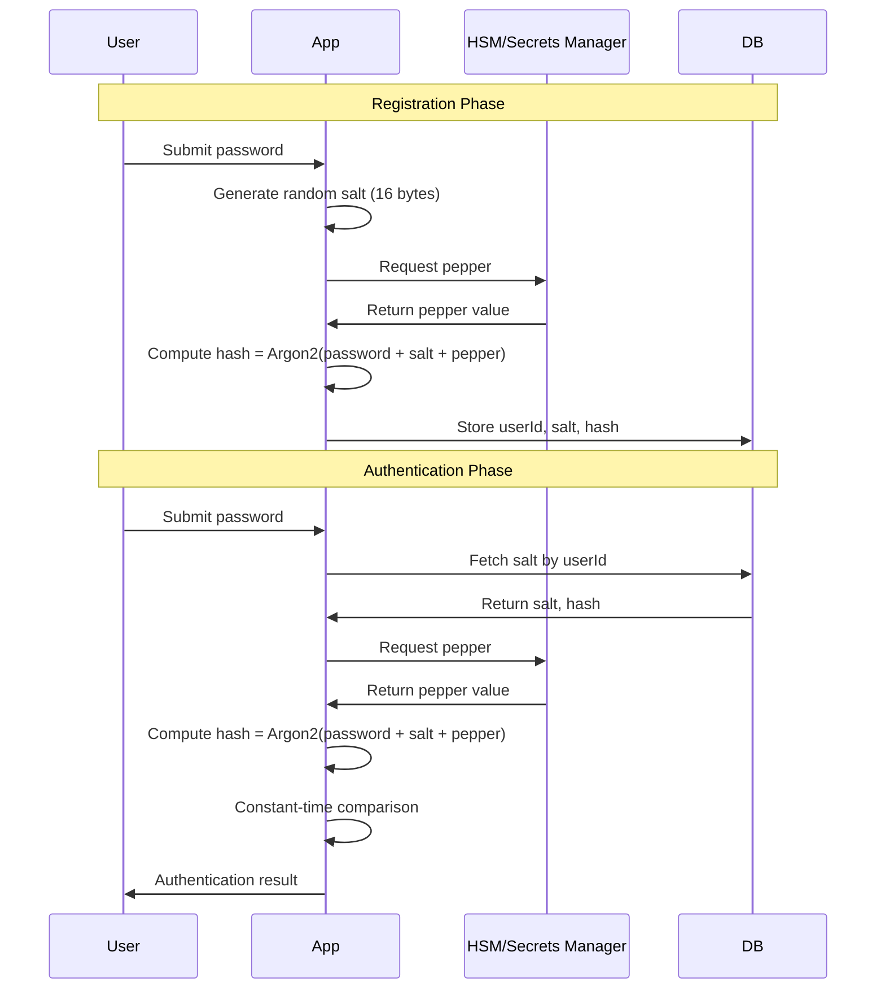
```mermaid
sequenceDiagram
    participant User
    participant App
    participant HSM as HSM/Secrets Manager
    participant DB
    
    Note over User,DB: Registration Phase
    User->>App: Submit password
    App->>App: Generate random salt (16 bytes)
    App->>HSM: Request pepper
    HSM->>App: Return pepper value
    App->>App: Compute hash = Argon2(password + salt + pepper)
    App->>DB: Store userId, salt, hash
    
    Note over User,DB: Authentication Phase
    User->>App: Submit password
    App->>DB: Fetch salt by userId
    DB->>App: Return salt, hash
    App->>HSM: Request pepper
    HSM->>App: Return pepper value
    App->>App: Compute hash = Argon2(password + salt + pepper)
    App->>App: Constant-time comparison
    App->>User: Authentication result
```

**Pepper Best Practices:**

- Store in Hardware Security Module (HSM) or secrets manager
- Never store in database or source code
- Rotate periodically with migration strategy
- Use different peppers for different environments

### Constant-Time Comparison

**Why it matters:** Prevents timing attacks

```python
# ❌ VULNERABLE - timing attack possible
def insecure_compare(hash1, hash2):
    return hash1 == hash2  # Returns immediately on first mismatch

# ✅ SECURE - constant time comparison
import hmac

def secure_compare(hash1, hash2):
    return hmac.compare_digest(hash1, hash2)  # Always takes same time
```

## Security Standards and Protocols

### NIST SP 800-63B - Digital Identity Guidelines

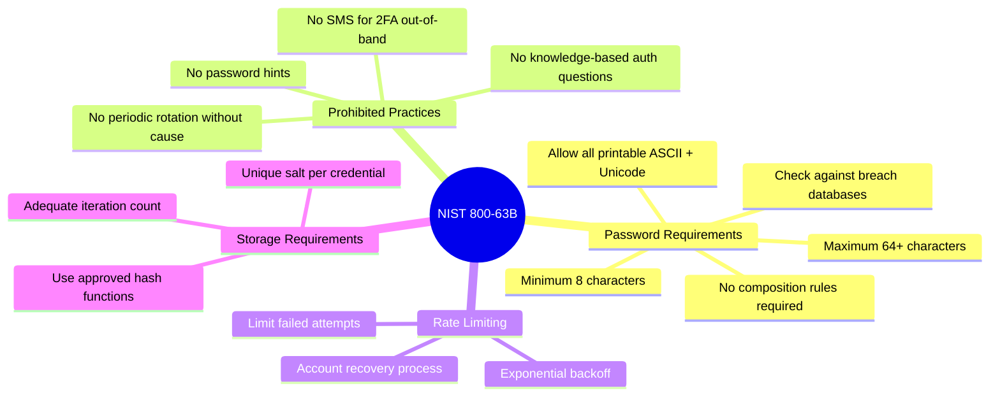
```mermaid
mindmap
  root((NIST 800-63B))
    Password Requirements
      Minimum 8 characters
      Maximum 64+ characters
      Allow all printable ASCII + Unicode
      No composition rules required
      Check against breach databases
    Prohibited Practices
      No periodic rotation without cause
      No password hints
      No knowledge-based auth questions
      No SMS for 2FA out-of-band
    Rate Limiting
      Limit failed attempts
      Exponential backoff
      Account recovery process
    Storage Requirements
      Use approved hash functions
      Unique salt per credential
      Adequate iteration count
```

**Key Recommendations:**

1. **Minimum length**: 8 characters (12+ for sensitive systems)
2. **No complexity requirements**: Don't force special characters
3. **Check compromised passwords**: Use HaveIBeenPwned API
4. **No password expiration**: Unless evidence of compromise
5. **Allow paste**: Don't block password managers

### OWASP Authentication Guidelines

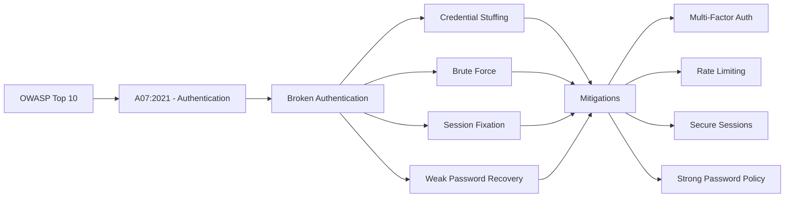
```mermaid
graph LR
    A[OWASP Top 10] --> B[A07:2021 - Authentication]
    B --> C[Broken Authentication]
    
    C --> D[Credential Stuffing]
    C --> E[Brute Force]
    C --> F[Session Fixation]
    C --> G[Weak Password Recovery]
    
    D --> H[Mitigations]
    E --> H
    F --> H
    G --> H
    
    H --> I[Multi-Factor Auth]
    H --> J[Rate Limiting]
    H --> K[Secure Sessions]
    H --> L[Strong Password Policy]
```

## Advanced Threat Detection

### Machine Learning-Based Anomaly Detection

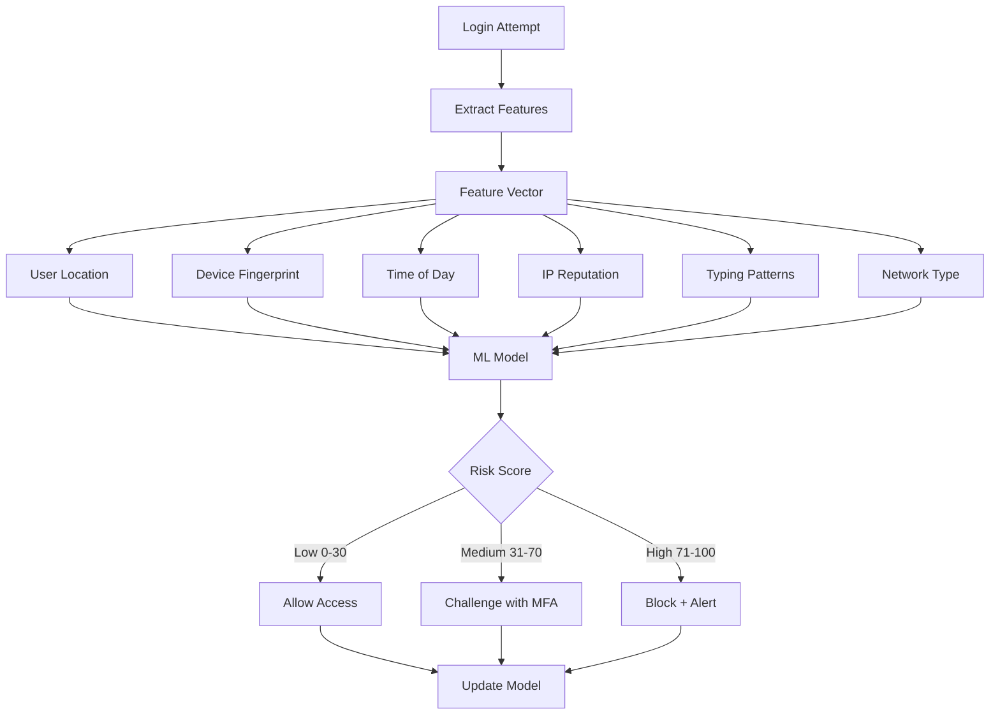
```mermaid
flowchart TD
    A[Login Attempt] --> B[Extract Features]
    B --> C[Feature Vector]
    
    C --> D[User Location]
    C --> E[Device Fingerprint]
    C --> F[Time of Day]
    C --> G[IP Reputation]
    C --> H[Typing Patterns]
    C --> I[Network Type]
    
    D --> J[ML Model]
    E --> J
    F --> J
    G --> J
    H --> J
    I --> J
    
    J --> K{Risk Score}
    K -->|Low 0-30| L[Allow Access]
    K -->|Medium 31-70| M[Challenge with MFA]
    K -->|High 71-100| N[Block + Alert]
    
    L --> O[Update Model]
    M --> O
    N --> O
```

**Features for ML Model:**
- Geographic location and velocity
- Device characteristics and history
- Time-based patterns
- Network type (VPN, Tor, datacenter)
- Behavioral biometrics (typing speed, mouse movements)
- Failed attempt patterns
- Account age and history

### Credential Breach Detection

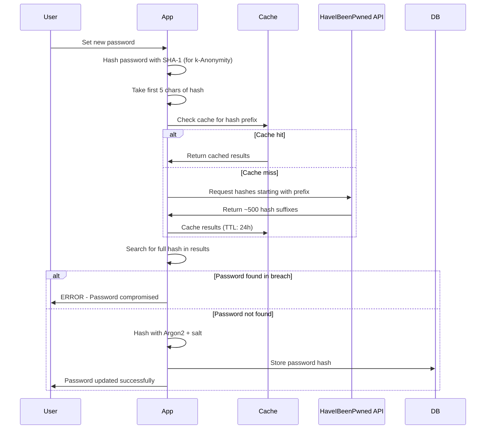
```mermaid
%%{init: {\'theme\':\'dark\'}}%%
sequenceDiagram
    participant User
    participant App
    participant Cache
    participant HibpAPI as HaveIBeenPwned API
    participant DB
    
    User->>App: Set new password
    App->>App: Hash password with SHA-1 (for k-Anonymity)
    App->>App: Take first 5 chars of hash
    App->>Cache: Check cache for hash prefix
    
    alt Cache hit
        Cache->>App: Return cached results
    else Cache miss
        App->>HibpAPI: Request hashes starting with prefix
        HibpAPI->>App: Return ~500 hash suffixes
        App->>Cache: Cache results (TTL: 24h)
    end
    
    App->>App: Search for full hash in results
    
    alt Password found in breach
        App->>User: ERROR - Password compromised
    else Password not found
        App->>App: Hash with Argon2 + salt
        App->>DB: Store password hash
        App->>User: Password updated successfully
    end
```

**k-Anonymity Protocol:**
- Client hashes password with SHA-1
- Sends only first 5 characters to API
- Receives all hashes with that prefix
- Locally checks if full hash exists
- Password never sent over network

## Advanced Architecture Patterns

### Microservices Authentication Pattern

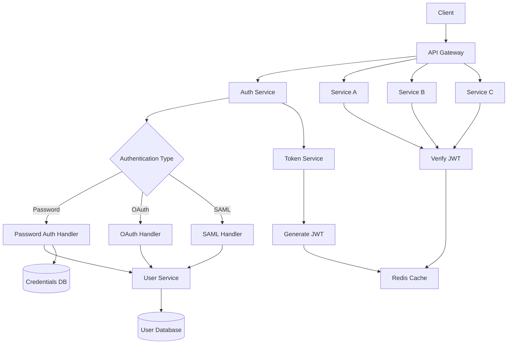
```mermaid
%%{init: {\'theme\':\'dark\'}}%%
graph TB
    A[Client] --> B[API Gateway]
    B --> C[Auth Service]
    C --> D{Authentication Type}
    
    D -->|Password| E[Password Auth Handler]
    D -->|OAuth| F[OAuth Handler]
    D -->|SAML| G[SAML Handler]
    
    E --> H[User Service]
    F --> H
    G --> H
    
    H --> I[(User Database)]
    E --> J[(Credentials DB)]
    
    C --> K[Token Service]
    K --> L[Generate JWT]
    L --> M[Redis Cache]
    
    B --> N[Service A]
    B --> O[Service B]
    B --> P[Service C]
    
    N --> Q[Verify JWT]
    O --> Q
    P --> Q
    
    Q --> M
```

**Key Components:**

1. **Auth Service**: Centralized authentication logic
2. **Token Service**: JWT generation and validation
3. **User Service**: User profile and permissions
4. **API Gateway**: Request routing and token verification
5. **Redis Cache**: Token blacklist and session data

### Zero-Trust Architecture

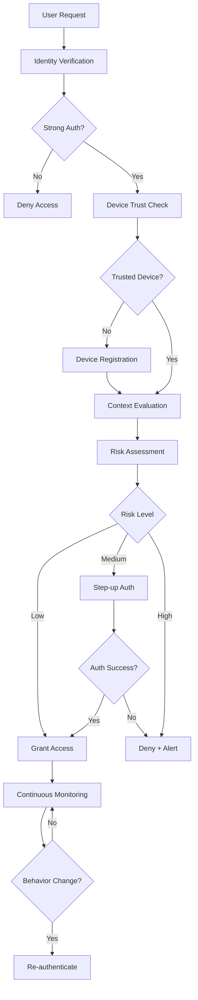
```mermaid
%%{init: {\'theme\':\'dark\'}}%%
flowchart TD
    A[User Request] --> B[Identity Verification]
    B --> C{Strong Auth?}
    C -->|No| D[Deny Access]
    C -->|Yes| E[Device Trust Check]
    
    E --> F{Trusted Device?}
    F -->|No| G[Device Registration]
    F -->|Yes| H[Context Evaluation]
    
    G --> H
    H --> I[Risk Assessment]
    
    I --> J{Risk Level}
    J -->|Low| K[Grant Access]
    J -->|Medium| L[Step-up Auth]
    J -->|High| M[Deny + Alert]
    
    K --> N[Continuous Monitoring]
    L --> O{Auth Success?}
    O -->|Yes| K
    O -->|No| M
    
    N --> P{Behavior Change?}
    P -->|Yes| Q[Re-authenticate]
    P -->|No| N
```

**Zero-Trust Principles:**
- Never trust, always verify
- Assume breach mentality
- Verify explicitly (device, user, context)
- Use least privilege access
- Continuous authentication and monitoring

## Migration Strategies

### Migrating from Password to Passwordless

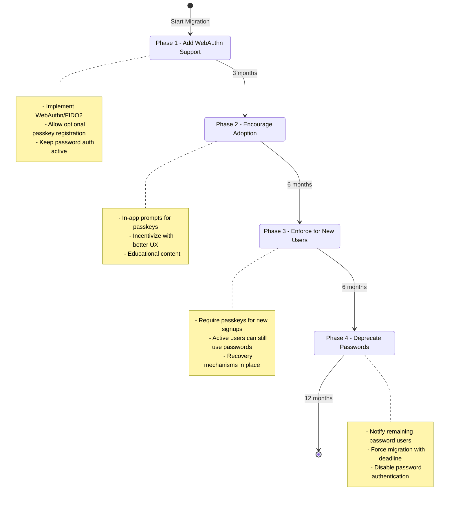
```mermaid
%%{init: {\'theme\':\'dark\'}}%%
stateDiagram-v2
    [*] --> Phase1: Start Migration
    
    Phase1: Phase 1 - Add WebAuthn Support
    Phase1 --> Phase2: 3 months
    
    Phase2: Phase 2 - Encourage Adoption
    Phase2 --> Phase3: 6 months
    
    Phase3: Phase 3 - Enforce for New Users
    Phase3 --> Phase4: 6 months
    
    Phase4: Phase 4 - Deprecate Passwords
    Phase4 --> [*]: 12 months
    
    note right of Phase1
        - Implement WebAuthn/FIDO2
        - Allow optional passkey registration
        - Keep password auth active
    end note
    
    note right of Phase2
        - In-app prompts for passkeys
        - Incentivize with better UX
        - Educational content
    end note
    
    note right of Phase3
        - Require passkeys for new signups
        - Active users can still use passwords
        - Recovery mechanisms in place
    end note
    
    note right of Phase4
        - Notify remaining password users
        - Force migration with deadline
        - Disable password authentication
    end note
```

### Password Hash Algorithm Migration

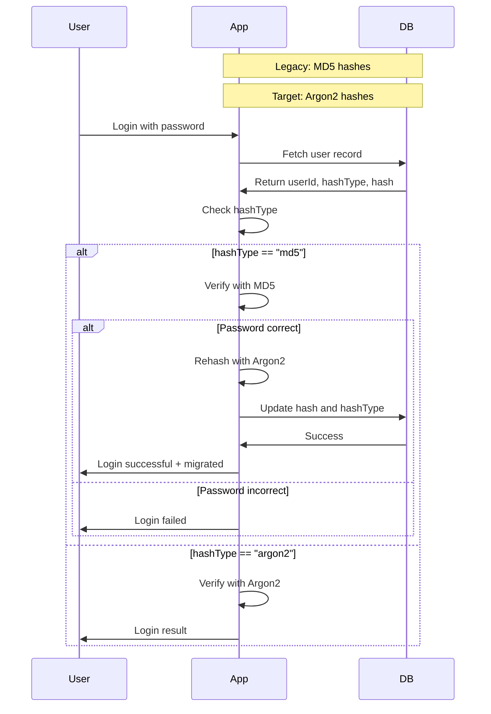
```mermaid
%%{init: {\'theme\':\'dark\'}}%%
sequenceDiagram
    participant User
    participant App
    participant DB
    
    Note over App,DB: Legacy: MD5 hashes
    Note over App,DB: Target: Argon2 hashes
    
    User->>App: Login with password
    App->>DB: Fetch user record
    DB->>App: Return userId, hashType, hash
    
    App->>App: Check hashType
    
    alt hashType == "md5"
        App->>App: Verify with MD5
        alt Password correct
            App->>App: Rehash with Argon2
            App->>DB: Update hash and hashType
            DB->>App: Success
            App->>User: Login successful + migrated
        else Password incorrect
            App->>User: Login failed
        end
    else hashType == "argon2"
        App->>App: Verify with Argon2
        App->>User: Login result
    end
```

**Migration Best Practices:**
- Transparent to users (no action required)
- Update on successful login
- Set migration deadline
- Maintain backward compatibility during transition
- Monitor migration progress

## Compliance and Regulations

### PCI-DSS Requirements

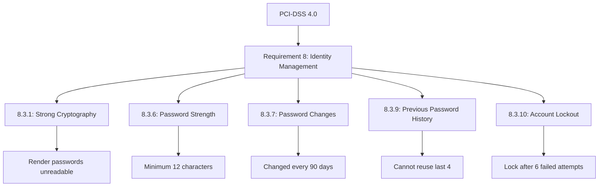
```mermaid
%%{init: {\'theme\':\'dark\'}}%%
graph TD
    A[PCI-DSS 4.0] --> B[Requirement 8: Identity Management]
    
    B --> C[8.3.1: Strong Cryptography]
    B --> D[8.3.6: Password Strength]
    B --> E[8.3.7: Password Changes]
    B --> F[8.3.9: Previous Password History]
    B --> G[8.3.10: Account Lockout]
    
    C --> H[Render passwords unreadable]
    D --> I[Minimum 12 characters]
    E --> J[Changed every 90 days]
    F --> K[Cannot reuse last 4]
    G --> L[Lock after 6 failed attempts]
```

### GDPR Considerations

**Data Protection Requirements:**

| Aspect | GDPR Requirement | Implementation |
|--------|------------------|----------------|
| Data Minimization | Collect only necessary data | Store hashed passwords, not plaintext |
| Purpose Limitation | Use data only for stated purpose | Auth only, no analytics on passwords |
| Storage Limitation | Delete when no longer needed | Purge inactive accounts |
| Security | Appropriate technical measures | Encryption, secure hashing |
| Breach Notification | Notify within 72 hours | Monitoring and alert systems |
| Right to Erasure | Delete user data on request | Account deletion workflow |

## Future Trends and Innovations

### Passwordless Authentication Evolution

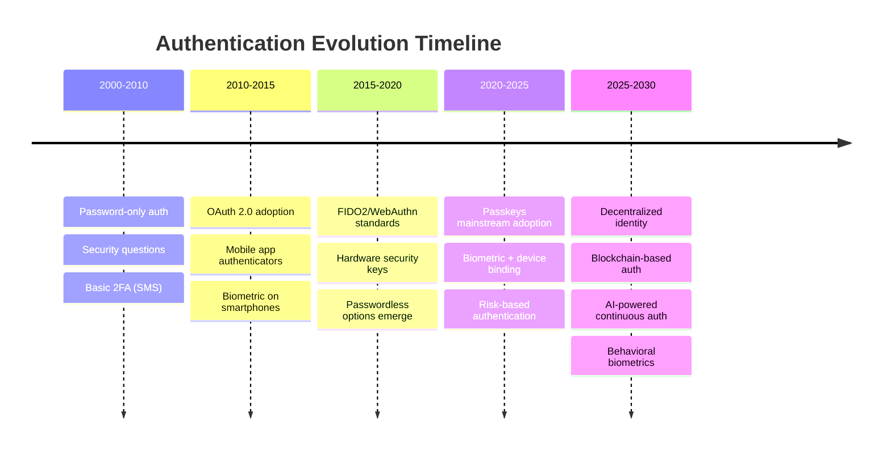
```mermaid
%%{init: {\'theme\':\'dark\'}}%%
timeline
    title Authentication Evolution Timeline
    2000-2010 : Password-only auth
              : Security questions
              : Basic 2FA (SMS)
    2010-2015 : OAuth 2.0 adoption
              : Mobile app authenticators
              : Biometric on smartphones
    2015-2020 : FIDO2/WebAuthn standards
              : Hardware security keys
              : Passwordless options emerge
    2020-2025 : Passkeys mainstream adoption
              : Biometric + device binding
              : Risk-based authentication
    2025-2030 : Decentralized identity
              : Blockchain-based auth
              : AI-powered continuous auth
              : Behavioral biometrics
```

### Decentralized Identity (DID)

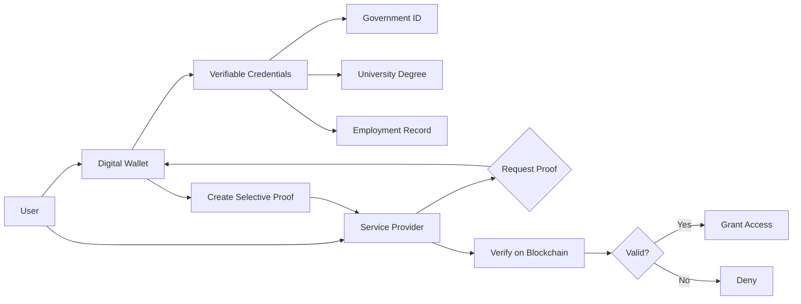
```mermaid
%%{init: {\'theme\':\'dark\'}}%%
graph LR
    A[User] --> B[Digital Wallet]
    B --> C[Verifiable Credentials]
    
    C --> D[Government ID]
    C --> E[University Degree]
    C --> F[Employment Record]
    
    A --> G[Service Provider]
    G --> H{Request Proof}
    H --> B
    B --> I[Create Selective Proof]
    I --> G
    
    G --> J[Verify on Blockchain]
    J --> K{Valid?}
    K -->|Yes| L[Grant Access]
    K -->|No| M[Deny]
```

**Benefits:**
- User controls their identity data
- No central authority required
- Selective disclosure (share only what's needed)
- Portable across services
- Cryptographically verifiable

### Quantum-Resistant Cryptography

**Current Threat:** Quantum computers could break current hash functions

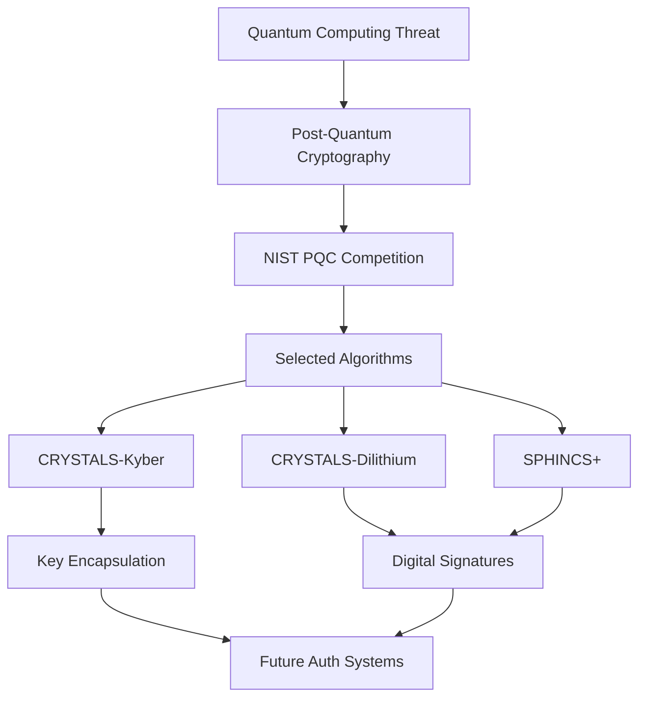
```mermaid
%%{init: {\'theme\':\'dark\'}}%%
graph TD
    A[Quantum Computing Threat] --> B[Post-Quantum Cryptography]
    
    B --> C[NIST PQC Competition]
    C --> D[Selected Algorithms]
    
    D --> E[CRYSTALS-Kyber]
    D --> F[CRYSTALS-Dilithium]
    D --> G[SPHINCS+]
    
    E --> H[Key Encapsulation]
    F --> I[Digital Signatures]
    G --> I
    
    H --> J[Future Auth Systems]
    I --> J
```

**Preparation Steps:**
1. **Crypto Agility**: Design systems to swap algorithms easily
2. **Hybrid Approach**: Use both classical and post-quantum algorithms
3. **Monitor NIST Standards**: Track standardization progress
4. **Plan Migration**: Start planning even if threat is years away

## Advanced Implementation Example

### Multi-Method Healthcare Authentication System

**Scenario:** Hospital EHR system requiring highest security with good UX

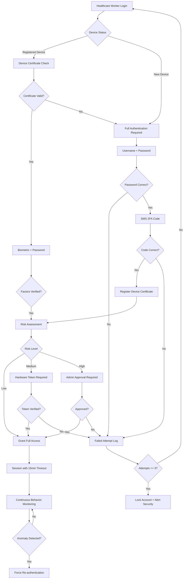
```mermaid
%%{init: {\'theme\':\'dark\'}}%%
flowchart TD
    A[Healthcare Worker Login] --> B{Device Status}
    B -->|Registered Device| C[Device Certificate Check]
    B -->|New Device| D[Full Authentication Required]
    
    C --> E{Certificate Valid?}
    E -->|Yes| F[Biometric + Password]
    E -->|No| D
    
    D --> G[Username + Password]
    G --> H{Password Correct?}
    H -->|No| I[Failed Attempt Log]
    H -->|Yes| J[SMS 2FA Code]
    
    F --> K{Factors Verified?}
    J --> L{Code Correct?}
    
    K -->|Yes| M[Risk Assessment]
    L -->|Yes| N[Register Device Certificate]
    L -->|No| I
    
    N --> M
    
    M --> O{Risk Level}
    O -->|Low| P[Grant Full Access]
    O -->|Medium| Q[Hardware Token Required]
    O -->|High| R[Admin Approval Required]
    
    Q --> S{Token Verified?}
    S -->|Yes| P
    S -->|No| I
    
    R --> T{Approved?}
    T -->|Yes| P
    T -->|No| I
    
    P --> U[Session with 15min Timeout]
    U --> V[Continuous Behavior Monitoring]
    
    V --> W{Anomaly Detected?}
    W -->|Yes| X[Force Re-authentication]
    W -->|No| V
    
    I --> Y{Attempts >= 3?}
    Y -->|Yes| Z[Lock Account + Alert Security]
    Y -->|No| A
```

**System Components:**

1. **Layer 1 - Device Trust**
   - Client certificates for registered devices
   - Device fingerprinting
   - Automatic renewal every 90 days

2. **Layer 2 - User Authentication**
   - Password (Argon2id hashed)
   - Biometric (fingerprint or face)
   - SMS or authenticator app for 2FA

3. **Layer 3 - Context-Aware**
   - Location verification
   - Time-of-day analysis
   - Network type checking

4. **Layer 4 - Risk-Based Decisions**
   - ML model for anomaly detection
   - Adaptive authentication requirements
   - Step-up authentication for high-risk actions

5. **Layer 5 - Continuous Monitoring**
   - Behavioral biometrics
   - Session timeout management
   - Real-time threat detection

## Performance Optimization

### Caching Strategy

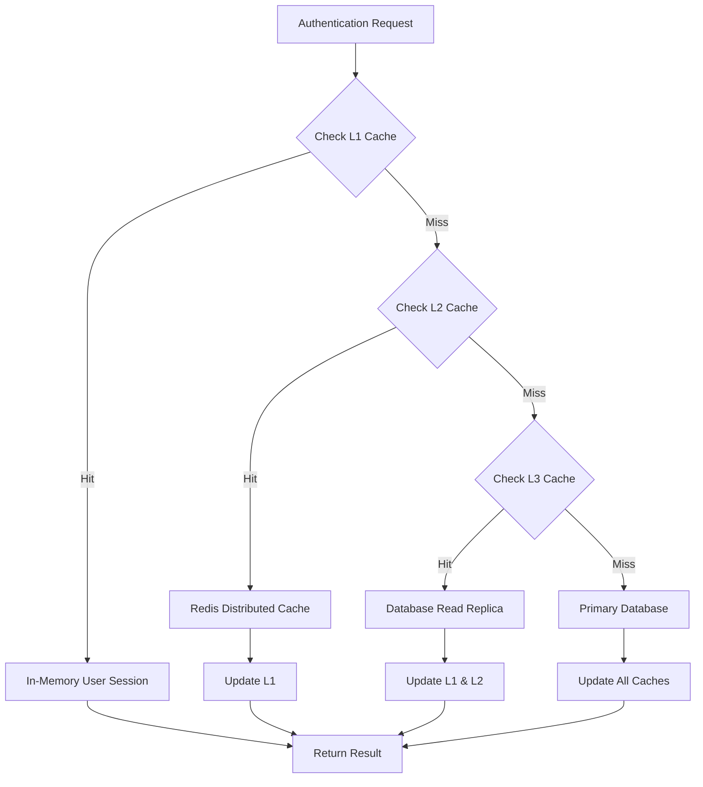
```mermaid
%%{init: {\'theme\':\'dark\'}}%%
graph TD
    A[Authentication Request] --> B{Check L1 Cache}
    B -->|Hit| C[In-Memory User Session]
    B -->|Miss| D{Check L2 Cache}
    
    D -->|Hit| E[Redis Distributed Cache]
    D -->|Miss| F{Check L3 Cache}
    
    F -->|Hit| G[Database Read Replica]
    F -->|Miss| H[Primary Database]
    
    C --> I[Return Result]
    E --> J[Update L1]
    G --> K[Update L1 & L2]
    H --> L[Update All Caches]
    
    J --> I
    K --> I
    L --> I
```

**Cache TTL Strategy:**
- L1 (Memory): 5 minutes
- L2 (Redis): 30 minutes
- L3 (Read Replica): Real-time replication
- Invalidate on password change, logout, or security event

### Load Balancing for Auth Services

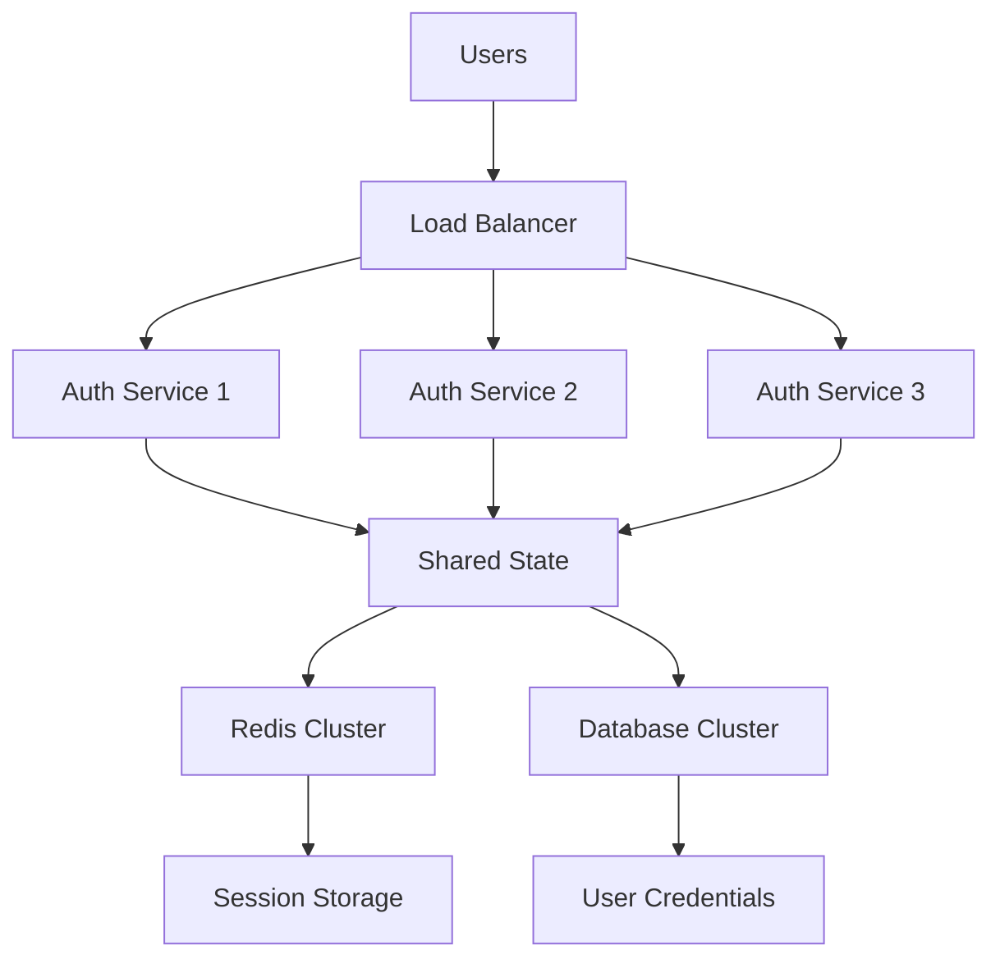
```mermaid
%%{init: {\'theme\':\'dark\'}}%%
graph TD
    A[Users] --> B[Load Balancer]
    B --> C[Auth Service 1]
    B --> D[Auth Service 2]
    B --> E[Auth Service 3]
    
    C --> F[Shared State]
    D --> F
    E --> F
    
    F --> G[Redis Cluster]
    F --> H[Database Cluster]
    
    G --> I[Session Storage]
    H --> J[User Credentials]
```

## Monitoring and Observability

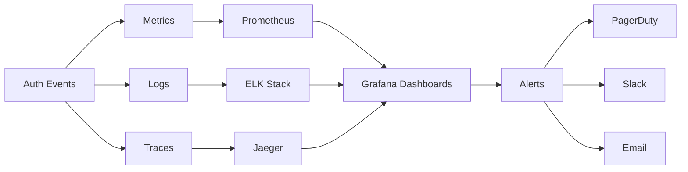
```mermaid
%%{init: {\'theme\':\'dark\'}}%%
graph LR
    A[Auth Events] --> B[Metrics]
    A --> C[Logs]
    A --> D[Traces]
    
    B --> E[Prometheus]
    C --> F[ELK Stack]
    D --> G[Jaeger]
    
    E --> H[Grafana Dashboards]
    F --> H
    G --> H
    
    H --> I[Alerts]
    I --> J[PagerDuty]
    I --> K[Slack]
    I --> L[Email]
```

**Key Metrics:**
- Login success/failure rates
- Authentication latency (p50, p95, p99)
- Hash computation time
- Cache hit rates
- Failed attempt patterns
- Geographic distribution of logins

## Security Testing

### Penetration Testing Checklist

- [ ] SQL injection in login forms
- [ ] XSS in authentication pages
- [ ] CSRF on login/logout endpoints
- [ ] Brute force resistance
- [ ] Credential stuffing prevention
- [ ] Session fixation attacks
- [ ] Session hijacking via XSS
- [ ] Man-in-the-middle attacks
- [ ] Password reset token security
- [ ] Rate limiting effectiveness
- [ ] Timing attack resistance
- [ ] Information disclosure in errors

## Conclusion

Password-based authentication remains relevant but must be:
- **Properly implemented** with modern cryptography
- **Layered** with additional factors
- **Monitored** continuously for threats
- **Evolved** toward passwordless solutions

The future is **passwordless**, but the transition requires careful planning and execution.

---

**Standards Referenced:** NIST SP 800-63B, OWASP ASVS, PCI-DSS 4.0, FIDO2, WebAuthn
**Algorithms:** Argon2id, bcrypt, PBKDF2, SHA-256/512
**Protocols:** TLS 1.3, mTLS, OAuth 2.0, OpenID Connect
