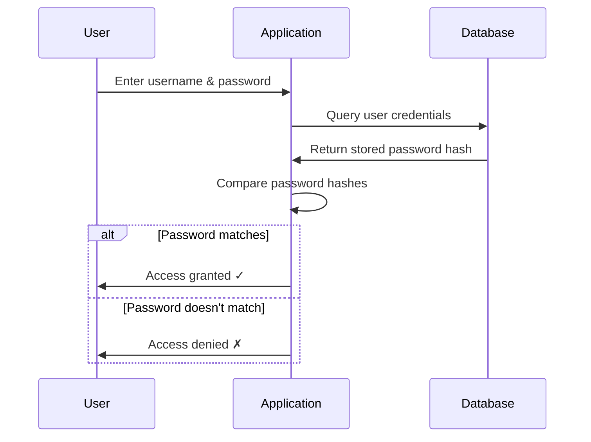
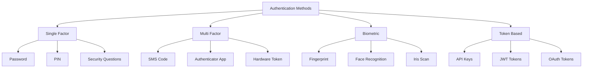
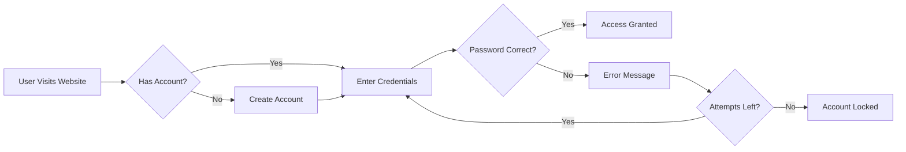

# Password-Based Authentication - Basic Level

## What is Authentication?

**Authentication** is the process of verifying the identity of a user, device, or system before granting access to resources. It answers the question: "Are you who you claim to be?"

### Why is Authentication Important?

- **Protects sensitive data** from unauthorized access
- **Ensures accountability** by tracking who accesses what
- **Maintains trust** between users and service providers
- **Prevents fraud** and malicious activities
- **Complies with regulations** (GDPR, HIPAA, PCI-DSS)

## Password-Based Authentication

### Definition

Password-based authentication is the most traditional and widely-used method where users provide:
1. **Username/Email** - Their identity claim
2. **Password** - A secret phrase or string only they should know

The system verifies the password matches what's stored, and if correct, grants access.

### How It Works



### Simple Examples

#### Example 1: Email Login
```
Username: john.doe@email.com
Password: MySecretP@ss123
```
**Use Case:** Logging into your personal email account (Gmail, Outlook, Yahoo)

#### Example 2: Banking Website
```
Customer ID: 123456789
Password: SecureBank#2024
```
**Use Case:** Accessing your online banking portal

#### Example 3: Social Media
```
Username: @johndoe
Password: SocialLife456!
```
**Use Case:** Logging into Facebook, Twitter, or Instagram

### Common Industries Using Password Authentication

| Industry | Application | Example |
|----------|-------------|---------|
| 🏦 Finance | Online banking, investment platforms | Chase Bank, PayPal |
| 🛒 E-commerce | Shopping websites, customer portals | Amazon, eBay |
| 📧 Communication | Email services, messaging apps | Gmail, Slack |
| 🎓 Education | Learning management systems | Coursera, Canvas |
| 💼 Enterprise | Internal company systems | Employee portals |
| 🎮 Gaming | Gaming platforms | Steam, Xbox Live |

## Types of Authentication Methods Overview



## Advantages of Password-Based Authentication

✅ **Simple to Implement** - Easy for developers to set up
✅ **Familiar to Users** - Everyone knows how passwords work
✅ **Low Infrastructure Cost** - No special hardware needed
✅ **Universal Support** - Works on any device or platform
✅ **Quick Setup** - Users can create accounts instantly

## Disadvantages of Password-Based Authentication

❌ **Weak Security** - Vulnerable to guessing and hacking
❌ **Password Fatigue** - Users have too many passwords to remember
❌ **Credential Reuse** - People use same password everywhere
❌ **Phishing Attacks** - Fake websites can steal passwords
❌ **Forgot Password Issues** - Frequent password resets needed

## Password Security Best Practices

### For Users
1. Use **strong, unique passwords** for each account
2. Make passwords **at least 12 characters** long
3. Include **uppercase, lowercase, numbers, and symbols**
4. Never **share passwords** with anyone
5. Use a **password manager** to remember them

### Example Strong Password
```
Weak:     password123
Better:   Password123!
Strong:   MyD0g&Loves#Walking!2024
```

## Real-World Security Incident

**Example:** In 2013, Adobe suffered a data breach where 153 million user passwords were compromised. Many were weakly encrypted, and common passwords like "123456" were easily cracked.

**Lesson:** Password-based authentication alone is not sufficient for protecting sensitive data.

## When to Use Password-Based Authentication

✅ **Good For:**
- Low-risk applications (personal blogs, forums)
- Internal tools with minimal sensitive data
- As one factor in multi-factor authentication
- Educational or demo applications

❌ **Not Recommended For:**
- Banking or financial applications (alone)
- Healthcare systems with patient data
- Administrative access to critical systems
- Applications storing sensitive personal information

## Simple Authentication Flow



## Key Takeaways

1. Password authentication is the **most common** but **least secure** method alone
2. Always combine with **other security measures** for important applications
3. Use **strong, unique passwords** for better security
4. Consider upgrading to **multi-factor authentication** for sensitive data
5. Password managers help maintain security without memory burden

## Next Steps

To learn more about password authentication:
- 📗 **Intermediate Level:** Explore industry-specific implementations and workflows
- 📕 **Advanced Level:** Deep dive into hashing algorithms, salt, and security protocols

---

**Related Topics:** Multi-Factor Authentication, Passwordless Authentication, Token-Based Authentication
