# Password-Based Authentication - Intermediate Level

## Deep Dive into Password Authentication

Password-based authentication forms the foundation of digital security across industries. This intermediate guide explores implementation details, industry-specific use cases, and real-world authentication workflows.

## Authentication Components

### 1. Password Storage

Modern systems never store passwords in plain text. Instead, they use cryptographic hashing:

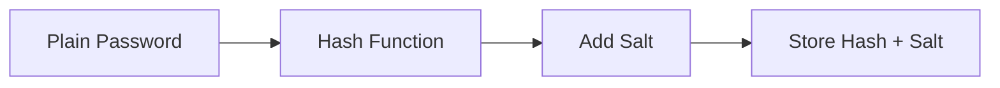

**Key Concepts:**
- **Hash Function**: One-way cryptographic function (SHA-256, bcrypt, Argon2)
- **Salt**: Random data added to password before hashing
- **Pepper**: Secret key added server-side (optional)

### 2. Password Verification Process

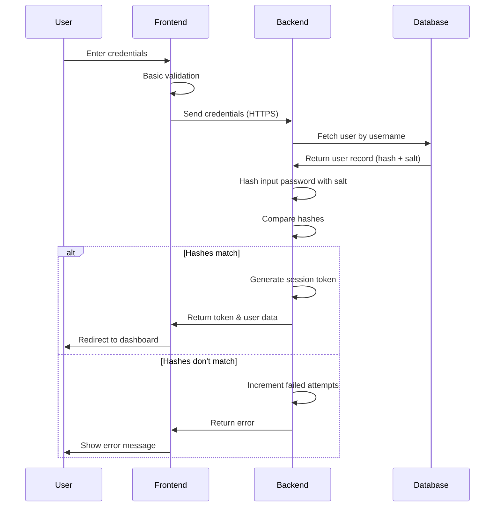

## Industry-Specific Use Cases

### 🏦 Finance Industry

**Use Case:** Online Banking Portal

**Requirements:**
- High security standards (PCI-DSS compliance)
- Account lockout after failed attempts
- Password complexity requirements
- Regular password rotation policies

**Example: Chase Bank Authentication**

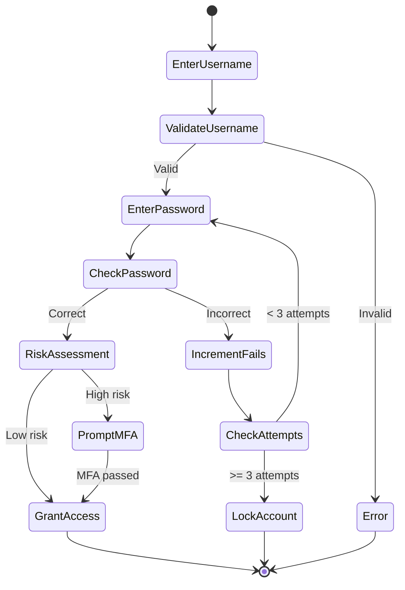

**Implementation Details:**
- Minimum 8 characters with mixed case, numbers, symbols
- Password history maintained (last 12 passwords)
- 90-day password expiration
- Account locks for 30 minutes after 3 failed attempts
- SSL/TLS encryption for transmission

### 🏥 Healthcare Industry

**Use Case:** Electronic Health Records (EHR) System

**Requirements:**
- HIPAA compliance
- Role-based access control (RBAC)
- Audit logging of all access
- Session timeout for inactive users

**Example: Epic Systems Login Flow**

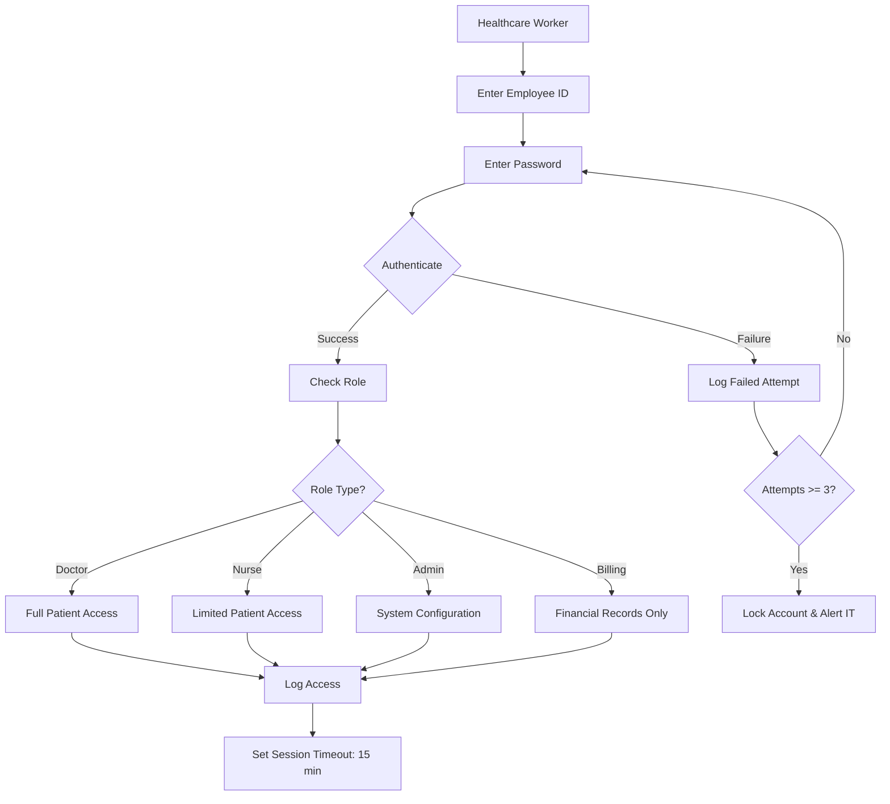

**Implementation Details:**
- Strong passwords (12+ chars, complexity requirements)
- Automatic logout after 15 minutes of inactivity
- All access logged with timestamps and user IDs
- Separate credentials from personal accounts
- Regular security training for staff

### 🛒 E-commerce Industry

**Use Case:** Customer Shopping Account

**Requirements:**
- Balance security with user experience
- Support social login as alternative
- Remember device for trusted users
- Password reset via email/SMS

**Example: Amazon Customer Authentication**

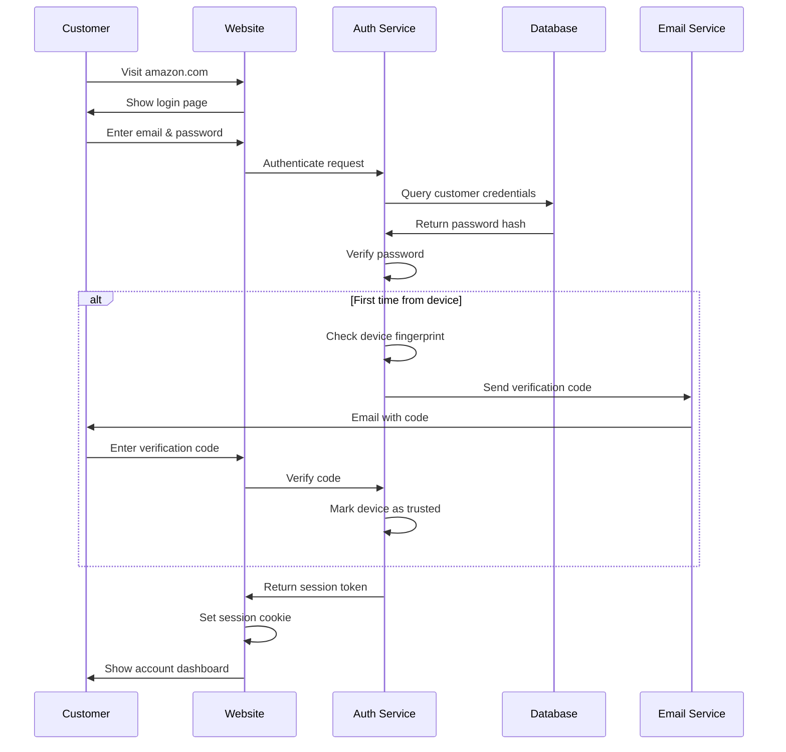

**Implementation Details:**
- Minimum 6 characters (balanced for UX)
- Device recognition via cookies and fingerprinting
- Optional "Stay signed in" for 30 days
- One-click password reset
- Monitoring for suspicious activity (new device, location)

### 🎓 Education Industry

**Use Case:** Learning Management System (LMS)

**Requirements:**
- Support for students, faculty, and administrators
- Integration with university identity systems
- Semester-based access control
- Simple password recovery for students

**Example: Canvas LMS Authentication**

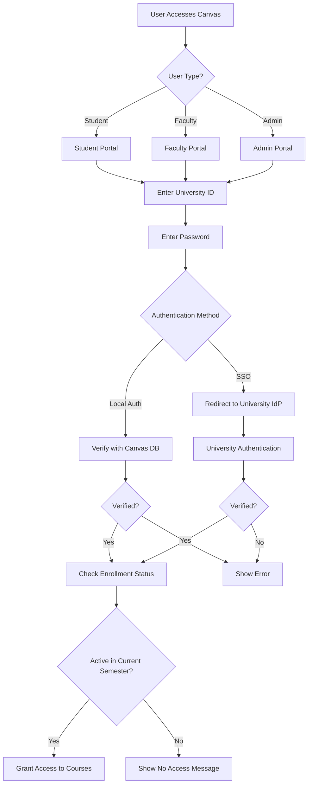

**Implementation Details:**
- Integration with university Active Directory
- Support for single sign-on (SSO)
- Password complexity requirements set by institution
- Self-service password reset using student email
- Access automatically disabled when not enrolled

## Password Complexity Requirements by Industry

| Industry | Min Length | Complexity | Rotation | Lockout Policy |
|----------|-----------|------------|----------|----------------|
| Banking | 12 chars | Upper, lower, number, symbol | 90 days | 3 attempts / 30 min |
| Healthcare | 12 chars | Upper, lower, number, symbol | 60 days | 3 attempts / 15 min |
| E-commerce | 8 chars | Upper, lower, number | Optional | 5 attempts / 1 hour |
| Government | 15 chars | Upper, lower, number, symbol | 60 days | 3 attempts / permanent |
| Education | 8 chars | Upper, lower, number | 180 days | 5 attempts / 2 hours |
| Corporate | 10 chars | Upper, lower, number, symbol | 90 days | 3 attempts / 20 min |

## Common Implementation Patterns

### Pattern 1: Basic Web Application

**Tech Stack:** Node.js + Express + PostgreSQL

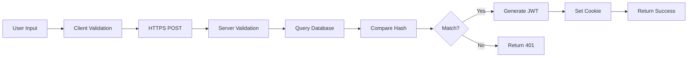

**Key Libraries:**
- `bcrypt` or `argon2` for password hashing
- `express-validator` for input validation
- `jsonwebtoken` for session management
- `helmet` for security headers

### Pattern 2: Mobile Application

**Tech Stack:** React Native + REST API

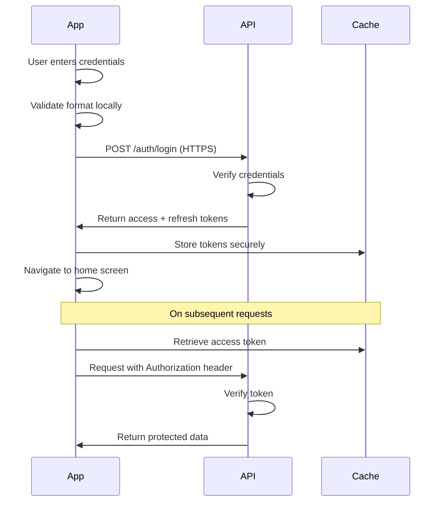

**Security Considerations:**
- Store tokens in secure storage (Keychain/KeyStore)
- Never log passwords or tokens
- Use certificate pinning for API calls
- Implement token refresh logic

### Pattern 3: Enterprise System

**Tech Stack:** Java Spring Boot + LDAP + Active Directory

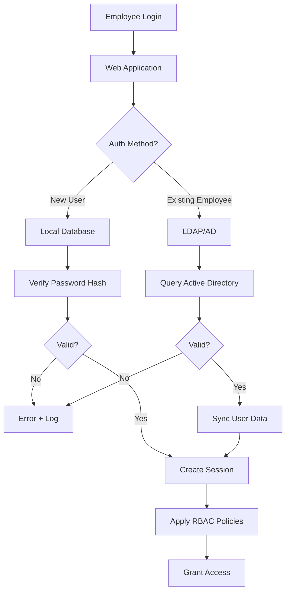

## Security Vulnerabilities and Mitigations

### 1. Brute Force Attacks

**Attack:** Automated attempts to guess passwords

**Mitigation:**
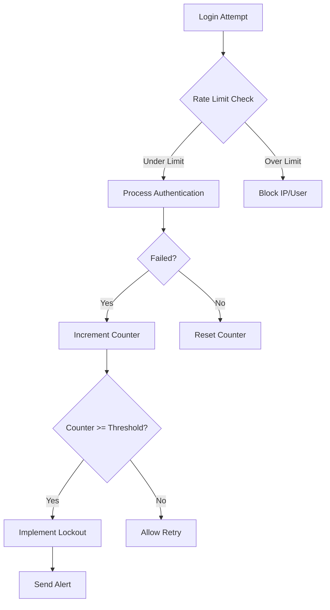

**Implementation:**
- Rate limiting (e.g., 5 attempts per minute per IP)
- Progressive delays (1s, 2s, 4s, 8s...)
- CAPTCHA after failed attempts
- Account lockout with notification

### 2. Credential Stuffing

**Attack:** Using leaked credentials from other breaches

**Mitigation:**
- Check passwords against breach databases (HaveIBeenPwned API)
- Implement unusual activity detection
- Require MFA for sensitive operations
- Monitor for multiple failed logins across accounts

### 3. Phishing Attacks

**Attack:** Fake login pages steal credentials

**Mitigation:**
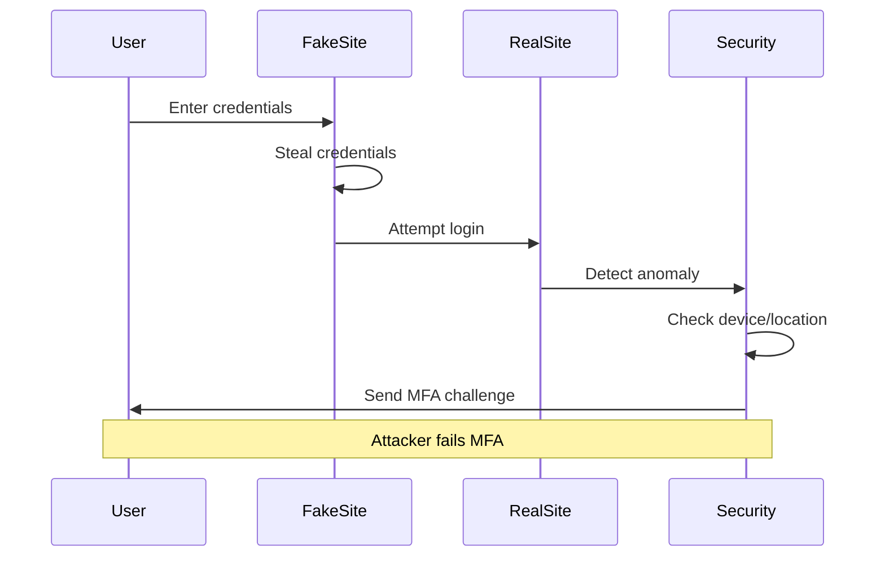

**Implementation:**
- User education about URL verification
- SSL/TLS certificates with EV validation
- Multi-factor authentication
- Email notifications for new device logins

## Performance Considerations

### Hashing Algorithm Comparison

| Algorithm | Speed | Security Level | CPU Cost | Recommended |
|-----------|-------|----------------|----------|-------------|
| MD5 | Very Fast | ❌ Weak | Low | No |
| SHA-1 | Fast | ❌ Weak | Low | No |
| SHA-256 | Fast | ⚠️ Moderate | Low | No |
| bcrypt | Slow | ✅ Strong | High | Yes |
| scrypt | Slower | ✅ Very Strong | Very High | Yes |
| Argon2 | Configurable | ✅ Strongest | Configurable | **Best** |

**Recommendation:** Use Argon2id with appropriate work factors

```javascript
// Example: Argon2 configuration
{
  type: argon2id,
  memoryCost: 65536,  // 64 MB
  timeCost: 3,        // iterations
  parallelism: 4      // threads
}
```

## Monitoring and Logging

### Essential Metrics to Track

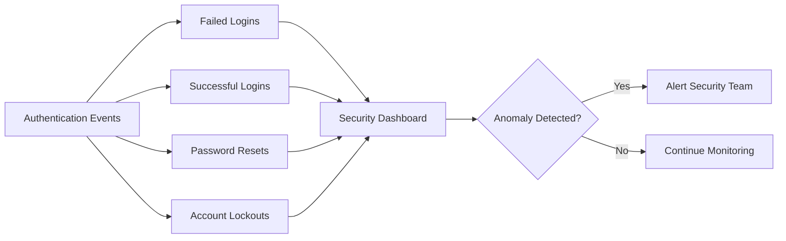

**Key Metrics:**
- Failed login rate by user/IP
- Geographic login patterns
- Device fingerprint changes
- Time-of-day access patterns
- Velocity of login attempts

## Best Practices Summary

1. **Never store plain text passwords** - Always use strong hashing (Argon2, bcrypt)
2. **Use unique salts** - Per-user random salts prevent rainbow table attacks
3. **Implement rate limiting** - Prevent brute force attacks
4. **Enable security logging** - Track all authentication events
5. **Provide clear error messages** - But don't reveal if username or password was wrong
6. **Support password managers** - Don't block paste functionality
7. **Offer password strength meters** - Help users create strong passwords
8. **Plan for password resets** - Secure, user-friendly recovery process
9. **Consider upgrade path** - Plan for adding MFA later
10. **Regular security audits** - Test authentication system regularly

## Testing Authentication Systems

### Test Cases

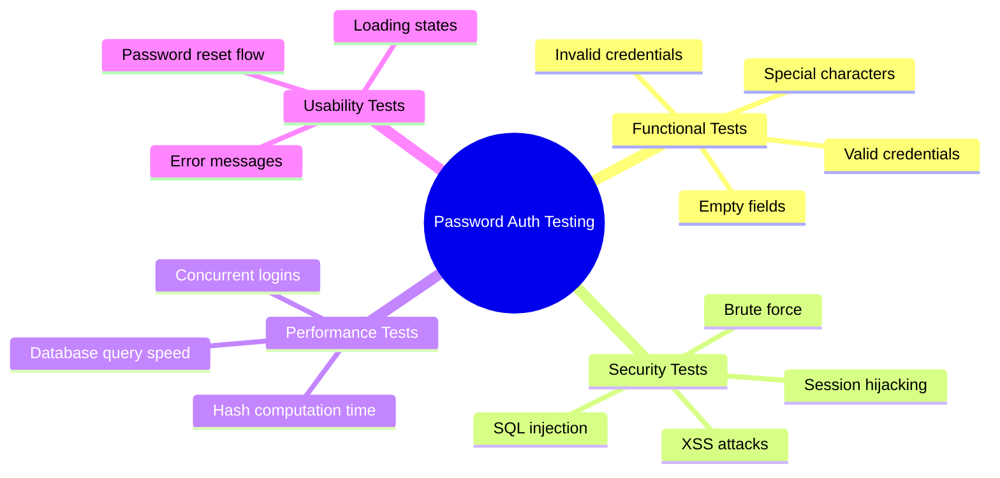

## Next Steps

📕 **Advanced Level:** Explore security protocols, OAuth integration, passwordless migrations, and advanced threat detection

---

**Industry Examples Referenced:** Chase Bank, Epic Systems, Amazon, Canvas LMS
**Standards:** NIST SP 800-63B, PCI-DSS, HIPAA, GDPR
